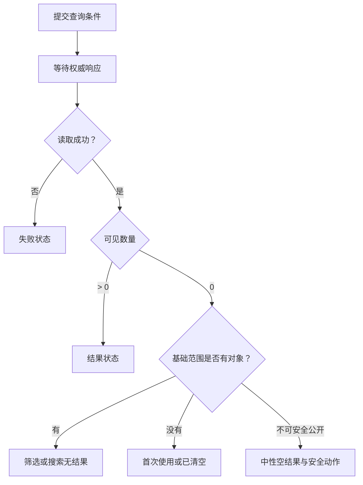

# 空状态

空状态表示一次权威读取已经结束，当前查询范围内存在零个可展示对象。它必须说明“什么为空、为什么为空、怎样改变”，不能用一张插画覆盖所有零数据场景。

## 空的判定对象

读者需要掌握查询、筛选、分页、权限过滤、软删除和状态消息。

空状态首先确定集合边界：

```json
{
  "resource": "orders",
  "scope": {
    "organizationId": "org-9",
    "owner": "me",
    "status": [
      "open"
    ],
    "createdFrom": "2026-07-01"
  },
  "queryRevision": 31,
  "result": {
    "status": "complete",
    "visibleCount": 0,
    "nextCursor": null
  },
  "capabilities": {
    "canCreateOrder": true,
    "canClearFilters": true
  }
}
```

只有 `result.status=complete` 且 `visibleCount=0` 才能判定当前查询为空。请求尚未完成不能用空数组提前显示空状态；权限过滤后的零对象也不能自动解释为“系统里没有对象”。

## 六种零数据原因

| 类型 | 事实 | 主要动作 |
| --- | --- | --- |
| 首次使用 | 当前主体从未创建对象 | 创建或导入 |
| 筛选无结果 | 基础集合有对象，但当前条件为零 | 清除或调整筛选 |
| 搜索无匹配 | 查询词无匹配 | 修改查询词 |
| 数据已处理完 | 待办集合降为零 | 查看历史或返回 |
| 对象被删除 | 深链目标已不存在 | 返回集合或恢复 |
| 结果不可见 | 对象可能存在，但当前主体不可访问 | 申请访问或安全返回 |

这六类不能共享同一标题。首次使用写“还没有项目”是合理的；搜索失败应写“没有与‘退款超时’匹配的项目”；完成全部待办应强调完成，而不是鼓励再创建一项。

## 空状态与相邻状态

- Loading：尚未取得完整结果，不能宣称为零；
- Failure：读取失败，零结果不可信；
- No permission：服务端明确拒绝访问集合或功能；
- Empty after authorization：读取成功，但授权范围内为零；
- End of pagination：已有结果且没有下一页，不是整个集合为空；
- Hidden by client filter：客户端隐藏全部项目，需要显示筛选作用；
- Deleted deep link：单对象不存在，不等于所属集合为空。



## 服务端必须返回的证据

空状态不能靠客户端 `items.length === 0` 单独决定。响应至少需要：

- 查询是否完成；
- 当前查询的规范化摘要；
- 可见总数是否已知；
- 是否还有下一页；
- 空原因是否可以安全公开；
- 当前主体可执行的恢复动作；
- 查询 revision 或缓存版本；
- 数据截止时间。

`baseCount` 有时能区分筛选无结果与首次使用，但返回它可能泄露用户无权访问的对象数量。服务端应按产品安全模型决定是否返回 `emptyReason`，而不是由前端通过多个探测查询猜测。

## 筛选无结果

筛选空状态要把有效条件放在结果标题附近：

```text
没有开放订单
范围：我负责 · 2026-07-01 起 · 状态为“开放”
[清除状态筛选] [修改日期]
```

恢复动作应只改变对应条件。“清除所有筛选”可能丢掉用户仍需要的组织、日期或负责人范围。

URL 应保存规范化筛选，使刷新、复制链接和浏览器返回都能重现同一零结果。若 URL 中存在已废弃筛选值，页面应显示该值无效并提供修正，不能静默忽略后显示一个范围不明的空状态。

## 搜索无匹配

搜索空状态需要区分：

- 查询词为空；
- 查询词只有停用字符；
- 搜索索引尚未收录新对象；
- 拼写或分词导致无匹配；
- 当前权限范围内无匹配；
- 网络失败造成结果未取得。

展示用户实际提交的查询词时必须转义，避免把输入当 HTML。建议词来自真实词典或已授权数据，不制造不存在的对象名。

动态搜索更新“0 个结果”时，该文本属于状态消息；它应能被辅助技术感知而无需移动焦点。不要对每次按键都使用高优先级 `alert`，应防抖并只播报稳定结果。

## 首次使用

首次使用的重点是建立对象，而不是解释所有功能。

内容顺序：

1. 集合名称；
2. 当前确实没有对象；
3. 创建后能完成的任务；
4. 一个主要入口；
5. 必要时提供导入或示例数据。

创建按钮只能在当前主体具备创建能力时显示。没有创建权限时，可显示申请权限、查看文档或切换空间；禁用创建按钮配一段泛化说明不是恢复路径。

示例数据必须与真实数据有明确边界。若“加载示例”会实际写入团队空间，需要说明对象数量、可见范围和删除方式。

## 完成型空状态

收件箱归零、批处理待办完成和清空购物车具有不同含义。

完成型空状态应保留：

- 刚完成的任务范围；
- 完成时间或同步状态；
- 撤销入口的真实有效期；
- 历史记录入口；
- 新项目到达时的更新方式。

“全部完成”只能在服务端确认待办计数为零后显示。本地乐观删除最后一项时可以暂时显示处理中，不应提前宣布完成。

## 深链对象不存在

用户访问 `/documents/doc-42` 得到无对象时，可能是：

- 对象从未存在；
- 已软删除且可恢复；
- 已永久删除；
- 被移动到新地址；
- 当前用户无权知道其存在。

服务端决定可以公开哪一种。可恢复对象显示删除时间、操作者（若有权限）和恢复动作；为防止对象枚举，受限对象可能与不存在共享中性响应。

焦点应放在页面标题或主要错误标题，而不是自动跳到导航中的任意链接。返回动作应指向安全可访问的集合。

## 并发变化

空状态可能在显示后立即失效：

- 另一个成员创建了第一条数据；
- 实时事件加入新待办；
- 权限扩大使更多对象可见；
- 后台同步补回对象；
- 当前筛选被另一组件改变。

新对象到达时，根据任务选择：

| 场景 | 行为 |
| --- | --- |
| 实时收件箱 | 原位将空状态替换为第一项，并说明有新内容 |
| 创建后的集合 | 导航到新对象或显示新列表 |
| 用户正在阅读说明 | 提示可刷新，不突然抢焦点 |
| 权限变化 | 重新查询并更新范围说明 |

迟到的旧空响应不能覆盖较新的非空结果。每次查询使用递增 `queryRevision` 或请求代次，只接纳当前条件对应的响应。

## 空状态的视觉与语义

空状态标题必须位于它所描述的集合区域。页面级空状态不能掩盖仍可操作的全局导航；单个区块为空也不能替换整个页面。

插画属于装饰时使用空替代文本。真正的信息必须出现在文本中：

- 对象名称；
- 当前范围；
- 空原因；
- 下一步动作。

清除筛选后将焦点保留在触发按钮或移动到结果标题，取决于是否发生导航。若同页更新结果，通过状态消息说明“显示 24 个订单”，不把焦点强行移动到第一项。

## 案例一：订单搜索无匹配

### 输入

- 基础范围有 328 个订单；
- 用户搜索“退款超时”；
- 时间筛选为最近 7 天；
- 当前授权范围内结果为 0；
- 最近 30 天存在 4 个匹配项。

### 决策过程

1. 查询响应确认最近 7 天可见数量为零；
2. 服务端允许公开扩展时间后的匹配数量；
3. 标题写明查询词和当前时间范围；
4. 保留搜索输入，不自动清空；
5. 提供“改为最近 30 天”与“清除搜索词”两个针对性动作；
6. 用户选择扩展时间后生成新的 URL 与 queryRevision；
7. 新结果返回前保留旧空说明但标记正在更新；
8. 只接纳最新 revision 的 4 条结果。

### 输出

页面显示“最近 7 天没有与‘退款超时’匹配的订单”，并提供两个明确动作。扩展为 30 天后显示 4 个结果，状态消息宣布结果数量，焦点仍在触发按钮。

### 案例验收

- 0 是服务端完成响应，不由初始空数组推断；
- 查询词以文本呈现，不执行其中的标记；
- 返回和刷新能恢复 7 天零结果；
- 扩展日期只改变时间条件，不删除负责人范围；
- 旧 7 天响应迟到时不能覆盖 30 天结果；
- 读屏在查询完成后听到“4 个结果”，不连续朗读每个中间请求。

### 失败分支

前端看到空数组就显示“还没有订单”和“创建订单”。这把筛选无结果误写成首次使用，并可能诱导重复创建。修正是等待完整查询证据并针对搜索条件提供恢复。

## 案例二：团队第一次使用自动化规则

### 输入

- 组织已有项目，但从未创建自动化规则；
- 当前管理员有 `rule:create`；
- 导入模板会创建 3 条真实规则；
- 另一个成员可能同时创建第一条规则；
- 新规则默认处于禁用状态。

### 设计过程

1. 服务端确认授权范围内规则总数为零；
2. 空状态解释规则用于什么，不展示筛选清除；
3. 主动作是“创建规则”，次动作是“导入 3 条模板”；
4. 导入前说明将写入团队空间且默认禁用；
5. 创建对话框完成后重新读取集合；
6. 若实时事件先带来另一成员创建的规则，空状态立即失效；
7. 新规则卡显示禁用文本，不只使用灰色；
8. 分析事件只记录动作类别，不记录规则名称或条件。

### 输出

首次使用页面只有创建与可解释的模板导入入口。第一条规则出现后页面变为列表，空状态节点被移除，焦点根据触发路径返回新规则标题或创建按钮附近的状态消息。

### 案例验收

- 没有创建权限的角色不会看到永远失败的创建按钮；
- 模板导入明确对象数量、默认状态和删除方式；
- 两个管理员并发创建时不会短暂恢复旧空状态；
- 创建失败保留已输入规则条件；
- 第一条规则出现时读屏能获知集合变化；
- 示例模板与真实规则在数据和视觉上均有明确标识。

### 失败分支

导入按钮把示例规则直接启用，导致真实自动化立即执行。修正为明确写入影响、默认禁用，并在服务端检查创建与启用是不同能力。

## 验证空原因

调试一次空状态需要记录：

- 规范化查询；
- 当前主体和授权范围；
- queryRevision；
- 服务端完成标记；
- 可见数量和分页游标；
- 可以公开的 emptyReason；
- 页面实际显示的标题和动作；
- 状态消息是否被辅助技术取得。

测试数据至少覆盖首次使用、搜索无匹配、筛选无结果、全部完成、对象删除和受限对象。不能只截取一张“暂无数据”截图作为验收。

## 综合练习：多原因任务列表

设计一个支持负责人、状态、日期与全文搜索的任务列表。

要求：

- 为六种零数据原因建立可复现夹具；
- URL 精确恢复查询；
- 请求代次阻止迟到空响应；
- 当前角色决定创建与清除筛选能力；
- 搜索零结果使用可感知状态消息；
- 完成型空状态保留历史与撤销边界；
- 深链对象不存在不泄露受限对象；
- 320 CSS px 与 200% 缩放下动作仍可到达。

验收时由同一账号依次完成首次创建、筛选到零、清除筛选、处理完全部任务和打开已删除深链。每次标题、范围和动作都必须不同且有权威数据支撑。

## 来源

- [W3C WAI — WCAG 2.2 状态消息说明](https://www.w3.org/WAI/WCAG22/Understanding/status-messages.html)（访问日期：2026-07-18）
- [W3C WAI — F103：零结果状态消息不可被程序确定的失败](https://www.w3.org/WAI/WCAG22/Techniques/failures/F103.html)（访问日期：2026-07-18）
- [WHATWG — HTML Standard：列表与分组内容](https://html.spec.whatwg.org/multipage/grouping-content.html)（访问日期：2026-07-18）
- [W3C — WCAG 2.2](https://www.w3.org/TR/WCAG22/)（访问日期：2026-07-18）
