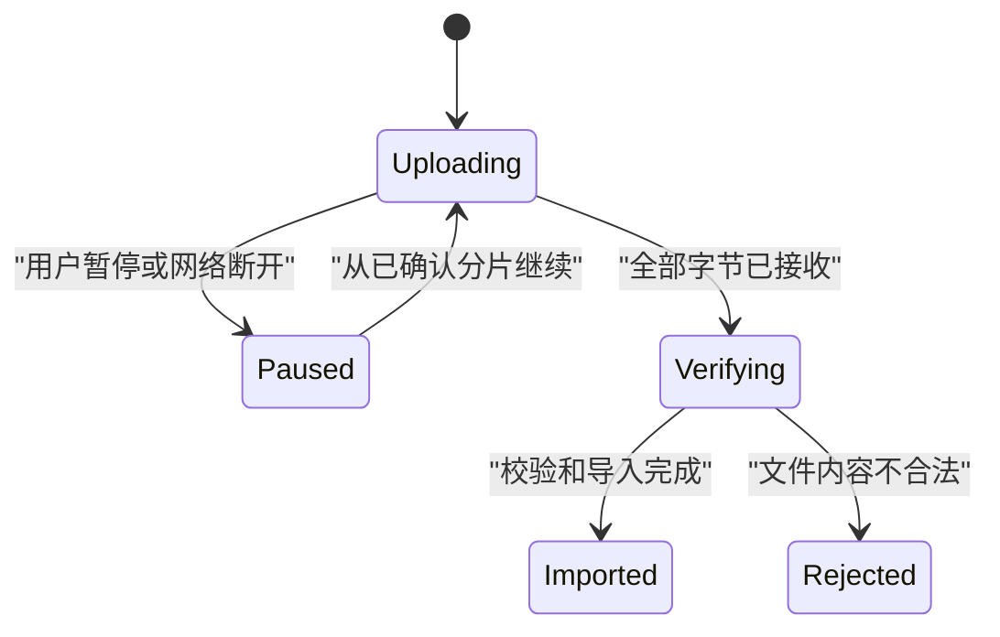

# 加载状态

加载状态表示一个确定的异步工作已经开始，但当前界面尚未取得足以进入下一业务状态的结果。它必须绑定请求或任务，说明影响范围，并处理迟到响应、取消与恢复。

## 三类加载不能混用

读者需要掌握 Promise、Fetch、AbortSignal、分页、缓存和后台任务。

| 类型 | 已有内容 | 用户能否继续 | 典型反馈 |
| --- | --- | --- | --- |
| 首次加载 | 没有可信内容 | 通常只能操作导航和取消 | 页面或区块骨架 |
| 后台刷新 | 有可用旧内容 | 可以继续读取 | 小型刷新状态与更新时间 |
| 增量加载 | 已有部分集合 | 可以操作已加载项 | 集合尾部进度 |

页面首次进入时不能把空数组渲染为空状态后再切换到加载。后台刷新也不应清空整页并用骨架替代仍然可读的旧数据。

## 请求状态与业务状态

请求 `pending` 只说明客户端还没有得到结果，不等于服务端业务仍在执行。连接断开时可能出现：

- 服务端根本没有收到请求；
- 服务端收到但尚未完成；
- 服务端已经完成，响应丢失；
- 客户端主动中止读取，但服务端继续；
- 代理缓存返回了旧响应。

读取请求通常可以安全重新发起；产生副作用的长任务必须通过任务资源查询，而不是把每次轮询都视为重新执行。

```json
{
  "queryKey": "orders?status=open&owner=me",
  "generation": 14,
  "phase": "refreshing",
  "startedAt": "2026-07-18T02:20:00Z",
  "previousDataVersion": 87,
  "progress": null,
  "canCancelViewRequest": true,
  "task": null
}
```

`generation` 是同一视图请求的递增代次。只允许当前代次更新界面。`previousDataVersion` 表明刷新期间的旧内容来自哪个版本。`progress=null` 表示没有可计算进度，不能伪造百分比。

## 请求代次与竞态

搜索、筛选和路由快速变化会产生并发请求：

```text
generation 12：查询“pay”
generation 13：查询“payment”
generation 14：查询“payment failed”
```

即使 12 最后返回，也必须丢弃其界面写入。中止旧 Fetch 能减少资源，但不能替代代次检查：中止可能发生得太晚，响应解析或其他异步转换也可能已开始。

```js
let generation = 0;
let controller;

async function loadOrders(query) {
  generation += 1;
  const current = generation;

  controller?.abort("superseded");
  controller = new AbortController();

  try {
    const response = await fetch(`/api/orders?${query}`, {
      signal: controller.signal
    });
    if (!response.ok) throw new Error(`HTTP ${response.status}`);
    const data = await response.json();
    if (current !== generation) return;
    renderOrders(data);
  } catch (error) {
    if (controller.signal.aborted || current !== generation) return;
    renderOrdersError(error);
  }
}
```

`AbortController.abort()` 会通知 Fetch 中止请求、响应体消费或流读取；它不保证远端服务端撤销已经开始的业务工作。

## 可确定与不可确定进度

当总工作量和完成量可测时使用确定进度：

```html
<label for="upload-progress">上传产品目录</label>
<progress id="upload-progress" max="24800000" value="6200000">
  25%
</progress>
```

`value/max` 表示完成比例。HTML `progress` 没有 `value` 时表示不确定进度，而不是 0%。进度标签必须说明正在处理什么。

可以显示百分比的前提：

- 总量稳定或变化规则可解释；
- 完成量单调或回退原因明确；
- 字节、对象或步骤单位真实；
- 客户端取得的是服务端权威进度；
- 用户能理解完成百分比不等于剩余时间。

无法估计时显示“正在生成 2026 年 7 月报告”，不要循环伪进度到 90% 后停住。

## 骨架屏的适用边界

骨架屏适合结构已知、内容即将填入且布局稳定的首次加载。它不能：

- 模拟最终不会出现的行数；
- 把错误或权限拒绝隐藏为永久闪动；
- 在后台刷新时抹掉真实旧数据；
- 产生大量动画；
- 被辅助技术朗读成无意义内容；
- 替代超时和恢复动作。

骨架通常是装饰，加载区域用可感知文本说明状态。若卡片高度取决于未知内容，使用合理最小高度，完成后仍需控制布局偏移。

## 加载影响范围

状态放置位置与受影响范围一致：

| 工作 | 正确范围 |
| --- | --- |
| 整页首个关键查询 | 主内容区域 |
| 单张仪表盘卡刷新 | 该卡片 |
| 表格加载下一页 | 表格尾部 |
| 保存一个字段 | 字段或保存区域 |
| 下载后台报告 | 持久任务入口 |

在一个按钮上显示 spinner 时，按钮仍要保留动作名称，例如“保存中”，不能只剩旋转图标。若页面其他操作安全可用，不应全部禁用。

## 焦点与状态消息

加载开始通常不移动焦点。用户触发“加载更多”后，焦点可以留在按钮；新项目插入后通过状态消息说明数量。

加载结束时不能只删除“正在加载”文本。若结果同页更新，应说明“已显示 18 个结果”或明确失败。WCAG 状态消息要求这类不改变上下文的信息可由辅助技术取得，无需取得焦点。

进度更新要节流。文件每增加一个字节都播报会阻断操作；可以按整数百分比阈值、阶段变化或时间窗口更新。

`aria-busy="true"` 可以表明区域正在更新，但仍需可见状态、正确范围和完成后的 `false`。不要把 `aria-live` 放在频繁重建的大型结果容器上。

## 超时不是失败分类

超时只表示客户端等待预算已用完。界面应按任务类型处理：

- 读取查询：显示重试并保留查询条件；
- 后台任务：切换为任务状态查询；
- 文件上传：确认已接收分片和可续传位置；
- 写操作：查询权威对象或操作记录后再决定；
- 实时订阅：重连并补取断开期间的事件。

超时阈值基于用户任务和服务 SLO。前端 10 秒超时不应把服务端仍在生成的报告标记为“生成失败”。

## 页面隐藏、刷新与恢复

页面进入后台时：

- 可降低非关键轮询频率；
- 不停止必须由服务端继续的任务；
- 恢复可见时先查询当前任务状态；
- 使用事件序列补回遗漏更新；
- 不把本地计时器推算为权威进度。

刷新页面后，读取查询可以从 URL 重建；长任务需要稳定 `taskId`：

```json
{
  "taskId": "report-2048",
  "state": "running",
  "stage": "aggregating",
  "completedUnits": 42,
  "totalUnits": 120,
  "updatedAt": "2026-07-18T02:22:10Z",
  "canRequestCancellation": true
}
```

`taskId` 查询的是同一后台任务，不是再次创建报告。任务状态由服务端维护，页面关闭后仍可继续。

## 缓存与刷新

已有缓存时可以采用 stale-while-revalidate 式界面：

1. 立即显示缓存；
2. 标明缓存版本或更新时间；
3. 后台发起新查询；
4. 仅在新数据有效且代次匹配时替换；
5. 刷新失败时保留旧内容并说明其过期风险。

此时页面业务状态是“有旧数据”，请求层是“refreshing”。不能把整页归为 loading 并禁止阅读。

## 案例一：商品搜索快速输入

### 输入

- 用户依次输入 `p`、`pa`、`pay`；
- 服务端延迟分别为 900 ms、400 ms、120 ms；
- 每次查询最多 20 项；
- 搜索区域初始已有推荐商品；
- `pay` 返回 6 项。

### 处理

1. 输入防抖 200 ms，但不依赖防抖保证顺序；
2. 每次正式查询增加 generation；
3. 新查询中止旧 Fetch；
4. 推荐商品保留，区域标记正在更新；
5. `pay` 响应在当前 generation 下被接纳；
6. 后到的 `p` 响应被丢弃；
7. 搜索结果替换后宣布“6 个结果”；
8. 焦点一直留在搜索框。

### 输出

用户最终只看到 `pay` 的 6 个结果。网络日志可以看到旧请求，但界面状态和 URL 始终对应最后一次查询。

### 案例验收

- 人为交换三个响应顺序，最终结果仍是 `pay`；
- 中止错误不显示为用户可见失败；
- 推荐内容在刷新期间不变成空状态；
- 结果数量只在稳定响应后播报一次；
- 清空搜索框后恢复推荐内容；
- 浏览器返回可以重现上一个正式查询。

### 失败分支

实现只用 spinner 和 `items=[]`。每次按键先出现“无结果”，旧响应又覆盖新结果。修正为保留旧内容、使用明确刷新状态和请求代次。

## 案例二：上传 24.8 MB 产品目录

### 输入

- 文件 24.8 MB，分为 25 个分片；
- 第 9 个分片网络断开；
- 服务端支持按 uploadId 查询已接收分片；
- 校验阶段无法提供百分比；
- 用户可暂停传输，但校验开始后不能撤销已接收数据。

### 状态流



### 处理

1. 上传阶段以确认字节数作为 `progress`；
2. 本地发送完成不增加进度，直到服务端确认分片；
3. 断网后查询 uploadId，确认前 8 个分片；
4. 继续从第 9 个分片传输，不重发已确认部分；
5. 100% 字节上传后文案切换为“正在校验”；
6. 校验阶段使用不确定进度，不把上传 100% 叫作导入成功；
7. 页面刷新后从 uploadId 恢复阶段；
8. 校验失败保留可下载的行级错误报告。

### 案例验收

- 进度单位为服务端确认字节，数值不会超过 max；
- 断网恢复不重复计费或生成重复文件；
- 上传 100% 与最终导入成功明确分开；
- 暂停按钮只在传输阶段可用；
- 页面刷新后显示同一 uploadId 的真实阶段；
- 读屏按 10% 或阶段变化播报，不逐分片打断；
- 减少动态效果偏好下没有不必要循环动画。

### 失败分支

客户端在最后一个字节发送后立即显示“导入成功”，但服务端校验随后发现 312 行错误。修正为上传、校验和导入三个独立业务阶段，最终成功只来自导入结果。

## 加载问题的诊断路径

首次加载白屏：

1. 检查关键请求是否真正发出；
2. 检查 DNS、连接、服务端等待和下载阶段；
3. 确认骨架范围是否遮住可用导航；
4. 确认超时后有明确恢复动作；
5. 检查错误是否被误吞为永久 pending。

结果闪回旧查询：

1. 记录查询键与 generation；
2. 记录响应完成顺序；
3. 检查异步解析后是否再次校验 generation；
4. 检查缓存键是否包含全部筛选；
5. 检查组件卸载后是否仍写入状态。

进度卡住：

1. 对账服务端完成单位和客户端显示单位；
2. 检查总量是否变化；
3. 检查推送断开与轮询回退；
4. 检查页面隐藏后的恢复查询；
5. 区分工作仍运行、已失败和状态事件丢失。

## 性能与观测

记录：

- 首次可用内容时间，而不只记录 spinner 时长；
- 请求排队、服务器处理与传输耗时；
- 被新代次取代的请求数量；
- 中止原因；
- 首次加载、刷新和增量加载分别耗时；
- 长任务阶段停留时间；
- 用户可见超时和恢复成功率；
- 骨架到真实内容的布局偏移。

日志保留查询键哈希和 request ID，不记录搜索敏感原文。上传日志记录字节和分片编号，不记录文件内容。

## 综合练习：可恢复数据导入

实现选择文件、分片上传、服务端校验和结果查看。

必须证明：

- 确定与不确定进度切换正确；
- 中止视图请求不会被描述为取消服务端任务；
- uploadId 能跨刷新恢复；
- 断网从服务端确认位置续传；
- 迟到状态事件按序列丢弃；
- 上传完成不等于导入成功；
- 失败结果可定位具体行；
- 键盘和读屏能获知阶段变化；
- 页面进入后台再恢复不会倒退进度。

验收夹具包含响应乱序、一次断网、总量变化、校验失败和页面刷新。最终文件对象数量必须与成功导入行数对账。

## 来源

- [WHATWG — Fetch Standard：AbortSignal 与请求中止](https://fetch.spec.whatwg.org/)（访问日期：2026-07-18）
- [WHATWG — HTML Standard：progress 元素](https://html.spec.whatwg.org/multipage/form-elements.html#the-progress-element)（访问日期：2026-07-18）
- [W3C WAI — WCAG 2.2 状态消息说明](https://www.w3.org/WAI/WCAG22/Understanding/status-messages.html)（访问日期：2026-07-18）
- [W3C — WAI-ARIA 1.2 progressbar](https://www.w3.org/TR/wai-aria-1.2/#progressbar)（访问日期：2026-07-18）
