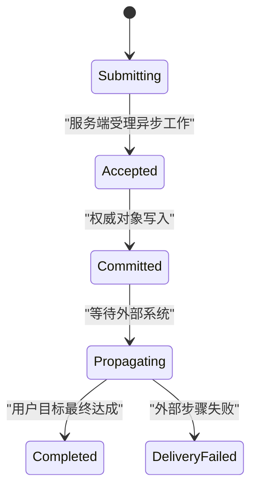
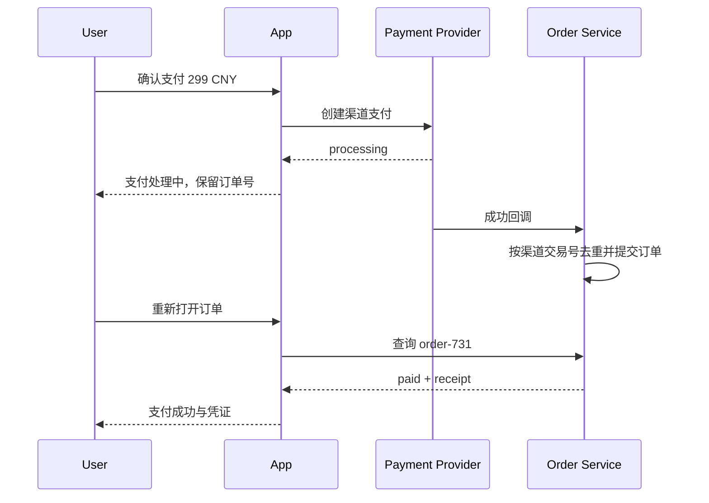

# 成功状态

成功状态表示用户要求的业务结果已经由权威系统确认。它必须说明完成了什么、作用于哪个对象、何时生效以及下一步，不以绿色图标、HTTP 2xx 或前端 Promise resolved 单独判定。

## 成功的判定层级

读者需要掌握 HTTP、事务、异步任务、缓存、对象版本和状态消息。

一次操作可能依次通过多个层级：

| 层级 | 证据 | 是否可以宣布业务成功 |
| --- | --- | --- |
| 客户端接受点击 | 事件处理器执行 | 否 |
| 请求已发送 | 网络面板有请求 | 否 |
| API 已接收 | 返回任务 ID | 只能说已受理 |
| 数据已提交 | 权威对象版本改变 | 通常可以 |
| 外部系统已完成 | 外部回执或最终状态 | 取决于任务定义 |
| 用户目标已达成 | 可验证业务结果 | 是 |

“邮件已加入发送队列”与“邮件已送达”是不同成功。“退款申请已受理”与“资金已退回”也是不同成功。文案必须对应当前证据。

## 成功契约

一个对象更新成功响应可以是：

```json
{
  "result": "committed",
  "resource": {
    "type": "notification-rule",
    "id": "rule-42",
    "version": 19
  },
  "changedFields": [
    "threshold",
    "channels"
  ],
  "committedAt": "2026-07-18T02:20:30Z",
  "actorId": "user-72",
  "receiptId": "audit-8841",
  "next": {
    "href": "/rules/rule-42",
    "label": "查看规则"
  }
}
```

字段责任：

- `result` 是受控结果枚举；
- `resource.id` 明确成功对象；
- `version` 是后续读取和条件写入基线；
- `changedFields` 支撑确认摘要和审计；
- `committedAt` 使用服务端时间；
- `actorId` 由认证上下文产生；
- `receiptId` 关联受控审计，不暴露内部日志；
- `next` 只提供当前主体真实可用的下一步。

成功状态不需要跨所有文章共享的逻辑意图字段。支付等确有幂等要求的操作可以使用该领域的支付请求键，但它不是每个成功界面的必备 UI 数据。

## 终态、阶段成功与暂定成功



界面可以分别写：

- 已受理：系统已创建任务，但业务结果尚未产生；
- 已保存：当前对象已写入权威存储；
- 生效中：配置已保存，正在传播到节点；
- 已完成：最终业务结果可验证；
- 部分完成：只有明确子集成功，必须展示逐项结果。

不能从 `202 Accepted` 直接跳到最终成功。也不能因为缓存读取仍是旧值就撤销已经提交的成功；应说明传播或刷新状态。

## 成功反馈的四个要素

1. 结果：已保存、已创建、已发送或已完成；
2. 对象：项目名、订单号或规则名称；
3. 范围：一个对象、当前筛选的 24 项或某个环境；
4. 后续：返回、查看、下载凭证或继续创建。

示例：

```text
告警规则“支付失败率”已保存
版本 19 · 2026-07-18 10:20（Asia/Shanghai）
[查看规则] [继续编辑]
```

只写“操作成功”迫使用户回忆刚才做了什么，也无法区分多个并发操作的结果。

## 反馈载体的选择

| 任务 | 合适载体 |
| --- | --- |
| 同页保存一个字段 | 字段附近状态与全局简短状态消息 |
| 创建重要对象 | 持久确认页或对象详情 |
| 添加购物车 | 同页状态消息与购物车数量 |
| 高风险支付 | 独立结果页和可再次访问凭证 |
| 后台任务受理 | 任务详情入口，不宣称最终完成 |
| 批量操作 | 持久结果摘要与逐项明细 |

Toast 适合补充低风险、可从页面状态再次确认的结果。它不应承载订单号、下载链接、失败明细或唯一撤销入口，因为自动消失后用户无法恢复。

## 焦点策略

同页保存成功通常不移动焦点。成功文本通过 `role="status"` 或等价方式被辅助技术感知，同时保留用户继续编辑的位置。

发生导航时，目标页使用正确标题和主内容结构，让浏览器与辅助技术取得新上下文。不要导航后又把焦点强行送到右上角 toast。

创建对话框关闭后的策略：

- 新对象出现在当前列表：焦点回到触发按钮或新对象标题；
- 导航到对象详情：让页面标题建立上下文；
- 对话框内连续创建：清空已提交字段并把焦点放到第一个字段；
- 创建按钮因权限变化消失：焦点转到集合标题或安全下一动作。

成功状态消息不应使用 `role="alert"`，除非结果紧急到必须打断当前工作。频繁自动保存若每次都播报会造成噪声，可以只在状态从保存中变为已保存、失败或离线时宣布。

## 成功后的本地状态

服务端提交后，客户端需要原子更新：

- 对象 ID；
- 新版本；
- 已提交基线；
- 当前值；
- 脏字段；
- 字段错误；
- 保存状态；
- 列表或缓存中的同一对象。

```js
function applyCommittedResult(formState, result) {
  if (result.resource.id !== formState.resourceId) return formState;

  return {
    ...formState,
    version: result.resource.version,
    baseline: formState.current,
    dirtyFields: [],
    fieldErrors: {},
    saveState: {
      kind: "saved",
      committedAt: result.committedAt,
      receiptId: result.receiptId
    }
  };
}
```

若只显示 toast 而不更新基线，离开页面时仍会错误提示“有未保存更改”。若只更新表单而不更新列表缓存，返回集合后会短暂看到旧值。

## 响应乱序

自动保存可能产生：

```text
save version 18 → threshold=5
save version 19 → threshold=8
```

旧请求不得在后返回时把界面改回 5。服务端使用版本条件防止写入倒退；客户端只接纳与当前提交序列和对象版本一致的成功结果。

安全策略：

1. 每次保存带当前对象版本；
2. 服务端成功后返回新版本；
3. 下一次保存基于该版本；
4. 并发编辑返回冲突而非最后写入获胜；
5. 客户端迟到响应只保留审计，不覆盖新基线。

对允许合并的独立字段，可以按字段版本或队列串行保存，但必须明确不变量。

## 成功后读取仍是旧值

写入主存储成功后，读副本、搜索索引和 CDN 可能暂时落后。界面应选择：

- 用提交响应更新当前对象；
- 标记搜索索引仍在更新；
- 在返回列表时保留新对象占位；
- 按版本等待读取达到至少新版本；
- 超过传播预算后显示可追踪问题。

不能把旧读取解释为“保存其实失败”，也不能永久用本地乐观数据掩盖服务端回滚。

## 撤销不是成功装饰

撤销只有在系统真实支持逆操作时显示。需要定义：

- 可撤销对象；
- 截止时间；
- 是否已产生外部副作用；
- 撤销自身的失败状态；
- 多设备执行时如何同步；
- 撤销后焦点和列表位置。

删除邮件到回收站可以撤销；已经发送的转账通常不能用同一按钮“撤销”，只能发起新的冲正或退款流程。

撤销入口若只存在于 5 秒 toast 中，会让慢速操作、读屏和注意力切换用户失去机会。高价值撤销应在对象历史或结果页中持续可用到截止时间。

## 成功凭证

支付、申请、预约和批量导入需要持久凭证。凭证包含：

- 业务可识别编号；
- 对象与范围；
- 金额和币种（如适用）；
- 权威时间和时区；
- 当前状态；
- 可再次访问的安全 URL；
- 客服可用的公开参考号。

凭证不直接暴露数据库主键、内部异常、支付密钥或完整敏感输入。下载凭证时重新授权并设置合理有效期。

## 案例一：保存告警规则

### 输入

- 规则 `rule-42` 当前版本 18；
- 用户把阈值从 3% 改为 5%；
- 通知渠道为短信和邮件；
- 保存响应为版本 19；
- 配置传播到 12 个节点需要约 20 秒。

### 处理

1. 提交时锁定本次字段快照与 version 18；
2. 服务端验证权限、阈值范围和渠道；
3. 权威规则写入成功并返回 version 19；
4. 页面显示“规则已保存”，而不是“所有节点已生效”；
5. 表单基线更新为 5%，脏字段清空；
6. 传播状态在规则详情单独显示 `3/12`、`12/12`；
7. 用户继续编辑阈值时，不被传播轮询抢焦点；
8. 传播完成后状态消息说明“已在 12 个节点生效”。

### 输出

保存确认与传播进度分离。规则详情和列表缓存都使用 version 19，审计记录能够关联操作者与 changedFields。

### 案例验收

- 保存后离开页面不再出现未保存提示；
- 断开传播推送再恢复时，从服务端补取节点状态；
- 传播失败一个节点时不把规则写入回滚成“未保存”；
- 同一规则另一个标签提交 version 18 时得到冲突；
- 自动保存连续两次响应乱序不会回退阈值；
- 键盘焦点留在保存按钮或正在编辑字段；
- 状态消息分别宣布已保存和最终生效。

### 失败分支

页面收到规则写入响应后显示“部署成功”，但 2 个节点拒绝配置。修正为将 committed 与 propagated 分为两个业务状态，并为节点失败提供明细和重试。

## 案例二：支付订单结果

### 输入

- 订单 `order-731` 金额 299 CNY；
- 支付渠道先返回处理中；
- 用户关闭页面后渠道回调成功；
- 回调可能重复；
- 当前账号只能查看自己的订单。

### 结果流程



### 处理

1. 渠道 `processing` 不展示最终成功；
2. 页面提供订单号和安全返回入口；
3. 服务端按渠道交易号幂等处理回调；
4. 回调提交订单支付状态与收款记录；
5. 用户重新打开时读取权威订单；
6. 结果页显示金额、币种、支付时间和凭证号；
7. 重复回调不生成第二笔收款；
8. 退款是新流程，不伪装为撤销原支付。

### 案例验收

- 切断前端响应后仍能从订单详情恢复最终结果；
- `processing`、`paid` 和 `failed` 有不同标题和动作；
- 重放三次回调只产生一条支付记录；
- 金额与币种来自权威订单，不从按钮文本拼接；
- 其他账号访问凭证得到安全拒绝；
- 200% 缩放下订单号、金额、下一步和帮助入口均可到达；
- 读屏进入结果页能先取得“支付成功”和订单号。

### 失败分支

前端只根据渠道弹窗关闭事件显示“支付成功”。用户取消弹窗也会得到绿色确认。修正为以订单服务提交的 `paid` 状态和唯一收款记录为成功证据。

## 成功状态的审计

调试记录应围绕业务结果：

- 请求 ID 与公开 receiptId；
- 操作者和授权范围；
- 提交前后对象版本；
- changedFields；
- 服务端提交时间；
- 外部传播或回调阶段；
- 页面显示的确切成功文案；
- 成功后缓存和表单基线；
- 重复事件是否造成额外副作用。

不要只截图绿色 toast。需要从权威对象、审计记录和下游结果证明用户目标确实完成。

## 观测指标

- 已受理到已提交的耗时；
- 已提交到最终完成的耗时；
- 成功后用户立即返回检查的比例；
- 成功确认无法再次找到的次数；
- 重复提交与重复副作用；
- 成功后仍出现未保存提示；
- 成功页下游动作完成率；
- 传播失败和最终一致耗时；
- 不同辅助技术能否取得状态消息。

分析事件不记录支付凭证全文、规则阈值中的敏感租户信息或表单原始内容。

## 综合练习：异步申请结果

设计一项需要人工审批的访问申请：

- 提交后先进入“已受理”，不是“已批准”；
- 申请对象有稳定编号和详情页；
- 审批结果由服务端状态决定；
- 页面关闭后可恢复；
- 重复回调不会重复授权；
- 批准后显示权限范围和生效时间；
- 拒绝后进入失败或拒绝状态；
- 权限过期属于后续状态变化；
- 同页更新使用可感知状态消息；
- 结果页具有合乎逻辑的焦点与标题。

验收至少模拟审批成功、审批拒绝、回调重复、读取副本延迟和账号权限变化。每个“成功”文案都必须能指出对应的权威状态与对象版本。

## 来源

- [W3C WAI — WCAG 2.2 状态消息说明](https://www.w3.org/WAI/WCAG22/Understanding/status-messages.html)（访问日期：2026-07-18）
- [W3C WAI — G199：提交成功反馈](https://www.w3.org/WAI/WCAG22/Techniques/general/G199.html)（访问日期：2026-07-18）
- [WHATWG — HTML Standard：表单提交](https://html.spec.whatwg.org/multipage/form-control-infrastructure.html#form-submission-algorithm)（访问日期：2026-07-18）
- [IETF — HTTP Semantics](https://www.rfc-editor.org/rfc/rfc9110)（访问日期：2026-07-18）
