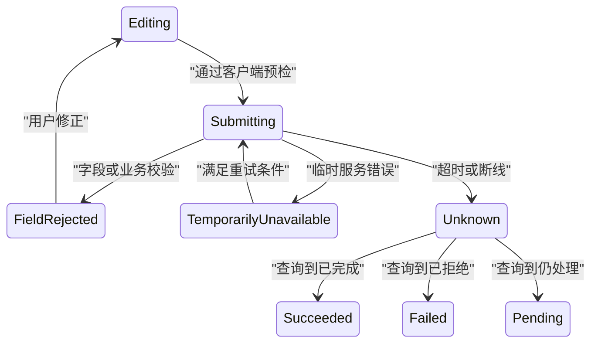

# 失败状态

失败状态表示系统已经取得足够证据，确认当前尝试不能按原条件完成。设计目标不是展示“出错了”，而是准确分类、保护输入、限定影响范围并提供真实恢复路径。

## 失败与未知结果

客户端看到异常不一定意味着业务失败：

- 参数校验被拒绝：确定失败；
- 权限不足：确定拒绝；
- 对象版本冲突：确定冲突；
- 服务端返回 503：本次尝试失败，之后可能恢复；
- 客户端超时：结果未知，服务端可能已经完成；
- 用户中止读取：客户端停止等待，不证明服务端回滚。

只有确定失败才能直接显示“未完成”。结果未知时先查询权威对象或任务，避免重复写入。

## 错误分类

| 类别 | 示例 | 是否原样重试 | 用户动作 |
| --- | --- | --- | --- |
| 字段校验 | 邮箱格式错误 | 否 | 修正字段 |
| 业务规则 | 库存不足 | 否 | 改变数量或对象 |
| 认证失效 | 会话过期 | 否 | 重新认证后重新授权 |
| 权限拒绝 | 无发布权限 | 否 | 申请权限或返回 |
| 并发冲突 | 对象版本改变 | 否 | 比较并合并 |
| 临时服务错误 | 503、限流 | 有条件 | 等待或安全重试 |
| 客户端环境 | 文件读取失败 | 视原因 | 重选文件或授权 |
| 未知结果 | 响应丢失 | 禁止盲重放 | 查询结果 |

错误类别决定交互，而不是根据字符串包含 “timeout” 或 “permission” 猜测。

## 前后端错误契约

HTTP API 可以使用 RFC 9457 Problem Details：

```json
{
  "type": "https://api.example.com/problems/inventory-insufficient",
  "title": "库存不足",
  "status": 409,
  "detail": "可用库存为 2，无法预留 5 件。",
  "instance": "https://api.example.com/problem-occurrences/p-8841",
  "resourceId": "sku-42",
  "availableQuantity": 2,
  "fieldErrors": [
    {
      "path": "quantity",
      "code": "greater_than_available",
      "message": "数量不能超过 2"
    }
  ]
}
```

字段责任：

- `type` 是稳定问题类型，不为每次错误变化；
- `title` 是问题类型的简短摘要；
- `status` 若存在应与实际 HTTP 状态一致；
- `detail` 面向当前发生实例，不能被客户端解析为逻辑字段；
- `instance` 是安全问题实例标识；
- 扩展字段使用稳定类型，客户端据此定位字段和动作；
- 响应不能包含异常栈、SQL、内部路径或密钥。

客户端按 `type`、HTTP 状态和扩展字段决策，不匹配本地化 `detail` 文案。

## 状态流



错误消失的证据必须明确：字段重新通过校验、服务恢复、权限改变、冲突合并或权威任务返回终态。

## 字段错误与全局错误

字段错误放在字段附近，并通过程序关系关联控件。错误摘要用于长表单定位，但不能替代字段错误。

提交失败后：

1. 保留所有仍合法输入；
2. 显示错误总数和提交未完成；
3. 把每个错误关联到具体字段；
4. 为已知修正提供建议；
5. 焦点移动到错误摘要或第一个错误，依据页面结构固定；
6. 修正后只清除对应错误；
7. 再次提交仍由服务端完整校验。

不要在输入每个字符时高优先级播报错误。失焦、提交或规则允许的稳定时机再反馈。

## 业务规则错误

库存、额度、状态转换和截止时间错误通常跨多个字段。界面需要说明：

- 当前业务事实；
- 请求值；
- 允许范围；
- 哪些输入被保留；
- 哪个动作可以继续。

例如库存不足时可以将数量改为可用量，但不得未经用户确认自动减少订单数量并提交。

## 临时故障

临时错误应携带：

- 可稳定识别的类别；
- 是否允许重试；
- 服务端建议等待时间（若有）；
- 已完成副作用范围；
- 安全请求参考号；
- 替代路径。

自动重试只适用于幂等读取或明确具备去重保证的操作。指数退避和抖动属于重试机制，不能把无权限、格式错误和永久业务拒绝放进循环。

## 错误呈现范围

单个头像加载失败不应替换整个个人资料页。范围与受影响功能一致：

| 失败对象 | 呈现位置 | 保留内容 |
| --- | --- | --- |
| 字段校验 | 字段与摘要 | 其他字段值 |
| 列表查询 | 列表区块 | 筛选、列头、旧数据说明 |
| 一张仪表盘卡 | 卡片内部 | 其他卡片 |
| 后台导出 | 任务详情 | 原查询和历史导出 |
| 整页授权依赖 | 主内容 | 安全导航和帮助 |

全屏错误页只用于主任务确实无法继续的情况。

## 输入保护

失败后丢失输入会扩大损害。按敏感度选择存储：

- 普通短表单：保留内存和当前 DOM；
- 长向导：加密或受控服务端草稿；
- 文件：保留文件元数据，浏览器可能要求重选真实文件；
- 密码和支付敏感数据：不持久化；
- 富文本：保存本地草稿时明确设备风险和清理规则。

会话过期后可保留非敏感输入，但重新提交前必须重新认证和授权。不能把旧凭证随草稿保存。

## 焦点和状态消息

同页提交失败属于错误状态消息。错误摘要应有清晰标题，例如“未能创建账户：有 3 个字段需要修正”，并让辅助技术取得变化。

是否移动焦点取决于操作：

- 长表单提交后错误在视口外：移动到错误摘要；
- 单字段保存失败：焦点保留在字段或保存按钮；
- 模态操作失败：焦点留在对话框；
- 导航请求失败：保留原页面和触发链接；
- 后台任务失败：不抢走用户当前工作，只更新任务入口。

`role="alert"` 只用于需要及时打断的错误。一般校验摘要可以用适当 live region，并避免重复朗读同一错误。

## 错误恢复与竞态

修正请求返回前，用户可能再次修改字段。每个提交保存字段快照和提交序列：

```json
{
  "submission": 7,
  "snapshot": {
    "email": "old@example.com",
    "team": "payments"
  },
  "problem": {
    "type": "email_taken",
    "field": "email"
  }
}
```

若 submission 7 的错误迟到，而当前 email 已是 `new@example.com`，客户端不能把 `email_taken` 错误绑定到新值。可以丢弃旧错误或标注它属于旧提交。

错误清除规则：

- 字段值变化时可以标记旧错误待重新验证；
- 不应仅因获得焦点就清除；
- 服务端错误在成功提交或明确新校验后清除；
- 区块错误在对应查询成功后清除；
- 问题实例和日志仍按保留策略保存。

## 案例一：企业账户注册失败

### 输入

- 表单含公司名、管理员邮箱、地区和条款确认；
- 邮箱 `admin@example.com` 已被占用；
- 地区 `cn-north-9` 已停用；
- 用户已填写 12 个字段；
- 服务端返回两个字段错误。

### 处理

1. 客户端先检查必填与格式；
2. 服务端再次校验唯一性与允许地区；
3. 顶部显示“账户未创建：2 个字段需要修正”；
4. 摘要链接到邮箱和地区字段；
5. 其余 10 个字段保持原值；
6. 邮箱错误建议登录或使用另一邮箱；
7. 地区字段提供当前允许选项；
8. 用户改变邮箱后旧错误标记待校验；
9. 第二次提交只在服务端成功后进入成功状态。

### 输出

没有创建半成品账户。用户可以从摘要直接到达两个错误字段，修正后完成注册。

### 案例验收

- 错误摘要数量与字段错误一致；
- 每个错误通过文本描述并关联正确标签；
- 200% 缩放时摘要链接和字段都可见；
- 迟到的旧邮箱错误不附着到新邮箱值；
- 页面刷新前的非敏感输入可由明确草稿策略恢复；
- 日志不包含条款文本、密码或完整个人资料；
- 重复点击提交不会创建两个账户。

### 失败分支

接口把唯一性错误返回为 `500 database constraint failed`，前端显示“系统异常”并清空表单。修正为稳定业务问题类型、字段定位和输入保护，数据库细节只留在受控日志。

## 案例二：报告导出任务失败

### 输入

- 报告覆盖 1000 万行；
- 服务端已创建 `export-2048`；
- 聚合阶段完成，文件写入阶段存储配额不足；
- 用户已离开报告页面；
- 原查询仍在保留期内。

### 处理

1. 任务状态从 `running` 进入 `failed-storage-capacity`；
2. 失败只显示在导出任务中心和关联报告入口；
3. 原仪表盘继续可用；
4. 错误文案说明文件未生成，不伪装为查询失败；
5. 保留查询摘要、时间窗和权限主体；
6. 提供“重新生成”前先确认服务恢复；
7. 新任务使用新的 taskId，旧失败任务保留审计；
8. 下载按钮不存在，不能指向部分文件；
9. 客服可使用公开 reference 查受控技术原因。

### 输出

任务中心显示“文件生成失败”，范围为一项导出任务。用户可以查看原查询并在服务恢复后重新生成，不影响页面其他工作。

### 案例验收

- 任务失败不抢走当前页面焦点；
- 任务推送丢失后重新查询仍得到失败；
- 部分文件不可下载；
- 原查询在重试前按当前权限重新授权；
- 旧任务与新任务 ID 不混用；
- 存储内部路径和配额拓扑不出现在客户端；
- 失败率按导出阶段分群观测。

### 失败分支

前端轮询停止就推断任务失败，但服务端实际已完成。修正为轮询错误进入“状态未知”，恢复查询后再显示成功或失败。

## 诊断顺序

字段或业务失败：

1. 固定请求输入和对象版本；
2. 检查 HTTP 状态与 Problem Details `type`；
3. 对账扩展字段和界面动作；
4. 检查输入是否被错误清空；
5. 修正后验证权威对象。

临时服务失败：

1. 区分客户端网络、网关和服务端错误；
2. 检查请求是否产生副作用；
3. 检查 `Retry-After` 或业务恢复条件；
4. 验证错误范围是否局部；
5. 检查自动重试上限和抖动。

未知结果：

1. 使用对象 ID、任务 ID 或业务凭证查询；
2. 检查审计中是否已有提交；
3. 禁止直接复制原写请求；
4. 找不到结果时显示当前未知事实；
5. 通过人工或后续事件最终收敛。

## 观测与告警

至少记录：

- problem type 与 HTTP 状态分布；
- 字段错误修正成功率；
- 临时错误恢复耗时；
- 错误后输入丢失；
- 未知结果查询数量；
- 重复副作用；
- 按页面、区块、字段划分的失败范围；
- 用户放弃点；
- 辅助技术无法取得错误的缺陷。

错误分析不记录完整 `detail`、用户输入或内部异常栈。安全团队需要的上下文通过 problem instance 关联受控日志。

## 综合练习：分阶段文件导入

实现上传、解析、校验与写入四阶段导入。

要求：

- 上传失败与内容校验失败分开；
- 行级错误包含稳定行号和字段码；
- 服务故障保留已上传文件引用；
- 结果未知时查询 taskId；
- 页面其他区块不被局部失败替换；
- 修正文件后创建新任务并关联旧任务；
- 错误文件下载重新授权；
- 键盘可以从摘要定位到错误明细；
- 失败结果跨刷新仍可取得。

验收夹具包含格式错误、业务规则错误、权限撤销、存储 503、响应丢失和成功重试。最终写入行数必须与权威数据库对账。

## 来源

- [IETF — RFC 9457：Problem Details for HTTP APIs](https://www.rfc-editor.org/rfc/rfc9457.html)（访问日期：2026-07-18）
- [IETF — RFC 9110：HTTP Semantics](https://www.rfc-editor.org/rfc/rfc9110.html)（访问日期：2026-07-18）
- [W3C WAI — WCAG 2.2 错误识别](https://www.w3.org/WAI/WCAG22/Understanding/error-identification)（访问日期：2026-07-18）
- [W3C WAI — WCAG 2.2 错误建议](https://www.w3.org/WAI/WCAG22/Understanding/error-suggestion)（访问日期：2026-07-18）
