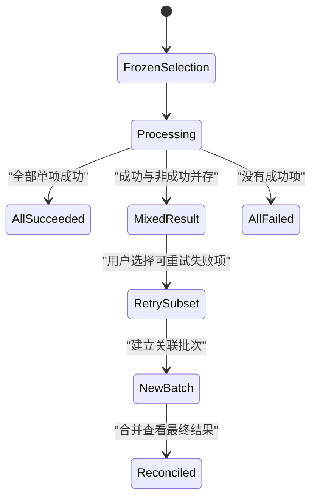

# 部分成功状态

部分成功表示一个包含多个独立处理单元的任务已经产生混合结果：至少一项完成，至少一项未完成。它不是模糊的黄色中间态，必须能按稳定对象 ID 对账。

## 何时允许部分成功

只有业务允许单项独立提交时，批次才能合法部分成功：

- 给 300 个独立用户发送通知；
- 导入 1000 行相互独立的商品；
- 批量移动可分别授权的文件；
- 为多个环境发布相互隔离的配置。

以下任务通常要求原子成功或整体失败：

- 一笔复式记账分录；
- 同一订单的借记与贷记；
- 必须保持引用完整的数据库迁移；
- 法律上必须一次确认的签署集合。

前端不能为了“让进度看起来更好”把原子事务拆成部分成功。

## 批次模型与守恒

```json
{
  "batchId": "notify-2048",
  "state": "completed-with-errors",
  "selection": {
    "queryId": "overdue-invoices-v31",
    "snapshotVersion": 31,
    "total": 312
  },
  "counts": {
    "succeeded": 307,
    "failed": 3,
    "skipped": 2,
    "pending": 0
  },
  "resultCursor": "result-page-1",
  "completedAt": "2026-07-18T02:20:30Z"
}
```

终态不变量：

```text
total = succeeded + failed + skipped
pending = 0
每个输入对象恰好对应一个终态结果
```

处理中不变量：

```text
total = succeeded + failed + skipped + pending
同一对象不能同时属于两个集合
```

`skipped` 必须有明确语义，例如提交时已支付、重复行或策略决定不处理，不能把未知结果塞进 skipped。

## 逐项结果

批次摘要不能替代逐项结果：

```json
{
  "itemId": "invoice-731",
  "outcome": "failed",
  "code": "recipient_unreachable",
  "message": "收件地址已退信",
  "attempt": 1,
  "retryable": false,
  "resourceVersion": 8
}
```

逐项字段说明：

- `itemId` 关联原始业务对象；
- `outcome` 使用 `succeeded`、`failed`、`skipped` 等受控枚举；
- `code` 支撑筛选和恢复决策；
- `message` 面向当前用户且经过安全处理；
- `attempt` 区分原批次与后续尝试；
- `retryable` 由业务规则决定；
- `resourceVersion` 证明处理的对象版本。

结果分页必须使用结果快照，不能因后台清理或新重试改变已完成批次的历史。

## 任务流



重试失败子集应创建关联的新批次，而不是篡改原批次历史。组合视图可以计算“截至目前最终成功”，但必须能下钻到每次尝试。

## 冻结作用范围

批量操作开始前保存：

- 显式对象 ID，或冻结查询标识；
- 查询摘要；
- 快照版本；
- 当前授权主体；
- 操作类型和参数；
- 排除项；
- 预计总数。

“选择当前筛选全部”不能在执行时重新解释为最新查询集合，否则新加入或已移除对象会意外被处理。

执行时仍需逐项重新授权。冻结范围确定候选对象，不绕过权限变化。

## 摘要界面

结论按重要性排序：

```text
已向 307 张发票发送提醒，5 张未发送
3 张失败 · 2 张已支付并跳过
[查看 5 张未发送] [下载结果]
```

不要只显示“98.4% 成功”。绝对数量、失败类别和剩余动作比百分比更可执行。

颜色不是唯一分类。成功、失败、跳过均使用文字和数量。进度条结束也不能隐藏混合结果。

## 明细操作

明细支持：

- 按 outcome 和 code 筛选；
- 通过稳定对象 ID 返回详情；
- 仅选择 `retryable=true` 的失败项；
- 下载当前授权范围内的结果；
- 复制公开批次参考号；
- 查看原始作用范围摘要；
- 对比关联重试批次。

失败行中的动作名称包含对象，例如“重新发送 invoice-731”。选择“重试全部失败项”前展示数量、排除永久错误和当前权限变化。

## 恢复策略

恢复不是重新执行整个批次：

1. 从原结果取失败和未知项目；
2. 对未知项目先查询权威副作用；
3. 排除已成功和明确跳过项；
4. 按当前版本重新读取候选对象；
5. 重新授权；
6. 只对仍合法且可重试的项目建立新批次；
7. 返回与原 batchId 的关联；
8. 在组合视图中对账。

若某失败对象已经由人工完成，新批次应标记跳过或已满足，不能重复产生副作用。

## 并发变化

批次期间对象可能改变：

- 发票被支付；
- 用户被删除；
- 文件移动到新目录；
- 通知地址更新；
- 操作权限撤销。

每项结果要说明处理时观察到的版本。对版本敏感操作使用条件写入；对允许读取最新值的操作，契约中明确何时重新读取。

示例：发送逾期提醒时，发票在处理前已支付应 `skipped/already-paid`，不算系统失败。若支付与发送并发，需要业务事务或事件顺序防止发送错误提醒。

## 取消中的部分结果

用户请求取消批次时，已经提交的单项通常不能回滚。结果分类为：

- 取消前成功；
- 取消前失败；
- 服务端确认未开始；
- 正在执行且结果待定。

只有所有执行单元收敛后才能显示最终计数。`cancel-requested` 不是终态，不应把所有 pending 直接改为 skipped。

## 无障碍与焦点

批次完成时用状态消息宣布摘要，不把焦点从用户当前工作强行移动到任务中心。若用户正在结果页，标题和摘要先读结论，再提供筛选。

结果表使用真实表头。失败筛选后说明“显示 5 张未发送”，行级按钮具有对象名称。动态计数按阶段或显著变化播报，不逐项朗读 1000 次。

下载明细不是唯一访问方式；核心结果必须可在页面阅读。下载文件包含列头、 outcome、code 和对象 ID，并按当前权限过滤。

## 案例一：导入商品目录

### 输入

- CSV 有 1000 行；
- 940 行合法并写入；
- 20 行 SKU 重复；
- 25 行价格格式错误；
- 15 行引用无权访问的供应商；
- 每行商品可独立创建。

### 处理

1. 上传文件后生成不可变解析快照；
2. 为每行分配 sourceRow 与规范化候选 ID；
3. 服务端逐行校验格式、唯一性和供应商权限；
4. 合法行在独立事务或明确分组事务中写入；
5. 重复 SKU 标记 `failed/duplicate-sku`；
6. 价格错误标记字段位置和原始行号；
7. 供应商错误不泄露受限供应商详情；
8. 汇总 940 成功、60 失败；
9. 生成只包含失败行的修正文件；
10. 用户修正后建立关联导入批次。

### 输出

结果页明确“已创建 940 个商品，60 行未导入”。成功商品立即可用，失败文件保留 sourceRow、可公开错误码和原输入安全字段。

### 案例验收

- 1000 等于 940 成功加 60 失败；
- 数据库中新商品稳定 ID 恰好 940 个；
- 重复上传原文件不会静默再创建 940 个商品；
- 失败文件的行号可回到原 CSV；
- 受限供应商错误不显示其名称和存在性；
- 修正批次只处理 60 行并关联原批次；
- 读屏可以从摘要进入失败表头和下载动作。

### 失败分支

系统把任何一行错误都显示为“导入失败”，但数据库实际已有 940 个商品。用户重新上传导致重复。修正为逐项结果、守恒计数和明确重试子集。

## 案例二：批量发送逾期提醒

### 输入

- 冻结查询包含 312 张逾期发票；
- 处理前 2 张已支付；
- 3 个收件地址已退信；
- 307 封由邮件服务确认接收；
- 支付状态和邮件发送存在并发。

### 处理

1. 保存查询 revision 31 与 312 个候选；
2. 每项执行前读取发票当前支付状态；
3. 已支付的 2 张标记 `skipped/already-paid`；
4. 为仍逾期对象生成稳定通知记录；
5. 邮件服务接收后 307 项标记 succeeded；
6. 永久退信 3 项标记 failed 且不可原样重试；
7. 页面按结果类别展示数量；
8. 针对退信项提供更新地址后重新发送；
9. 结果下载在当前财务权限下生成。

### 输出

批次为 `completed-with-errors`：307 成功、3 失败、2 跳过。组合结果不把已支付跳过算作系统故障。

### 案例验收

- 服务端确认的邮件记录数量为 307；
- 两张已支付发票没有通知副作用；
- 退信项显示对象和修复地址入口，不提供无效自动重试；
- 权限在结果下载前撤销时受限行被过滤；
- 另一个会话更新邮箱后，重试使用新地址和新批次；
- 刷新结果页仍看到同一结果快照；
- 页面不以 98% 隐藏 5 个未发送对象。

### 失败分支

客户端按当前 DOM 的 50 行推断批次总数，摘要显示“47/50 成功”，与冻结查询 312 项不一致。修正为所有计数由服务端批次结果产生。

## 结果对账

对每个完成批次执行：

```text
输入候选 ID 集合
− 成功 ID
− 失败 ID
− 跳过 ID
= 空集合
```

并检查三个结果集合两两不相交。对象级副作用再与 succeeded 集合对账，例如商品创建记录、邮件通知记录或文件移动审计。

结果事件乱序时按单项版本或序列合并。重复事件不能重复增加计数；计数可以由逐项表聚合，或在数据库中用原子条件维护并定期对账。

## 原子批次与尽力批次的选择

接口必须在执行前声明批次语义，不能等错误发生后临时决定。

| 语义 | 提交保证 | 适用条件 | 错误呈现 |
| --- | --- | --- | --- |
| 原子批次 | 全部提交或全部回滚 | 存在跨项不变量且能在同一事务完成 | 整体成功或整体失败 |
| 尽力批次 | 每项独立提交 | 单项互不依赖，部分结果对用户有价值 | 逐项终态与守恒摘要 |
| 分组原子 | 组内原子、组间独立 | 对象可按账户、文件或事务边界分组 | 显示组与单项两层结果 |

若 1000 行导入中商品和库存必须同时建立，可以按商品分组原子：同一商品的主记录与初始库存共同成功或回滚，不同商品之间允许部分成功。结果中的处理单元应是“商品组”，不能把主记录成功、库存失败伪装成两个无关行。

接口顶层 HTTP 状态只描述这次 HTTP 交换，无法单独表达所有单项业务结果。批次已经被正确处理并返回混合业务结果时，可以返回成功响应并在领域表示中给出 `completed-with-errors`；若请求格式本身无效，则整个请求按相应 4xx 拒绝。不要把 WebDAV 的 207 Multi-Status 当成所有 JSON 批量 API 的通用要求。

## 结果保留与可追溯性

用户关闭页面后仍需取得批次结果，因此要定义：

- 批次摘要保留期；
- 逐项明细保留期；
- 原始输入是否保留及其敏感等级；
- 下载文件到期时间；
- 原对象删除后如何显示历史 ID；
- 关联重试批次保留多久；
- 谁可以查看旧结果。

明细到期后，页面不能仍显示“可下载失败项”的失效按钮。若法律或成本要求先删除原始输入，可以保留不含敏感内容的对象 ID、outcome、code 和审计摘要，确保计数仍可证明。

批次的组合视图按对象选择最后一个权威结果，但历史视图不覆盖旧尝试。例如第一次 `failed/temporary`、第二次 `succeeded`，组合状态为已完成，审计仍保留两次尝试及其时间。

## 观测

- 批次总数和结果守恒异常；
- 各 outcome 与 code 分布；
- 每项和整个批次耗时；
- 失败子集重试成功率；
- 重试中意外处理已成功对象；
- 权限变化导致的跳过；
- 用户找不到失败明细；
- 结果下载权限拒绝；
- 取消后仍在执行的项目。

不要在分析事件记录导入原始行、客户邮箱或文件名。使用批次、错误类别和数量。

## 综合练习：多环境配置发布

向 20 个相互隔离环境发布配置：

- 12 个成功；
- 3 个版本冲突；
- 2 个无权限；
- 2 个健康检查失败；
- 1 个用户取消前尚未开始。

设计冻结范围、逐环境结果、取消收敛、冲突解决和失败子集重试。成功环境不能因其他环境失败回滚，除非业务明确要求全局原子发布。

验收要求：

- 20 项计数守恒；
- 每项有环境 ID、观察版本和 outcome；
- 无权限不泄露环境配置；
- 新批次只包含仍需恢复的环境；
- 组合视图保留每次尝试；
- 键盘可筛选并操作失败项；
- 审计能证明每个环境最终版本。

## 来源

- [IETF — RFC 9457：Problem Details for HTTP APIs](https://www.rfc-editor.org/rfc/rfc9457.html)（访问日期：2026-07-18）
- [IETF — RFC 9110：HTTP Semantics](https://www.rfc-editor.org/rfc/rfc9110.html)（访问日期：2026-07-18）
- [W3C WAI — WCAG 2.2 状态消息](https://www.w3.org/WAI/WCAG22/Understanding/status-messages.html)（访问日期：2026-07-18）
- [W3C — WCAG 2.2 信息与关系](https://www.w3.org/WAI/WCAG22/Understanding/info-and-relationships.html)（访问日期：2026-07-18）
