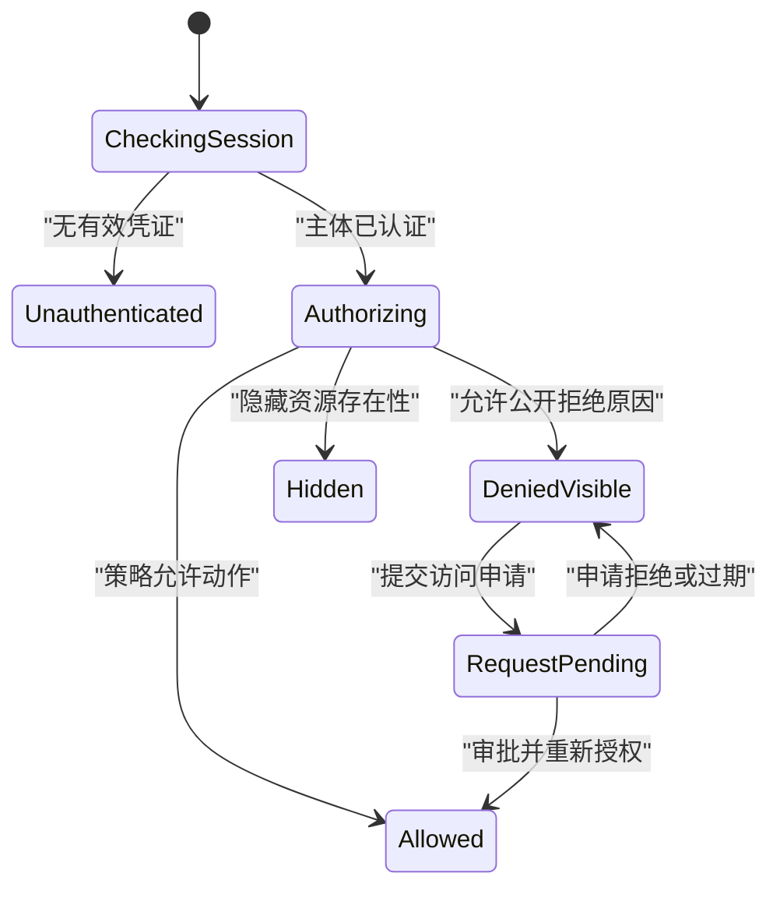

# 无权限状态

无权限状态表示当前主体已被系统识别，但不具备执行某项动作或读取某项资源所需的授权。界面负责解释可公开的范围和下一步，授权本身必须由服务端执行。

## 认证与授权

| 问题 | 认证 | 授权 |
| --- | --- | --- |
| 核心判断 | 你是谁 | 你能对该对象做什么 |
| 证据 | 会话、令牌、强认证 | 角色、关系、策略、资源属性 |
| 失败后动作 | 登录或重新认证 | 申请权限、切换范围或返回 |
| 是否可由前端决定 | 否 | 否 |

HTTP 401 表示请求缺少有效认证凭证，并通常伴随认证质询；403 表示服务端理解请求但拒绝执行。资源所有者若希望隐藏资源存在性，可以用 404 响应。

登录成功不保证获得目标权限。重新认证后必须重新运行授权判断。

## 授权决策模型

```json
{
  "subject": {
    "id": "user-72",
    "tenantId": "org-9",
    "authenticationLevel": "mfa"
  },
  "resource": {
    "type": "report",
    "id": "report-42",
    "tenantId": "org-9",
    "classification": "finance"
  },
  "action": "report.export",
  "decision": "deny",
  "reason": "missing-capability",
  "requiredCapability": "finance.export",
  "disclosure": "reason-and-request-path",
  "policyVersion": 18
}
```

服务端输入包括主体、资源、动作和环境。输出至少包含 allow/deny；原因与申请路径只有在安全策略允许时返回。

`policyVersion` 用于调试和审计，不使客户端获得策略解释权。客户端可以根据 `requiredCapability` 选择已注册文案，但提交时仍需服务端复核。

## 页面级与动作级拒绝

页面级无权限：

- 用户无法读取主资源；
- 页面标题说明无法访问；
- 不渲染资源敏感字段；
- 提供安全返回位置；
- 若允许，提供申请访问或切换账号。

动作级无权限：

- 用户可以读对象但不能编辑、导出或删除；
- 页面主体继续可用；
- 相关动作隐藏或禁用取决于发现性需求；
- 尝试执行时服务端仍返回明确拒绝；
- 权限变化后动态更新能力。

不能因为“删除按钮不可用”就替换整个详情页。

## 能力契约

读取对象时可以返回经过授权的能力：

```json
{
  "project": {
    "id": "project-42",
    "name": "支付平台",
    "version": 31
  },
  "capabilities": {
    "read": true,
    "edit": false,
    "delete": false,
    "inviteMember": true
  }
}
```

能力有三个用途：

- 决定当前界面展示哪些真实动作；
- 解释只读状态；
- 减少用户必然失败的尝试。

能力不是授权令牌。用户点击“邀请成员”时，服务端按当前主体、项目和最新策略再次检查。

## 存在性隐藏

私有文档、用户账号和安全事件可能不能向未授权主体公开“它存在”。

安全响应应统一：

- 状态码策略；
- 页面文案；
- 响应大小与明显时间差；
- 申请路径；
- 日志和分析字段。

不能一边返回 404，一边在页面写“该私有文档存在，但你不是成员”。找不到与无权查看共享中性结果时，只提供安全集合入口或联系管理员的一般方式。

对已知协作者可以公开“权限已被移除”；这种差异必须来自明确披露策略。

## 状态转换



访问申请成功只表示申请已提交，不表示权限已经生效。审批事件到达后重新读取授权决策。

## 登录重定向安全

未认证用户访问受保护页面时，可以保存安全目标路径。重新登录后：

1. 校验目标是本站允许路径；
2. 防止开放重定向；
3. 重新获取会话；
4. 对目标资源执行授权；
5. 允许则进入；
6. 拒绝则显示相应状态。

不要把旧页面中的敏感查询参数直接写入登录 URL。跨租户切换时目标租户也要重新确认。

## 申请访问

申请入口需要真实工作流：

- 申请对象；
- 请求的角色或能力；
- 业务理由；
- 审批人或策略；
- 预计处理方式；
- 当前申请状态；
- 撤回或补充信息；
- 结果通知。

按钮“申请权限”若只发一封无人处理的邮件，不是可靠恢复路径。重复申请应返回已有 pending 申请，而不是制造多条审批。

审批通过后：

- 服务端提交授权关系；
- 产生审计记录；
- 缓存失效；
- 当前页面重新查询 capabilities；
- 只在确认 allow 后显示受保护内容。

## 权限在操作中变化

用户打开编辑页时有权限，提交前可能被移除。服务端拒绝提交后，界面应：

- 说明当前更改未保存；
- 保留可安全复制的输入；
- 移除进一步写入动作；
- 提供返回只读视图或申请权限；
- 不把本地草稿自动同步到无权对象；
- 避免泄露最新资源内容。

若权限缩小影响字段级可见性，旧缓存中的敏感字段必须从界面和应用状态清除。不能仅用 CSS 隐藏。

## 多租户边界

对象 ID 不能替代租户授权。每次查询将租户边界纳入：

```text
subject.tenantId
resource.tenantId
requested tenant context
action
```

即使两个租户都存在 `project-42`，当前会话也只能访问授权租户。切换组织时清空旧组织的缓存、选择、草稿引用和预取结果。

聚合数据也必须在授权范围内计算。不能先返回全组织总数，再在前端隐藏明细。

## 字段与行级权限

同一对象中可能只有部分字段可见：

- 客服可见订单状态但不可见完整支付卡号；
- 项目成员可见成员名但不可见薪酬；
- 审计员可导出元数据但不可下载附件。

接口应返回经过过滤的表示或明确字段能力，不能返回完整对象让前端删除字段。

表格行级授权影响总数、分页和选择。总数必须按当前主体计算；跨页选择执行时逐项复核，结果只显示用户有权知道的拒绝信息。

## 缓存与预取

权限敏感响应的缓存键至少区分主体、租户和授权相关表示。服务工作线程、客户端查询缓存、浏览器历史和边缘缓存都可能保留旧内容。

权限撤销后需要：

1. 服务端立即拒绝新的资源与附件请求；
2. 使共享缓存不再返回旧授权表示；
3. 客户端从内存移除已不可见字段；
4. 停止相关预取、轮询和订阅；
5. 清理离线副本或按组织策略要求重新认证；
6. 保留不含资源内容的安全返回路径。

前端清缓存不能替代服务端撤权，因为旧标签、旧设备和直接 API 调用仍可能存在。反过来，服务端已拒绝但当前 DOM 继续显示敏感正文，也属于需要处理的泄露窗口。

## 无障碍与焦点

页面级拒绝使用明确页面标题，例如“无法访问财务报告”。焦点进入主标题或由导航建立上下文，安全返回链接紧随说明。

动作级拒绝发生在同页时，焦点保留在触发按钮，错误与该动作关联。权限被动态撤销导致按钮消失时，把焦点转到对象标题或相邻安全动作。

锁图标不能成为唯一信息。只读字段、审批状态和申请结果都有文本。状态消息说明“访问申请已提交”，不能说“权限已获得”。

## 案例一：私有设计文档深链

### 输入

- 文档 `doc-42` 属于团队 A；
- 用户属于团队 B；
- 用户从外部聊天链接进入；
- 披露策略隐藏文档存在性；
- 用户可以访问自己的文档列表。

### 处理

1. 服务端认证用户；
2. 以 `document.read` 对 doc-42 授权；
3. 策略返回 deny 和 disclosure=hidden；
4. API 使用与不存在一致的安全响应；
5. 页面标题写“找不到该文档或你无法访问”；
6. 不显示文档名、所有者或团队 A；
7. 提供返回“我的文档”；
8. 日志记录受控拒绝原因，分析只记录隐藏型拒绝；
9. 响应不提供针对 doc-42 的申请按钮。

### 输出

用户无法从页面或网络响应确认 doc-42 是否存在，但可以回到自己的合法集合。

### 案例验收

- 不存在 ID 与受限 ID 的公开响应策略一致；
- HTML、页面标题和分析事件均不包含文档名称；
- 浏览器返回到聊天后不会缓存敏感预览；
- 直接修改 URL 不能取得附件或缩略图；
- 读屏先取得中性标题和安全返回动作；
- 受控审计仍能区分真实原因供安全团队调查。

### 失败分支

API 返回 404，但前端从预取缓存显示文档标题和“申请加入团队 A”。修正为切换主体或租户时清除敏感缓存，所有派生资源单独授权。

## 案例二：财务报表导出权限申请

### 输入

- 用户可以读取汇总报表；
- 缺少 `finance.export`；
- 组织允许申请 24 小时临时导出权限；
- 审批需要直属负责人；
- 页面可能在审批期间保持打开。

### 处理

1. 报表正常显示，导出动作说明需要额外权限；
2. 用户打开申请表，目标能力和期限已明确；
3. 服务端验证申请资格并创建 `access-request-8841`；
4. 页面显示“申请已提交”，不显示“导出已解锁”；
5. 重复点击返回已有 pending 申请；
6. 审批事件到达后页面重新查询 capabilities；
7. 只有 `finance.export=true` 时启用导出；
8. 导出请求再次授权并记录审计；
9. 24 小时后能力失效，已打开页面下一次导出被拒绝。

### 输出

读报表与导出权限分离。申请、审批、生效和过期都有不同状态，导出文件仅在当前权限下生成。

### 案例验收

- 无导出权限不影响合法阅读；
- pending 申请不会重复创建；
- 审批拒绝保留报表并给出可公开原因；
- 审批通过前按钮不能发起真实导出；
- 权限过期后前后端同时回到只读能力；
- 导出 URL 不在授权撤销后继续有效；
- 焦点在动态启用按钮时不被强制移动。

### 失败分支

前端审批动画结束就启用导出，而授权缓存尚未更新。攻击者可在短窗口请求文件。修正为动画不改变能力，必须以服务端最新授权为准。

## 审计与观测

每次授权决策至少关联：

- 主体；
- 租户；
- 资源类型与安全 ID；
- 动作；
- allow/deny；
- 策略版本；
- 可以公开的 reason；
- 请求参考号；
- 决策时间。

界面调试对照 capabilities、实际按钮和服务端最终决策。只检查按钮隐藏无法证明资源、附件、导出和聚合 API 安全。

观测：

- 页面级和动作级拒绝率；
- 401 与 403 分布；
- 访问申请提交、批准和过期；
- 权限撤销后仍成功的请求；
- 隐藏型拒绝的信息泄露缺陷；
- 跨租户缓存命中；
- 用户被困在无恢复路径的次数；
- 辅助技术无法取得拒绝原因。

分析日志不记录受限资源名称或正文。

## 综合练习：项目角色与临时权限

实现 viewer、editor、admin 三种项目角色，并允许申请 2 小时临时导出能力。

验收覆盖：

- 未认证登录恢复；
- 页面级读拒绝；
- 可读不可编辑；
- 字段级敏感信息过滤；
- 临时申请 pending、approved、denied、expired；
- 编辑期间权限撤销；
- 跨租户对象 ID 碰撞；
- 隐藏存在性的私有项目；
- 附件和导出独立授权；
- 键盘可访问安全返回与申请流程。

最终证明服务端拒绝所有未授权请求，前端 capabilities 只改善交互，不承担安全边界。

## 来源

- [IETF — RFC 9110：401、403 与隐藏资源的 404 语义](https://www.rfc-editor.org/rfc/rfc9110.html)（访问日期：2026-07-18）
- [IETF — RFC 9457：Problem Details 安全考虑](https://www.rfc-editor.org/rfc/rfc9457.html)（访问日期：2026-07-18）
- [W3C WAI — WCAG 2.2 错误识别](https://www.w3.org/WAI/WCAG22/Understanding/error-identification)（访问日期：2026-07-18）
- [W3C WAI — WCAG 2.2 一致帮助](https://www.w3.org/WAI/WCAG22/Understanding/consistent-help.html)（访问日期：2026-07-18）
