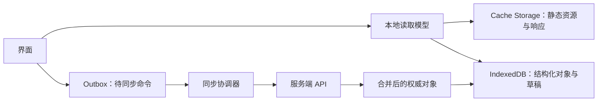

# 离线状态

离线状态表示应用当前无法完成某类必要网络通信。它不是 `navigator.onLine === false` 的视觉映射，而是按能力说明哪些数据可读、哪些操作只在本地、哪些必须等待同步。

## 连通性不是一个布尔事实

浏览器网络接口只能提供信号。以下情况都可能表现不同：

- 设备没有网络；
- 已连接 Wi‑Fi 但需要门户登录；
- DNS 失败；
- 目标 API 不可达；
- 静态资源 CDN 可达但写入服务不可达；
- VPN 阻断特定域；
- 请求超时；
- 服务恢复但认证已过期。

应用以真实请求结果和最近成功时间判断具体能力，不能用一个全局 online 布尔值保证服务可用。

## 离线能力矩阵

| 能力 | 可离线读取 | 可离线修改 | 恢复要求 |
| --- | --- | --- | --- |
| 已缓存帮助文档 | 是 | 否 | 更新缓存 |
| 本地个人草稿 | 是 | 是 | 可选同步 |
| 团队工单 | 仅已缓存部分 | 可排队受限动作 | 重新授权与冲突处理 |
| 银行转账 | 可读旧历史 | 不应离线提交 | 联网重新确认 |
| 文件下载 | 已下载文件可用 | 可排队删除本地副本 | 云端删除需联网 |

产品在设计前逐项确定能力，而不是统一显示“离线模式仍可使用全部功能”。

## 数据分层



Cache Storage 适合请求/响应缓存；IndexedDB 适合结构化对象、索引和事务。二者的内容都受存储配额、清理和隐私策略影响，不能承诺永久存在。

## 本地对象模型

```json
{
  "entity": {
    "type": "inspection-note",
    "localId": "local-72",
    "serverId": null,
    "baseVersion": null,
    "fields": {
      "site": "仓库 A",
      "result": "需要复检"
    }
  },
  "sync": {
    "state": "queued",
    "operationId": "device-op-8841",
    "attempts": 0,
    "lastError": null
  },
  "local": {
    "updatedAt": "2026-07-18T02:20:00+08:00",
    "attachmentRefs": [
      "blob-photo-3"
    ]
  }
}
```

`localId` 在服务器分配 ID 前稳定关联界面、附件和命令。`baseVersion` 用于编辑已有对象的冲突检测。`operationId` 只在本设备 outbox 中标识一次命令，服务端还需自己的去重协议。

## Outbox

离线写入先在一个本地事务中完成：

1. 写入或更新本地实体；
2. 写入待同步命令；
3. 更新本地视图；
4. 事务提交后才显示“已保存到此设备”。

不能先显示“已同步”，也不能先更新视图再因 outbox 写入失败丢掉操作。

```json
{
  "operationId": "device-op-8841",
  "kind": "inspection-note.create",
  "entityLocalId": "local-72",
  "payloadVersion": 1,
  "createdAt": "2026-07-18T02:20:00+08:00",
  "state": "queued",
  "dependsOn": [],
  "requiresFreshAuthorization": true
}
```

命令保存业务意图所需的最小字段，不保存会话令牌。同步时使用当前凭证重新认证和授权。

## 同步状态

每个本地对象至少区分：

- `local-only`：只存在设备；
- `queued`：已有待同步命令；
- `syncing`：当前正在发送；
- `synced`：服务端已确认且返回版本；
- `conflict`：服务端版本与 baseVersion 不匹配；
- `rejected`：格式、业务或权限永久拒绝；
- `retry-wait`：临时故障等待恢复。

状态文本与对象关联。页面顶部“离线”只说明整体环境，不能替代“这 3 条记录尚未同步”。

## 同步算法

恢复网络后：

1. 验证目标 API 实际可达；
2. 获取当前会话，必要时要求重新登录；
3. 按依赖关系选择可发送命令；
4. 对已有对象附带 baseVersion；
5. 服务端授权并执行去重；
6. 保存返回的 serverId 和新版本；
7. 原子删除或标记 outbox 命令已完成；
8. 拉取服务端自上次同步后的变化；
9. 检测冲突；
10. 更新界面和同步摘要。

后台同步能力不是所有环境都保证可用。应用打开时和用户显式触发时都必须能运行同一同步逻辑。

## 命令顺序与依赖

创建项目后离线创建任务时，任务命令依赖项目服务器 ID：

```text
project.create local-project-1
task.create local-task-9 dependsOn local-project-1
```

同步器先提交项目，取得 `project-42`，再重写任务的引用并提交。若项目创建永久失败，依赖任务不能继续发送；界面需要解释受影响对象。

删除与更新同一对象时要折叠命令。例如离线创建草稿后又删除且从未同步，可以同时移除本地对象和创建命令，不必先在服务端创建再删除。

## 冲突

离线编辑时间长，冲突不是异常边角。

冲突数据应包含：

- baseVersion 和 base 值；
- 本地当前值；
- 服务端当前版本和值；
- 每个字段能否自动合并；
- 用户选择；
- 合并提交的新条件版本。

文本备注可以保留两个版本并让用户合并；库存数量、余额和权限不能用最后写入获胜。业务不变量始终由服务端执行。

## 附件

离线照片、音频和文件需要：

- 本地 blob 引用；
- MIME 类型和大小；
- 校验和；
- 上传状态；
- 与业务对象的依赖；
- 配额失败处理；
- 用户删除和隐私清理；
- 上传成功后的服务端引用。

页面重新打开时必须检查 blob 是否仍存在。元数据在但文件被系统清理时，显示“附件已从设备移除，需要重新选择”，不能让同步永久 pending。

## 缓存安全

共享设备上缓存可能暴露敏感数据。按数据分类决定：

- 是否允许离线；
- 是否加密；
- 退出登录时是否清理；
- 缓存保留多久；
- 屏幕锁或重新认证要求；
- 分析数据能否记录；
- 服务工作线程缓存是否区分用户。

不能把带用户数据的 API 响应放进全用户共享缓存键。切换账号时清空或隔离当前主体的 IndexedDB 和 Cache Storage 数据。

## 界面与状态消息

离线横幅应写具体事实，例如：

```text
无法连接到工单服务
你仍可查看 10:18 同步的数据。2 项更改仅保存在此设备。
[查看待同步项目] [重试连接]
```

重点包括：

- 不可用的服务；
- 缓存更新时间；
- 待同步数量；
- 本地保存范围；
- 当前可执行动作。

不要在每次网络抖动时反复播报。连接状态稳定变化、待同步队列从非零到零、冲突出现时提供节流后的状态消息。

离线不应突然把焦点移到横幅。用户打开“待同步项目”后，列表项显示命令状态和修复动作。

## 案例一：现场巡检记录

### 输入

- 检查员在无信号仓库创建 6 条记录；
- 每条含文本和一张照片；
- 第 4 条引用一个已被后台删除的检查点；
- 两台设备都编辑了第 2 条已有记录；
- 设备剩余存储空间有限。

### 本地处理

1. 打开任务前已缓存检查点清单和最后同步时间；
2. 新记录在 IndexedDB 事务中写入实体与 outbox；
3. 照片先计算校验和再保存 blob；
4. 本地 UI 显示“仅保存在此设备”；
5. 每条记录有稳定 localId；
6. 存储不足时第 6 张照片保存失败，文本记录仍保留并明确缺附件；
7. 用户离开页面再打开，6 条记录和 5 张照片可恢复。

### 联网同步

1. 重新认证检查员；
2. 上传照片并取得服务端引用；
3. 创建前 5 个合法记录；
4. 第 4 条因检查点删除被拒绝；
5. 第 2 条已有记录返回版本冲突；
6. 界面显示 4 条已同步、1 条业务拒绝、1 条冲突；
7. 用户为第 4 条选择新检查点；
8. 用户合并第 2 条文本后再次提交。

### 案例验收

- outbox 和本地实体在同一事务提交；
- 重新打开应用不丢失文本；
- 照片不存在时不显示永久上传中；
- 认证令牌未写入 IndexedDB；
- 检查点删除不会被自动重试；
- 冲突保留 base、本地和服务端三份值；
- 最终 6 条记录各有一个 serverId；
- 屏幕阅读器可区分本地、同步中、冲突和已同步。

### 失败分支

应用仅监听 `online` 事件后把所有记录标记为已同步，但 API 仍被 VPN 阻断。修正为每个命令以服务端确认进入 synced，顶层在线信号只触发探测。

## 案例二：离线下载培训资料

### 输入

- 用户选择 12 个视频和 PDF；
- 设备中途断网；
- 两个文件在服务器更新；
- 一个文件权限被撤销；
- 用户需要删除本地副本但保留云端收藏。

### 下载过程

1. 清单保存文件 ID、版本、大小和校验和；
2. 下载前检查配额并让用户确认 2.4 GB；
3. 已完成文件标记本地可用；
4. 断网时暂停未完成流，不把部分文件当可打开；
5. 恢复后按服务端支持的范围协议续传或重新下载；
6. 文件完成后验证校验和；
7. 服务器版本改变时提示更新，不静默混合字节；
8. 权限撤销的文件从下载队列移除并按策略删除本地副本；
9. “从设备删除”不发送云端删除命令。

### 输出

10 个文件离线可用，1 个等待更新确认，1 个因权限撤销不可用。每个文件显示版本、下载状态和本地占用。

### 案例验收

- 部分下载不被标记为完整；
- 校验和错误会删除损坏副本并提供重新下载；
- 删除本地副本不改变云端收藏；
- 权限撤销后深链和缓存都不可继续访问；
- 切换账号不会看到前一账号下载清单；
- 存储不足前提供需要空间和可清理项目；
- 键盘能暂停、继续和删除本地副本。

### 失败分支

缓存键只使用文件 URL，不包含版本和主体，账号 B 命中账号 A 的旧视频。修正为资源授权、用户隔离、版本化缓存和退出清理。

## 调试同步

本地事务问题：

1. 记录 object store、transaction mode 与 complete/abort；
2. 强制关闭页面验证原子性；
3. 注入配额错误；
4. 检查实体与 outbox 是否同时存在；
5. 检查升级版本时数据迁移。

同步问题：

1. 导出不含敏感负载的队列摘要；
2. 检查依赖拓扑；
3. 记录每项 attempt、HTTP 分类和服务端版本；
4. 重放响应丢失与重复事件；
5. 检查已成功命令是否被再次执行；
6. 对账本地 serverId 与服务端对象。

冲突问题：

1. 保存 baseVersion；
2. 固定两端编辑顺序；
3. 检查自动合并字段；
4. 检查不变量是否仍由服务端保护；
5. 检查用户选择后的条件提交。

## 观测

- 活跃设备的待同步项目数；
- 队列最老项目年龄；
- 同步成功、永久拒绝和冲突；
- 本地存储配额失败；
- 附件丢失；
- 重复副作用；
- 按服务和网络类型的不可达时间；
- 用户离线创建后最终同步率；
- 权限撤销后的缓存清理失败。

分析事件不上传离线文本、照片名和文件内容。诊断包需要用户明确同意并脱敏。

## 综合练习：离线工单

实现可离线创建工单、追加评论和拍照的应用。

必须覆盖：

- 结构化本地数据库；
- 实体与 outbox 原子写入；
- localId 到 serverId 映射；
- 命令依赖；
- 认证恢复；
- 当前权限复核；
- 附件校验和与配额；
- 重复发送去重；
- baseVersion 冲突；
- 按对象显示同步状态；
- 账号切换清理；
- 无后台同步能力时的前台恢复。

验收在浏览器离线、API 单独不可达、响应丢失、存储不足和两设备冲突条件下运行。最终服务端对象、附件与本地队列必须对账，任何“已同步”都有服务端确认。

## 来源

- [W3C — Service Workers](https://www.w3.org/TR/service-workers/)（访问日期：2026-07-18）
- [W3C — Indexed Database API 3.0](https://www.w3.org/TR/IndexedDB/)（访问日期：2026-07-18）
- [WICG — Web Background Synchronization](https://wicg.github.io/background-sync/spec/)（访问日期：2026-07-18）
- [WHATWG — Storage Standard](https://storage.spec.whatwg.org/)（访问日期：2026-07-18）
