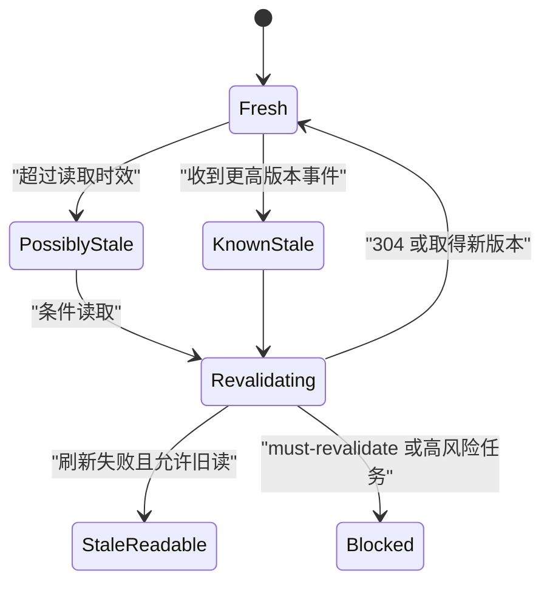

# 数据过期状态

数据过期表示当前表示仍可读取，但已经超过为该任务定义的新鲜度要求，或已知存在更新版本。它不是单纯“时间很久”，必须同时说明数据版本、观察时间和是否允许继续决策。

## 新鲜度来自任务

同一份数据在不同任务中的有效期不同：

| 数据 | 浏览用途 | 写入用途 |
| --- | --- | --- |
| 商品描述 | 数小时可能可接受 | 编辑前需要最新版本 |
| 库存 | 几秒可能已影响购买 | 下单时由服务端重新校验 |
| 财务余额 | 历史报表可按截止时间读取 | 转账前必须重新确认 |
| 权限 | 页面展示可短暂缓存 | 每次敏感动作重新授权 |
| 构建日志 | 已结束任务永久稳定 | 运行中日志持续变化 |

产品需要定义“对哪个决策足够新”，而不是统一设置五分钟后显示黄色标签。

## HTTP 新鲜度与业务时效

RFC 9111 定义缓存新鲜度：

```text
response_is_fresh = freshness_lifetime > current_age
```

`max-age`、`s-maxage`、`Expires` 和 `Age` 参与 HTTP 缓存判断。HTTP 缓存仍然 fresh 不保证业务值适合某个高风险动作；反之，历史报告明确截止到昨日，即使生成时间早，也不一定“过期”。

业务表示需要额外字段：

```json
{
  "resourceId": "inventory-sku-42",
  "version": 884,
  "asOf": "2026-07-18T02:20:00Z",
  "receivedAt": "2026-07-18T02:20:02Z",
  "freshnessPolicy": {
    "readMaxAgeSeconds": 60,
    "writeRequiresRevalidation": true
  },
  "refresh": {
    "state": "idle",
    "lastAttemptAt": "2026-07-18T02:20:02Z"
  }
}
```

`asOf` 表示数据反映到哪个业务时间；`receivedAt` 是客户端收到时间；`version` 用于确定新旧；本地时钟不能替代服务端版本。

## 过期来源

- 显式缓存寿命已结束；
- 推送通知表明有更高版本；
- 用户从休眠页面恢复；
- 浏览器历史恢复了旧 DOM；
- 离线缓存无法重新验证；
- 后台数据回补改变历史结果；
- 当前权限或筛选改变；
- 写入成功但列表缓存未失效；
- 多地区读副本落后。

界面需要区分“按时间推测可能旧”与“已知存在新版本”。后者应优先刷新并阻止基于旧版本的危险写入。

## 状态流



刷新失败不自动删除旧数据。是否继续展示由数据分类和业务政策决定。

## 条件重新验证

读取资源时保存 ETag：

```text
GET /inventory/sku-42
ETag: "inventory-884"
Cache-Control: max-age=60, must-revalidate
```

过期后发送：

```text
GET /inventory/sku-42
If-None-Match: "inventory-884"
```

服务端可返回 304 更新缓存元数据，或 200 与新表示。条件请求减少传输，但仍需正确处理认证、Vary、缓存键和权限。

`must-revalidate` 表示响应过期后不能在未成功验证时复用。金融写入准备、权限敏感表示等错误复用会造成不正确操作时，应采用严格策略。

## stale-while-revalidate 界面

适合低风险浏览：

1. 立即显示旧内容；
2. 标出“数据截至 10:20”；
3. 后台发起重新验证；
4. 保持当前滚动和焦点；
5. 新版本返回后按稳定 ID 更新；
6. 说明关键变化；
7. 刷新失败时保留旧内容并说明。

不适合：

- 转账余额确认；
- 权限决策；
- 库存扣减；
- 医疗剂量；
- 已知旧版本的覆盖写入。

HTTP 允许某些 stale 响应，不代表产品可以隐藏其年龄。

## 刷新与用户编辑竞态

用户基于 version 884 编辑数量，刷新得到 version 885。不能直接把新表示写入表单并覆盖用户输入。

分开：

- 浏览表示缓存；
- 编辑基线；
- 当前草稿；
- 服务端最新版本。

若只有未编辑字段变化，可以提示并合并；若同一字段变化，进入冲突状态。提交附带 version 884，由服务端拒绝过期写入。

## 回补数据

经营指标可能因退款、迟到事件或修复改变历史。仅显示“最后刷新时间”不足以解释变化，还需：

- 数据截止时间；
- 计算版本；
- 回补范围；
- 与上次版本差异；
- 下钻查询。

历史日期不是不可变。若报告在 7 月 18 日回补了 7 月 10 日收入，界面应记录计算版本和更新时间。

## 实时推送与版本

推送事件只作为失效信号或携带完整有序变更：

```json
{
  "resourceId": "inventory-sku-42",
  "newVersion": 885,
  "eventSequence": 9120,
  "changedFields": [
    "available"
  ]
}
```

事件版本高于当前版本时标记 known stale。重复或旧事件忽略；序列缺口触发重新读取。不能只按客户端收到时间决定顺序。

## 新鲜度门槛的计算

界面不要使用“现在减去客户端 receivedAt”作为唯一年龄。经过代理缓存的响应已经携带 `Age`，业务数据又有独立 `asOf`。可以同时计算：

```text
传输表示年龄 = HTTP current_age
业务观测年龄 = 服务端当前时间 - asOf
客户端停留时间 = 单调时钟当前值 - 接收时单调时钟值
```

日历时间可能因系统校时向前或向后跳；页面停留计时宜使用单调时钟。最终是否允许动作由服务端版本和业务门槛决定，客户端时间只用于提示。

不同字段也可能有不同 asOf。订单主体来自事务库，配送预计时间来自第三方服务。若合并成一张卡片，应分别显示关键字段时效，或者让服务端生成具有共同截止时间的快照。

## 写动作门禁

旧数据可读不表示旧页面上的所有按钮可用。动作按风险分级：

| 动作 | stale 时行为 |
| --- | --- |
| 复制历史编号 | 允许 |
| 展开旧详情 | 允许并保留时效说明 |
| 修改显示偏好 | 与业务版本无关，可允许 |
| 更新库存 | 先重新读取并比较 |
| 批量调拨 | 阻止，要求全范围新快照 |
| 依据旧权限导出 | 重新授权并重新查询 |

按钮恢复后仍需服务端条件校验。刷新成功只说明取得了当时的新版本，不锁住资源。

## 缓存与隐私

认证响应若允许缓存，需要正确的 `private`、共享缓存规则和 `Vary` 维度。用户切换租户后，旧租户表示即使尚未超过 max-age 也不能继续展示。

对于撤权、登出和敏感字段变化：

- 立即停止使用旧表示；
- 清除内存和持久缓存中的敏感内容；
- 使附件和下钻请求重新授权；
- 不把 stale-if-error 用于绕过权限服务失败；
- 分析日志只记录版本和分类，不记录旧正文。

可用性策略不能覆盖安全策略。无法重新验证权限时，安全资源进入 blocked，而不是 stale-readable。

## 界面反馈

可读旧数据时：

```text
库存数据截至 10:20，正在刷新
当前显示 8 件。下单时会重新确认库存。
```

刷新失败：

```text
无法取得最新库存
当前显示的是 10:20 的数据，不能用于批量调拨。
[重新加载] [查看历史]
```

状态必须包含时间或版本、影响和动作。不能只放一个时钟图标。

刷新通常不移动焦点。新数据使列表重排时，先保持用户阅读位置；高风险变化用状态消息说明。用户正在复制数值或操作菜单时避免重建 DOM。

## 案例一：运营仪表盘回补

### 输入

- 页面显示昨日收入 120 万；
- 数据版本 `revenue-v31`，截至 09:00；
- 09:10 退款回补使收入变为 116 万；
- 用户正在查看地区分群；
- 一张渠道卡刷新失败。

### 处理

1. 每张卡保存查询、时间窗、asOf 和版本；
2. 推送通知收入指标已有 v32；
3. 收入卡标记 known stale 并重新查询；
4. 旧 120 万继续可读，但显示更新中；
5. v32 返回后更新为 116 万并说明退款回补；
6. 地区筛选和焦点保持；
7. 渠道卡刷新失败，保留 v31 并标记旧；
8. 导出冻结每张卡实际版本，不混合成“最新”。

### 输出

页面同时存在收入 v32 和渠道 v31，但每张卡的版本与状态清晰。总体结论不在数据版本不一致时自动生成。

### 案例验收

- 120 万到 116 万有回补原因和计算版本；
- 局部失败不让其他卡退回 v31；
- 用户筛选与展开状态不因刷新丢失；
- 读屏取得“收入已更新为 116 万”；
- 导出注明每个指标截止时间；
- 旧推送事件不能把 v32 改回 v31；
- 详情页复现同一查询与版本。

### 失败分支

仪表盘只显示“刚刚更新”，但一张卡来自昨天缓存。修正为卡级 asOf、版本和局部刷新状态，不用页面级时间掩盖混合新鲜度。

## 案例二：库存编辑

### 输入

- 管理员打开 SKU-42，version 884，可用库存 8；
- 另一个仓库操作把库存改为 5，version 885；
- 当前管理员输入调拨 6；
- 页面收到失效事件；
- 调拨必须基于最新库存。

### 处理

1. 事件使浏览表示进入 known stale；
2. 当前输入 6 保留，不自动覆盖；
3. 条件读取取得 version 885 与库存 5；
4. 页面说明“库存已由 8 更新为 5”；
5. 调拨按钮暂时不可提交旧条件；
6. 管理员把数量改为 5；
7. 提交附带 `If-Match: "inventory-885"`；
8. 服务端再次检查并原子扣减；
9. 成功返回 version 886。

### 输出

用户输入未丢失，但旧版本不能用于调拨。最终库存和调拨数量由服务端 version 885 条件保证。

### 案例验收

- 失效事件不直接替换用户草稿；
- 新版本对比明确指出库存字段变化；
- version 884 提交得到前置条件失败；
- 重新确认后仅提交 version 885；
- 两个标签并发调拨不会出现负库存；
- 页面刷新后读取 version 886；
- 时钟偏差不影响版本判断。

### 失败分支

客户端按“数据未超过 60 秒”允许 version 884 调拨。缓存时间满足但已知有 v885。修正为已知版本变化优先于时间寿命，并由服务端条件写入保护。

## 调试新鲜度

记录：

- cache key 与 Vary 维度；
- Date、Age、Cache-Control、ETag；
- 业务 asOf 和数据版本；
- 当前任务的新鲜度策略；
- 失效事件序列；
- 重新验证请求与 304/200；
- 界面显示的时间和允许动作；
- 刷新期间的焦点与草稿。

常见问题：

- CDN 缓存键漏掉租户；
- 客户端查询键漏掉筛选；
- 写入后只失效详情，不失效列表；
- 304 后没有更新缓存元数据；
- 多标签各自持有旧版本；
- 本地时钟改变导致错误年龄；
- stale 数据仍用于危险写入。

## 观测

- stale 表示被展示的时长；
- 重新验证成功率与延迟；
- 已知旧版本仍提交的次数；
- 缓存命中但业务时效不满足；
- 推送序列缺口；
- 回补数据变化范围；
- 用户因旧数据做出无效操作；
- 不同缓存层的版本不一致。

日志记录版本与查询哈希，不记录敏感表示内容。

## 综合练习：多层缓存库存页

实现浏览器缓存、边缘缓存和源服务共同参与的库存详情：

- GET 返回 ETag 和明确 Cache-Control；
- 浏览可短暂使用旧值；
- 调拨必须重新验证；
- 写入使用 If-Match；
- 推送提供版本失效信号；
- 多标签同步 known stale；
- 断网时按 must-revalidate 阻止调拨；
- 刷新不覆盖草稿；
- 304 与 200 均正确更新状态；
- 缓存按租户隔离。

验收注入 CDN Age、客户端时钟偏差、推送丢失、版本并发和源站不可达。任何调拨都必须与权威库存版本对账。

## 来源

- [IETF — RFC 9111：HTTP Caching](https://www.rfc-editor.org/rfc/rfc9111.html)（访问日期：2026-07-18）
- [IETF — RFC 9110：条件请求与 ETag](https://www.rfc-editor.org/rfc/rfc9110.html)（访问日期：2026-07-18）
- [IETF — RFC 5861：stale-while-revalidate 与 stale-if-error](https://www.rfc-editor.org/rfc/rfc5861.html)（访问日期：2026-07-18）
- [W3C WAI — WCAG 2.2 状态消息](https://www.w3.org/WAI/WCAG22/Understanding/status-messages.html)（访问日期：2026-07-18）
