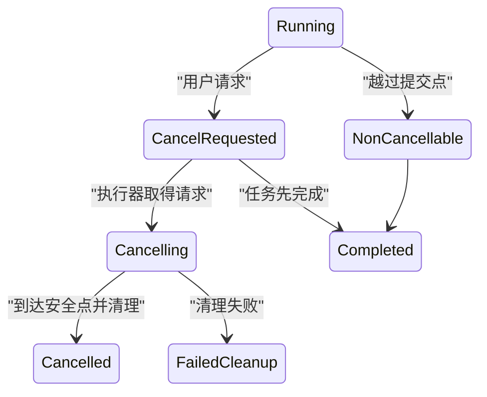

# 取消状态

取消表示用户请求停止尚未完成的工作。客户端停止等待、服务端接受取消请求、执行器实际停止和业务补偿完成是不同阶段，不能共用一个 `cancelled` 布尔值。

## 四种“取消”

| 行为 | 影响 | 是否证明业务停止 |
| --- | --- | --- |
| 关闭对话框 | 仅隐藏界面 | 否 |
| AbortSignal 中止 Fetch | 客户端停止网络操作 | 否 |
| 服务端接受取消请求 | 已记录停止意图 | 否 |
| 执行器到达安全点 | 不再开始新工作 | 是，已完成部分仍存在 |

删除已完成副作用属于补偿或反向业务，不是原取消的一部分。

## 任务取消契约

```json
{
  "taskId": "export-2048",
  "state": "cancel-requested",
  "stage": "rendering",
  "progress": {
    "completed": 42,
    "total": 120
  },
  "cancellation": {
    "requestedAt": "2026-07-18T02:20:00Z",
    "requestedBy": "user-72",
    "mode": "stop-after-current-unit",
    "canWithdraw": false
  },
  "result": {
    "completedUnits": 42,
    "discardedArtifact": false
  }
}
```

状态至少包括：

- `running`：正常执行；
- `cancel-requested`：请求已记录；
- `cancelling`：执行器正在收敛；
- `cancelled`：已到终态；
- `completed`：取消到达前已完成；
- `failed`：因其他原因失败；
- `cannot-cancel`：已越过不可取消点。

## 安全停止点

长任务不能在任意机器指令处停止。需要定义检查取消的边界：

- 每处理一个独立对象后；
- 一个数据库事务提交前；
- 文件分片完成后；
- 外部 API 调用前；
- 渲染一个页面后；
- 进入不可逆动作之前。

任务在事务中收到取消时，通常让事务完成或回滚，再进入 cancelled。强制杀进程可能留下锁、临时文件和不守恒计数。



`cancel-requested → completed` 是合法竞态，界面要写“任务在取消生效前已完成”，不能强行覆盖为 cancelled。

## 客户端 AbortSignal

DOM Standard 的 AbortController 可以向异步操作发出 abort 信号，并携带 reason。Fetch 读取中止后，客户端 Promise 拒绝，但远端服务器是否停止由协议和服务实现决定。

```js
const controller = new AbortController();

async function loadPreview() {
  try {
    const response = await fetch("/api/report-preview", {
      signal: controller.signal
    });
    return await response.json();
  } catch (error) {
    if (controller.signal.aborted) {
      return { kind: "cancelled-locally", reason: controller.signal.reason };
    }
    throw error;
  }
}

controller.abort("dialog-closed");
```

预览是无副作用读取，关闭对话框后中止它即可。创建导出任务则需要调用任务取消 API，并继续查询终态。

## 取消 API

一种明确设计：

```text
POST /exports/export-2048/cancellation
```

响应可能为：

- 202：取消请求已接受，继续查询；
- 200：任务已经 cancelled；
- 409：任务已经完成或处于不可取消阶段；
- 403：当前主体无取消权限；
- 404：任务不存在或按策略隐藏。

重复发送取消请求应得到相同当前状态，不创建多个补偿任务。取消权限可能与创建权限不同。

## 界面阶段

运行中：

```text
正在生成报告：42/120 页
[请求取消]
```

请求后：

```text
正在停止报告
已完成当前页面后停止，请不要重复创建任务。
```

终态：

```text
报告已取消
已处理 42 页，未生成可下载文件。
[重新生成] [返回报告]
```

按钮点击后不能立即显示“已取消”。禁用重复按钮并显示 `cancel-requested`，直到服务端确认。

## 可撤回取消

大多数取消请求一旦执行器读取就不可撤回。若产品提供“继续”，必须有真实协议：

- 取消请求有等待窗口；
- 执行器尚未停止；
- 服务端能原子撤销请求；
- 客户端查询到恢复为 running。

仅在前端重新显示进度不代表任务继续。

## 已完成部分的处理

取消上传、导出和批量操作有不同结果：

- 上传：已存分片可保留用于续传或按期清理；
- 导出：临时文件必须删除，除非可验证完整；
- 批量通知：已发送无法撤销，未开始项停止；
- 数据迁移：按事务边界决定已提交范围；
- 视频转码：已完成片段可能作为临时数据清理。

界面要说明保留和清理政策。批量通知取消不能写“没有发送任何通知”，除非逐项结果证明为零。

## 取消与补偿

已经完成的业务动作需要补偿：

```text
原动作：预订座位成功
用户请求：不再需要
正确流程：创建取消预订业务动作
可能结果：退款、手续费、拒绝
```

补偿拥有独立权限、状态、失败和审计。它不是把原任务状态改回未开始。

## 分布式执行器如何观察取消

任务可能由多个 worker 处理。仅修改数据库中的 `cancel_requested=true` 不会自动停止已经领取的工作，执行协议还需要：

- 短期队列租约；
- 每个工作单元开始前检查任务状态；
- 长单元内部定期检查；
- 外部调用超时与可取消接口；
- worker 崩溃后的租约到期；
- 状态事件序列；
- 终态聚合器。

worker 完成单元时使用条件提交：只有任务仍允许接纳该结果且租约属于当前 worker 才更新。取消后迟到的成功事件不能悄悄增加完成数；若副作用实际上已经发生，则必须记录为已完成并纳入最终结果，而不是丢弃证据。

## 取消优先级与公平性

系统拥塞时，取消命令不应排在大量普通工作之后。可以为控制消息使用独立队列或在领取工作前查询状态，但需要限制恶意频繁取消造成的负载。

批量任务之间还要公平：一个 100 万项任务取消收敛时，不能占满所有 worker 只做清理。清理队列设置并发上限和优先级，关键敏感临时数据可提高优先级。

## 费用与配额

用户常把取消理解为“不再计费”，实际费用可能已经发生：

- 已传输字节；
- 已调用外部模型或邮件服务；
- 已占用计算时间；
- 已生成但尚未发布的文件；
- 取消和补偿本身的费用。

确认对话框应在可计算时说明“已完成部分仍可能计费”。最终凭证分别列出已完成量、未开始量、可退款量和清理状态，不能承诺无法保证的全额退款。

## 终态保留

cancelled 任务需要保留足以解释结果的摘要。任务详情到期前应包括取消请求者、请求时间、执行器观察时间、安全停止点、已完成计数和清理结果。

删除原始输入与删除审计摘要是两个保留策略。隐私要求可能要求立即删除文件内容，但仍保留不含内容的 taskId、字节数和结果码。

## 页面关闭

关闭页面只能：

- 中止不再需要的客户端读取；
- 保存可恢复任务 ID；
- 停止 UI 轮询；
- 释放本地资源。

不能可靠地用卸载事件完成关键取消。后台任务应由服务端持续维护；用户重新打开后查询真实状态。

## 焦点与辅助技术

取消按钮名称包含任务，例如“取消 7 月收入报告生成”。触发后焦点留在按钮位置，按钮可变为不可操作文本或“正在取消”状态；若节点被移除，将焦点放到任务标题。

取消确认对话框说明：

- 已完成部分是否保留；
- 是否可恢复；
- 是否产生费用；
- 取消生效可能延迟。

状态变化按阶段播报，不逐个轮询响应播报。最终 cancelled、completed-before-cancel 或 cleanup-failed 必须能区分。

## 案例一：大文件上传取消

### 输入

- 文件 4 GB，分片 64 MB；
- 已确认 18 个分片；
- 用户选择“取消并删除已上传内容”；
- 第 19 个分片正在传输；
- 清理服务可能暂时失败。

### 处理

1. 客户端中止第 19 分片 Fetch；
2. 向 uploadId 发送取消请求；
3. 服务端标记 cancel-requested，拒绝新分片；
4. 已接收 18 个分片进入清理队列；
5. UI 显示正在停止，不宣布已删除；
6. 清理成功后任务进入 cancelled；
7. 服务端返回已删除字节和结束时间；
8. 本地移除 uploadId 和续传入口；
9. 若清理失败，状态为 cleanup-pending 并继续服务端重试。

### 输出

最终取消证明包含 18 个分片已清理。第 19 分片是否到达由服务端 upload 状态决定，不能只依赖客户端 abort。

### 案例验收

- 中止网络不直接将服务端任务标记 cancelled；
- 取消后服务端拒绝迟到分片；
- 重复取消不会创建多个清理任务；
- 页面刷新后仍能查询 cleanup-pending；
- 清理完成前不释放同名新上传的去重边界；
- 读屏取得“正在停止”和“已取消”两个不同阶段；
- 存储对账确认临时分片为零。

### 失败分支

前端 abort 后删除本地 uploadId 并显示成功，18 个分片永久占用存储。修正为服务端取消资源和可恢复清理状态。

## 案例二：批量邮件任务取消

### 输入

- 批次含 1000 封邮件；
- 已确认发送 300 封；
- 20 封正在邮件服务处理中；
- 680 封尚未开始；
- 用户请求取消。

### 收敛

1. 服务端停止从队列领取新项目；
2. 已发送 300 项保持 succeeded；
3. 20 项查询邮件服务结果；
4. 680 项标记 not-started-after-cancel；
5. 所有处理中项目收敛后进入 cancelled-with-results；
6. 摘要显示实际发送与未发送数量；
7. 已发送邮件不能通过取消任务撤回；
8. 需要后续沟通时创建新的业务流程。

### 输出

若 20 项中 18 成功、2 失败，最终为 318 已发送、2 失败、680 未开始。总数守恒。

### 案例验收

- 1000 等于 318+2+680；
- cancel-requested 期间不再领取第 321 个新项目；
- 处理中项目没有被直接算作未发送；
- 重复取消不改变逐项结果；
- 用户可下载已发送对象明细；
- 权限撤销后明细按当前授权过滤；
- 页面不承诺撤回已送达邮件。

### 失败分支

取消请求到达后把全部 700 个非成功项标为 cancelled，包括邮件服务实际已接受的 18 项。修正为逐项查询并等待结果收敛。

## 取消故障诊断

任务一直 cancelling：

1. 检查执行器最后心跳；
2. 检查当前安全停止点；
3. 检查外部调用能否中止；
4. 检查清理队列；
5. 检查取消事件是否被消费；
6. 检查状态事件序列。

任务取消后仍有副作用：

1. 找到副作用开始时间；
2. 对照 cancel requested 与 executor observed；
3. 判断动作是否已越过提交点；
4. 检查是否错误领取新项目；
5. 对已完成项执行领域允许的补偿；
6. 修复幂等和队列租约。

## 观测

- 取消请求到最终停止耗时；
- completed-before-cancel 比例；
- 不可取消阶段拒绝；
- 清理失败和临时资源泄漏；
- 取消后新启动的单项；
- 重复取消；
- 用户误以为已撤销副作用的反馈；
- 页面关闭后失去任务入口；
- 取消状态消息可访问性。

日志关联 taskId、阶段和计数，不记录邮件正文、文件内容或敏感参数。

## 综合练习：可取消视频转码

实现上传完成后的多清晰度转码：

- 每个清晰度是独立工作单元；
- 取消后不启动新清晰度；
- 当前编码单元到安全点停止；
- 临时片段清理可恢复；
- 已发布成品是否保留由用户选择；
- 页面关闭后任务继续或取消都可查询；
- 重复取消幂等；
- 取消到达前完成合法；
- 最终结果计数守恒；
- 键盘与读屏取得阶段变化。

验收注入执行器崩溃、清理失败、取消与完成竞态、页面刷新和权限撤销。最终对象存储、任务状态和逐清晰度结果必须一致。

## 来源

- [WHATWG — DOM Standard：AbortController 与 AbortSignal](https://dom.spec.whatwg.org/)（访问日期：2026-07-18）
- [WHATWG — Fetch Standard：请求中止](https://fetch.spec.whatwg.org/)（访问日期：2026-07-18）
- [IETF — RFC 9110：HTTP 方法与状态语义](https://www.rfc-editor.org/rfc/rfc9110.html)（访问日期：2026-07-18）
- [W3C WAI — WCAG 2.2 状态消息](https://www.w3.org/WAI/WCAG22/Understanding/status-messages.html)（访问日期：2026-07-18）
