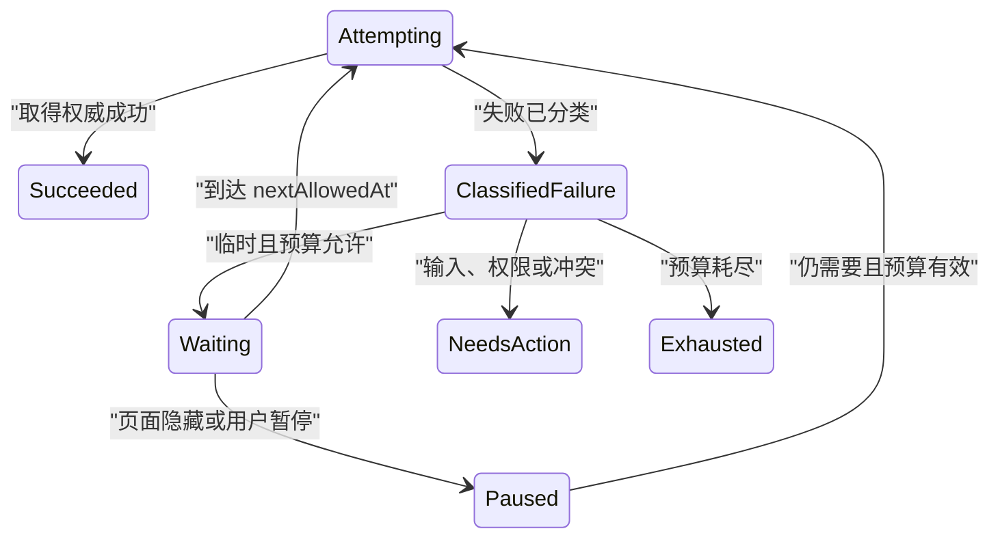

# 重试状态

重试是针对一次已分类失败，在满足安全条件后重新发起同一读取或恢复动作。它不是任何错误的默认按钮，也不是无限循环。

## 重试前的三个问题

1. 原操作是否产生副作用；
2. 原结果是确定失败还是未知；
3. 失败原因是否可能在不改输入的情况下消失。

只有答案支持时才能原样重试。

| 原因 | 原样重试 |
| --- | --- |
| DNS 或临时连接失败的 GET | 可以，受预算限制 |
| 503 且服务端允许 | 可以，遵守 Retry-After |
| 429 限流 | 等待窗口后可以 |
| 字段格式错误 | 不可以，先修正 |
| 403 | 不可以，权限改变后重新发起 |
| 版本冲突 | 不可以，先合并 |
| 支付响应丢失 | 不可以先重放，先查询支付结果 |

## 重试契约

```json
{
  "operation": "catalog.read",
  "attempt": 3,
  "maxAttempts": 5,
  "firstAttemptAt": "2026-07-18T02:20:00Z",
  "lastFailure": {
    "class": "temporary-unavailable",
    "httpStatus": 503,
    "reference": "problem-8841"
  },
  "nextAllowedAt": "2026-07-18T02:20:08Z",
  "budgetRemainingMs": 22000,
  "automatic": true
}
```

`attempt` 从一次用户意图内的网络尝试计数；`maxAttempts` 与总时间预算共同约束；`nextAllowedAt` 依据服务端建议和退避计算。

## 指数退避与抖动

无抖动的指数退避：

```text
delay = min(cap, base × 2^attempt)
```

大量客户端会在相同时间重试，形成同步峰值。全抖动可在 `[0, delay]` 随机取值。服务端返回 `Retry-After` 时，客户端应按协议和本地最大等待策略处理。

```js
function nextRetryDelay({ attempt, baseMs, capMs, retryAfterMs }) {
  const exponential = Math.min(capMs, baseMs * 2 ** attempt);
  const jittered = Math.floor(Math.random() * (exponential + 1));
  return Math.max(jittered, retryAfterMs ?? 0);
}
```

该函数只计算时间，不决定错误是否可重试。分类必须在调用前完成。

## 重试预算

同时限制：

- 最大尝试次数；
- 从首次请求开始的总时长；
- 单次请求超时；
- 用户当前任务的可等待时间；
- 服务端负载；
- 页面是否仍需要结果；
- 电量和网络成本。

五次各 30 秒的请求可能让用户等 150 秒。总预算能避免单独限制次数仍造成过长等待。

## 状态流



成功、用户取消、页面不再需要和预算耗尽都会终止自动重试。

## HTTP 分类

常见参考：

- 408：请求超时，仍需判断副作用和连接语义；
- 429：请求过多，可含 `Retry-After`；
- 502/503/504：通常可能临时，但不是无条件重试；
- 400/422：输入问题，原样重试无效；
- 401：重新认证，不使用旧凭证循环；
- 403：权限拒绝；
- 404：是否可重试由资源创建/传播语义决定；
- 409/412：需要冲突处理或更新前置条件。

状态码是输入之一。应用问题类型、方法语义和业务阶段共同决定。

## 幂等与去重

GET、HEAD 等安全方法通常容易重试。写操作需要：

- 领域定义的幂等键；
- 服务端保存首次结果；
- 相同键和相同规范化负载返回同一结果；
- 相同键不同负载被拒绝；
- 去重记录保留足够长；
- 最终结果可查询。

幂等键不能用固定用户 ID 或当前秒生成。它标识一次业务请求，例如一次订单创建，而不是跨所有操作复用。

## 未知结果先查询

支付提交后连接断开：

1. 保留订单号和支付请求键；
2. 查询订单/支付状态；
3. 若已成功，显示成功凭证；
4. 若仍处理中，继续状态查询；
5. 若明确未创建且协议允许，再提交；
6. 若无法判定，保持未知并提供人工处理。

“重试支付”按钮不能无条件复制 POST。

## 自动与手动重试

自动适合：

- 短暂读取失败；
- 用户仍停留在当前任务；
- 不需要改变输入；
- 重试不会造成额外副作用；
- 等待很短且有预算。

手动适合：

- 等待超过用户可接受时间；
- 会产生流量或费用；
- 需要重新认证；
- 用户需要检查输入；
- 服务恢复时间未知；
- 多次自动尝试已用尽。

手动按钮显示具体动作：“重新加载订单”，不是泛化“重试”。

## 页面隐藏与网络恢复

页面隐藏时可以暂停非关键自动重试，恢复后重新计算：

- 当前结果是否仍需要；
- 总预算是否过期；
- 服务端建议时间是否到达；
- 查询条件是否改变；
- 会话是否有效。

监听 `online` 只能触发一次探测，不能证明 API 已恢复。避免网络抖动触发多个并发重试循环。

## 轮询也是重试

后台任务状态轮询需要：

- 稳定 taskId；
- 不重新创建任务；
- 退避间隔；
- 推送断开时的回退；
- 页面隐藏策略；
- 终态停止；
- 最大观察时长。

轮询返回 404 时不要立即创建新任务；可能是传播延迟、权限或清理，需要依据任务协议处理。

## 熔断与负载保护

单个客户端退避仍可能让百万客户端持续攻击故障服务。调用层可以使用熔断状态：

| 状态 | 行为 |
| --- | --- |
| closed | 正常请求并统计失败 |
| open | 在冷却窗口内快速拒绝非关键请求 |
| half-open | 仅允许少量探测 |

熔断是系统保护，不应把所有 open 状态写成业务失败。界面说明服务暂时不可用，并在探测成功后恢复。关键请求是否绕过熔断由容量和安全策略决定。

客户端也需要全局重试预算：某个页面的十张卡不能各自独立尝试五次。调度器限制同域并发、单位时间重试数和后台页面流量。

## 对冲请求不是普通重试

读取尾延迟优化有时会向另一个副本发送对冲请求，并接受先完成者。这会增加负载，只适用于幂等读取和经过容量验证的场景。

对冲请求需要：

- 延迟阈值基于分位数而非任意定时；
- 两个响应版本的选择规则；
- 胜出后中止另一读取；
- 避免同时命中相同故障域；
- 计入总请求预算；
- 不用于写入。

不要把“同时发两个 POST，取先返回者”称为可靠性优化。

## Retry-After 的边界

`Retry-After` 可以是秒数或 HTTP 日期。解析日期时考虑服务器与客户端时钟差，优先使用响应 Date 估算。非法值按本地退避策略处理，不立即重试。

等待期间若用户改变查询，旧 Retry-After 不约束新资源，但服务端的账户级限流可能仍然适用。客户端需要知道限流范围是用户、令牌、资源还是整个服务，不能仅禁用当前按钮。

## 重试测试

使用虚拟时钟验证：

1. attempt 从正确值开始；
2. 指数增长不溢出；
3. cap 生效；
4. 抖动落在合法区间；
5. Retry-After 形成下界；
6. 总预算先于次数耗尽时停止；
7. 成功清理 timer；
8. AbortSignal 清理等待；
9. 页面卸载没有悬挂 Promise；
10. 多组件共享限流不会重复请求。

随机算法测试固定 seed，并额外做分布检查；只断言一次随机毫秒会产生脆弱测试。

## 界面反馈

自动重试中：

```text
订单列表暂时不可用，正在重新连接（第 2/5 次）
[立即重试] [停止自动重试]
```

等待限流：

```text
请求过于频繁，可在 10:22 后重新加载
```

预算耗尽：

```text
仍无法连接订单服务
你的筛选已保留。
[重新加载订单] [返回工作台]
```

不要显示每秒倒计时，除非时间准确且任务需要。焦点保留在原操作；状态消息按失败、开始等待、恢复成功和最终耗尽几个关键变化播报。

## 案例一：商品目录读取

### 输入

- GET `/catalog?category=tools`；
- 第一次 503，`Retry-After: 2`；
- 第二次连接失败；
- 第三次成功；
- 页面仍显示上一版目录；
- 用户未改变筛选。

### 处理

1. 保留旧目录并标记刷新失败；
2. 分类 503 为临时；
3. 等待至少 2 秒并加入抖动；
4. 第二次连接失败仍在总预算；
5. 计算下一次退避；
6. 第三次成功取得 version 42；
7. 按稳定商品 ID 更新；
8. 清除刷新错误；
9. 状态消息说明“目录已更新”。

### 输出

用户可以继续浏览旧目录，后台三次尝试受预算控制。成功后不重置筛选和滚动位置。

### 案例验收

- 首次重试不早于 Retry-After；
- 三个客户端的抖动时间不完全相同；
- 筛选改变后旧重试循环被取消；
- 第三次成功终止所有定时器；
- 页面隐藏后不会高频请求；
- 旧内容明确标注版本和更新时间；
- 读屏不逐秒朗读倒计时。

### 失败分支

组件每次渲染都启动新的 setTimeout，恢复时并发发送 12 个 GET。修正为单一重试控制器、稳定查询键和卸载清理。

## 案例二：订单创建响应丢失

### 输入

- 用户创建金额 299 CNY 的订单；
- 请求携带领域幂等键 `order-create-8841`；
- 服务端已创建 `order-731`；
- 成功响应在网络中丢失；
- 客户端显示等待超时。

### 恢复

1. 不立即重发创建；
2. 以幂等键查询创建结果；
3. 服务端返回 order-731 与 committed；
4. 页面进入成功状态；
5. 若查询仍 pending，继续有预算的状态轮询；
6. 只有服务端明确没有接受且协议允许时才重发相同键；
7. 相同键不同金额被服务端拒绝；
8. 去重记录保留超过客户端最大重试窗口。

### 输出

数据库只有一个订单，用户取得 order-731 凭证。网络尝试次数与业务订单数量分开。

### 案例验收

- 丢失响应不产生第二个订单；
- 相同键同负载返回原订单；
- 相同键不同负载明确拒绝；
- 页面刷新后仍能查询结果；
- 幂等记录过期策略覆盖最长未知窗口；
- 重新认证后再次验证订单归属；
- 分析记录尝试数，不记录完整订单内容。

### 失败分支

超时弹窗只有“再次提交”，每次点击生成新键。用户创建三个订单。修正为先查询原业务请求，并保持同一领域去重键。

## 重试控制器调试

记录：

- 操作类别和方法；
- 分类后的 failure class；
- attempt 与首次时间；
- 每次 delay 的组成；
- Retry-After；
- 总预算；
- 中止原因；
- 查询键；
- 最终成功、耗尽或取消；
- 写操作的去重结果。

测试使用可控时钟和固定随机源，避免等待真实秒数。验证并发组件只有一个控制器，路由变化后没有残留定时器。

## 观测

- 重试后恢复率；
- 平均尝试数；
- 预算耗尽；
- 429 后过早请求；
- 每个服务的重试放大倍数；
- 重复副作用；
- 用户手动与自动重试；
- 页面隐藏期间请求；
- 恢复成功但界面仍显示失败；
- 按网络、版本和地区分群。

限制全链路重试放大：浏览器、网关和下游服务若各自重试三次，最坏请求量会成倍增加。明确哪一层负责重试。

## 综合练习：可靠报告查询

实现即时查询和异步导出：

- 即时 GET 对 503、429 使用不同策略；
- 读取保留旧结果；
- 查询变化取消旧重试；
- 导出创建使用领域去重键；
- 创建响应丢失先查询任务；
- taskId 轮询有退避和终态停止；
- 页面隐藏暂停非关键请求；
- 重新认证后重新授权；
- 预算耗尽有手动恢复；
- 可控时钟测试全部延迟。

验收注入 429+Retry-After、连续 503、响应丢失、路由切换和服务恢复。最终导出任务只能创建一次。

## 来源

- [IETF — RFC 9110：Retry-After 与 HTTP 状态语义](https://www.rfc-editor.org/rfc/rfc9110.html)（访问日期：2026-07-18）
- [IETF — RFC 6585：429 Too Many Requests](https://www.rfc-editor.org/rfc/rfc6585.html)（访问日期：2026-07-18）
- [IETF — RFC 9457：可重试问题类型](https://www.rfc-editor.org/rfc/rfc9457.html)（访问日期：2026-07-18）
- [WHATWG — DOM Standard：AbortSignal](https://dom.spec.whatwg.org/)（访问日期：2026-07-18）
