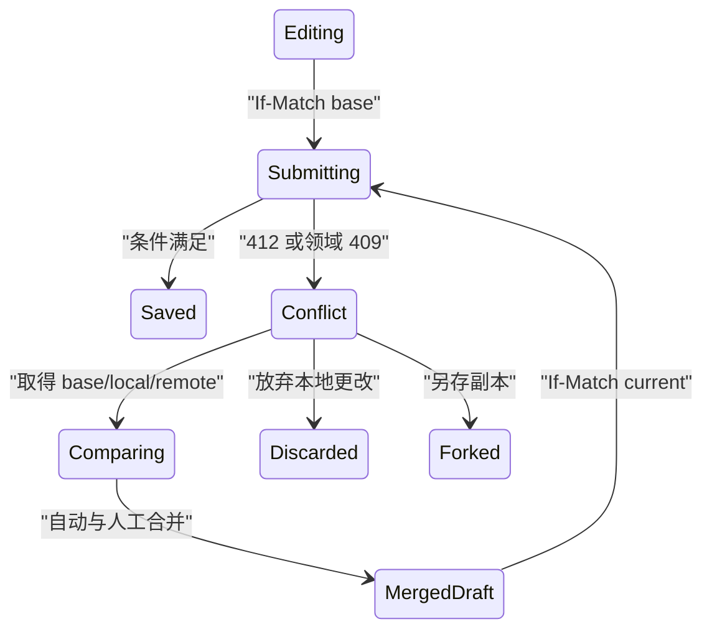

# 并发冲突状态

并发冲突表示当前写入所依据的基线已经落后，或两个合法操作无法同时满足业务不变量。系统必须阻止静默覆盖，并帮助用户比较、合并或重新执行。

## 冲突不等于同时点击

以下情况会形成冲突：

- 两个用户编辑同一字段；
- 同一用户两个标签保存不同草稿；
- 离线设备基于旧版本同步；
- 一个用户删除对象，另一个用户编辑；
- 库存只剩一件时两个订单同时预留；
- 列表排序与移动操作同时发生；
- 权限在提交前变化。

并发请求若修改互不相关且系统支持合并，不一定冲突。冲突由版本条件和业务不变量定义。

## 丢失更新

初始对象 version 18：

```json
{
  "id": "doc-42",
  "version": 18,
  "title": "支付方案",
  "owner": "李明",
  "status": "draft"
}
```

用户 A 改标题，用户 B 改 owner。若两人都 PUT 完整旧对象且最后写入获胜，B 的请求可能把 A 的标题恢复为旧值。

防护方式：

- 乐观并发控制：提交版本或 ETag 条件；
- 悲观锁：编辑前取得租约；
- 操作变换或 CRDT：为特定协作数据设计合并；
- 领域原子命令：例如 `assignOwner` 而不是覆盖完整对象；
- 数据库约束：最终保护库存、余额和唯一性。

## ETag 与 If-Match

读取：

```text
GET /documents/doc-42
ETag: "doc-18"
```

更新：

```text
PATCH /documents/doc-42
If-Match: "doc-18"
Content-Type: application/merge-patch+json

{"title":"支付方案 v2"}
```

若当前 ETag 已是 `"doc-19"`，前置条件失败，服务端不执行方法并返回 412。没有携带前置条件但服务端检测到语义冲突时，可以使用 409 并说明解决方式。

弱 ETag 不适用于需要强比较的 If-Match 语义。版本标识生成和比较必须由服务端控制。

## 冲突响应

```json
{
  "type": "https://api.example.com/problems/edit-conflict",
  "title": "文档已被其他人更新",
  "status": 412,
  "resourceId": "doc-42",
  "baseVersion": 18,
  "currentVersion": 19,
  "conflictingFields": [
    "title"
  ],
  "current": {
    "title": "支付设计方案",
    "owner": "李明"
  }
}
```

服务端只返回当前主体有权读取的字段。客户端还保留 base 与 local，构成三方比较：

| 字段 | Base | Local | Remote |
| --- | --- | --- | --- |
| title | 支付方案 | 支付方案 v2 | 支付设计方案 |
| owner | 李明 | 李明 | 李明 |

title 需要用户选择或编辑合并；owner 三者一致，无需冲突。

## 三方合并规则

对每个字段：

1. local 等于 base，remote 改变：接受 remote；
2. remote 等于 base，local 改变：保留 local；
3. local 等于 remote：接受共同值；
4. local 与 remote 都偏离 base 且不同：冲突；
5. 字段有关联不变量：即使值不同字段也可能需要整体校验。

自动合并后仍基于 currentVersion 重新提交。若期间又变为 version 20，重复比较，不能绕过条件。

## 状态流



冲突不是失败后原样重试。新的提交必须使用新的基线与用户确认后的候选。

## 字段级与结构级冲突

字段级冲突容易显示差异；结构级冲突包括：

- 节点被移动后原父路径失效；
- 列表项被删除；
- 表格列 schema 改变；
- 富文本段落重排；
- 同一附件被替换；
- 用户权限不再允许看到远端值。

结构冲突需要领域操作日志或树路径，不适合把整个 JSON 做文本 diff。

## 删除冲突

用户编辑时对象被删除：

- 若可恢复：说明删除者、时间和恢复能力；
- 若不可恢复：保留本地输入供复制或另存；
- 若存在性不可公开：使用安全中性结果；
- 不能自动重新创建同 ID；
- 关联子对象需要独立处理。

“另存为新对象”创建新 ID，并重新校验名称、权限和引用。

## 悲观锁与租约

适合无法安全合并且编辑时间有限的资源：

```json
{
  "leaseId": "lease-8841",
  "resourceId": "schedule-42",
  "holder": "user-72",
  "expiresAt": "2026-07-18T02:25:00Z",
  "renewAfter": "2026-07-18T02:23:00Z"
}
```

锁需要：

- 到期时间；
- 续租；
- 页面关闭后的释放或自然到期；
- 管理员接管；
- 网络断开处理；
- 锁内仍做最终业务校验。

永久锁会导致资源不可编辑。客户端本地“正在编辑”标记不是服务端锁。

## 领域冲突

库存和座位不能靠 UI 合并：

```text
库存 1
订单 A 预留 1
订单 B 预留 1
```

数据库条件更新或事务必须保证最多一个成功。失败订单得到 `inventory-unavailable`，而不是展示对象 JSON diff。

唯一名称冲突、额度冲突和状态转换冲突也需要领域问题类型及可执行替代。

## 实时协作

富文本实时协作可以用 CRDT 或操作变换降低冲突，但仍有边界：

- 权限变化；
- 文档删除；
- schema 升级；
- 附件引用；
- 审批状态；
- 外部发布。

算法能合并文本不代表能自动合并所有业务状态。发布动作仍基于明确版本或快照。

## 顺序与移动冲突

列表和树结构不只包含字段值，还包含相对位置。两个用户同时执行：

```text
A：把任务 X 移到 Y 前
B：把任务 Y 移到 Z 后
```

若只保存数组索引，两个操作会根据不同旧数组解释。领域命令应引用稳定节点 ID、目标锚点和观察版本。服务端应用后返回新顺序与版本；锚点已删除或移动时返回结构冲突。

可使用稠密排序键减少整体重编号，但仍需处理键耗尽、并发插入同一区间和定期重平衡。视觉拖拽结果不能作为唯一权威顺序。

## 锁与版本的组合

租约可以降低冲突频率，但不能消除：

- 锁到期后旧客户端仍尝试保存；
- 网络分区导致持有者不知道租约失效；
- 管理员强制接管；
- 数据库事务越过租约时间；
- 不同资源共享业务不变量。

因此写入同时携带 leaseId 和资源版本。服务端检查租约仍属于当前主体、未过期且版本匹配。所谓“锁图标仍显示”不是写入依据。

## 集合与唯一约束

创建新对象也会冲突。两个用户同时创建相同项目 slug：

1. 客户端预检都可能显示可用；
2. 数据库唯一约束只允许一个提交；
3. 失败方得到领域问题 `slug-already-used`；
4. 页面保留其他字段并建议新 slug；
5. 不能通过先查后写的时间窗口保证唯一。

预检改善体验，数据库约束保护不变量。唯一约束错误应映射为稳定业务问题，不能泄露内部索引名。

## 冲突解决权限

用户可能有编辑权限但无权读取远端某些字段。冲突响应不能为了合并返回完整对象。

可选策略：

- 服务端仅返回允许公开的冲突字段；
- 受限字段由服务端保留 remote；
- 用户只能放弃对受限字段的旧修改；
- 由更高权限审批者解决；
- 将本地可见更改另存为建议。

权限在合并过程中撤销时，清除已经取得但不再允许保留的 remote 数据，并阻止条件提交。

## 冲突循环

热门对象可能在每次合并后又改变。界面需要上限：

- 显示当前冲突次数；
- 缩小编辑范围；
- 提供临时协作锁或维护窗口；
- 允许导出本地草稿；
- 建议稍后重试；
- 不能在后台自动覆盖。

超过产品阈值后停止自动三方合并，要求用户重新打开最新版本或转入实时协作模式。

## 界面比较

冲突页先说明：

```text
文档在你编辑期间已更新
你的更改尚未保存。请比较标题后继续。
```

然后按字段显示：

- 你的版本；
- 当前版本；
- 上次共同版本；
- 修改者和时间（若允许公开）；
- 选择当前、选择我的或手动编辑；
- 放弃与另存为。

不能默认选择“保留我的全部”，这会重新制造覆盖。颜色之外使用标签和文本；差异区域按 DOM 顺序可用键盘操作。

## 焦点与恢复

同页保存返回冲突时，焦点移到冲突摘要或保持在保存按钮并提供到摘要的链接，策略保持一致。用户解决一个字段后转到下一个冲突字段。

冲突界面刷新后需要恢复：

- local 草稿；
- baseVersion；
- 已取得的 remoteVersion；
- 已完成的字段选择；
- 当前远端是否又变化。

敏感草稿按策略存储。重新认证后重新授权，不能因持有旧 local 值取得 remote 内容。

## 案例一：项目设置三方合并

### 输入

- base version 18：名称“支付平台”，地区“华东”，负责人李明；
- 用户 A 把名称改为“支付基础设施”；
- 用户 B 把地区改为“华北”并先保存 version 19；
- A 提交 If-Match `"project-18"`；
- 名称和地区相互独立。

### 处理

1. 服务端因 ETag 不匹配返回 412；
2. A 的客户端保留 base 与 local；
3. 取得 version 19 的 remote；
4. 名称：remote 等于 base，保留 local；
5. 地区：local 等于 base，接受 remote；
6. 负责人三者一致；
7. 合并候选为“支付基础设施、华北、李明”；
8. 用户确认后以 If-Match `"project-19"` 提交；
9. 服务端返回 version 20；
10. 表单基线更新并清空冲突状态。

### 输出

A 和 B 的非重叠更改都保留，没有最后写入覆盖。

### 案例验收

- version 18 请求没有修改 version 19；
- 三方规则逐字段可复算；
- 合并提交使用 version 19，而不是删除条件；
- 合并期间 version 20 再变化会再次返回冲突；
- 刷新页面不丢 A 的名称草稿；
- 不可见字段不会出现在冲突响应；
- 键盘能逐字段选择并提交。

### 失败分支

客户端收到 412 后只替换 ETag，再次发送 A 的完整旧对象，地区被改回华东。修正为重新读取并三方合并，不能只刷新版本号。

## 案例二：会议座位最后一个名额

### 输入

- 活动仅剩 1 个座位；
- 用户 A 与 B 同时确认；
- 两个界面都显示“剩余 1”；
- 预订涉及座位计数和预订记录；
- 不允许超卖。

### 服务端事务

```text
UPDATE events
SET available = available - 1
WHERE id = event-42 AND available >= 1;

如果受影响行数为 1：
  创建预订记录并提交
否则：
  返回 seat-unavailable
```

实际实现需要在同一事务中保持计数与预订记录一致，并处理唯一约束。

### 交互

1. A 的事务先提交，获得 booking-731；
2. B 的条件更新影响 0 行；
3. B 得到领域冲突 `seat-unavailable`；
4. 页面保留参会人输入；
5. 提供候补名单或其他场次；
6. 不提供“重试”造成请求风暴；
7. A 的成功凭证可再次查询；
8. 实时库存事件把其他页面更新为 0。

### 案例验收

- 两个并发事务仅一个成功；
- available 最终为 0，不为 -1；
- 只有一条有效预订；
- B 不取得 A 的身份信息；
- B 的表单输入可用于候补名单；
- 重放 A 的确认不会新增预订；
- 前端禁用按钮不是唯一超卖保护。

### 失败分支

两个客户端各自在本地执行 `1 - 1` 后写入 0，数据库得到两条预订。修正为服务端条件更新、事务和唯一约束。

## 冲突诊断

对编辑冲突记录：

- resourceId；
- base、local、remote 版本；
- ETag 与 If-Match；
- conflictingFields；
- 自动合并字段；
- 用户选择；
- 重新提交版本；
- 最终对象版本。

对领域冲突记录：

- 不变量；
- 事务条件；
- 影响行数；
- 唯一约束；
- 获胜与失败请求参考；
- 是否产生部分副作用。

不能只记录 HTTP 409 数量；412 前置条件失败和领域 409 的恢复路径不同。

## 观测

- 每种资源的冲突率；
- 自动合并和人工合并比例；
- 用户放弃或另存副本；
- 冲突循环次数；
- 静默覆盖缺陷；
- 锁等待与过期；
- 离线同步冲突；
- 领域不变量拒绝；
- 冲突解决耗时；
- 辅助技术完成合并的成功率。

分析记录字段类别，不记录文档正文和敏感远端值。

## 综合练习：协作配置编辑器

实现多用户编辑服务配置：

- GET 返回强 ETag；
- PATCH 使用 If-Match；
- 保存 412 返回安全当前表示；
- 客户端保存 base/local/remote；
- 非重叠字段自动合并；
- 同字段冲突人工选择；
- 对象删除可另存为；
- 权限撤销不泄露 remote；
- 页面刷新恢复本地草稿；
- 发布动作基于合并后明确版本；
- 两标签和离线设备纳入测试；
- 数据库不变量独立保护。

验收用确定顺序重放两个用户、三个字段和一次删除。最终每个字段来源、对象版本和审计事件都能解释。

## 来源

- [IETF — RFC 9110：ETag、If-Match、409 与 412](https://www.rfc-editor.org/rfc/rfc9110.html)（访问日期：2026-07-18）
- [IETF — RFC 5789：PATCH 与并发修改](https://www.rfc-editor.org/rfc/rfc5789.html)（访问日期：2026-07-18）
- [IETF — RFC 6585：428 Precondition Required](https://www.rfc-editor.org/rfc/rfc6585.html)（访问日期：2026-07-18）
- [IETF — RFC 9457：冲突问题详情](https://www.rfc-editor.org/rfc/rfc9457.html)（访问日期：2026-07-18）
