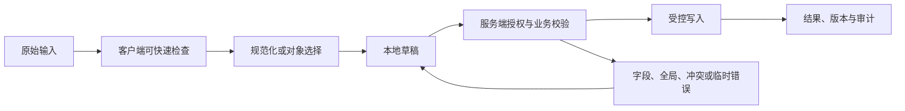

# Auto Complete 自动完成

Auto Complete 自动完成把搜索字符串、候选集合、活动候选和已选对象组合为一个输入流程。它适合候选可检索但无法一次展示的场景，不等同于浏览器自动填充或普通文本建议。

## 能力边界与前置知识

Auto Complete 自动完成负责把用户输入转换为可校验、可提交、可恢复的数据。它不能替代服务端授权、业务校验、唯一约束、恶意内容处理或并发控制。

前置知识：

- 能定义字段或文档的数据类型、必填、范围和业务不变量；
- 能区分原始输入、显示值、规范化值和稳定对象 ID；
- 了解表单标签、可访问名称、焦点顺序和状态消息；
- 能观察请求、响应、对象版本和权威写入结果。

## 组成部分

- 输入值：用户当前文本，可能尚未对应对象。
- 选择值：稳定对象 ID，与显示名称分开。
- 候选源：本地词表或远程查询，包含权限过滤。
- 弹出列表：加载、无结果、错误、活动项和选中项。
- 提交规则：允许自由文本、必须选择，或允许创建新对象。

查询文本、候选 ID、显示标签和最终选择必须分别建模。列表更新时活动候选仍按 ID 追踪，不能靠数组下标；提交时也不能把用户尚未确认的查询字符串当成已选对象。

## 输入数据生命周期



### 原始输入

输入框保存用户正在组合的查询文本，并区分 `composition`、已提交查询和已确认选择。搜索层可以生成规范化查询副本，但不能把改写结果反写输入框导致光标跳动。

### 规范化值

候选的显示标签用于阅读，稳定 ID 才是选择值；同名对象通过类型、路径或辅助信息区分。大小写折叠、拼音或别名扩展只影响检索，不改变用户最终选择的对象身份。

### 草稿

草稿分别记录查询文本和已选 ID。恢复时重新读取所选对象的当前标签与权限；若对象已删除或不可见，显示失效引用并要求重新选择，不能用缓存标签继续提交。

### 权威结果

远程搜索响应带查询序号或取消信号，只有最新查询可更新列表；选中后服务端仍要验证对象存在、可见且适用于当前字段。验证失败时保留查询并重新打开候选列表。

## 专属行为

- combobox 保持 DOM 焦点，aria-activedescendant 指向活动选项。
- aria-expanded、aria-controls 和 aria-autocomplete 与真实行为一致。
- 输入变更后清除不再匹配的旧选择 ID。
- 中文等输入法 compositionend 前不提交候选。
- 远程查询设置最小输入、去抖、取消和乱序响应保护。

## 设计决策

1. 自由文本与受控对象的业务差异。
2. 同名候选需要哪些二级信息才能区分。
3. 查询延迟和结果规模是否需要分页或分组。
4. 无结果时允许创建、换词还是联系管理员。
5. 缓存是否包含角色、租户、语言和数据版本。

验收需要明确自由文本是否允许、何时发起查询、空结果怎样返回、活动候选怎样随键盘移动，以及乱序响应和对象失效时怎样恢复。

## 状态模型

| 状态 | 进入条件 | 界面责任 | 退出条件 |
| --- | --- | --- | --- |
| Auto Complete 自动完成未触碰 | 还没有本次交互 | 显示标签、规则和合理默认值 | 用户输入或选择 |
| 编辑中 | 原始值正在变化 | 保持焦点和输入法行为 | 完成输入、取消或提交 |
| 本地无效 | 可确定格式或范围错误 | 就近说明修正方式 | 输入变为有效 |
| 可提交 | 本地条件满足 | 主操作可用，不承诺业务成功 | 提交、继续编辑 |
| 提交中 | 请求或上传进行 | 防重复意图，保留输入 | 成功、失败、超时、取消 |
| 选择被拒绝 | 所选对象已删除、无权限或不再适用 | 保留查询文字，清除无效 ID 并解释原因 | 重新搜索或取消 |
| 冲突 | 基础对象版本变化 | 比较、刷新或合并 | 新版本确认 |
| 搜索状态未知 | 最新查询超时或连接中断 | 保留旧列表但标记已过期，不允许误认为完整结果 | 重试当前查询或输入新词 |
| 成功 | 权威结果完成 | 显示结果和下一步 | 后续操作 |

状态不能只存在于颜色。错误、等待、选中、进度和保存结果应有程序化表达。

## 工程状态示例

```json
{
  "query": "shang",
  "displayValue": "上海市",
  "selectedId": "region-310000",
  "activeOptionId": "region-310000"
}
```

示例字段不是通用接口标准。项目应按Auto Complete 自动完成的真实值类型定义 schema，并明确缺失值、无效值、服务端错误、版本和恢复语义。

## 校验顺序

1. Auto Complete 自动完成输入前说明格式、单位、范围和不可接受内容。
2. 输入期间只做不会打断输入法的安全检查。
3. 完成输入或离开字段后给出可修正反馈。
4. 提交时客户端汇总当前已知错误。
5. 服务端重新执行格式、授权、业务和并发校验。
6. 返回字段错误与全局错误的稳定代码和安全文案。
7. 界面保留合法输入，把焦点移到合理错误入口。
8. 修正后只清除已经解决的错误。
9. 成功后从权威响应更新对象和版本。

客户端限制可以减少错误，不能防止直接请求、旧客户端或恶意输入。

## 案例一：地址输入关联标准行政区 ID

### 固定输入

- 使用合成账户与合成业务数据；
- 正常网络 80 ms，另注入 2 秒延迟和一次 503；
- 打开时对象版本为 17，提交前另一个会话更新为 18；
- 覆盖空值、无效值、长值、重复值和权限撤销；
- 记录可见结果、焦点、请求、响应和权威对象。

### 设计与实现

1. combobox 保持 DOM 焦点，aria-activedescendant 指向活动选项。
2. aria-expanded、aria-controls 和 aria-autocomplete 与真实行为一致。
3. 输入变更后清除不再匹配的旧选择 ID。
4. 中文等输入法 compositionend 前不提交候选。
5. 远程查询设置最小输入、去抖、取消和乱序响应保护。

负责人选择成功后保存成员 ID，并用服务端返回的当前显示名和头像刷新输入；查询字符串不进入业务对象，旧缓存中的同名成员也不会替代已确认 ID。

### 验证

- 鼠标、键盘、触屏和屏幕阅读器都能完成；
- 输入法组合期间不误提交；
- 本地错误与服务端错误均能修正；
- 请求失败和冲突不清空合法工作；
- 重复触发只产生一个逻辑副作用；
- 最终显示与权威数据对账一致。

### 失败分支

乱序响应覆盖新查询并提交过期 ID

修复后重复相同输入和时序，确认界面状态、服务端副作用和审计记录同时正确。

## 案例二：工单选择数万名成员中的处理人

### 固定输入

- 360 CSS px 视口与 200% 文本缩放；
- 系统大字体、中文输入法和仅键盘操作；
- 网络先离线，恢复后响应超时；
- 会话在未提交工作存在时到期；
- 数据包含同名对象、过期引用和被删除目标。

### 设计过程

1. 查询框允许自由输入，但提交必须选择成员稳定 ID。
2. 同名候选显示团队和邮箱域名等允许公开的区分信息。
3. 输入法组合结束后去抖查询，取消旧请求并丢弃乱序响应。
4. 输入文字变化后清除不再匹配的旧 selectedId。
5. 方向键移动活动候选，Enter 选择，Escape 关闭。
6. 提交前服务端重新检查成员仍可分配且当前用户有权限。

窄屏候选列表与输入框保持视觉相邻，候选主标签、辅助身份和选中状态逐项排列；网络断开后关闭远程建议并保留查询，不把缓存候选标成当前完整结果。

### 验证

- 关闭和恢复网络后不重复写入；
- 刷新后按声明的草稿策略恢复；
- 会话到期不把敏感值写入不安全存储；
- 失效引用有替换、清除或返回路径；
- 读屏能获知结果而无需焦点被强制移动；
- 长文本不会遮挡唯一保存或取消动作。

### 失败分支

会话在Auto Complete 自动完成进行中到期。界面必须暂停后续写入，保留允许保留的非敏感工作，重新认证后再次校验权限与版本；不能直接重放旧请求。

会话恢复时重新验证已选成员 ID：可见对象刷新标签，不可见对象显示“选择已失效”；未确认查询只作为本地文本恢复，不自动选择最接近的候选。

## 无障碍实现

### 名称与说明

- Auto Complete 自动完成的可见标签进入可访问名称。
- 帮助文本与错误通过程序化关系关联。
- placeholder 不替代持久可见标签。
- 必填、单位、格式和限制不只靠颜色或图标。
- 复合输入使用与真实行为匹配的 APG 模式。

### 键盘与输入法

- Auto Complete 自动完成的 Tab 顺序跟随 DOM 与视觉阅读顺序。
- Enter、Space、方向键和 Escape 只按控件语义接管。
- 输入法 composition 期间不把中间文本当成完成值。
- 粘贴、语音输入和浏览器自动填充不被无理由阻止。
- 临时弹层关闭后焦点回到触发点或下一逻辑位置。
- 错误修正后焦点不被异步结果抢走。

### 重排

在 320 CSS px 等效宽度和 200% 缩放下，弹出列表宽度不小于输入框，候选辅助文本可换行；活动候选始终滚入列表视口，但页面焦点仍留在 combobox 输入框。

## 安全、性能与一致性

### 安全

- 所有输入均视为不可信；
- 服务端重新授权和校验；
- 富文本与文件按输出上下文净化或隔离；
- 错误不泄露内部异常、受限对象或敏感路径；
- 日志不默认记录正文、文件内容、密码或令牌。

### 性能

- 取消失效查询并丢弃乱序响应；
- 长列表、长文档和大文件使用适合的分页、分片或后台任务；
- 加载优化不改变可访问树的完整语义；
- 缓存键包含租户、角色、语言和会改变结果的筛选条件；
- 性能预算覆盖输入响应、候选出现、提交和恢复。

### 一致性

- 写请求带幂等或逻辑意图标识；
- 对现有对象修改带期望版本；
- 超时先查询结果而不是盲目重试；
- 部分成功返回逐项稳定 ID 与结果；
- 草稿与正式提交使用不同状态和权限；
- 客户端缓存不能静默覆盖服务端新版本。

## 调试与观测

1. 固定Auto Complete 自动完成的输入、角色、对象版本、网络、语言和视口。
2. 检查原始值、显示值、选择 ID、错误和焦点。
3. 检查请求参数、取消、响应顺序和业务错误码。
4. 检查服务端授权、规范化、版本和权威写入。
5. 注入超时、权限撤销、并发和页面刷新。
6. 用键盘、读屏、输入法和窄屏重复。

观测指标：

- 有效开始、提交、成功、失败、取消和恢复；
- 首次错误类型与最终修正率；
- 输入丢失和重复副作用；
- 候选或校验响应延迟；
- 键盘阻断、焦点丢失和错误未关联；
- 按平台、语言、角色和数据量分群的完成时间。

## 综合练习

为Auto Complete 自动完成完成可运行原型和服务端模拟。覆盖正常、无效、等待、失败、权限、过期、冲突、取消和未知结果。

验收：

- Auto Complete 自动完成的数据类型、显示值、提交值和稳定 ID 边界明确；
- 两个案例有固定输入、处理、结果、验证和失败；
- 客户端与服务端校验责任分开；
- 失败后保留允许保留的工作；
- 键盘、屏幕阅读器和输入法完成任务；
- 弱网、窄屏和长文本不隐藏恢复；
- 日志与分析不收集不必要敏感内容；
- 权威数据与界面结果可以对账。

## 来源

- [W3C WAI — Combobox Pattern](https://www.w3.org/WAI/ARIA/apg/patterns/combobox/)（访问日期：2026-07-18）
- [WHATWG — Forms](https://html.spec.whatwg.org/multipage/forms.html)（访问日期：2026-07-18）
- [W3C — Web Content Accessibility Guidelines (WCAG) 2.2](https://www.w3.org/TR/WCAG22/)（访问日期：2026-07-18）
