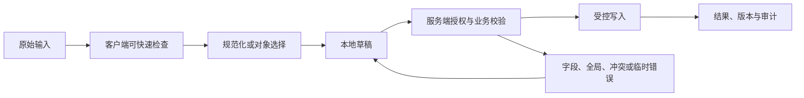

# Date Picker 日期选择

Date Picker 日期选择协调日期文本、日历网格、允许范围和日期语义。只有任务需要浏览相邻日期或选择范围时才需要弹出日历；已知日期的快速录入仍应保留可编辑文本路径。

## 能力边界与前置知识

Date Picker 日期选择负责把用户输入转换为可校验、可提交、可恢复的数据。它不能替代服务端授权、业务校验、唯一约束、恶意内容处理或并发控制。

前置知识：

- 能定义字段或文档的数据类型、必填、范围和业务不变量；
- 能区分原始输入、显示值、规范化值和稳定对象 ID；
- 了解表单标签、可访问名称、焦点顺序和状态消息；
- 能观察请求、响应、对象版本和权威写入结果。

## 组成部分

- 逻辑日期：不含时区的日历日。
- 时间点：需要时区或偏移才能唯一定位。
- 文本输入：允许直接键入和纠错。
- 日历网格：浏览临近日期与范围。
- 可用规则：最早、最晚、禁用日和服务端实时库存。

输入文本、日历焦点、已选日期和业务时区是四个独立状态。合同必须说明值表示自然日、当地日期时间还是绝对时间点，否则日历看似选中同一天，跨时区保存后仍可能改变。

## 输入数据生命周期



### 原始输入

文本输入保留用户键入的日期字符串，解析结果单独存放。`03/04/2026` 在不同地区含义不同，无法按当前 locale 确定时应要求澄清，而不是静默交换月日。

### 规范化值

自然日保存为日历日期；预约时间保存当地日期时间、IANA 时区和必要的偏移确认；绝对事件保存时间点。格式化只负责显示，不能把格式化字符串当权威值。

### 草稿

范围选择草稿记录起点、候选终点和当前日历月份，尚未完成的范围不能提交。恢复预约草稿时重新取得可预约区间，因为节假日、容量和时区规则可能已经变化。

### 权威结果

服务端用当前时区规则和可用性再次验证日期范围，成功后返回规范日期、时区和预约版本。名额被占用时保留用户选择并显示新的可选日期，不能只清空控件。

## 专属行为

- 原生 date 输入的提交值是 yyyy-mm-dd，显示由浏览器 locale 决定。
- 出生日期等远距离日期通常直接分字段或文本输入更高效。
- 自定义日历遵循 dialog/grid 键盘行为并提供月份导航。
- 日期范围明确包含端点、最大跨度和跨月规则。
- 客户端禁用日期仍需服务端重新验证可用性。

## 设计决策

1. 业务需要日期、当地时间还是绝对时间点。
2. 时区取用户、对象地点还是组织设置。
3. 日历是否真的优于已知日期输入。
4. DST 缺失或重复本地时间怎样处理。
5. 格式解析是否拒绝歧义输入并保留原值。

验收必须覆盖 locale、时区、夏令时缺失或重复时刻、键盘日历浏览、禁用日期和跨月范围，明确哪一种日期语义被保存。

## 状态模型

| 状态 | 进入条件 | 界面责任 | 退出条件 |
| --- | --- | --- | --- |
| Date Picker 日期选择未触碰 | 还没有本次交互 | 显示标签、规则和合理默认值 | 用户输入或选择 |
| 编辑中 | 原始值正在变化 | 保持焦点和输入法行为 | 完成输入、取消或提交 |
| 本地无效 | 可确定格式或范围错误 | 就近说明修正方式 | 输入变为有效 |
| 可提交 | 本地条件满足 | 主操作可用，不承诺业务成功 | 提交、继续编辑 |
| 提交中 | 请求或上传进行 | 防重复意图，保留输入 | 成功、失败、超时、取消 |
| 日期被拒绝 | 名额、截止时间或允许范围已变化 | 保留输入，更新禁用日期并解释失效原因 | 选择新日期或取消 |
| 冲突 | 基础对象版本变化 | 比较、刷新或合并 | 新版本确认 |
| 预约结果未知 | 创建预约时请求超时 | 按预约意图 ID 查询，不重复占用同一时段 | 找到预约或恢复候选范围 |
| 成功 | 权威结果完成 | 显示结果和下一步 | 后续操作 |

状态不能只存在于颜色。错误、等待、选中、进度和保存结果应有程序化表达。

## 工程状态示例

```json
{
  "kind": "date-range",
  "startDate": "2026-07-18",
  "endDate": "2026-07-25",
  "timeZone": "Asia/Shanghai"
}
```

示例字段不是通用接口标准。项目应按Date Picker 日期选择的真实值类型定义 schema，并明确缺失值、无效值、服务端错误、版本和恢复语义。

## 校验顺序

1. Date Picker 日期选择输入前说明格式、单位、范围和不可接受内容。
2. 输入期间只做不会打断输入法的安全检查。
3. 完成输入或离开字段后给出可修正反馈。
4. 提交时客户端汇总当前已知错误。
5. 服务端重新执行格式、授权、业务和并发校验。
6. 返回字段错误与全局错误的稳定代码和安全文案。
7. 界面保留合法输入，把焦点移到合理错误入口。
8. 修正后只清除已经解决的错误。
9. 成功后从权威响应更新对象和版本。

客户端限制可以减少错误，不能防止直接请求、旧客户端或恶意输入。

## 案例一：预约系统选择未来可用日期

### 固定输入

- 使用合成账户与合成业务数据；
- 正常网络 80 ms，另注入 2 秒延迟和一次 503；
- 打开时对象版本为 17，提交前另一个会话更新为 18；
- 覆盖空值、无效值、长值、重复值和权限撤销；
- 记录可见结果、焦点、请求、响应和权威对象。

### 设计与实现

1. 原生 date 输入的提交值是 yyyy-mm-dd，显示由浏览器 locale 决定。
2. 出生日期等远距离日期通常直接分字段或文本输入更高效。
3. 自定义日历遵循 dialog/grid 键盘行为并提供月份导航。
4. 日期范围明确包含端点、最大跨度和跨月规则。
5. 客户端禁用日期仍需服务端重新验证可用性。

预约成功后使用服务端返回的预约 ID、当地日期时间、IANA 时区和显示偏移更新摘要；客户端解析出的暂定时间不能冒充最终预约。

### 验证

- 鼠标、键盘、触屏和屏幕阅读器都能完成；
- 输入法组合期间不误提交；
- 本地错误与服务端错误均能修正；
- 请求失败和冲突不清空合法工作；
- 重复触发只产生一个逻辑副作用；
- 最终显示与权威数据对账一致。

### 失败分支

本地午夜换算成 UTC 后落到前一天

修复后重复相同输入和时序，确认界面状态、服务端副作用和审计记录同时正确。

## 案例二：报表选择跨月统计范围

### 固定输入

- 360 CSS px 视口与 200% 文本缩放；
- 系统大字体、中文输入法和仅键盘操作；
- 网络先离线，恢复后响应超时；
- 会话在未提交工作存在时到期；
- 数据包含同名对象、过期引用和被删除目标。

### 设计过程

1. 报表输入的是逻辑日期范围，不在客户端转换为 UTC 时间点。
2. 文本框允许直接输入 yyyy-mm-dd，日历用于浏览临近日期。
3. 范围包含起止日，最大 90 天，结束不得早于开始。
4. 自定义日历使用 dialog 与 grid 键盘模型。
5. 提交时服务端按报表时区生成精确时间边界。
6. DST 边界用该时区规则计算，不按固定 24 小时相乘。

窄屏日历一次显示完整周列并保证日期按钮可读，月份切换、文本输入和错误不脱离控件。离线时允许保留候选日期，但所有可用性状态标为待刷新。

### 验证

- 关闭和恢复网络后不重复写入；
- 刷新后按声明的草稿策略恢复；
- 会话到期不把敏感值写入不安全存储；
- 失效引用有替换、清除或返回路径；
- 读屏能获知结果而无需焦点被强制移动；
- 长文本不会遮挡唯一保存或取消动作。

### 失败分支

会话在Date Picker 日期选择进行中到期。界面必须暂停后续写入，保留允许保留的非敏感工作，重新认证后再次校验权限与版本；不能直接重放旧请求。

会话恢复后保留用户输入的日期范围，重新加载时区规则和可预约区间；已失效日期在原位置标错，并提供最近合法日期，不能自动替换用户选择。

## 无障碍实现

### 名称与说明

- Date Picker 日期选择的可见标签进入可访问名称。
- 帮助文本与错误通过程序化关系关联。
- placeholder 不替代持久可见标签。
- 必填、单位、格式和限制不只靠颜色或图标。
- 复合输入使用与真实行为匹配的 APG 模式。

### 键盘与输入法

- Date Picker 日期选择的 Tab 顺序跟随 DOM 与视觉阅读顺序。
- Enter、Space、方向键和 Escape 只按控件语义接管。
- 输入法 composition 期间不把中间文本当成完成值。
- 粘贴、语音输入和浏览器自动填充不被无理由阻止。
- 临时弹层关闭后焦点回到触发点或下一逻辑位置。
- 错误修正后焦点不被异步结果抢走。

### 重排

在 320 CSS px 等效宽度和 200% 缩放下，七列日历仍显示完整日期名称，必要时使用更短但无歧义的星期标签；范围摘要和错误放在网格之外，避免覆盖日期按钮。

## 安全、性能与一致性

### 安全

- 所有输入均视为不可信；
- 服务端重新授权和校验；
- 富文本与文件按输出上下文净化或隔离；
- 错误不泄露内部异常、受限对象或敏感路径；
- 日志不默认记录正文、文件内容、密码或令牌。

### 性能

- 取消失效查询并丢弃乱序响应；
- 长列表、长文档和大文件使用适合的分页、分片或后台任务；
- 加载优化不改变可访问树的完整语义；
- 缓存键包含租户、角色、语言和会改变结果的筛选条件；
- 性能预算覆盖输入响应、候选出现、提交和恢复。

### 一致性

- 写请求带幂等或逻辑意图标识；
- 对现有对象修改带期望版本；
- 超时先查询结果而不是盲目重试；
- 部分成功返回逐项稳定 ID 与结果；
- 草稿与正式提交使用不同状态和权限；
- 客户端缓存不能静默覆盖服务端新版本。

## 调试与观测

1. 固定Date Picker 日期选择的输入、角色、对象版本、网络、语言和视口。
2. 检查原始值、显示值、选择 ID、错误和焦点。
3. 检查请求参数、取消、响应顺序和业务错误码。
4. 检查服务端授权、规范化、版本和权威写入。
5. 注入超时、权限撤销、并发和页面刷新。
6. 用键盘、读屏、输入法和窄屏重复。

观测指标：

- 有效开始、提交、成功、失败、取消和恢复；
- 首次错误类型与最终修正率；
- 输入丢失和重复副作用；
- 候选或校验响应延迟；
- 键盘阻断、焦点丢失和错误未关联；
- 按平台、语言、角色和数据量分群的完成时间。

## 综合练习

为Date Picker 日期选择完成可运行原型和服务端模拟。覆盖正常、无效、等待、失败、权限、过期、冲突、取消和未知结果。

验收：

- Date Picker 日期选择的数据类型、显示值、提交值和稳定 ID 边界明确；
- 两个案例有固定输入、处理、结果、验证和失败；
- 客户端与服务端校验责任分开；
- 失败后保留允许保留的工作；
- 键盘、屏幕阅读器和输入法完成任务；
- 弱网、窄屏和长文本不隐藏恢复；
- 日志与分析不收集不必要敏感内容；
- 权威数据与界面结果可以对账。

## 来源

- [W3C WAI — Dialog Date Picker Example](https://www.w3.org/WAI/ARIA/apg/patterns/dialog-modal/examples/datepicker-dialog/)（访问日期：2026-07-18）
- [WHATWG — Date state](https://html.spec.whatwg.org/multipage/input.html#date-state-(type=date))（访问日期：2026-07-18）
- [W3C — Web Content Accessibility Guidelines (WCAG) 2.2](https://www.w3.org/TR/WCAG22/)（访问日期：2026-07-18）
