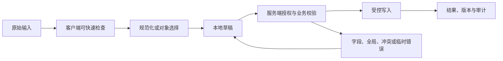

# Inline Edit 行内编辑

Inline Edit 行内编辑在内容原位置完成单字段修改，核心是查看态、编辑态和保存态之间不丢失上下文。它只适合边界清楚、低风险且无需大量关联信息的字段。

## 能力边界与前置知识

Inline Edit 行内编辑负责把用户输入转换为可校验、可提交、可恢复的数据。它不能替代服务端授权、业务校验、唯一约束、恶意内容处理或并发控制。

前置知识：

- 能定义字段或文档的数据类型、必填、范围和业务不变量；
- 能区分原始输入、显示值、规范化值和稳定对象 ID；
- 了解表单标签、可访问名称、焦点顺序和状态消息；
- 能观察请求、响应、对象版本和权威写入结果。

## 组成部分

- 查看态：内容与编辑入口都可键盘到达。
- 编辑态：真实输入控件、标签和保存/取消动作。
- 脏值：区分原值、本地修改和服务端版本。
- 保存态：阻止重复意图但不锁死取消与阅读。
- 冲突态：展示当前版本、用户输入和合并选择。

查看态和编辑态必须共享字段 ID、对象 ID 与基础版本；脏值同时记录原值和本地值。否则失焦、虚拟列表回收或并发更新后，界面无法判断应该取消、重试还是进入冲突比较。

## 输入数据生命周期



### 原始输入

进入编辑时冻结该字段的显示值、原始值和对象版本。用户输入保持原样，Escape 才恢复冻结值；渲染层不能在每次输入时把服务端格式化文本写回控件并移动光标。

### 规范化值

单字段规范化必须与完整编辑页使用同一规则，例如标题长度、空白策略和唯一性。实体字段不能把显示名当提交值，行内选择后仍要保存稳定对象 ID。

### 草稿

短字段通常只保留当前编辑会话草稿；若列表虚拟化或路由切换会卸载编辑行，应把 `objectId + fieldId + baseVersion + rawValue` 放入受控编辑状态。高敏感字段不提供行内持久草稿。

### 权威结果

保存成功必须返回该字段的权威显示值和新对象版本，随后才退出编辑态。若后端只接受异步变更申请，查看态应显示“待审核”，不能立即显示为最终值。

## 专属行为

- Enter 是否保存取决于单行/多行；多行编辑器不能抢占换行。
- Escape 取消只丢弃本地未提交更改，并提前说明。
- 失焦自动保存容易产生意外写入，只有低风险且可恢复时考虑。
- 保存失败保持输入与焦点，错误就近关联。
- 进入编辑不能只依赖 hover；触屏与键盘有显式入口。

## 设计决策

1. 字段是否低风险、短且能在原位置完整编辑。
2. 编辑是否需要其他字段上下文或复杂校验。
3. 保存触发是显式按钮、Enter 还是安全自动保存。
4. 并发冲突可自动合并还是必须人工选择。
5. 列表虚拟化时编辑行是否会被回收。

验收必须覆盖 Enter、Escape、显式保存、失焦、列表行回收和版本冲突，证明每种离开编辑态的路径都不会产生未声明写入。

## 状态模型

| 状态 | 进入条件 | 界面责任 | 退出条件 |
| --- | --- | --- | --- |
| Inline Edit 行内编辑未触碰 | 还没有本次交互 | 显示标签、规则和合理默认值 | 用户输入或选择 |
| 编辑中 | 原始值正在变化 | 保持焦点和输入法行为 | 完成输入、取消或提交 |
| 本地无效 | 可确定格式或范围错误 | 就近说明修正方式 | 输入变为有效 |
| 可提交 | 本地条件满足 | 主操作可用，不承诺业务成功 | 提交、继续编辑 |
| 提交中 | 请求或上传进行 | 防重复意图，保留输入 | 成功、失败、超时、取消 |
| 保存被拒绝 | 字段规则、权限或对象状态已变化 | 保持编辑控件、原值和本地值，错误关联当前字段 | 修正、取消或打开完整编辑页 |
| 冲突 | 基础对象版本变化 | 比较、刷新或合并 | 新版本确认 |
| 保存结果未知 | 请求超时且服务端可能已写入 | 暂停再次保存，按对象 ID 读取当前字段与版本 | 对账后回查看态或继续编辑 |
| 成功 | 权威结果完成 | 显示结果和下一步 | 后续操作 |

状态不能只存在于颜色。错误、等待、选中、进度和保存结果应有程序化表达。

## 工程状态示例

```json
{
  "objectId": "task-42",
  "field": "title",
  "baseVersion": 17,
  "draft": "修正后的标题",
  "status": "editing"
}
```

示例字段不是通用接口标准。项目应按Inline Edit 行内编辑的真实值类型定义 schema，并明确缺失值、无效值、服务端错误、版本和恢复语义。

## 校验顺序

1. Inline Edit 行内编辑输入前说明格式、单位、范围和不可接受内容。
2. 输入期间只做不会打断输入法的安全检查。
3. 完成输入或离开字段后给出可修正反馈。
4. 提交时客户端汇总当前已知错误。
5. 服务端重新执行格式、授权、业务和并发校验。
6. 返回字段错误与全局错误的稳定代码和安全文案。
7. 界面保留合法输入，把焦点移到合理错误入口。
8. 修正后只清除已经解决的错误。
9. 成功后从权威响应更新对象和版本。

客户端限制可以减少错误，不能防止直接请求、旧客户端或恶意输入。

## 案例一：任务列表直接修改标题和负责人

### 固定输入

- 使用合成账户与合成业务数据；
- 正常网络 80 ms，另注入 2 秒延迟和一次 503；
- 打开时对象版本为 17，提交前另一个会话更新为 18；
- 覆盖空值、无效值、长值、重复值和权限撤销；
- 记录可见结果、焦点、请求、响应和权威对象。

### 设计与实现

1. Enter 是否保存取决于单行/多行；多行编辑器不能抢占换行。
2. Escape 取消只丢弃本地未提交更改，并提前说明。
3. 失焦自动保存容易产生意外写入，只有低风险且可恢复时考虑。
4. 保存失败保持输入与焦点，错误就近关联。
5. 进入编辑不能只依赖 hover；触屏与键盘有显式入口。

资产标题保存响应返回 `task-42` 的规范化标题与版本 18；行内控件用响应值回到查看态，并把焦点放回“编辑标题”按钮，而不是用本地字符串假定保存成功。

### 验证

- 鼠标、键盘、触屏和屏幕阅读器都能完成；
- 输入法组合期间不误提交；
- 本地错误与服务端错误均能修正；
- 请求失败和冲突不清空合法工作；
- 重复触发只产生一个逻辑副作用；
- 最终显示与权威数据对账一致。

### 失败分支

失焦自动保存覆盖了他人的新版本

修复后重复相同输入和时序，确认界面状态、服务端副作用和审计记录同时正确。

## 案例二：资产详情修改单个可授权字段

### 固定输入

- 360 CSS px 视口与 200% 文本缩放；
- 系统大字体、中文输入法和仅键盘操作；
- 网络先离线，恢复后响应超时；
- 会话在未提交工作存在时到期；
- 数据包含同名对象、过期引用和被删除目标。

### 设计过程

1. 在查看态提供显式“编辑标题”按钮，不能只依赖 hover。
2. 进入编辑后把焦点放入预填原值的单行输入。
3. Enter 保存、Escape 取消；失焦只保持编辑，不自动写入。
4. 提交带 task ID 与 expectedVersion。
5. 冲突时并排显示用户草稿和远端标题。
6. 保存成功后返回查看态并播报结果。

窄屏中编辑控件、错误、保存和取消紧跟被编辑内容，不把按钮挤到表格不可见区域。断线时该行保持编辑态并标记未提交，恢复后先比较 `expectedVersion`。

### 验证

- 关闭和恢复网络后不重复写入；
- 刷新后按声明的草稿策略恢复；
- 会话到期不把敏感值写入不安全存储；
- 失效引用有替换、清除或返回路径；
- 读屏能获知结果而无需焦点被强制移动；
- 长文本不会遮挡唯一保存或取消动作。

### 失败分支

会话在Inline Edit 行内编辑进行中到期。界面必须暂停后续写入，保留允许保留的非敏感工作，重新认证后再次校验权限与版本；不能直接重放旧请求。

会话恢复后先读取资产标题与版本：若远端未变，可继续提交本地标题；若远端已变，展示两值选择；若写权限撤销，只允许复制草稿或取消。

## 无障碍实现

### 名称与说明

- Inline Edit 行内编辑的可见标签进入可访问名称。
- 帮助文本与错误通过程序化关系关联。
- placeholder 不替代持久可见标签。
- 必填、单位、格式和限制不只靠颜色或图标。
- 复合输入使用与真实行为匹配的 APG 模式。

### 键盘与输入法

- Inline Edit 行内编辑的 Tab 顺序跟随 DOM 与视觉阅读顺序。
- Enter、Space、方向键和 Escape 只按控件语义接管。
- 输入法 composition 期间不把中间文本当成完成值。
- 粘贴、语音输入和浏览器自动填充不被无理由阻止。
- 临时弹层关闭后焦点回到触发点或下一逻辑位置。
- 错误修正后焦点不被异步结果抢走。

### 重排

在 320 CSS px 等效宽度和 200% 缩放下，查看值切换为纵向编辑区，保存与取消保持同组且均可见；表格本身可滚动，但当前编辑控件和字段错误不能被裁剪。

## 安全、性能与一致性

### 安全

- 所有输入均视为不可信；
- 服务端重新授权和校验；
- 富文本与文件按输出上下文净化或隔离；
- 错误不泄露内部异常、受限对象或敏感路径；
- 日志不默认记录正文、文件内容、密码或令牌。

### 性能

- 取消失效查询并丢弃乱序响应；
- 长列表、长文档和大文件使用适合的分页、分片或后台任务；
- 加载优化不改变可访问树的完整语义；
- 缓存键包含租户、角色、语言和会改变结果的筛选条件；
- 性能预算覆盖输入响应、候选出现、提交和恢复。

### 一致性

- 写请求带幂等或逻辑意图标识；
- 对现有对象修改带期望版本；
- 超时先查询结果而不是盲目重试；
- 部分成功返回逐项稳定 ID 与结果；
- 草稿与正式提交使用不同状态和权限；
- 客户端缓存不能静默覆盖服务端新版本。

## 调试与观测

1. 固定Inline Edit 行内编辑的输入、角色、对象版本、网络、语言和视口。
2. 检查原始值、显示值、选择 ID、错误和焦点。
3. 检查请求参数、取消、响应顺序和业务错误码。
4. 检查服务端授权、规范化、版本和权威写入。
5. 注入超时、权限撤销、并发和页面刷新。
6. 用键盘、读屏、输入法和窄屏重复。

观测指标：

- 有效开始、提交、成功、失败、取消和恢复；
- 首次错误类型与最终修正率；
- 输入丢失和重复副作用；
- 候选或校验响应延迟；
- 键盘阻断、焦点丢失和错误未关联；
- 按平台、语言、角色和数据量分群的完成时间。

## 综合练习

为Inline Edit 行内编辑完成可运行原型和服务端模拟。覆盖正常、无效、等待、失败、权限、过期、冲突、取消和未知结果。

验收：

- Inline Edit 行内编辑的数据类型、显示值、提交值和稳定 ID 边界明确；
- 两个案例有固定输入、处理、结果、验证和失败；
- 客户端与服务端校验责任分开；
- 失败后保留允许保留的工作；
- 键盘、屏幕阅读器和输入法完成任务；
- 弱网、窄屏和长文本不隐藏恢复；
- 日志与分析不收集不必要敏感内容；
- 权威数据与界面结果可以对账。

## 来源

- [W3C WAI — Button Pattern](https://www.w3.org/WAI/ARIA/apg/patterns/button/)（访问日期：2026-07-18）
- [WHATWG — Forms](https://html.spec.whatwg.org/multipage/forms.html)（访问日期：2026-07-18）
- [W3C — Web Content Accessibility Guidelines (WCAG) 2.2](https://www.w3.org/TR/WCAG22/)（访问日期：2026-07-18）
