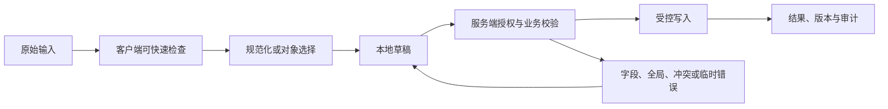

# Rich Text Editor 富文本编辑器

Rich Text Editor 富文本编辑器维护结构化文档、选择、编辑命令和撤销历史。它不是给 `contenteditable` 加一排格式按钮；数据模型、粘贴净化、序列化往返和协作策略共同决定内容能否长期维护。

## 能力边界与前置知识

Rich Text Editor 富文本编辑器负责把用户输入转换为可校验、可提交、可恢复的数据。它不能替代服务端授权、业务校验、唯一约束、恶意内容处理或并发控制。

前置知识：

- 能定义字段或文档的数据类型、必填、范围和业务不变量；
- 能区分原始输入、显示值、规范化值和稳定对象 ID；
- 了解表单标签、可访问名称、焦点顺序和状态消息；
- 能观察请求、响应、对象版本和权威写入结果。

## 组成部分

- 文档模型：块、内联标记、属性和稳定节点 ID。
- 编辑表面：选择、光标、输入法和浏览器编辑事件。
- 工具栏：命令启用状态、快捷键和可访问名称。
- 序列化：HTML、Markdown 或结构化 JSON 的往返规则。
- 净化：允许元素、属性、URL 协议和粘贴策略。

工具栏命令必须作用于同一文档 Schema 和选择模型，序列化器也要能无损保存允许结构。若编辑表面显示一种格式而存储层不能表达，保存和重新打开就会静默丢失节点或标记。

## 输入数据生命周期



### 原始输入

编辑输入首先转为文档事务，事务记录插入、删除、标记和选择变化。浏览器 DOM 只是渲染表面，不能在每次输入后把 `innerHTML` 当作唯一文档事实。

### 规范化值

规范化依据文档 Schema 合并等价文本节点、限制标题层级并校验链接协议。净化后的结构与用户可见变化要可解释，未知节点不能悄悄降级成无意义文本。

### 草稿

长文档草稿保存结构快照或可重放事务、基础版本和编辑器 Schema 版本。恢复前先迁移旧 Schema；含客户隐私的回复草稿不得进入未加密浏览器缓存或普通分析事件。

### 权威结果

保存响应返回文档版本和服务端净化后的结构摘要；若还需异步转换、索引或发布，编辑器分别显示“草稿已保存”和“发布处理中”，不能把两者合成一个绿色勾。

## 专属行为

- contenteditable 本身不提供完整文档模型、撤销或协作语义。
- 输入法组合、双向文本和浏览器撤销必须真实测试。
- 工具栏采用单一 Tab 停靠点和方向键时遵循 toolbar 模式。
- 粘贴外部内容先解析到允许结构，不保留任意内联样式。
- 保存失败保留文档与选择；恢复时比较服务端版本。

## 设计决策

1. 允许哪些语义格式，避免功能集合无限扩张。
2. 输出面向网页、邮件、打印还是多端渲染。
3. HTML 净化在写入和输出哪个边界执行。
4. 长文档虚拟化如何保持选择与辅助技术。
5. 多人协作使用 OT、CRDT 或版本冲突的成本。

验收要用允许和禁止节点、复杂粘贴、输入法、双向文本、撤销、Schema 升级与并发编辑验证文档往返，而不是只检查工具栏按钮能否变亮。

## 状态模型

| 状态 | 进入条件 | 界面责任 | 退出条件 |
| --- | --- | --- | --- |
| Rich Text Editor 富文本编辑器未触碰 | 还没有本次交互 | 显示标签、规则和合理默认值 | 用户输入或选择 |
| 编辑中 | 原始值正在变化 | 保持焦点和输入法行为 | 完成输入、取消或提交 |
| 本地无效 | 可确定格式或范围错误 | 就近说明修正方式 | 输入变为有效 |
| 可提交 | 本地条件满足 | 主操作可用，不承诺业务成功 | 提交、继续编辑 |
| 提交中 | 请求或上传进行 | 防重复意图，保留输入 | 成功、失败、超时、取消 |
| 文档被拒绝 | 节点、链接、大小、权限或发布规则不满足 | 保留文档事务与选择，定位违规节点 | 修改、保存本地副本或返回 |
| 冲突 | 基础对象版本变化 | 比较、刷新或合并 | 新版本确认 |
| 保存结果未知 | 自动保存超时 | 停止覆盖式重试，按文档 ID 和基础版本读取当前状态 | 合并、确认已保存或另存副本 |
| 成功 | 权威结果完成 | 显示结果和下一步 | 后续操作 |

状态不能只存在于颜色。错误、等待、选中、进度和保存结果应有程序化表达。

## 工程状态示例

```json
{
  "documentId": "doc-42",
  "baseVersion": 17,
  "format": "structured-json",
  "dirty": true,
  "saveState": "pending"
}
```

示例字段不是通用接口标准。项目应按Rich Text Editor 富文本编辑器的真实值类型定义 schema，并明确缺失值、无效值、服务端错误、版本和恢复语义。

## 校验顺序

1. Rich Text Editor 富文本编辑器输入前说明格式、单位、范围和不可接受内容。
2. 输入期间只做不会打断输入法的安全检查。
3. 完成输入或离开字段后给出可修正反馈。
4. 提交时客户端汇总当前已知错误。
5. 服务端重新执行格式、授权、业务和并发校验。
6. 返回字段错误与全局错误的稳定代码和安全文案。
7. 界面保留合法输入，把焦点移到合理错误入口。
8. 修正后只清除已经解决的错误。
9. 成功后从权威响应更新对象和版本。

客户端限制可以减少错误，不能防止直接请求、旧客户端或恶意输入。

## 案例一：知识库多人维护长文档

### 固定输入

- 使用合成账户与合成业务数据；
- 正常网络 80 ms，另注入 2 秒延迟和一次 503；
- 打开时对象版本为 17，提交前另一个会话更新为 18；
- 覆盖空值、无效值、长值、重复值和权限撤销；
- 记录可见结果、焦点、请求、响应和权威对象。

### 设计与实现

1. contenteditable 本身不提供完整文档模型、撤销或协作语义。
2. 输入法组合、双向文本和浏览器撤销必须真实测试。
3. 工具栏采用单一 Tab 停靠点和方向键时遵循 toolbar 模式。
4. 粘贴外部内容先解析到允许结构，不保留任意内联样式。
5. 保存失败保留文档与选择；恢复时比较服务端版本。

客服回复保存后采用服务端返回的文档版本和净化结果；若危险链接被拒绝，编辑器聚焦对应链接并保留其可见文本，不把本地 HTML 当作已保存文档。

### 验证

- 鼠标、键盘、触屏和屏幕阅读器都能完成；
- 输入法组合期间不误提交；
- 本地错误与服务端错误均能修正；
- 请求失败和冲突不清空合法工作；
- 重复触发只产生一个逻辑副作用；
- 最终显示与权威数据对账一致。

### 失败分支

粘贴外部 HTML 带入危险脚本或不可维护样式

修复后重复相同输入和时序，确认界面状态、服务端副作用和审计记录同时正确。

## 案例二：客服回复中插入链接、列表和代码

### 固定输入

- 360 CSS px 视口与 200% 文本缩放；
- 系统大字体、中文输入法和仅键盘操作；
- 网络先离线，恢复后响应超时；
- 会话在未提交工作存在时到期；
- 数据包含同名对象、过期引用和被删除目标。

### 设计过程

1. 文档模型只允许标题、段落、列表、链接和代码块。
2. 粘贴内容解析为允许结构，移除任意样式和危险 URL。
3. 工具栏使用 roving tabindex，编辑区有可访问名称。
4. 输入法、选择、撤销和浏览器历史分别测试。
5. 自动保存携带 baseVersion，失败保留文档与选择。
6. 冲突时保存本地副本并进入差异解决，不静默覆盖。

窄屏工具栏分组滚动或折叠，但编辑区、当前格式状态和保存状态保持可达；离线事务标记为本地草稿，恢复连接后基于文档版本重放或进入冲突解决。

### 验证

- 关闭和恢复网络后不重复写入；
- 刷新后按声明的草稿策略恢复；
- 会话到期不把敏感值写入不安全存储；
- 失效引用有替换、清除或返回路径；
- 读屏能获知结果而无需焦点被强制移动；
- 长文本不会遮挡唯一保存或取消动作。

### 失败分支

会话在Rich Text Editor 富文本编辑器进行中到期。界面必须暂停后续写入，保留允许保留的非敏感工作，重新认证后再次校验权限与版本；不能直接重放旧请求。

会话恢复时先加载权威文档与 Schema，再重放允许保留的本地事务；无法迁移的节点保存在可复制的恢复区，权限撤销后停止展示受限远端正文。

## 无障碍实现

### 名称与说明

- Rich Text Editor 富文本编辑器的可见标签进入可访问名称。
- 帮助文本与错误通过程序化关系关联。
- placeholder 不替代持久可见标签。
- 必填、单位、格式和限制不只靠颜色或图标。
- 复合输入使用与真实行为匹配的 APG 模式。

### 键盘与输入法

- Rich Text Editor 富文本编辑器的 Tab 顺序跟随 DOM 与视觉阅读顺序。
- Enter、Space、方向键和 Escape 只按控件语义接管。
- 输入法 composition 期间不把中间文本当成完成值。
- 粘贴、语音输入和浏览器自动填充不被无理由阻止。
- 临时弹层关闭后焦点回到触发点或下一逻辑位置。
- 错误修正后焦点不被异步结果抢走。

### 重排

在 320 CSS px 等效宽度和 200% 缩放下，工具栏不覆盖编辑区，长代码块可局部横向滚动，正文、错误和保存状态仍按文档阅读顺序重排。

## 安全、性能与一致性

### 安全

- 所有输入均视为不可信；
- 服务端重新授权和校验；
- 富文本与文件按输出上下文净化或隔离；
- 错误不泄露内部异常、受限对象或敏感路径；
- 日志不默认记录正文、文件内容、密码或令牌。

### 性能

- 取消失效查询并丢弃乱序响应；
- 长列表、长文档和大文件使用适合的分页、分片或后台任务；
- 加载优化不改变可访问树的完整语义；
- 缓存键包含租户、角色、语言和会改变结果的筛选条件；
- 性能预算覆盖输入响应、候选出现、提交和恢复。

### 一致性

- 写请求带幂等或逻辑意图标识；
- 对现有对象修改带期望版本；
- 超时先查询结果而不是盲目重试；
- 部分成功返回逐项稳定 ID 与结果；
- 草稿与正式提交使用不同状态和权限；
- 客户端缓存不能静默覆盖服务端新版本。

## 调试与观测

1. 固定Rich Text Editor 富文本编辑器的输入、角色、对象版本、网络、语言和视口。
2. 检查原始值、显示值、选择 ID、错误和焦点。
3. 检查请求参数、取消、响应顺序和业务错误码。
4. 检查服务端授权、规范化、版本和权威写入。
5. 注入超时、权限撤销、并发和页面刷新。
6. 用键盘、读屏、输入法和窄屏重复。

观测指标：

- 有效开始、提交、成功、失败、取消和恢复；
- 首次错误类型与最终修正率；
- 输入丢失和重复副作用；
- 候选或校验响应延迟；
- 键盘阻断、焦点丢失和错误未关联；
- 按平台、语言、角色和数据量分群的完成时间。

## 综合练习

为Rich Text Editor 富文本编辑器完成可运行原型和服务端模拟。覆盖正常、无效、等待、失败、权限、过期、冲突、取消和未知结果。

验收：

- Rich Text Editor 富文本编辑器的数据类型、显示值、提交值和稳定 ID 边界明确；
- 两个案例有固定输入、处理、结果、验证和失败；
- 客户端与服务端校验责任分开；
- 失败后保留允许保留的工作；
- 键盘、屏幕阅读器和输入法完成任务；
- 弱网、窄屏和长文本不隐藏恢复；
- 日志与分析不收集不必要敏感内容；
- 权威数据与界面结果可以对账。

## 来源

- [WHATWG — contenteditable](https://html.spec.whatwg.org/multipage/interaction.html#contenteditable)（访问日期：2026-07-18）
- [W3C WAI — Toolbar Pattern](https://www.w3.org/WAI/ARIA/apg/patterns/toolbar/)（访问日期：2026-07-18）
- [W3C — Web Content Accessibility Guidelines (WCAG) 2.2](https://www.w3.org/TR/WCAG22/)（访问日期：2026-07-18）
