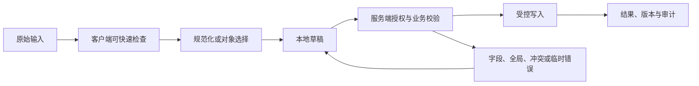

# Upload 文件上传

Upload 文件上传连接本地文件选择、字节传输、服务端安全校验和后台处理。传输完成、扫描通过、解析完成与业务导入成功是不同里程碑，不能合并成一个进度状态。

## 能力边界与前置知识

Upload 文件上传负责把用户输入转换为可校验、可提交、可恢复的数据。它不能替代服务端授权、业务校验、唯一约束、恶意内容处理或并发控制。

前置知识：

- 能定义字段或文档的数据类型、必填、范围和业务不变量；
- 能区分原始输入、显示值、规范化值和稳定对象 ID；
- 了解表单标签、可访问名称、焦点顺序和状态消息；
- 能观察请求、响应、对象版本和权威写入结果。

## 组成部分

- 选择：文件名、数量、声明类型和浏览器提供的元数据。
- 预检：大小、扩展名、MIME 与业务规则的快速反馈。
- 传输：单请求、分片、暂停、取消和重试。
- 服务端校验：真实类型、恶意内容、配额和授权。
- 后台处理：解析、扫描、转码或导入的独立任务状态。

文件项以客户端临时 ID、上传 ID、分片清单和业务对象 ID 逐阶段关联。进度、取消和重试都必须指向正确阶段，否则用户重试一次解析失败可能重新上传并重复导入全部文件。

## 输入数据生命周期



### 原始输入

浏览器提供的文件名、声明 MIME、大小和最后修改时间只用于预览与快速检查，不能证明真实类型。文件名不得当作对象键，也不能在客户端读取任意本地路径。

### 规范化值

客户端可规范显示文件名并计算分片校验值，但真实类型、恶意内容和业务结构由隔离区服务端判断。上传 ID、对象存储键和最终业务对象 ID 始终分开。

### 草稿

可恢复草稿保存上传 ID、已确认分片和过期时间，不把文件字节复制到普通 Web Storage。刷新后若浏览器无法重新取得文件句柄，应说明需要重新选文件，并用校验值确认同一内容。

### 权威结果

对象存储确认所有分片只代表传输完成；扫描、解析和导入各自返回任务状态。只有业务导入返回逐项结果后，界面才能报告成功数量和可下载失败明细。

## 专属行为

- accept 只提示文件选择器，不是安全校验。
- 分片重试使用上传 ID 和分片校验，不重复创建业务对象。
- 上传完成不等于处理完成，两个进度与失败分开。
- 取消要确认服务端是否停止并清理临时分片。
- 失败保留可重试文件引用时需考虑浏览器安全限制和隐私。

## 设计决策

1. 是否真的需要原文件，结构化少量数据可直接输入。
2. 单文件与总配额、超限后的部分选择如何处理。
3. 直传对象存储的短期凭证和回调校验。
4. 病毒扫描前文件是否完全隔离。
5. 导入部分成功如何下载逐行结果和回滚。

验收要分别验证选择限制、分片续传、取消清理、扫描隔离、解析失败和部分导入，确保每个重试只重做允许重复的阶段。

## 状态模型

| 状态 | 进入条件 | 界面责任 | 退出条件 |
| --- | --- | --- | --- |
| Upload 文件上传未触碰 | 还没有本次交互 | 显示标签、规则和合理默认值 | 用户输入或选择 |
| 编辑中 | 原始值正在变化 | 保持焦点和输入法行为 | 完成输入、取消或提交 |
| 本地无效 | 可确定格式或范围错误 | 就近说明修正方式 | 输入变为有效 |
| 可提交 | 本地条件满足 | 主操作可用，不承诺业务成功 | 提交、继续编辑 |
| 提交中 | 请求或上传进行 | 防重复意图，保留输入 | 成功、失败、超时、取消 |
| 服务端拒绝文件 | 配额、真实类型、扫描或业务结构不合格 | 标记具体文件和处理阶段，隔离危险内容 | 移除、替换或下载安全错误报告 |
| 冲突 | 基础对象版本变化 | 比较、刷新或合并 | 新版本确认 |
| 分片或导入结果未知 | 上传确认或导入响应超时 | 用上传 ID、分片号或导入任务 ID 对账 | 只重试缺失阶段或确认完成 |
| 成功 | 权威结果完成 | 显示结果和下一步 | 后续操作 |

状态不能只存在于颜色。错误、等待、选中、进度和保存结果应有程序化表达。

## 工程状态示例

```json
{
  "uploadId": "up-42",
  "fileName": "orders.csv",
  "bytesTotal": 1048576,
  "bytesSent": 524288,
  "processingState": "scanning"
}
```

示例字段不是通用接口标准。项目应按Upload 文件上传的真实值类型定义 schema，并明确缺失值、无效值、服务端错误、版本和恢复语义。

## 校验顺序

1. Upload 文件上传输入前说明格式、单位、范围和不可接受内容。
2. 输入期间只做不会打断输入法的安全检查。
3. 完成输入或离开字段后给出可修正反馈。
4. 提交时客户端汇总当前已知错误。
5. 服务端重新执行格式、授权、业务和并发校验。
6. 返回字段错误与全局错误的稳定代码和安全文案。
7. 界面保留合法输入，把焦点移到合理错误入口。
8. 修正后只清除已经解决的错误。
9. 成功后从权威响应更新对象和版本。

客户端限制可以减少错误，不能防止直接请求、旧客户端或恶意输入。

## 案例一：财务导入十万行 CSV

### 固定输入

- 使用合成账户与合成业务数据；
- 正常网络 80 ms，另注入 2 秒延迟和一次 503；
- 打开时对象版本为 17，提交前另一个会话更新为 18；
- 覆盖空值、无效值、长值、重复值和权限撤销；
- 记录可见结果、焦点、请求、响应和权威对象。

### 设计与实现

1. accept 只提示文件选择器，不是安全校验。
2. 分片重试使用上传 ID 和分片校验，不重复创建业务对象。
3. 上传完成不等于处理完成，两个进度与失败分开。
4. 取消要确认服务端是否停止并清理临时分片。
5. 失败保留可重试文件引用时需考虑浏览器安全限制和隐私。

CSV 导入最终返回任务 ID、输入文件版本、逐行结果和已创建对象 ID；页面按这些权威结果更新，不能用“上传 100%”推断 1,000 行都已写入。

### 验证

- 鼠标、键盘、触屏和屏幕阅读器都能完成；
- 输入法组合期间不误提交；
- 本地错误与服务端错误均能修正；
- 请求失败和冲突不清空合法工作；
- 重复触发只产生一个逻辑副作用；
- 最终显示与权威数据对账一致。

### 失败分支

网络超时后重试造成同一文件重复导入

修复后重复相同输入和时序，确认界面状态、服务端副作用和审计记录同时正确。

## 案例二：成员上传头像并裁剪

### 固定输入

- 360 CSS px 视口与 200% 文本缩放；
- 系统大字体、中文输入法和仅键盘操作；
- 网络先离线，恢复后响应超时；
- 会话在未提交工作存在时到期；
- 数据包含同名对象、过期引用和被删除目标。

### 设计过程

1. 选择 CSV 后先显示文件名、大小和声明类型。
2. 服务端创建 uploadId，再分片传输并校验每片。
3. 传输完成进入扫描和解析，不能提前显示导入成功。
4. 解析预览冻结文件版本与字段映射。
5. 正式导入返回逐行成功、失败和未处理结果。
6. 重试只传失败分片或失败行，不重复已完成对象。

窄屏文件项依次显示文件名、大小、当前阶段、进度和该文件的取消或重试；批量摘要放在列表前。断线后进度标为等待对账，不回退成 0% 或假装完成。

### 验证

- 关闭和恢复网络后不重复写入；
- 刷新后按声明的草稿策略恢复；
- 会话到期不把敏感值写入不安全存储；
- 失效引用有替换、清除或返回路径；
- 读屏能获知结果而无需焦点被强制移动；
- 长文本不会遮挡唯一保存或取消动作。

### 失败分支

会话在Upload 文件上传进行中到期。界面必须暂停后续写入，保留允许保留的非敏感工作，重新认证后再次校验权限与版本；不能直接重放旧请求。

会话恢复后用上传 ID 查询已持久化分片、扫描状态和导入任务；已上传文件不重复传输，临时凭证重新签发，无法恢复的本地文件明确要求重新选择。

## 无障碍实现

### 名称与说明

- Upload 文件上传的可见标签进入可访问名称。
- 帮助文本与错误通过程序化关系关联。
- placeholder 不替代持久可见标签。
- 必填、单位、格式和限制不只靠颜色或图标。
- 复合输入使用与真实行为匹配的 APG 模式。

### 键盘与输入法

- Upload 文件上传的 Tab 顺序跟随 DOM 与视觉阅读顺序。
- Enter、Space、方向键和 Escape 只按控件语义接管。
- 输入法 composition 期间不把中间文本当成完成值。
- 粘贴、语音输入和浏览器自动填充不被无理由阻止。
- 临时弹层关闭后焦点回到触发点或下一逻辑位置。
- 错误修正后焦点不被异步结果抢走。

### 重排

在 320 CSS px 等效宽度和 200% 缩放下，每个文件项纵向排列状态、进度和动作；长文件名可换行并保留扩展名，取消按钮不与全局“全部上传”混淆。

## 安全、性能与一致性

### 安全

- 所有输入均视为不可信；
- 服务端重新授权和校验；
- 富文本与文件按输出上下文净化或隔离；
- 错误不泄露内部异常、受限对象或敏感路径；
- 日志不默认记录正文、文件内容、密码或令牌。

### 性能

- 取消失效查询并丢弃乱序响应；
- 长列表、长文档和大文件使用适合的分页、分片或后台任务；
- 加载优化不改变可访问树的完整语义；
- 缓存键包含租户、角色、语言和会改变结果的筛选条件；
- 性能预算覆盖输入响应、候选出现、提交和恢复。

### 一致性

- 写请求带幂等或逻辑意图标识；
- 对现有对象修改带期望版本；
- 超时先查询结果而不是盲目重试；
- 部分成功返回逐项稳定 ID 与结果；
- 草稿与正式提交使用不同状态和权限；
- 客户端缓存不能静默覆盖服务端新版本。

## 调试与观测

1. 固定Upload 文件上传的输入、角色、对象版本、网络、语言和视口。
2. 检查原始值、显示值、选择 ID、错误和焦点。
3. 检查请求参数、取消、响应顺序和业务错误码。
4. 检查服务端授权、规范化、版本和权威写入。
5. 注入超时、权限撤销、并发和页面刷新。
6. 用键盘、读屏、输入法和窄屏重复。

观测指标：

- 有效开始、提交、成功、失败、取消和恢复；
- 首次错误类型与最终修正率；
- 输入丢失和重复副作用；
- 候选或校验响应延迟；
- 键盘阻断、焦点丢失和错误未关联；
- 按平台、语言、角色和数据量分群的完成时间。

## 综合练习

为Upload 文件上传完成可运行原型和服务端模拟。覆盖正常、无效、等待、失败、权限、过期、冲突、取消和未知结果。

验收：

- Upload 文件上传的数据类型、显示值、提交值和稳定 ID 边界明确；
- 两个案例有固定输入、处理、结果、验证和失败；
- 客户端与服务端校验责任分开；
- 失败后保留允许保留的工作；
- 键盘、屏幕阅读器和输入法完成任务；
- 弱网、窄屏和长文本不隐藏恢复；
- 日志与分析不收集不必要敏感内容；
- 权威数据与界面结果可以对账。

## 来源

- [WHATWG — File Upload state](https://html.spec.whatwg.org/multipage/input.html#file-upload-state-(type=file))（访问日期：2026-07-18）
- [MDN — File API](https://developer.mozilla.org/en-US/docs/Web/API/File_API)（访问日期：2026-07-18）
- [W3C — Web Content Accessibility Guidelines (WCAG) 2.2](https://www.w3.org/TR/WCAG22/)（访问日期：2026-07-18）
