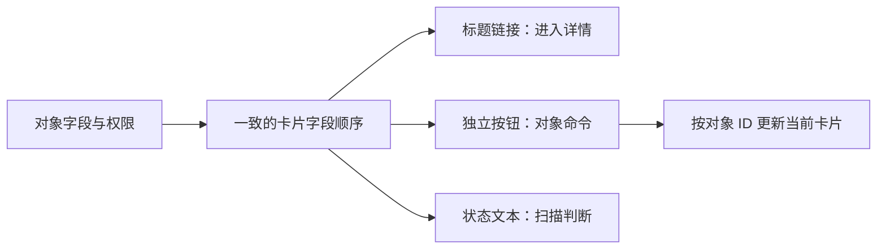

# Card 卡片

卡片把一个对象的标题、摘要、状态和少量相关操作放在可识别容器中，适合浏览，不适合高密度逐字段比较。

## 数据与任务边界

卡片服务于“先识别对象，再进入对象或执行少量操作”的任务。字段一旦增加到需要横向逐项对齐，或者每张卡出现大量按钮，任务已经越过卡片的能力边界。

前置知识：HTML 列表与链接语义、CSS Grid、图片替代文本、对象权限和响应式布局。

## 数据模型

```json
{
  "objectId": "project-42",
  "title": "支付平台",
  "summary": "12 个服务",
  "status": "healthy",
  "primaryHref": "/projects/project-42",
  "actions": [
    "favorite"
  ]
}
```

`objectId` 负责状态合并和操作授权，`primaryHref` 是主导航目标；`status` 必须使用业务定义的枚举并映射为可见文本，不能只映射为颜色。`actions` 只声明当前对象和当前用户实际可执行的命令。

## 工作机制

- Card 不是 ARIA 角色，根据内容使用 article、li 或普通分组。
- 标题是对象的主要入口，卡片容器不必整体模拟链接。
- 对象 ID、标题、摘要、状态与操作分开。
- 多卡集合使用列表语义并保持一致内容顺序。
- 状态不只靠边框颜色，显示文本和可访问名称。
- 整卡点击与内部按钮不能形成嵌套交互元素。
- 高度和网格列数不改变 DOM 阅读顺序。
- 需要精确比较时切换到表格或比较视图。




## 交互规则

- 主链接只包裹标题或明确区域。
- 收藏、菜单等操作有独立按钮和名称。
- 键盘 Tab 顺序按卡片逐项，不为容器增加多余停靠点。
- 图片有用途相关替代文本或标记装饰。
- 加载图片失败仍保留标题与状态。
- 窄屏单列重排与 DOM 顺序一致。

## Card 卡片状态

| 状态 | 专属行为 |
| --- | --- |
| 可用 | 标题、摘要和状态完整 |
| 图片加载失败 | 保留对象名称与任务 |
| 受限 | 隐藏敏感字段但保留合法入口 |
| 长内容 | 卡片高度变化但DOM顺序不变 |
| 选中 | 多选状态与主链接分开 |
| 过期 | 对象状态更新并说明 |

## 案例 1：项目首页扫描最近工作区

### 约束与输入

- 12 个项目；标题、环境、成员数和健康状态。
- 用户进入项目或切换收藏。

### 处理过程

1. 使用 ul/li，卡片标题为项目链接。
2. 状态用文字与图标共同表达。
3. 收藏按钮名称包含项目名。
4. 服务端按用户权限返回卡片。
5. 长标题在两行后仍保留完整可访问名称。

### 失败分支

把整个卡片放进 anchor 后又加入收藏 button，产生非法嵌套和冲突点击。修正为只让标题链接。

### 专属验证

- Tab 一轮应依次到达 12 个项目标题及各自收藏按钮，卡片容器本身不增加停靠点。
- 读屏按钮列表中应出现“收藏支付平台”等对象化名称，而不是 12 个无法区分的“收藏”。
- 模拟项目权限撤销后，该项目敏感成员数消失，仍可见的健康状态与合法入口不受影响。
- 收藏请求失败时按钮恢复原状态，焦点仍在该项目按钮，并显示与该对象关联的错误。

## 案例 2：模板市场比较用途和维护者

### 约束与输入

- 80 个模板；用户按类别浏览，不进行精确字段对比。
- 卡片含预览图、用途、维护者和更新时间。

### 处理过程

1. 筛选写入 URL，卡片顺序由明确排序决定。
2. 预览图懒加载但尺寸预留，避免布局跳动。
3. 模板名是详情链接。
4. 维护者和更新时间使用文本，不藏在 tooltip。
5. 需要比较时提供独立比较表格。

### 失败分支

卡片视觉顺序用 CSS order 改变，读屏仍按旧 DOM 阅读。修正为数据排序后渲染一致 DOM 顺序。

### 专属验证

- 在预览图全部 404 的条件下，80 个模板仍能按名称、用途和维护者完成筛选与进入详情。
- 三列、两列和单列断点下，DOM 项目顺序与排序结果完全一致，Tab 不发生视觉跳跃。
- 抽取 5 个需要精确比较的模板进入比较表，维护者、更新时间和用途与卡片源数据一致。
- 长维护者名称和四行用途文本不得覆盖更新时间或更多菜单，卡片高度变化不改变下一项语义。

## 语义与键盘

- 卡片集合使用带可见标题的列表；单张卡通常不需要额外焦点。
- 标题链接的可访问名称就是对象名称，不附加一长串摘要和状态。
- 项内按钮按 DOM 顺序位于主链接之后，并以对象名称消除重复按钮歧义。
- 收藏等切换按钮暴露当前状态；健康、受限等状态同时显示文字。
- 网格从三列变一列时只改变布局，标题、摘要、状态、操作的阅读顺序不变。
- 图片加载失败、字段隐藏或卡片删除后，剩余主任务仍可由键盘完成。

## Card 卡片工程实现

### 1. Card没有专用ARIA角色；集合用list，独立内容可用article。

商品、项目等同类卡片应放在 `ul`/`li` 中，让辅助技术取得集合边界与项目数量。只有卡片本身构成可独立分发的完整内容时才使用 `article`；仅为布局添加 `role="group"` 不会自动建立标题关系。

### 2. 只让标题或明确区域成为链接，避免anchor嵌套button。

卡片标题链接提供稳定的主入口，收藏、删除和更多菜单保持为并列按钮。若产品坚持整卡可点，应使用拉伸链接等视觉技术，但必须保证按钮不落在链接元素内部，并测试拖选文字、右键打开和键盘焦点。

### 3. 卡片字段顺序跨所有项一致；需要逐字段比较时提供表格。

组件接口应区分必填字段、可选字段和缺失时的占位策略，避免某项没有价格时把状态顶到价格的位置。若任务要求沿同一列比较价格、权限或日期，卡片布局会增加扫视成本，应切换为数据表格或提供视图切换。

### 4. CSS Grid重排不能使用order改变语义顺序。

DOM 顺序同时决定读屏阅读顺序和通常的键盘顺序。响应式布局应改变网格列数和跨度，不应把第三个卡片通过 `order` 视觉移到第一个；发布前分别对照无样式 DOM、Tab 顺序与视觉顺序。

### 5. 图片预留尺寸并按用途写alt；装饰图为空alt。

图片组件需要接收固有宽高或 `aspect-ratio`，从而在资源返回前保留空间。若图片重复标题已经表达的对象名称，空 `alt` 可以避免重复朗读；若图片承载商品颜色、损坏状态等决策信息，替代文本必须写出该信息。

### 6. 菜单按钮名称包含对象名，关闭后焦点返回按钮。

同屏多个“更多”按钮必须形成可区分名称，例如“项目北斗的更多操作”。菜单因 Escape、外部点击或执行命令关闭时都应恢复到原按钮；若原卡片已被删除，则按列表顺序把焦点交给下一张、上一张或集合标题。

## Card 卡片调试

- Tab遍历整组卡片
- 关闭CSS检查阅读顺序
- 长标题与RTL文本
- 图片404
- 权限隐藏字段
- 整卡点击与内部按钮冲突

调试记录保存对象 ID、实际权限、卡片 DOM、每个交互元素的可访问名称和关闭菜单后的焦点位置。分别在整卡点击开启与关闭的实现上测试右键打开、文字选择和内部按钮，确认事件目标没有冲突。

## Card 卡片发布检查

- 没有嵌套交互元素
- 对象标题是稳定入口
- 视觉与DOM顺序一致
- 状态不只靠颜色
- 图片失败不阻断任务
- 比较任务有替代表格

失败注入包括封面 404、标题超过四行、摘要为空、操作权限在菜单打开后撤销、收藏请求乱序以及卡片从三列收缩为一列。每个分支都要保留对象名称、合法入口和可预测焦点。

## 综合练习

实现项目卡片网格与模板市场，加入长标题、无图、权限字段和窄屏。

验收时用至少 30 张真实字段组合的卡片完成扫描、进入详情、收藏、菜单操作和视图切换；对照 DOM 与视觉顺序，确认没有嵌套交互元素，删除当前卡后焦点落点可预测。

## Card 没有专用语义

“卡片”是视觉与信息分组名称，不是固定 HTML 或 ARIA 角色。

按内容选择：

| 内容关系 | 结构 |
| --- | --- |
| 多个同类对象 | `ul`/`li` |
| 可独立发布的内容 | `article` |
| 普通信息分组 | `div` 配合标题 |
| 一组键值摘要 | `dl` 或 summary list |
| 需要逐列比较 | `table` |

不要为卡片添加不存在的 `role="card"`。

## 点击模型

### 标题链接

推荐让标题成为主链接：

```html
<li class="project-card">
  <h2><a href="/projects/project-42">支付平台</a></h2>
  <p>12 个服务</p>
  <p>状态：健康</p>
  <button type="button" aria-label="收藏支付平台">收藏</button>
</li>
```

优点：

- 支持新标签、复制地址和链接菜单；
- 内部按钮保持独立；
- 键盘停靠点数量清楚；
- 可访问名称来自可见标题。

### 整卡点击

若扩大指针点击区域，不能用一个 anchor 包裹内部按钮。可以使用 CSS 扩展标题链接的点击区域，但要：

- 防止覆盖其他交互元素；
- 保持文本选择；
- 提供清晰 hover 和 focus；
- 检查多个卡片区域不重叠；
- 让键盘仍只聚焦真实链接。

## 字段层级

一个对象卡片通常分三层：

### 身份

标题、对象类型、必要的唯一辅助信息。

### 决策摘要

只保留完成当前浏览任务需要的字段。项目卡可能显示环境、健康状态、更新时间；模板卡可能显示用途、维护者和兼容版本。

### 操作

最多放少量高频、低风险操作。更多操作进入有名称的菜单。删除、权限变更等高风险操作不应因卡片空间狭小而省略影响说明。

## Card 与 Table

选择 Card：

- 用户先识别对象，再进入详情；
- 每个对象的媒体或摘要差异明显；
- 字段数量少；
- 主要任务是浏览。

选择 Table：

- 用户需要跨多个对象比较同一字段；
- 数值和状态需要对齐；
- 排序、筛选和批量操作频繁；
- 信息密度比媒体预览重要。

不要为了“视觉现代”把 20 个对比字段塞进不同高度卡片。

## 图片处理

图片有三种责任：

| 图片 | `alt` |
| --- | --- |
| 对象识别所需 | 描述能区分对象的信息 |
| 与邻近标题重复 | 空 `alt` |
| 纯装饰背景 | CSS 背景或空 `alt` |

工程要求：

- 提供固定宽高减少布局跳动；
- 选择适合密度与视口的资源；
- 加载失败不移除对象标题；
- 私有图片 URL 有权限与到期；
- 不在日志记录敏感文件名；
- 裁剪不能隐藏任务关键区域。

## 网格与阅读顺序

CSS Grid 可以改变列数，但 DOM 顺序保持业务顺序。

桌面三列到窄屏一列时：

```text
DOM: A B C D E F
桌面: A B C
      D E F
窄屏: A
      B
      C
      D
      E
      F
```

不要使用 `order` 构造蛇形或视觉优先布局，除非同步改变 DOM 数据顺序。

## 卡片状态

- 图片加载与对象数据加载分开；
- 收藏中的乐观状态可回滚；
- 对象删除后卡片进入失效，不链接到空首页；
- 权限字段被过滤后不留无标签空位；
- 状态过期时显示更新时间；
- 菜单打开时卡片实时更新不能移除焦点；
- 加载骨架从可访问树隐藏并由区域 busy 状态说明；
- 错误只影响对应卡片或字段。

## Card 专项验证

1. Tab 顺序是否只到标题链接和真实操作。
2. 点击标题附近是否意外触发收藏。
3. 图片 404 后能否完成任务。
4. 200% 缩放后标题和操作是否重叠。
5. 40 字标题与双向文本怎样换行。
6. CSS 禁用后阅读顺序是否合理。
7. 屏幕阅读器链接列表能否区分对象。
8. 权限变化后私有摘要是否消失。
9. 卡片排序变化是否保留焦点。
10. 需要精确比较时是否提供表格入口。

## Card 菜单

卡片菜单按钮名称包含对象，例如“支付平台的更多操作”。菜单打开后：

1. 焦点进入首个可用项或按组件约定保留在按钮；
2. Escape 关闭并返回按钮；
3. 对象实时删除时关闭菜单并把焦点放到下一卡片；
4. 权限变化时重新计算菜单项；
5. 危险操作进入包含对象名与影响的确认流程；
6. 菜单项执行失败后保留对象上下文。

## Card 指标

可记录卡片主链接进入、菜单打开、具体动作、失败和返回，但不要把“整卡任意点击”合并成一个事件。卡片点击高可能表示对象常用，也可能表示摘要不足导致必须进入详情。结合任务完成、快速返回和错误操作判断。

卡片内容可能包含客户名、文件名和预览图。分析事件使用对象类型与动作类别，不默认记录显示文本和图片 URL。

服务端渲染或 JavaScript 失败时，卡片标题链接仍应是可导航的基础能力。收藏数量、在线状态和图片可以独立失败，不能移除对象身份。预取详情前先检查权限与网络成本，不能因为用户指针经过卡片就下载受限或巨大的详情数据。

## 来源

- [html.spec.whatwg.org — Card 卡片相关规范](https://html.spec.whatwg.org/multipage/sections.html#the-article-element)（访问日期：2026-07-18）
- [www.w3.org — Card 卡片相关规范](https://www.w3.org/TR/WCAG22/)（访问日期：2026-07-18）
- [design-system.service.gov.uk — Card 卡片相关规范](https://design-system.service.gov.uk/components/summary-card/)（访问日期：2026-07-18）
