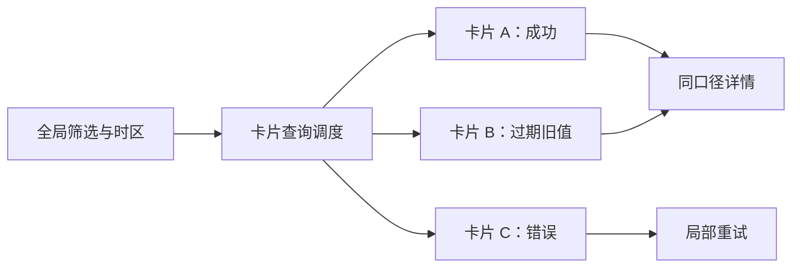

# Dashboard 仪表盘

仪表盘组合多个指标、状态和入口，支持持续监测与决策。每张卡片必须说明口径、时间窗、单位和更新时间。

## 数据与任务边界

仪表盘把多个查询放在同一决策上下文中，但每张卡仍有独立口径、时效和失败状态。页面的责任是帮助发现偏差并下钻，不应把来源不同、时间窗不同的数字伪装成可直接比较。

前置知识：指标分子与分母、时间窗、聚合查询、缓存过期、图表与卡片模式、URL 状态。

## 数据模型

```json
{
  "dashboardId": "service-health",
  "filters": {
    "environment": "production",
    "window": "1h"
  },
  "cards": [
    {
      "id": "error-rate",
      "metric": "http_error_ratio",
      "unit": "percent",
      "aggregation": "sum(errors)/sum(requests)",
      "updatedAt": "2026-07-18T10:20:30Z"
    }
  ]
}
```

每张卡的 `metric` 必须解析到带版本的指标定义，`aggregation` 由受控配置或服务端实现生成，而不是在界面任意拼接。`updatedAt` 只表示该卡数据的更新时间；它不能替代业务数据截止时间或查询时间窗。

## 工作机制

- 指标定义、分子分母、单位和采样点进入指标字典。
- 全局筛选明确哪些卡片适用，未适用卡片不能静默保留。
- 每卡显示时间窗、更新时间和数据状态。
- 总体指标与分群指标分开，避免平均掩盖异常。
- 告警阈值、目标和当前值分别表达。
- 卡片位置不决定业务优先级的唯一含义。
- 视觉图表提供文本结论和数据表。
- 刷新频率依据决策时效，不追求无意义实时。




## 交互规则

- 全局筛选写入 URL 并产生查询版本。
- 单卡失败保留其他可用卡片。
- 刷新时保留旧值并明确标记过期。
- 点击指标进入使用相同筛选的详情。
- 自定义布局保存为用户偏好而非指标定义。
- 导出冻结全部卡片口径和时间窗。

## Dashboard 仪表盘状态

| 状态 | 专属行为 |
| --- | --- |
| 部分加载 | 各卡独立状态 |
| 可用 | 口径、时间窗和更新时间完整 |
| 局部失败 | 其他卡保持可用 |
| 过期 | 旧值可读但不能伪装最新 |
| 全局筛选 | 标明适用和不适用卡片 |
| 回补 | 历史值更新并显示版本 |

## 案例 1：运维团队监控服务健康和告警

### 约束与输入

- 生产环境；1 小时时间窗；错误率、P95 延迟、流量。
- 数据来自三个独立源。

### 处理过程

1. 建立同一环境与时间窗过滤。
2. 每卡独立加载并显示更新时间。
3. 错误率使用总错误/总请求，不平均实例百分比。
4. 延迟显示 P50/P95/P99 与样本量。
5. 单源失败时卡片局部报错。

### 失败分支

三个卡片使用不同时间窗却只在页面标题写“最近一小时”。修正为每卡携带查询口径。

### 专属验证

- 用实例级原始计数复算错误率：结果必须等于 `sum(errors)/sum(requests)`，不得等于实例百分比平均值。
- 让延迟数据源超时，错误率和流量卡仍可读取；延迟卡显示上次成功时间和局部重试。
- 将环境从 production 切换到 staging 后，三张卡的查询 ID、时间窗和标题状态同步变化。
- 从错误率卡下钻，详情页携带同一环境、1 小时时间窗和时区，并能对账到卡片数值。

## 案例 2：经营人员查看收入、转化和异常分群

### 约束与输入

- 日收入、漏斗和地区分群；时区为业务时区。
- 退款会回补历史收入。

### 处理过程

1. 指标字典定义确认收入与退款口径。
2. 日期按业务时区切分。
3. 总体转化旁显示关键分群。
4. 回补后标记数据更新时间和版本。
5. 详情沿用仪表盘筛选。

### 失败分支

总体转化提高但新用户分群下降。修正为固定展示关键护栏分群。

### 专属验证

- 选择业务时区跨日边界的两笔订单，确认收入归属日期与指标字典一致。
- 注入一笔历史退款后，当日净收入、趋势和更新时间同时更新，旧值明确标记已回补。
- 构造总体转化上升而新用户转化下降的数据，页面必须同时暴露总体与新用户护栏分群。
- 地区筛选不适用于某经营目标卡时，该卡显示“不受地区筛选影响”，而不是静默保持数字。

## 语义与键盘

- 页面标题后先放全局筛选和数据时区，再按决策优先级组织卡片标题。
- 卡片标题、指标值、单位、时间窗和更新时间构成完整可读单元。
- 告警不能只靠红色或卡片位置；同时显示级别、阈值、当前值和持续时间。
- 自动刷新不重建整个页面 DOM，不改变当前焦点或用户自定义布局。
- 单卡错误在该卡标题下说明，并提供局部重试，不把所有错误汇总成脱离上下文的提示。
- 图表卡提供文本结论与精确数据入口，数字卡的趋势箭头同时写出变化方向和幅度。

## Dashboard 仪表盘工程实现

### 1. 指标字典保存名称、分子、分母、单位、采样和聚合。

例如“支付成功率”必须明确分子是成功支付次数还是成功订单数，分母是否排除取消订单，时间按创建还是支付发生归属。指标版本发生口径变化时要保留生效时间，避免同一趋势线拼接不可比的数据。

### 2. 每张卡拥有查询ID、时间窗、时区、更新时间和状态。

卡片状态至少区分初次加载、已有旧值时刷新、成功、空数据、过期和错误。局部请求失败时保留其他卡片结果，并在失败卡上显示上次成功时间；不得把昨日旧值伪装成刚刷新的当前值。

### 3. 全局筛选声明适用卡片；不适用卡片禁用或解释。

每张卡的查询定义应声明支持的筛选维度及映射字段。用户选择“渠道=自然流量”后，不具备渠道维度的库存卡片应标记“不受此筛选影响”，而不是静默保留一个看似已经过滤的数字。

### 4. 总体旁固定关键分群，防止平均值掩盖回归。

总体改善可能来自流量构成变化，而某个平台、地区或新用户群已经恶化。关键分群应由业务风险预先确定并保持可比，不能只展示当期最好或最差的组；分群样本量也应与比率一起显示。

### 5. 自动刷新不在用户复制或阅读时重排焦点。

刷新周期、页面可见性和请求取消策略应统一管理，防止多个卡片叠加轮询。新数据先更新卡片内容，不改变 DOM 排列；当用户正在选择文本、操作菜单或查看展开详情时，延迟会破坏当前操作的结构变化。

### 6. 详情链接携带同一筛选与时间窗。

下钻链接应序列化开始时间、结束时间、时区、维度筛选和指标版本，详情页再校验权限与参数。若详情默认回到“最近七天”，用户将无法解释仪表盘数值与明细为何不一致。

## Dashboard 仪表盘调试

- 对账分子分母
- 让单数据源失败
- 切换全局筛选
- 回补历史退款
- 跨时区日期边界
- 慢网下检查旧值标记

调试以卡片为单位记录查询 ID、指标版本、筛选映射、数据截止时间、缓存年龄和响应状态。点击下钻后对比详情页的时间窗、时区、权限范围和分子分母，任何一项不同都应视为口径断裂。

## Dashboard 仪表盘发布检查

- 每卡口径可见
- 局部失败不阻断整页
- 全局筛选适用范围明确
- 总体与关键分群并存
- 更新时间和过期可感知
- 详情沿用同一查询

失败注入包括一张卡超时、一张卡返回旧缓存、某筛选维度不适用、历史回补改变趋势、分群样本为零和用户权限缩小。页面应保留可用卡，逐卡标记状态，并禁止用旧授权范围的聚合值继续展示。

## 综合练习

实现服务健康与经营仪表盘，包含局部失败、全局筛选、回补和可访问数据表。

验收使用至少六张不同数据源的卡片，逐张复算指标并验证全局筛选适用范围。模拟局部失败与自动刷新时，筛选焦点、展开详情和文本选择均保持稳定；下钻页面必须复现相同时间窗与指标版本。

## 指标字典

每个指标先定义，再进入卡片：

```json
{
  "id": "http-error-ratio",
  "label": "HTTP 错误率",
  "numerator": "sum(http_requests where status >= 500)",
  "denominator": "sum(http_requests)",
  "unit": "percent",
  "aggregation": "ratio-of-sums",
  "dimensions": ["service", "environment", "region"],
  "owner": "service-platform"
}
```

“平均错误率”可能错误地平均各实例百分比。跨实例聚合应使用总错误数除以总请求数。

## 卡片查询契约

每张卡保存：

| 字段 | 含义 |
| --- | --- |
| metricId | 指标字典 ID |
| filters | 环境、地区、版本等 |
| window | 时间范围 |
| grain | 数据粒度 |
| timeZone | 日期边界与显示时区 |
| aggregation | 聚合规则 |
| updatedAt | 最新数据时间 |
| queryId | 可追踪查询 |
| state | loading/ready/stale/error |

全局筛选改变时，卡片必须声明：

- 完全适用；
- 部分适用；
- 不适用；
- 需要独立转换。

不适用卡片不能静默保留旧数值。

## 局部失败

仪表盘由多个查询组成。一个来源失败时：

```text
错误率：可用
延迟：可用
部署：暂时失败，可重试
```

页面保留可用卡片，并在失败卡片中显示：

- 失败范围；
- 最后成功值及时间；
- 当前值是否过期；
- 重试；
- 查看数据源状态。

不要把整页替换为“加载失败”。

## 自动刷新

刷新策略由决策时效决定：

- 高频告警可以 10 秒；
-容量趋势可以 5 分钟；
- 财务收入可能每日回补；
- 静态配置只在版本变化时更新。

刷新时：

- 保留旧值；
- 显示更新时间；
- 不重置用户筛选；
- 不抢焦点；
- 不关闭展开详情；
- 乱序响应按查询版本丢弃；
- 页面隐藏时降低不必要频率。

## 总体与分群

总体平均可能掩盖局部下降。为每个核心指标定义固定护栏分群：

| 总体指标 | 护栏分群 |
| --- | --- |
| 转化率 | 新旧用户、平台、入口 |
| 错误率 | 服务、地区、版本 |
| 延迟 | P50、P95、P99 |
| 收入 | 地区、币种、退款 |
| 任务成功 | 角色、数据量 |

仪表盘不需要展示所有分群，但异常时能进入使用同一筛选的详情。

## 告警与目标

区分：

- 当前值；
- 目标值；
- 告警阈值；
- 预算消耗；
- 预测值。

“错误率 2%”只有结合阈值、持续时间和流量才可判断风险。

## 数据回补

退款、延迟事件和数据修复会改变历史值。卡片显示：

- 数据版本；
- 最新回补时间；
- 是否为初步值；
- 历史变化说明；
- 报告导出版本。

不要把昨天的数值当作永远不可变。

## 布局与键盘

- 页面有唯一主标题和全局筛选名称。
- 每卡使用可见标题。
- 卡片详情链接名称包含指标。
- DOM 顺序表达优先阅读顺序。
- 用户自定义布局保存为偏好，但读屏顺序需要可预测。
- 自动刷新不改变焦点。
- 图表卡提供文本结论和数据表。
- 200% 缩放后单列重排。

## Dashboard 专项验收

1. 每卡能回答指标是什么、时间窗是什么、何时更新。
2. 全局筛选的适用范围可见。
3. 单卡失败不阻断其他卡。
4. 总体旁可进入关键分群。
5. 详情沿用同一过滤。
6. 自动刷新不造成焦点和布局跳动。
7. 回补能追踪版本。
8. 导出冻结查询口径。
9. 权限过滤覆盖指标和总数。
10. 数据源失败有最后成功时间。

## Dashboard 权限

权限不仅影响卡片是否显示，还影响：

- 指标分子与分母；
- 总数；
- 分群；
- 异常对象列表；
- 下钻详情；
- 导出；
- 告警阈值；
- 保存视图。

若普通成员只能查看自己项目，不能返回全组织总数再隐藏详情。聚合查询必须在授权范围内计算。

## Dashboard 性能预算

为每张卡记录：

| 信号 | 含义 |
| --- | --- |
| query start | 查询开始 |
| first value | 首个可解释值 |
| complete | 全部结果完成 |
| stale shown | 展示旧值 |
| error | 卡片失败 |
| retry | 用户重试 |

页面首个可操作不需要等待所有低优先卡。关键告警卡优先，重型报表延后。并行请求设置上限，避免仪表盘自身制造数据服务拥塞。

## Dashboard 失败注入

1. 三个数据源中一个返回 503。
2. 全局时间窗只适用于一半卡片。
3. 用户切换筛选后旧响应晚到。
4. 收入历史发生退款回补。
5. 环境权限在刷新期间撤销。
6. 自动刷新时用户正在复制数据。
7. P95 卡片没有样本量。
8. 总体改善但关键分群下降。
9. 200% 缩放后卡片单列。
10. 导出使用不同时间区间。

仪表盘分析事件围绕决策任务：改变筛选、进入异常详情、确认告警和导出报告。卡片曝光和点击只能说明使用路径，不能证明指标被正确理解。对每个结论保留查询 ID 与指标字典版本，客服和审计可以复现当时看到的数值。

## 来源

- [www.w3.org — Dashboard 仪表盘相关规范](https://www.w3.org/TR/WCAG22/)（访问日期：2026-07-18）
- [www.w3.org — Dashboard 仪表盘相关规范](https://www.w3.org/WAI/tutorials/images/complex/)（访问日期：2026-07-18）
- [design-system.service.gov.uk — Dashboard 仪表盘相关规范](https://design-system.service.gov.uk/styles/data/)（访问日期：2026-07-18）
