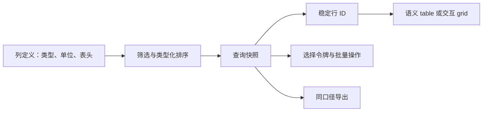

# Table 数据表格

数据表格用行列关系呈现同类记录，支持精确比较、查找和批量操作。静态 table 与可编辑 grid 的键盘模型不同。

## 数据与任务边界

表格的核心是不同行共享同一列定义，从而沿垂直方向精确比较。设计前必须确定记录主键、字段类型、表头关系和操作范围；可编辑单元格导航是额外能力，不能由普通读取表自动推导。

前置知识：HTML 表格元素、ARIA grid、稳定排序、游标分页、批量授权和数据导出。

## 数据模型

```json
{
  "queryId": "invoice-open",
  "columns": [
    "invoiceNo",
    "customer",
    "amount",
    "status"
  ],
  "sort": [
    {
      "field": "issuedAt",
      "direction": "desc"
    }
  ],
  "page": {
    "cursor": "c-20",
    "size": 50
  },
  "total": 1842,
  "snapshotVersion": 27
}
```

`columns` 应引用列定义而非只存显示文案，列定义包含字段类型、单位、格式化器和可排序性。`snapshotVersion` 把总数、页数据和跨页选择绑定到同一集合；更新后的快照不能继续使用旧选择令牌。

## 工作机制

- 每行对应一个稳定业务对象，行键不使用数组序号。
- 列有字段 ID、可见标题、类型、单位、格式化与排序规则。
- 静态比较优先使用原生 table、thead、tbody、th 与 scope。
- 只有需要方向键在单元格间移动或编辑时才采用 ARIA grid。
- 排序状态同时更新按钮名称、aria-sort、查询和 URL。
- 分页总数、当前页和跨页选择使用同一查询快照。
- 固定列与虚拟滚动不得破坏表头关系和键盘顺序。
- 批量结果按稳定行 ID 返回成功、失败与未处理。




## 交互规则

- 筛选改变查询集合并清除或重新确认跨页选择。
- 排序使用原始类型值，不用格式化字符串比较。
- 列宽调整有键盘或设置入口，不把拖拽作为唯一方式。
- 行级操作与行导航分开，整行点击不能包裹内部按钮。
- 选择当前页与选择当前筛选全部明确显示数量。
- 导出冻结筛选、列、时区和权限，并返回任务 ID。

## Table 数据表格状态

| 状态 | 专属行为 |
| --- | --- |
| 查询中 | 保留表头、筛选和已确认快照；新查询不可操作旧选择 |
| 可用 | 总数、快照版本、列与排序齐全 |
| 跨页选择 | 明确本页数量与冻结查询全部数量 |
| 部分结果 | 逐行标记失败，不把整表改成成功 |
| 过期 | 版本变化，写操作前刷新并重选 |
| 虚拟化 | 只渲染窗口，但行列语义与总数可取得 |

## 案例 1：账单后台筛选、排序并跨页选择发票

### 约束与输入

- 1,842 张发票；50 行/页；财务角色；金额含币种。
- 筛选未付款并按开票时间降序，选择当前筛选全部。

### 处理过程

1. 服务端返回 queryId、snapshotVersion 与总数。
2. 表头按钮更新 aria-sort 和 URL 查询。
3. 用户选择本页 50 项后，显式升级为全部 312 项。
4. 提交批量提醒时发送冻结 queryId 而非当前 DOM 行。
5. 结果页列出逐项结果并允许重试失败项。

### 失败分支

筛选改变后仍保留旧的“全部 312 项”选择。修正为查询指纹变化即使选择失效，并要求重新确认范围。

### 专属验证

- 按开票时间降序后，前后两页合计 100 个发票 ID 无重复，列头报告降序且焦点留在排序按钮。
- 从“本页 50 项”升级到“当前筛选 312 项”后，界面、选择令牌摘要和服务端预览数量一致。
- 改变未付款筛选或角色权限后，旧选择令牌被拒绝并要求重新确认，不能继续发送提醒。
- 批量结果按发票 ID 对账，成功、无权限、已支付和不存在分别计数，失败项可单独导出。

## 案例 2：安全平台查看上万条审计事件

### 约束与输入

- 每天 200 万事件；只读；事件时间和接收时间分开。
- 用户需要键盘查看详情并复制事件 ID。

### 处理过程

1. 使用服务端游标分页，不计算巨大页码偏移。
2. 表格只展示关键列，详情通过相邻抽屉读取。
3. 时间列显示时区并保留机器可读时间。
4. 虚拟化只在性能证据需要时启用，并测试读屏行列信息。
5. 导出作为后台任务按当前授权重新过滤。

### 失败分支

虚拟滚动让读屏只感知 20 行，却宣称总计 20,000 行。若无法完整实现 grid 虚拟化语义，应改用分页静态表格。

### 专属验证

- 读屏抽查事件时间、主体、动作三列，任一数据单元格都能取得正确列头，不出现复制固定列的重复内容。
- 在 200 万事件数据上比较游标分页与虚拟化；若虚拟化不能保持总行数和行索引，则交付方案必须回退到分页。
- 从事件行打开相邻抽屉再关闭，焦点返回原事件 ID；该行滚出窗口后按既定规则恢复可见位置。
- 导出任务使用当前授权重新查询，文件中的首尾游标、时区与界面筛选摘要一致。

## 语义与键盘

- 读取表保留原生 `table`、`caption`、`thead`、`tbody` 与 `th` 关系。
- 排序按钮位于列头内，当前排序列使用 `aria-sort`；结果更新后焦点仍在按钮。
- 行选择复选框名称包含对象标识，表头复选框明确“本页”还是“当前筛选全部”。
- 水平滚动限制在带名称的表格容器，固定列不复制第二套可访问单元格。
- 只有实现完整方向键与编辑模式时才使用 grid；普通表格保持浏览器表格导航。
- 批量操作逐项返回状态，失败行可以定位、下载或在权限允许时重试。

## Table 数据表格工程实现

### 1. 静态读取表使用原生 table。表头按钮置于 th 内，aria-sort 只放当前排序列。

列头用 `scope="col"`，复杂分组表头按结构使用 `scope` 或 `headers`/`id` 建立对应关系。排序按钮的名称保持列名，排序状态由当前表头的 `aria-sort` 表达；切换排序后焦点留在按钮，并说明新的顺序。

### 2. 交互 grid 采用 roving tabindex；方向键在单元格移动，Tab 进入/离开 grid 或按产品编辑模型处理。不要把普通表格加 role=grid。

只有需要单元格导航、选择或编辑时才承担 grid 的键盘责任。组件状态应保存活动行列，方向键只改变活动单元格；进入编辑模式后，文本框、选择框等内部控件接管按键，Escape 恢复到单元格导航。

### 3. 跨页选择保存 explicit IDs 或冻结 queryId。筛选、排序、权限或快照改变后，旧 queryId 失效。

少量选择直接提交对象 ID；“选择全部查询结果”则由服务端生成带过期时间和查询摘要的选择令牌，并允许记录排除项。执行批量操作时服务端重新授权每个对象，返回成功、已变化、无权限和不存在等逐项结果。

### 4. 虚拟化必须维护稳定 row ID、rowindex、rowcount 和表头关系；无法验证读屏时回退为分页。

回收 DOM 行时不能把视觉索引当对象 ID，焦点、选择和更新都必须绑定业务主键。对于 ARIA grid，`aria-rowindex` 表示该行在完整集合中的一基位置，`aria-rowcount` 表示已知总数；滚动卸载活动行前需要先确定焦点迁移策略。

### 5. 固定列由同一语义表格实现，不复制出两个无法关联的表。

可使用 `position: sticky` 固定同一表格中的表头和首列，并处理层叠顺序、背景及滚动容器。若为视觉效果复制首列，会产生重复朗读、行高错位和两个滚动区域；必须避免这种拆分或隐藏重复副本且证明表头关系仍成立。

### 6. 导出在服务端按冻结筛选、列、时区和当前授权重新执行。

导出任务应保存请求者、查询版本、字段集合、币种与时间格式，并在生成时再次执行行级和列级授权。文件完成后提供行数、生成时间和失败原因；超大导出采用异步任务与短期下载地址，不把当前页面 DOM 拼成权威数据。

## Table 数据表格调试

- 检查表头 scope/headers 与 aria-sort。
- 用两列同名显示值验证稳定行 ID。
- 选择本页后升级为全部，再改变筛选。
- 让另一会话删除已选行并提交批量操作。
- 用 20,000 行测试分页、虚拟化、焦点和内存。
- 对比界面金额、导出金额和数据库币种。

调试记录列定义、表头关联、排序原始值、查询快照、选择令牌与批量逐项结果。虚拟化场景还要保存活动行 ID、ARIA 行索引、DOM 窗口范围和滚动后焦点，避免只验证视觉行号。

## Table 数据表格发布检查

- 表头与单元格关系可由读屏取得
- 排序后焦点留在触发按钮且结果被说明
- 跨页选择数量与服务端作用范围一致
- 虚拟化不会把总行数伪装为可视行数
- 列固定和横向滚动不破坏键盘顺序
- 逐项结果可以下载和重试

失败注入包括同值排序、空单元格、超长文本、总数变化、已选行被删除、导出期间权限撤销和虚拟行回收。所有结果按稳定主键合并，旧快照选择不得静默作用于新查询。

## 综合练习

实现发票表：4列、服务端排序、游标分页、本页/全部选择、逐项批量结果。另实现静态 table 与 grid 两版并说明为何最终只选一版。

验收分别实现读取表与可编辑 grid，证明二者键盘模型没有混用。使用 20,000 行验证排序、分页或虚拟化、跨页选择、批量部分失败及导出对账；读屏能取得每个数据单元格对应表头。

## Table 与 Grid 的选择

`<table>` 表达二维数据关系。浏览器与辅助技术能够识别表格、行、列、表头和单元格。只读表即使包含链接、复选框和按钮，也不因此自动变成 `grid`。

`grid` 是复合控件。采用它以后，应用负责：

- 只让一个单元格或行进入页面 Tab 序列；
- 用方向键在单元格之间移动；
- 区分导航模式与单元格编辑模式；
- 实现 Home、End、Page Up、Page Down 等约定行为；
- 维护 `aria-rowindex`、`aria-colindex` 与总行列信息；
- 处理虚拟化窗口之外的逻辑位置；
- 在删除、排序和分页后恢复焦点。

以下情况优先保留原生 Table：

- 主要任务是阅读和比较；
- 行内只有少量独立操作；
- 用户不需要像电子表格一样连续编辑；
- 分页可以满足容量；
- 团队无法完整实现和测试 Grid 键盘模型。

以下情况才考虑 Grid：

- 用户高频在大量单元格之间移动；
- 多个单元格可直接编辑；
- 方向键导航能显著改善任务；
- 已有真实辅助技术测试和回退方案。

## 表头关系

简单表格中，列标题使用 `<th scope="col">`，行标题使用 `<th scope="row">`。

多级表头需要确认每个数据单元格能关联到正确的上级表头。若跨行、跨列结构过于复杂，应：

1. 简化表头层级；
2. 拆分为多个可理解表格；
3. 使用 `headers` 与 `id` 显式关联；
4. 用屏幕阅读器逐列验证。

表头视觉固定不能复制出第二套只有外观、没有关系的表头。固定层应来自同一语义表格，或保证复制层完全不进入可访问树且原表头关系仍有效。

## 排序契约

排序字段包含：

| 字段 | 含义 |
| --- | --- |
| `field` | 服务端允许排序的稳定字段 ID |
| `direction` | `asc` 或 `desc` |
| `nulls` | 空值在前或在后 |
| `locale` | 文本排序使用的语言规则 |
| `collation` | 数据库或服务端实际排序规则 |
| `tieBreaker` | 值相同时的稳定次级字段 |

表头按钮名称应表达动作，例如“按金额升序排列”。排序完成后，当前列的 `aria-sort` 表达结果。

不要用格式化文本排序：

- `¥9,000` 与 `¥100` 应按数值；
- `2026年7月` 应按日期；
- “高、中、低”应按业务枚举；
- 缺失值位置应固定；
- 相同值应使用稳定次序，避免翻页重复或丢行。

## 跨页选择

跨页选择至少支持两种范围：

### 显式 ID

保存用户逐项选择的稳定 ID。适合数量有限、需要精确复核的任务。

### 冻结查询

保存查询指纹、快照版本和排除 ID：

```json
{
  "kind": "frozen-query",
  "queryId": "invoice-open-v27",
  "snapshotVersion": 27,
  "total": 312,
  "excludedIds": ["invoice-91"]
}
```

界面必须显示“已选择当前筛选中的 311 项”，不能只显示复选框勾选。

筛选、排序、租户、权限或快照改变时：

- 旧范围失效；
- 已成功对象不能自动重新处理；
- 用户重新确认新数量；
- 服务端按当前授权再次过滤；
- 结果返回成功、失败、跳过和已失效。

## 虚拟化边界

虚拟化减少 DOM 数量，但增加语义和焦点成本。

检查：

- 读屏能否取得逻辑总行数；
- `aria-rowindex` 是否从完整集合计算；
- 滚动回收行时焦点是否消失；
- 排序后焦点对象是否仍存在；
- 当前选择是否依赖可见 DOM；
- 浏览器查找是否只搜索可视行；
- 打印与导出是否覆盖完整结果；
- 动态行高是否使滚动位置漂移。

若这些条件不能稳定满足，服务端分页通常更安全。

## 表格错误分类

| 错误 | 呈现范围 | 恢复 |
| --- | --- | --- |
| 查询失败 | 表体 | 保留表头、筛选和重试 |
| 单行数据缺失 | 该行 | 标记字段并允许查看详情 |
| 批量部分成功 | 逐行 | 只重试失败 ID |
| 权限撤销 | 页面或字段 | 重新授权并解释范围 |
| 快照过期 | 选择与写操作 | 刷新并重新确认 |
| 导出失败 | 后台任务 | 保留查询并重新生成 |

## 来源

- [html.spec.whatwg.org — Table 数据表格相关规范](https://html.spec.whatwg.org/multipage/tables.html)（访问日期：2026-07-18）
- [www.w3.org — Table 数据表格相关规范](https://www.w3.org/WAI/ARIA/apg/patterns/grid/)（访问日期：2026-07-18）
- [www.w3.org — Table 数据表格相关规范](https://www.w3.org/TR/WCAG22/)（访问日期：2026-07-18）
