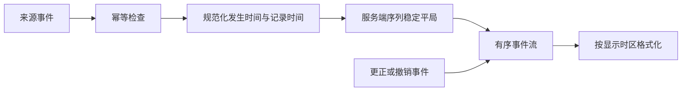

# Timeline 时间线

时间线按时间或因果顺序呈现事件，重点是发生了什么、何时发生、由谁触发以及对象怎样变化。

## 数据与任务边界

时间线组织的是不可变事件及其顺序证据，而不是可被覆盖的一组当前字段。必须区分业务发生时间、系统记录时间、来源顺序和因果引用，才能处理迟到、重复、更正和跨时区显示。

前置知识：ISO 8601 时间、时区与时间点、幂等键、稳定排序、事件溯源基础和有序列表语义。

## 数据模型

```json
{
  "objectId": "order-42",
  "displayTimeZone": "Asia/Shanghai",
  "events": [
    {
      "id": "evt-9",
      "occurredAt": "2026-07-18T02:00:00Z",
      "recordedAt": "2026-07-18T02:00:01Z",
      "type": "payment.captured",
      "actorId": "system-payment"
    }
  ]
}
```

事件 `id` 是本系统身份，来源事件还需要 `(source, sourceEventId)` 幂等键。`actorId` 表示主体身份而非显示名称；界面根据权限取得名称快照。示例还应扩展服务端序列与更正引用，才能覆盖同刻事件和审计。

## 工作机制

- 事件 ID、发生时间、记录时间、主体和类型分别保存。
- 客户端时间不作为跨主体排序的唯一依据。
- 相同时间使用服务端序列或因果关系稳定排序。
- 列表使用 ol，time 元素包含机器可读 datetime。
- 更正历史追加修正事件，不无审计重写。
- 聚合重复事件时保留数量、范围与展开明细。
- 时区是显示设置，不改变绝对时间点。
- 跨日和夏令时条件用真实时区规则格式化。




## 交互规则

- 默认顺序和反向顺序明确。
- 筛选不改变事件原始身份。
- 展开详情后返回保持事件位置。
- 实时新事件不强制把阅读位置拉到顶部。
- 复制事件链接包含稳定事件 ID。
- 无权限事件按规则隐藏或概括，不破坏时间因果。

## Timeline 时间线状态

| 状态 | 专属行为 |
| --- | --- |
| 可用 | 事件时间、主体和类型齐全 |
| 实时新增 | 不强制移动阅读位置 |
| 时间不确定 | 标注来源与估计 |
| 重复事件 | 按sourceEventId去重 |
| 更正 | 追加修正事件 |
| 受限 | 概括或隐藏敏感事件 |

## 案例 1：订单展示支付、发货和退款事件

### 约束与输入

- 订单跨 UTC 与上海时区；支付回调可能延迟。
- 退款发生时间早于回调记录时间。

### 处理过程

1. 按 occurredAt 展示业务发生顺序，同时保留 recordedAt。
2. 每个事件显示主体、动作、结果与金额币种。
3. 回调重试按事件 ID 去重。
4. 退款修正以新事件关联原事件。
5. 导出包含 ISO 时间与显示时区。

### 失败分支

客户端本地时间参与排序，退款出现在支付前。修正为服务端事件时间和序列。

### 专属验证

- 让支付回调延迟 30 秒到达，业务发生顺序仍为支付后发货，调试视图能从记录时间看出延迟。
- 同一回调重试三次只生成一个支付事件，幂等命中记录保留来源事件键。
- 退款更正显示原金额、更正金额、原因与关联事件；原记录仍可审计但不再计入当前金额。
- 切换上海与 UTC 显示后事件 ID 和次序不变，导出同时包含 ISO 时间与显示时区。

## 案例 2：事故平台重建告警与响应过程

### 约束与输入

- 来自监控、聊天和部署系统；时钟可能漂移。
- 需要区分事实与人工注释。

### 处理过程

1. 导入事件保留 source 与 sourceEventId。
2. 统一记录接收时间并估计时钟偏差。
3. 自动事件和人工注释视觉与语义区分。
4. 筛选不改变原始事件顺序。
5. 报告引用稳定事件 ID。

### 失败分支

重复 webhook 生成三条部署事件。修正为 source + sourceEventId 唯一约束。

### 专属验证

- 对监控、聊天和部署各取两个事件，保存来源时间、接收时间与估计偏差，报告能解释采用的排序依据。
- 重放三次相同部署 webhook 后时间线只保留一个事实事件，人工注释不参与该幂等键。
- 两个来源无法证明先后关系时显示“顺序不确定”，不得通过相邻视觉位置宣称因果。
- 用户正在阅读历史告警时，新聊天事件只增加“1 条新事件”入口，不改变当前滚动锚点。

## 语义与键盘

- 时间线使用有序列表，每个事件先读事件标题，再读主体、绝对时间和详情。
- 可见时间按用户时区格式化，`time[datetime]` 保留带偏移量的机器可读值。
- 表示连接关系的轴线和圆点作为装饰，不进入可访问名称。
- 更正事件同时指向被更正记录；不能仅用删除线或颜色表达失效。
- 实时新增不移动当前阅读位置，由“有新事件”入口决定是否跳转。
- 复制事件链接以稳定事件 ID 定位，过滤和分页不能改变该身份。

## Timeline 时间线工程实现

### 1. 事件保存 occurredAt、recordedAt、source、sourceEventId 和服务端序列。

`occurredAt` 表示业务动作实际发生时间，`recordedAt` 表示系统接收或持久化时间；二者可用于计算摄取延迟。`source` 与 `sourceEventId` 组成跨源去重依据，服务端序列为相同时间戳提供稳定次序。

### 2. 排序优先业务发生时间，平局使用序列；记录时间用于调试延迟。

排序键应在服务端明确为 `(occurredAt, sequence)`，分页游标也包含这两个值，防止相同毫秒事件跨页重复或遗漏。迟到事件可以插入历史位置，但界面需要提示新增历史记录，不能让用户误以为它刚刚发生。

### 3. 用ol表达顺序，time datetime保存ISO时间。

每个事件作为 `li`，事件标题、主体和时间形成可连续阅读的 DOM 顺序。`time` 的可见文本可本地化为“7月18日 09:30”，`datetime` 保留带偏移量的机器可读时间；仅显示“3小时前”时还应提供绝对时间。

### 4. 客户端显示时区不改变绝对时间点。

存储和传输使用具有明确时区语义的时间值，显示层再按用户或业务时区格式化。同一事件切换时区只改变日期文字，不改变排序和持续时间；跨夏令时区间的持续时间应按时间点相减，不能直接减本地时钟读数。

### 5. 更正和撤销以新事件引用旧事件，保留审计。

更正事件包含被更正事件 ID、变更字段、原因和操作者；界面把旧值标记为已更正，并链接到新记录。撤销也应追加记录而非删除原事件，使权限审计、事故复盘和同步消费者能够重建完整历史。

### 6. 跨源导入先做幂等，再处理时钟偏差和因果关系。

接收端先以来源事件键执行唯一性约束，再写入规范化事件；重试同一 webhook 返回已有结果。来源时钟不可信时保留原始时间与接收时间，对必须满足的因果关系使用业务序列或前驱事件 ID，不能仅靠客户端时间猜测。

## Timeline 时间线调试

- 调整客户端时钟
- 重复发送webhook
- 相同毫秒写入多事件
- 跨DST显示
- 更正历史事件
- 实时新增时读屏阅读

调试记录每个事件的来源键、发生时间、记录时间、服务端序列和最终显示时区。对同一毫秒事件、迟到事件与更正事件重放排序，确认分页游标不会造成重复或遗漏，显示文字也能还原到原时间点。

## Timeline 时间线发布检查

- 排序可由服务端证据重建
- 发生与记录时间分开
- 重复事件不重复展示
- 修正不抹除历史
- 显示时区明确
- 新事件不抢阅读位置

失败注入包括 webhook 重复、客户端时钟快五分钟、同一毫秒并发写入、跨夏令时显示、历史事件迟到以及更正目标无权限。系统必须保留原始证据、稳定排序，并对不能确定的因果关系明确标注而非伪造顺序。

## 综合练习

实现订单与事故时间线，支持跨源去重、时区显示、人工注释和修正事件。

验收把订单系统与部署系统两类来源合并为可分页时间线，重复事件只出现一次，迟到事件可定位，更正不删除历史。切换三个时区后事件身份和排序不变，仅显示时间改变；实时新增不打断当前阅读。

## 事件字段

时间线事件不是一段拼接文本。至少保存：

| 字段 | 作用 |
| --- | --- |
| `eventId` | 全局或对象范围内稳定身份 |
| `type` | 受控事件类型 |
| `objectId` | 被改变的对象 |
| `actorId` | 人、系统或外部服务 |
| `occurredAt` | 业务事实发生时间 |
| `recordedAt` | 当前系统记录时间 |
| `source` | 事件来源系统 |
| `sourceEventId` | 来源侧幂等身份 |
| `sequence` | 同对象的稳定次序 |
| `payloadVersion` | 事件结构版本 |
| `visibility` | 可见范围 |
| `correctsEventId` | 更正关联 |

## 发生时间与记录时间

支付服务在 10:00:00 完成扣款，网络故障后于 10:03:00 才把回调送到订单服务：

```json
{
  "occurredAt": "2026-07-18T02:00:00Z",
  "recordedAt": "2026-07-18T02:03:00Z"
}
```

订单业务时间线可以按 `occurredAt` 展示；调试回调延迟需要 `recordedAt`。两者不能覆盖。

## 稳定排序

只按毫秒时间排序会出现并列。使用：

1. 业务发生时间；
2. 服务端对象序列；
3. 稳定事件 ID。

跨系统没有共同序列时，必须说明顺序不确定，不能伪造精确因果。

## 幂等与重复事件

来源 webhook 重试是正常行为。数据库使用：

```text
unique(source, sourceEventId)
```

接收重复事件时：

- 返回已处理结果；
- 不创建第二条时间线；
- 不重复发通知；
- 不重复更新统计；
- 保留重复接收的技术日志；
- 不改变原事件作者和时间。

## 更正与删除

审计型时间线不应直接编辑旧事件。

错误金额修正：

```json
{
  "eventId": "evt-correction-10",
  "type": "payment.amount-corrected",
  "correctsEventId": "evt-payment-9",
  "reason": "上游币种映射错误"
}
```

界面显示原事件与修正关系。删除敏感内容时，可净化 payload，但保留事件存在、执行主体、时间和净化依据，具体取决于法规与业务政策。

## 时区显示

存储绝对时间点时使用 UTC 或带偏移 ISO 时间。显示时区来自：

- 对象所在地；
- 组织设置；
- 用户偏好；
- 报告固定时区。

页面标题或筛选中说明使用的时区。仅显示“10:20”无法跨地区复盘。

逻辑日期事件如“账期 2026-07-18”可能不是时间点，不要强行在 UTC 午夜存储后造成前一天显示。

## 自动事件与人工注释

两类内容分开：

| 自动事件 | 人工注释 |
| --- | --- |
| 来自系统事实 | 来自人的解释 |
| 有来源事件 ID | 有作者身份 |
| 类型和 payload 受控 | 正文需净化 |
| 通常不可编辑 | 可按权限编辑或删除 |
| 可用于自动计算 | 不自动当作事实 |

事故复盘中，人工注释可以引用自动事件，但不能无痕改变事件时间。

## 实时新增

用户正在阅读历史事件时，新事件到达：

- 不强制滚动到顶部；
- 显示“有 3 条新事件”；
- 用户激活后插入；
- 保存当前锚点事件 ID；
- 插入后保持焦点；
- 读屏公告数量而不是逐条高频播报。

## Timeline 语义

使用有序列表表达事件顺序。每项包含标题、主体和 `<time datetime>`：

```html
<ol>
  <li>
    <h3>支付成功</h3>
    <p>系统支付服务</p>
    <time datetime="2026-07-18T02:00:00Z">
      2026-07-18 10:00（Asia/Shanghai）
    </time>
  </li>
</ol>
```

视觉轴线、圆点和连接线是装饰，不进入可访问名称。

## Timeline 专项失败注入

- 两个事件具有相同毫秒时间；
- 来源时钟快五分钟；
- 同一 webhook 重放三次；
- 修正事件先于原事件到达；
- 用户无权查看其中一条事件；
- 显示时区跨夏令时回拨；
- 实时事件在用户复制文本时到达；
- 事件 payload 使用旧版本；
- 来源系统暂时离线后批量补发；
- 人工注释包含危险 HTML。

## Timeline 筛选与分页

长时间线使用游标分页，游标包含排序时间、序列和事件 ID。筛选可以按事件类型、主体和来源，但不能改变事件原始身份。

从事件深链进入：

1. 校验当前权限；
2. 取得包含事件的时间窗口；
3. 加载必要的前后事件；
4. 把焦点放到事件标题；
5. 显示当前筛选与时区；
6. 事件被净化或删除时进入明确状态。

导出冻结对象、时间窗、时区、类型筛选和权限。报告中引用事件 ID，避免只引用会随语言改变的标题。

## Timeline 验收

- 订单事件能按服务端序列重建；
- 事故事件能区分自动事实与人工解释；
- 时钟偏差不会被伪装为精确因果；
- 重复回调只生成一条业务事件；
- 更正事件关联原事件；
- 新事件不会抢走阅读焦点；
- 读屏取得标题、主体和完整时间；
- 受限事件不泄露正文。

时间线指标应关注固定复盘任务是否能找到关键事件、识别主体并解释顺序。滚动深度和展开次数不能证明理解。记录零结果筛选、事件深链失效、时区切换和更正查看，但分析事件不保存人工注释正文。

## 来源

- [html.spec.whatwg.org — Timeline 时间线相关规范](https://html.spec.whatwg.org/multipage/text-level-semantics.html#the-time-element)（访问日期：2026-07-18）
- [www.w3.org — Timeline 时间线相关规范](https://www.w3.org/TR/WCAG22/)（访问日期：2026-07-18）
- [design-system.service.gov.uk — Timeline 时间线相关规范](https://design-system.service.gov.uk/components/timeline/)（访问日期：2026-07-18）
