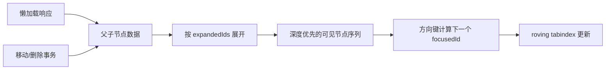

# Tree 树形数据

Tree 展示可展开父子层级，并用方向键在节点间移动。层级导航只有在实现完整 Tree View 模型时才使用 tree 角色。

## 数据与任务边界

Tree 适用于用户需要理解并操作父子层级的场景。它同时维护结构、展开集合、焦点、选中集合和加载状态；这些状态合并成一套方向键导航，但彼此不能替代。

前置知识：树与深度优先遍历、DOM 层级、ARIA tree/treeitem/group、roving tabindex 和异步请求竞态。

## 数据模型

```json
{
  "treeId": "org-tree",
  "focusedId": "team-payments",
  "selectedIds": [
    "team-payments"
  ],
  "nodes": [
    {
      "id": "team-payments",
      "parentId": "dept-engineering",
      "level": 3,
      "expanded": false,
      "hasChildren": true,
      "loadState": "idle"
    }
  ]
}
```

`focusedId` 只控制键盘焦点，`selectedIds` 表示业务选择；节点的 `expanded` 与 `loadState` 也分别保存。`level` 可由完整树结构计算，在虚拟化渲染中用于恢复 ARIA 层级，不能信任服务端返回的任意视觉缩进值。

## 工作机制

- treeitem 的焦点、选中、展开和当前对象分别表达。
- 父子关系由 DOM 嵌套或 aria-owns 建立，优先稳定 DOM。
- roving tabindex 只让一个节点在 Tab 序列。
- 右箭头展开或进入首个子节点，左箭头收起或返回父节点。
- Home/End 到首尾可见节点，字符导航按名称实现。
- 懒加载区分未加载、加载中、无子节点和失败。
- 移动节点前防止循环并检查目标权限。
- 不依赖拖拽提供移动按钮或对话框。




## 交互规则

- 单选与多选模型提前确定并在说明中表达。
- 展开不自动等于选中。
- 加载子节点时保留父节点焦点。
- 删除焦点节点后选择可预测相邻节点。
- 搜索结果进入树时展开祖先路径。
- 虚拟化必须维护 level、posinset 与 setsize。

## Tree 树形数据状态

| 状态 | 专属行为 |
| --- | --- |
| 折叠 | treeitem 的 aria-expanded=false，子节点不可达 |
| 展开 | 直接子节点可见，焦点仍可独立移动 |
| 懒加载 | 父节点保持焦点并表达 busy |
| 加载失败 | 仍标记 hasChildren，提供重试 |
| 选中 | aria-selected 与焦点分开 |
| 移动中 | 源、目标与禁止循环条件明确 |

## 案例 1：组织管理员选择部门

### 约束与输入

- 5 层组织；2,000 节点；按需加载。
- 选择一个部门作为成员归属。

### 处理过程

1. 使用单选 Tree View。
2. 展开部门时请求直接子节点。
3. 加载失败保留父节点和重试。
4. 选择只提交稳定部门 ID。
5. 提交前服务端检查部门仍存在且可分配。

### 失败分支

加载失败被当作无子节点，管理员错误判断部门为空。修正为独立 loadState 与错误子状态。

### 专属验证

- 对折叠部门按右箭头后先展开，第二次右箭头才进入首个子部门；左箭头按相反路径返回。
- 加载请求失败时父部门仍有 `aria-expanded` 能力和重试入口，不能被读成无子节点叶子。
- 方向键移动只改变 `focusedId`，空格或确定操作才改变待提交部门 `selectedIds`。
- 提交前删除已选部门，服务端拒绝旧 ID，树保留用户位置并要求重新选择合法部门。

## 案例 2：文件管理器浏览目录并移动对象

### 约束与输入

- 目录可深达 12 层；支持键盘移动文件。
- 目标目录可能是当前目录后代。

### 处理过程

1. 树负责目录导航，文件列表负责当前目录内容。
2. 移动对话框提供树选择与路径文本。
3. 服务端拒绝循环、只读目标与同名冲突。
4. 成功后更新源和目标版本。
5. 失败保留选择和原位置。

### 失败分支

拖拽是唯一移动方式且自动滚动失控。增加“移动到”按钮和完整键盘树选择。

### 专属验证

- 仅用键盘打开“移动到”，展开 12 层目录、选择目标并确认，流程不依赖拖拽或指针悬停。
- 选择源目录自身、其后代、只读目录和同名冲突目录时，服务端分别返回可解释拒绝原因。
- 移动期间目标目录版本变化时不覆盖并发结果；刷新相关分支后仍保留源文件焦点。
- 移动成功后源分支移除对象、目标分支增加对象，两个父目录版本和面包屑路径一致。

## 语义与键盘

- 整棵树只有一个 Tab 入口，进入后由方向键在可见 `treeitem` 间移动。
- 折叠父节点使用 `aria-expanded="false"`，叶子节点不提供 `aria-expanded`。
- 焦点、选中和当前对象分别表达；不能只用背景色合并三种状态。
- 节点名称包含可识别文本，展开按钮与节点本身的点击范围不能制造两个含义冲突的焦点。
- 懒加载期间父节点保持焦点并表达忙碌；错误后仍能从该节点重试。
- 拖拽移动必须有键盘可操作的“移动到”命令，并说明非法目标与权限拒绝。

## Tree 树形数据工程实现

### 1. 一个 treeitem 位于 tree 或 group 中；层级由嵌套 DOM 表达，只有虚拟化时补 aria-level、posinset 与 setsize。

非虚拟树优先让子节点容器嵌套在父 `treeitem` 所属结构中，使层级可由 DOM 推导。虚拟化移除祖先或兄弟后，组件才需要根据完整数据集计算层级、集合位置和集合大小，不能使用当前渲染窗口的索引。

### 2. roving tabindex 让一个 treeitem 为 0，其余为 -1。焦点 ID 与选中 ID 分开存储。

重新计算可见节点序列后，只有 `focusedId` 对应项进入 Tab 顺序。展开不等于选中，焦点移动也不应自动改变多选集合；若焦点节点因过滤或删除消失，按固定邻接规则选择新的可见焦点。

### 3. 右箭头展开折叠节点或进入首个子节点；左箭头收起或返回父节点；Home/End 到首尾可见节点。

键盘处理基于展开后的扁平可见序列，而不是完整节点数组。字符导航在可见同级或全部可见节点中的范围必须一致；可选的 `*` 展开兄弟行为只有实现完整时才公开，不能占用按键却不产生确定结果。

### 4. 懒加载状态包含 unknown/loading/loaded-empty/loaded/error，不能用 children.length===0 推断叶子。

展开 `unknown` 节点时进入 `loading` 并记录请求版本；响应只在节点仍存在且版本匹配时合并。失败状态保留展开入口和重试操作，`loaded-empty` 才能确认没有子节点；收起不必取消缓存，但迟到响应不能重新展开节点。

### 5. 移动节点前在服务端验证目标不是源或源的后代，并检查源写权限、目标写权限和名称冲突。

客户端可先阻止明显非法目标并显示原因，但最终约束必须在同一服务端事务中检查。移动成功后返回新父节点、位置和版本；版本冲突时重新拉取相关分支，不得在本地强行覆盖其他会话刚完成的结构变化。

### 6. 删除焦点节点后选择下一个可见兄弟、前一个兄弟或父节点，规则需固定。

删除确认前保存父节点和可见兄弟顺序；服务端成功后，优先聚焦原位置的下一兄弟，其次上一兄弟，最后父节点。若删除的是含子节点的分支，确认对话框必须说明影响范围，并在失败时保留原焦点与展开状态。

## Tree 树形数据调试

- 记录 focusedId、selectedIds、expandedIds 与 loadState。
- 展开后立即收起，让迟到响应返回。
- 让加载失败后重试并返回空集合。
- 搜索深层节点并检查祖先自动展开。
- 移动父节点到后代，确认前后端都拒绝。
- 在 2,000 节点下检查字符导航和虚拟化层级。

调试时逐按键记录 `focusedId`、`expandedIds`、`selectedIds` 和深度优先可见序列。懒加载还要记录节点请求版本与响应是否被接纳；移动操作保存源路径、目标路径、版本和服务端拒绝原因。

## Tree 树形数据发布检查

- 方向键模型与APG一致
- 展开、焦点和选中不会混用
- 加载失败不显示为叶子
- 删除节点后焦点位置可预测
- 移动操作有非拖拽等价方式
- 服务端阻止循环和越权

失败注入包括展开后立即收起、旧加载响应晚到、节点返回空集合、搜索命中深层节点、移动父节点到后代、删除当前焦点节点和移动期间权限撤销。树结构、焦点和展开集合必须在每个分支保持可重建。

## 综合练习

实现五层组织树：按需加载、单选、字符导航、搜索定位与失败重试；再增加“移动到”任务，验证循环、只读目标和同名冲突。

验收用至少四层、2,000 节点且部分懒加载的数据完成全套 APG 方向键、字符导航、搜索定位、移动和删除。任何时刻仅一个节点在 Tab 序列，服务器拒绝循环移动，删除节点后的焦点落点符合文中规则。

## Tree View 的程序化结构

一个 Tree View 包含：

- `tree`：整个树的复合控件；
- `treeitem`：可获得焦点的节点；
- `group`：某个父节点的直接子节点集合；
- `aria-expanded`：有子节点的节点当前是否展开；
- `aria-selected`：节点是否被选中；
- `aria-level`：逻辑层级；
- `aria-posinset`：在同级节点中的位置；
- `aria-setsize`：同级节点总数。

使用嵌套 DOM 时，浏览器可以从结构推导部分层级信息。虚拟化、动态所有权或不完整 DOM 需要应用维护位置属性。

不要同时把以下状态压入 `selected`：

| 状态 | 独立字段 |
| --- | --- |
| DOM 焦点 | `focusedId` |
| 业务选中 | `selectedIds` |
| 展开 | `expandedIds` |
| 当前页面 | `currentNodeId` |
| 加载 | `loadStateById` |
| 编辑 | `editingId` |

## Roving Tabindex

Tree 在页面 Tab 顺序中通常只有一个停靠点：

1. 当前焦点节点 `tabindex="0"`；
2. 其他节点 `tabindex="-1"`；
3. 方向键移动时同时更新两个节点；
4. DOM 重渲染后按稳定 ID 恢复；
5. 若节点被删除，按固定规则选择新焦点；
6. Tab 离开 Tree，Shift+Tab 返回最后焦点节点。

焦点节点不一定是选中节点。多选树中，方向键移动焦点不能清除已有选择。

## 键盘模型

| 按键 | 折叠父节点 | 展开父节点 | 叶子节点 |
| --- | --- | --- | --- |
| 右箭头 | 展开 | 进入首个子节点 | 无动作 |
| 左箭头 | 返回父节点 | 收起 | 返回父节点 |
| 下箭头 | 下一个可见节点 | 下一个可见节点 | 下一个可见节点 |
| 上箭头 | 上一个可见节点 | 上一个可见节点 | 上一个可见节点 |
| Home | 第一个可见节点 | 第一个可见节点 | 第一个可见节点 |
| End | 最后一个可见节点 | 最后一个可见节点 | 最后一个可见节点 |
| 字符 | 跳到匹配名称 | 跳到匹配名称 | 跳到匹配名称 |

Space 与 Enter 的行为取决于单选、多选、激活和导航模型，必须在控件说明与实现中一致。

## 懒加载状态

`children.length === 0` 不能证明节点是叶子。使用明确状态：

```json
{
  "nodeId": "department-42",
  "hasChildren": true,
  "loadState": "error",
  "childIds": [],
  "errorCode": "temporary-unavailable"
}
```

状态含义：

- `unknown`：尚不知道子节点；
- `loading`：请求进行中；
- `loaded`：子节点已取得；
- `loaded-empty`：权威结果确认没有子节点；
- `error`：请求失败，仍可能有子节点。

加载期间焦点留在父节点。成功后不自动把焦点移入子节点，除非用户再次执行进入动作。

乱序保护：

1. 展开节点并开始请求 A；
2. 用户收起节点；
3. 用户再次展开并开始请求 B；
4. B 先返回；
5. A 后返回；
6. 只有与当前请求版本一致的结果可写入。

## 节点移动

移动前计算：

- 源节点；
- 目标父节点；
- 源版本和目标版本；
- 源写权限与目标写权限；
- 目标是否是源本身；
- 目标是否位于源后代；
- 同名规则；
- 继承权限变化；
- 移动后深链与路径。

服务端必须使用事务或受控操作防止循环。客户端禁用后代目标只能减少误选，不能保证不变量。

移动结果：

- 成功后更新源旧父级与目标新父级；
- 当前路径和面包屑重新计算；
- 焦点进入移动后的节点；
- 原列表出现并发变化时按版本刷新；
- 失败保留源、目标和错误；
- 审计记录旧父级、新父级和主体。

## 大树与虚拟化

大树可以按需加载，不代表必须虚拟化。

虚拟化时验证：

- 可见节点的逻辑层级正确；
- `posinset` 与 `setsize` 来自完整同级集合；
- Page Up/Down 和 End 的含义明确；
- 搜索定位能加载并展开完整祖先链；
- 焦点节点不会因滚动窗口回收；
- 收起祖先后焦点返回该祖先；
- 屏幕阅读器能理解节点总量和位置。

无法满足时，使用搜索、分步浏览或分页子列表降低一次呈现规模。

## Tree 验收记录

记录每次方向键后的 `focusedId`、`expandedIds`、`selectedIds` 和可见节点序列。懒加载测试保存请求版本与父节点状态。移动测试保存源路径、目标路径、服务端拒绝原因和移动后焦点。只看截图无法证明 Tree View 键盘模型正确。

## 来源

- [www.w3.org — Tree 树形数据相关规范](https://www.w3.org/WAI/ARIA/apg/patterns/treeview/)（访问日期：2026-07-18）
- [www.w3.org — Tree 树形数据相关规范](https://www.w3.org/TR/wai-aria-1.2/#tree)（访问日期：2026-07-18）
- [www.w3.org — Tree 树形数据相关规范](https://www.w3.org/TR/WCAG22/)（访问日期：2026-07-18）
