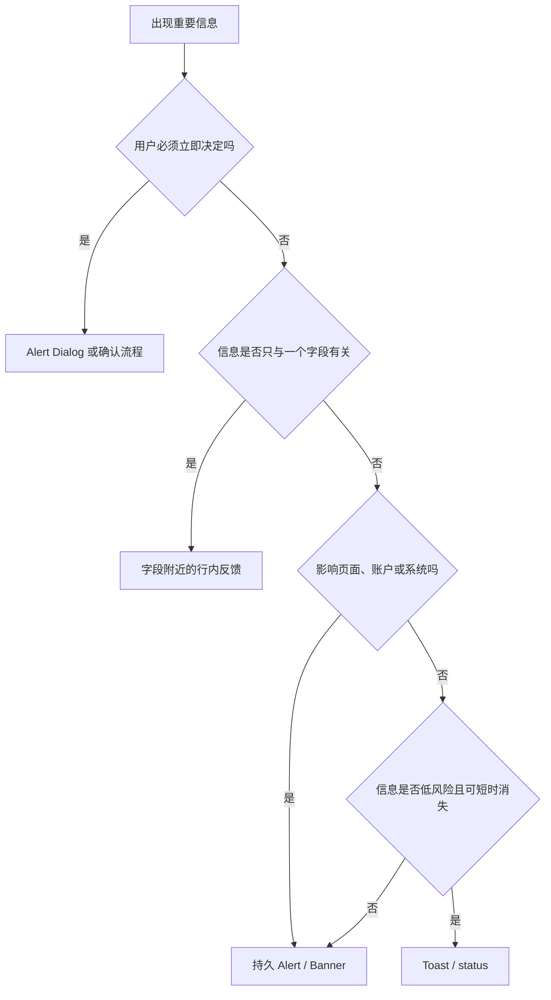
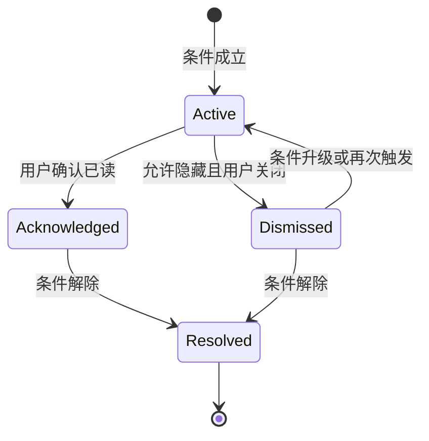

# Alert 警示

Alert 是重要且及时、但不一定要求用户立即作出决定的消息。

它的核心价值是让风险、错误或状态变化在当前任务中可被发现。

Alert 不是红色容器的名称。

是否构成 Alert 取决于消息的紧迫性、影响范围、持续时间和用户是否必须处理，而不是背景色、图标或组件名。

## Alert 的信息责任

一个有效 Alert 应回答：

1. 发生了什么。
2. 影响哪些对象、用户或操作。
3. 用户现在能否继续。
4. 用户需要做什么。
5. 状态何时解除，或从哪里查看后续结果。

例如：

> 当前修改尚未同步。可以继续编辑；网络恢复后将自动重试。

它比“网络错误”多提供了影响、当前能力和恢复方式。

## Alert、状态消息与对话框



| 模式 | 焦点 | 持续性 | 使用条件 |
| --- | --- | --- | --- |
| `role="alert"` | 不移动 | 由界面决定 | 动态出现的重要、及时消息 |
| `role="status"` | 不移动 | 由界面决定 | 不值得打断当前播报的普通结果 |
| Alert Dialog | 移入对话框 | 响应前保留 | 工作流必须暂停并由用户决策 |
| 行内错误 | 通常不移动 | 修正前保留 | 与字段或局部对象直接关联 |
| 页面 Banner | 通常不移动 | 条件解除前保留 | 页面、账户或系统范围状态 |

WAI-ARIA 的 `alert` role 是 live region。

它通常具有 assertive 的播报优先级，会中断辅助技术当前的语音输出。

因此不能把普通成功消息、提示文字或所有表单错误都标为 `alert`。

## 严重度不是单轴分类

很多设计系统使用 `info`、`success`、`warning`、`error`。

这些标签可以帮助统一视觉，但不足以决定行为。

至少还要判断：

- **紧迫性**：现在就需要知道，还是稍后查看即可。
- **影响范围**：字段、对象、页面、账户还是整个系统。
- **可恢复性**：自动恢复、用户可恢复、管理员处理或不可恢复。
- **阻断性**：用户能否继续当前任务。
- **持续性**：条件解除前是否必须保留。
- **可信度**：已确认事实、风险预测还是结果未知。

相同的 `error` 可能采用不同模式：

- 邮箱格式错误：字段行内错误。
- 保存失败且输入仍保留：编辑器顶部持久 Alert。
- 账户被冻结：账户级 Banner 和专门页面。
- 删除需要再次确认：Alert Dialog。

## 作用范围

Alert 应尽量靠近影响区域。

| 范围 | 位置 | 示例 |
| --- | --- | --- |
| 字段 | 标签、输入框附近 | 日期格式无效 |
| 组件 | 组件标题或内容上方 | 图表数据加载失败 |
| 页面 | 主标题之后 | 当前页面只读 |
| 账户 | 全局导航附近 | 订阅已到期 |
| 系统 | 全局持久区域 | 服务正在降级 |

把字段错误只放在页面顶部会增加定位成本。

把系统级故障重复放进每个卡片会产生噪声。

页面可以同时提供错误摘要和字段级说明，但两者要指向同一错误来源，不能形成两份不同状态。

## 消息结构

推荐结构：

`事实标题 + 影响说明 + 下一步 + 可选技术标识`

示例：

> 无法保存版本
>
> 另一位成员已更新此文档。比较两个版本后再决定保留哪些修改。
>
> [比较版本] [下载我的修改]

标题应描述事实，而不是使用抽象严重度：

- 推荐：“文件包含不受支持的列”
- 避免：“警告”
- 推荐：“你没有发布权限”
- 避免：“发生错误”

按钮应使用具体动词：

- 重新连接
- 查看失败项目
- 比较版本
- 下载未保存内容
- 申请权限

避免把“确定”作为所有 Alert 的动作。

## 持续与关闭

Alert 是否可关闭取决于事实是否仍然存在。

### 不应关闭

- 用户必须处理才能继续。
- 条件仍然影响页面正确性。
- 关闭后没有其他稳定入口。
- 消息涉及未保存数据或不可逆后果。
- 法律、账务或安全要求必须持续可见。

### 可以关闭

- 用户已理解，且信息可从通知中心回看。
- 消息只是一次性说明，不再影响后续操作。
- 条件仍存在但界面有稳定状态指示。
- 用户明确选择暂时隐藏，并能重新打开。

关闭 Alert 不等于解决问题。

系统需要分别保存：

- `conditionResolved`：条件是否已解除。
- `dismissedByUser`：用户是否隐藏消息。
- `acknowledgedAt`：用户是否确认已读。

不能用一个 `isVisible` 同时代表三个事实。

## 状态模型



状态升级需要重新评估是否播报。

例如网络从“延迟升高”变为“写入不可用”，即使用户关闭过旧 Alert，也应显示新的影响事实。

## 动态 Alert 的无障碍语义

`role="alert"` 用于重要且及时的动态消息。

关键行为：

- Alert 出现时通常不移动键盘焦点。
- 屏幕阅读器通常立即播报动态插入的 Alert。
- 页面加载前已经存在的静态 Alert 不一定会被自动播报。
- Alert 本身不具有需要键盘操作的默认交互。
- 需要用户立即响应时，应使用 Alert Dialog，而不是给普通 Alert 强行加焦点。

```html
<div id="urgent-message" role="alert"></div>
```

```js
const alertRegion = document.querySelector("#urgent-message");

function showUrgentMessage(message) {
  alertRegion.textContent = "";
  requestAnimationFrame(() => {
    alertRegion.textContent = message;
  });
}
```

不要反复播报没有变化的消息。

应用应按事件 ID 或条件版本去重，而不是每次组件重渲染都更新 live region。

## 静态 Alert

页面初始加载就存在的重要说明依然可以在视觉上使用 Alert 样式。

但如果内容不是动态出现，不能依赖 live region 自动播报。

静态消息需要：

- 放在合理的文档顺序。
- 使用清楚的标题。
- 与受影响区域建立可理解的位置关系。
- 进入页面时可以通过普通阅读顺序发现。
- 必要时把焦点放到页面主标题或错误摘要，而不是假设 `role="alert"` 会朗读。

## Alert 中的操作

Alert 可以包含按钮和链接，但这不会把整个 Alert 变成复合控件。

操作应进入正常 Tab 顺序。

要求：

- 操作标签说明结果。
- 主次关系与恢复优先级一致。
- 关闭按钮具有可访问名称。
- 操作完成后更新消息或移除条件。
- Alert 被移除时，焦点移动到合理位置。
- 自动刷新不能替换正在获得焦点的按钮。

```html
<section class="page-alert" aria-labelledby="sync-title">
  <h2 id="sync-title">修改尚未同步</h2>
  <p>本地内容已保留。网络恢复后可以重新同步。</p>
  <button type="button">重新连接</button>
  <a href="/sync/activity">查看同步记录</a>
</section>
```

静态持久 Alert 不一定需要 `role="alert"`。

普通结构和正确文档顺序通常更可预测。

## 颜色、图标和对比度

颜色不能作为唯一信息线索。

Alert 需要文本标题；图标只能辅助识别。

至少检查：

- 正文与背景的文本对比度。
- 图标、边框等非文本视觉线索的对比度。
- 高对比度模式中边界是否仍可见。
- 深色模式是否保持严重度区分。
- `forced-colors` 下是否丢失图标含义。
- 色觉差异下 `warning` 与 `error` 是否仍可通过文字区分。

装饰性图标应隐藏于辅助技术。

```html
<svg aria-hidden="true" focusable="false"><!-- warning icon --></svg>
```

## 表单错误摘要

提交表单后发现多个错误时，可以在表单顶部显示错误摘要。

摘要的责任是：

- 告知错误数量。
- 列出错误字段。
- 让用户快速移动到对应字段。
- 保留字段旁的具体错误说明。

```html
<section aria-labelledby="error-summary-title">
  <h2 id="error-summary-title">请修正 2 个问题</h2>
  <ul>
    <li><a href="#email">邮箱地址格式无效</a></li>
    <li><a href="#start-date">开始日期不能早于今天</a></li>
  </ul>
</section>
```

字段本身仍需关联错误：

```html
<label for="email">邮箱</label>
<input
  id="email"
  name="email"
  type="email"
  aria-invalid="true"
  aria-describedby="email-error"
>
<p id="email-error">请输入包含 @ 和域名的邮箱地址。</p>
```

错误摘要与字段错误不能只靠视觉位置关联。

## 服务端错误分类

界面不能把所有非 2xx 响应都显示为“系统繁忙”。

| 类别 | 用户事实 | 合适动作 |
| --- | --- | --- |
| 输入无效 | 某些数据不满足规则 | 定位字段并修正 |
| 未认证 | 会话无效 | 重新认证并安全恢复 |
| 无权限 | 当前主体不能执行 | 申请权限或返回 |
| 冲突 | 基础版本已变化 | 比较、刷新或合并 |
| 速率限制 | 请求过于频繁 | 告知可重试时间 |
| 服务不可用 | 服务暂时无法完成 | 保留工作并稍后重试 |
| 结果未知 | 客户端未收到最终结果 | 按操作 ID 查询 |

服务端返回内部堆栈、SQL 或云资源名称时，界面不能直接展示。

用户消息与诊断日志应通过相关 ID 连接。

## 案例一：文档版本冲突

### 场景

成员 A 打开 revision 31。

成员 B 完成编辑，服务端生成 revision 32。

成员 A 提交时，条件写入被拒绝。

### 错误事实

A 的修改没有写入服务端，但本地输入仍然存在。

### 设计

编辑器顶部显示持久 Alert：

> 此文档已有新版本
>
> 你的修改尚未保存。比较 revision 31 与 32 后再合并。
>
> [比较版本] [下载我的修改]

不能显示自动消失的 Toast。

不能只提供“刷新”，因为刷新可能丢失 A 的修改。

### 焦点

提交按钮触发冲突后：

- 保持或恢复到提交区域的合理位置。
- 通过 `role="alert"` 播报冲突摘要一次。
- 不自动把焦点移进 Alert。
- 用户可用正常 Tab 顺序进入“比较版本”。

### 恢复

1. 保存 A 的本地变更快照。
2. 取得 revision 32。
3. 展示差异。
4. 用户选择合并结果。
5. 以 revision 32 为条件重新提交。
6. 服务端确认 revision 33。
7. 移除冲突 Alert。

### 验收

- A 的内容不会因刷新丢失。
- Alert 明确说明“尚未保存”。
- 多次组件渲染只播报一次。
- 比较页面能返回编辑上下文。
- 权限在恢复期间变化时停止提交并更新 Alert。

## 案例二：服务降级

### 场景

报表服务读取正常，但导出任务出现大量超时。

### 范围

影响整个工作区的导出，不影响查看报表。

### 设计

全局导航下方显示持久 Banner：

> 报表导出延迟
>
> 可以继续查看和编辑报表。新导出任务可能需要更长时间。
>
> [查看服务状态]

“导出”按钮仍可使用时，按钮附近需要说明预计延迟。

如果新任务已经完全不可用，应禁用或阻止提交，并解释原因。

### 数据来源

Alert 由服务健康事件驱动，事件包含：

```json
{
  "incidentId": "inc_20260718_export",
  "service": "report-export",
  "impact": "degraded",
  "startedAt": "2026-07-18T08:20:00Z",
  "affectedCapabilities": ["create-export"],
  "unaffectedCapabilities": ["view-report", "edit-report"]
}
```

客户端不能用一个 `systemDown: true` 模糊所有能力。

### 更新

- 影响升级时更新标题和动作，并重新播报一次。
- 只有预计恢复时间确实来自事件系统时才显示。
- 恢复后显示短时状态消息，并移除持久 Banner。
- 事故历史保留在状态页。

### 验收

- 影响范围与实际能力一致。
- 用户不会误以为报表内容丢失。
- 多标签页不会重复播报同一 incident 版本。
- 状态页链接可用键盘访问。
- 事故解除后按钮状态和 Banner 同步恢复。

## 案例三：会话即将过期

### 场景

安全策略要求会话在无操作后结束。

用户正在填写长表单。

### 风险

会话结束可能使提交失败，但表单内容不一定允许保存到本地持久存储。

### 设计

过期前在页面范围显示重要 Alert：

> 会话将在 2 分钟后结束
>
> 继续会话以保留当前操作。
>
> [继续会话] [安全退出]

如果必须立即选择，且倒计时结束会造成重大数据损失，应使用 Alert Dialog。

### 时间

倒计时不能每秒通过 live region 播报。

只在有意义的节点更新，例如：

- 2 分钟
- 1 分钟
- 30 秒
- 已过期

视觉倒计时与服务端绝对过期时间对齐，不能只依赖客户端递减计时器。

### 验收

- 后台标签恢复时重新读取真实过期时间。
- “继续会话”失败时给出明确结果。
- 失效后不会重放旧的敏感请求。
- 屏幕阅读器不会被每秒播报打断。
- 安全退出会清除受保护的本地信息。

## 响应式布局

窄屏 Alert 应按阅读顺序重排：

1. 图标或严重度标识。
2. 标题。
3. 说明。
4. 主操作。
5. 次操作。
6. 关闭操作。

按钮过多时不应压缩成只有图标。

可以保留最重要的一至两个动作，把详细处理放入专门页面。

在 320 CSS px 等效宽度下，非二维内容不应要求双向滚动。

长 URL、错误编号和对象名称应允许换行。

## 国际化

Alert 文案通常比按钮更长。

需要测试：

- 德语等长度扩张。
- 中文与日文无空格换行。
- 阿拉伯语等 RTL 布局。
- 复数和数字格式。
- 本地化日期与时区。
- 用户生成对象名称。

不要把图标固定在 `left`，应使用 `inline-start`。

不要把严重度词直接拼接进句子，因为不同语言的语序可能不同。

## 安全边界

Alert 不能泄露用户无权知道的事实。

例如访问受限项目时：

- “你没有访问权限”通常比“项目 X 属于财务团队且由 Alice 创建”更安全。
- 密码重置应避免确认某个邮箱是否注册。
- 服务异常不能暴露内部主机、数据库表或密钥片段。

账户级安全 Alert 应来源于服务端权威状态，不能只依赖可被修改的客户端缓存。

关闭安全 Alert 的操作需要根据风险记录审计事件。

## 观测

可记录：

- Alert 条件发生次数。
- 首次显示到恢复的时长。
- 用户执行恢复动作的比例。
- 恢复成功率。
- 相同条件重复出现率。
- 用户关闭后条件仍存在的时长。
- 支持请求中无法理解影响范围的比例。
- 辅助技术测试中的重复播报缺陷。

不要把关闭率解释为“用户已经解决问题”。

关闭只说明用户触发了关闭动作。

## 测试矩阵

### 信息

- 标题说明事实。
- 影响范围准确。
- 是否可继续被明确说明。
- 恢复动作可执行。
- 未确认的结果不会写成成功或失败。

### 状态

- 条件解除与用户关闭分开存储。
- 状态升级会重新显示必要信息。
- 多标签页对同一事件正确去重。
- 页面刷新后持久 Alert 仍与权威状态一致。

### 焦点

- 动态 Alert 不无故抢焦点。
- Alert 操作进入正常 Tab 顺序。
- Alert 被移除后焦点不会丢失。
- Alert Dialog 只在必须响应时使用。

### 辅助技术

- 动态重要消息只播报一次。
- 普通信息不滥用 `alert`。
- 静态消息可通过文档顺序发现。
- 错误摘要链接到具体字段。
- 颜色与图标不是唯一线索。

### 故障

- 离线时说明本地与服务端状态。
- 超时不被误报为失败。
- 冲突保留用户输入。
- 权限变化后不继续旧操作。
- 日志有相关 ID，但界面不泄露内部详情。

## 综合练习

为“批量邀请 200 名成员”设计反馈。

服务端返回：

- 147 人邀请成功。
- 18 个邮箱格式无效。
- 21 人已经是成员。
- 9 人超出许可数量。
- 5 个请求结果未知。

要求：

1. 判断能否使用单一 Alert。
2. 设计页面摘要和逐项结果。
3. 明确哪些项目可修正、可重试或无需处理。
4. 为结果未知的项目设计对账流程。
5. 说明焦点初始位置和错误链接。
6. 给出重新提交时的选择范围。
7. 防止成功项目被重复邀请。

合理方案应使用持久结果区域，而不是只弹出“53 项失败”的 Toast。

摘要负责解释总体结果；每一类结果提供独立动作；重新提交只包含明确可重试项目。

## 来源

- [W3C WAI-ARIA APG：Alert Pattern](https://www.w3.org/WAI/ARIA/apg/patterns/alert/)（访问日期：2026-07-18）
- [W3C WAI-ARIA APG：Alert and Message Dialogs Pattern](https://www.w3.org/WAI/ARIA/apg/patterns/alertdialog/)（访问日期：2026-07-18）
- [W3C：WCAG 2.2，Error Identification](https://www.w3.org/TR/WCAG22/#error-identification)（访问日期：2026-07-18）
- [W3C：WCAG 2.2，Status Messages](https://www.w3.org/TR/WCAG22/#status-messages)（访问日期：2026-07-18）
- [W3C：WAI-ARIA 1.2，alert role](https://www.w3.org/TR/wai-aria-1.2/#alert)（访问日期：2026-07-18）
