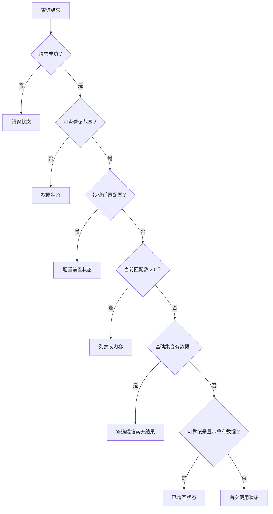
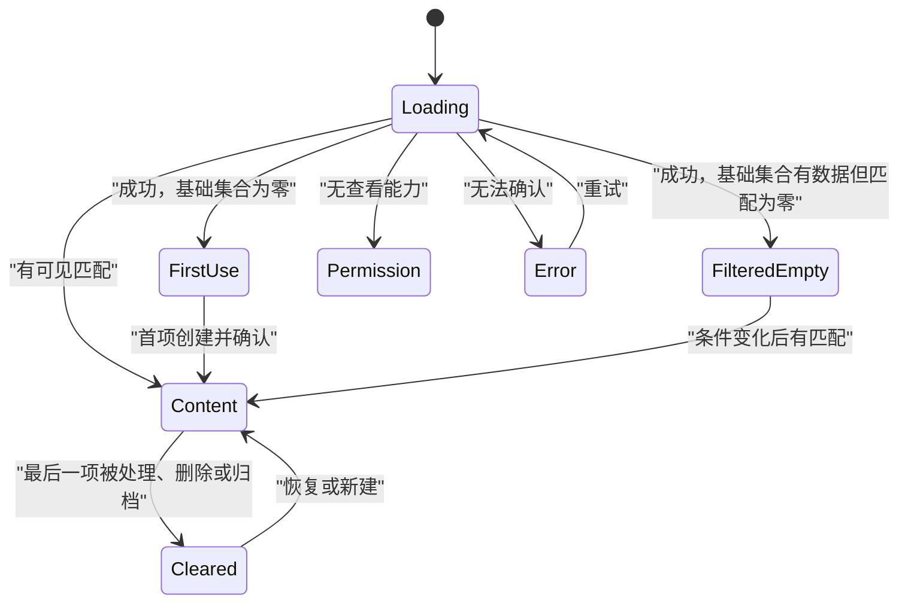

# Empty State 空状态

Empty State 是系统已经完成必要判断后，对“当前范围没有可展示数据”给出的界面状态。空状态必须说明空的是哪个范围、为什么为空、用户是否能改变结果，以及下一步会产生什么影响。

## 能力边界与前置知识

本文处理：

- 首次使用、筛选无结果、数据已清空和权限受限的不同语义。
- 从接口、缓存、权限与筛选条件推导可靠空状态。
- 选择创建、清除筛选、恢复、申请权限或返回等动作。
- 让动态零结果对辅助技术可感知。
- 避免把加载、错误、未授权和索引延迟误画成“没有数据”。

前置知识：

- 能定义集合范围、筛选条件和权限模型。
- 能区分服务器权威数据、客户端缓存和搜索索引。
- 理解空状态不是装饰插图，而是数据状态的结果。

## “零条记录”不足以决定界面

相同的 `items.length === 0` 可能来自完全不同原因：

| 原因 | 实际事实 | 合理下一步 |
| --- | --- | --- |
| 首次使用 | 范围内从未创建对象 | 创建、导入或了解对象 |
| 筛选无结果 | 基础集合可能有数据，当前条件无匹配 | 清除或修改筛选 |
| 搜索无结果 | 查询完成且无可见匹配 | 改词、清除范围、浏览分类 |
| 用户已清空 | 对象曾存在，现已删除、归档或处理完 | 查看归档、恢复或创建 |
| 权限受限 | 对象可能存在，但当前主体不可见 | 申请权限或切换范围 |
| 上游尚未配置 | 当前对象依赖前置设置 | 完成配置 |
| 索引未同步 | 权威集合有数据，检索副本暂时无结果 | 显示同步状态或回退查询 |
| 请求失败 | 系统无法确认集合 | 错误与重试 |
| 仍在加载 | 结果尚未确定 | 加载反馈 |

如果后端只返回空数组，前端无法可靠区分这些状态。需要额外的计数、能力和数据新鲜度契约。

## 空状态判定模型

设：

- `R`：请求是否成功。
- `A`：当前主体是否有查看该范围的能力。
- `B`：未应用当前筛选时，基础集合是否有可见数据。
- `M`：当前筛选匹配数量。
- `H`：是否有“曾存在后被清空”的可靠历史。
- `P`：是否缺少必要前置配置。

判定顺序：

权限判断先于数据存在性。否则“0 个项目”可能向无权限用户暗示组织真的没有项目，或让用户误以为需要创建重复对象。

## 四类核心空状态

以下四类状态都表现为零条可见记录，但进入条件、主要操作和退出方式不同。

### 首次使用

### 定义

当前可见范围尚未建立任何对象，且用户具备创建或导入能力。首次使用状态主要解释对象用途和建立第一份有效数据的路径。

应包含：

- 明确范围：“这个项目还没有环境变量。”
- 对象带来的直接结果：“添加后，部署可从受控配置读取值。”
- 一个主要起步操作。
- 若存在导入、模板或连接外部来源，按实际优先级提供。
- 用户无创建权限时，不显示不可执行的主按钮。

不应包含：

- 空泛欢迎语。
- 与当前任务无关的功能营销。
- 多个同等强度操作让用户重新做产品规划。
- 假示例冒充真实数据。

### 创建后的退出条件

创建操作成功并且权威查询可读到对象后，退出空状态。仅前端乐观插入卡片时应标记待确认；写入失败需恢复空状态并保留输入。

### 筛选或搜索无结果

### 定义

基础集合中存在当前用户可见数据，但当前条件没有匹配项。用户已经投入了查询或筛选意图，因此空状态要保留条件并帮助修正。

应显示：

- 哪些条件造成当前范围。
- “0 个匹配结果”的明确结果。
- 清除全部筛选，以及可选的逐项移除。
- 搜索词拼写或范围调整建议，但不能假装知道用户意图。
- 当搜索索引存在延迟时，说明结果新鲜度或提供权威浏览路径。

筛选无结果不能把整个页面替换为首次使用插图；筛选控件必须留在原位。

### 动态结果消息

若结果在同一页面更新，没有页面导航，`“没有匹配结果”` 属于状态消息。应以可程序化方式呈现，使屏幕阅读器无需移动焦点也能获知变化。结果列表本身不是简短状态消息，仍按正常内容结构呈现。

### 已清空或完成

### 定义

集合曾有数据，现因用户操作、归档、处理完成或保留策略而为空。它与首次使用的区别在于用户需要确认“刚才的对象去了哪里”。

根据业务显示：

- “待处理队列已清空”可以是积极完成状态。
- “回收站为空”只需说明没有可恢复项目。
- 批量删除后说明删除范围、恢复期限与审计入口。
- 归档后提供“查看归档”，而不是要求重新创建。

“曾存在”必须来自可靠事件或集合状态，不能仅依赖本地 `hasVisited`。清除浏览器数据或换设备后，用户仍应得到正确状态。

### 权限受限

### 定义

当前主体不能查看目标集合，或只能看其中一部分。权限状态不是普通空状态，不能写“暂无数据”。

可显示的信息取决于泄露风险：

| 条件 | 可显示 | 不应显示 |
| --- | --- | --- |
| 用户知道组织和功能存在 | 功能名称、缺少的能力、申请渠道 | 受限对象名称与数量 |
| 对象存在性敏感 | 通用不可访问状态、返回路径 | 403 与 404 文案差异泄露存在性 |
| 可申请权限 | 申请对象、审批人类型、预计流程 | 承诺一定批准 |
| 角色切换可解决 | 当前身份与可切换范围 | 自动冒用更高权限 |

界面隐藏不构成授权。查询、计数、搜索建议和导出都必须在服务端按当前主体过滤。

## 数据契约

一个可区分空状态的集合响应可以包含：

| 字段 | 含义 | 边界 |
| --- | --- | --- |
| `items` | 当前页可见记录 | 经过授权和当前筛选 |
| `matching_count` | 当前筛选的可见匹配数 | 不能包含受限对象 |
| `base_visible_count` | 移除当前筛选后的可见数 | 仍受相同权限与范围约束 |
| `can_create` | 当前主体能否创建 | 服务端能力结果 |
| `can_import` | 能否导入 | 与创建可能不同 |
| `prerequisite` | 未满足的前置配置 | 只返回可安全披露的信息 |
| `collection_state` | active、cleared、archived 等 | 来自权威业务状态 |
| `data_as_of` | 数据或索引时间 | 检索副本可能需要 |
| `next_cursor` | 是否还有下一页 | 空页不等于整个集合空 |

分页请求返回空页但有前页数据，通常是游标过期、删除竞态或越界，不应切换整个集合为空。客户端需回到有效页或刷新游标。

## 空状态内容结构

### 标题

标题陈述当前事实，包含必要范围：

- “项目 Alpha 还没有部署环境。”
- “没有符合 3 个筛选条件的订单。”
- “待你审核的请求已处理完。”
- “你无权查看组织审计日志。”

避免“这里空空如也”“暂无相关内容”等无法区分原因的句子。

### 解释

只说明影响下一步的原因、范围或恢复条件。若用户不需要理解内部索引、队列或权限实现，不展示内部术语。

### 主要操作

主要操作必须能改变当前空状态：

- 首次使用：创建第一项。
- 筛选无结果：清除筛选。
- 已归档：查看归档。
- 缺少前置：完成配置。
- 权限受限：申请权限或返回。

“刷新”只在数据确实可能自行出现时有效，不能作为所有空状态的默认按钮。

### 次要入口

模板、导入、文档或联系管理员可以是次要入口。若用户无法执行任何改变，提供安全返回路径即可，不用制造不可操作按钮。

### 插图

插图不承担状态含义，且应有空文本替代。复杂插图会推低关键信息、增加下载和本地化成本。数据密集型产品常只需标题、说明和操作。

## 布局边界

空状态放在它所代表的范围内：

- 整页集合为空：位于页面主内容。
- 某一面板为空：只替换该面板内容，保留页面其他区域。
- 表格筛选无结果：保留表头、筛选和批量操作边界。
- 图表无数据：保留图表标题、时间范围和数据口径。
- 组合看板：各卡片独立说明，不用一个全页空状态覆盖有数据区域。

空状态不能让页面标题、导航和筛选突然消失，否则用户无法判断范围。

## 状态转换

转移由权威结果驱动。加载超时不应自动进入首次使用；客户端缓存失效也不等于已清空。

## 方案取舍

| 方案 | 适用条件 | 收益 | 风险 |
| --- | --- | --- | --- |
| 行内空状态 | 表格、卡片或面板局部为空 | 保留页面上下文 | 空间小，文案需简洁 |
| 整页起步状态 | 核心对象首次建立 | 能解释起步任务 | 容易变成功能营销 |
| 示例数据 | 学习型工具且明确标为示例 | 展示结构 | 可能污染真实分析或被误认为数据 |
| 模板库 | 对象创建有标准起点 | 降低首项配置成本 | 模板需版本和适用范围 |
| 直接创建表单 | 首项字段少、风险低 | 减少一次导航 | 复杂表单会压迫空状态 |
| 权限申请 | 有真实审批渠道 | 提供可执行恢复 | 不应泄露对象或承诺批准 |

## 案例一：知识库的首次使用与已清空

### 输入

团队知识库以空间为范围。空间所有者可以创建页面和导入 Markdown；编辑者只能创建；阅读者不能创建。页面可归档 30 天后删除。

空数组可能表示：

- 新空间从未有页面。
- 所有页面已归档。
- 阅读者只能看到未受限页面，而当前没有可见项。
- 查询服务失败。

### 数据与决策

服务端返回可见页面、可见归档数、创建能力、导入能力和空间生命周期。界面决策：

- 新空间所有者：标题“这个空间还没有页面”，主操作“创建页面”，次操作“导入 Markdown”。
- 新空间编辑者：只显示创建。
- 阅读者无可见页面：显示“你当前没有可访问的页面”，提供返回空间列表；不显示空间内受限页面数。
- 所有可见页面已归档：显示“当前页面已全部归档”，主操作“查看归档”。
- 请求失败：显示错误与重试，不显示首次使用。

### 创建流程

点击创建后进入具有稳定 URL 的编辑器。保存成功且查询能读到新页面后，列表退出空状态。若保存失败，编辑器保留标题与正文；不能回到空状态并丢失草稿。

导入完成但索引尚未更新时，空间使用权威列表读取或显示同步状态，不要先显示“导入成功”又立即回到“没有页面”。

### 验证

- 三种角色分别进入全新空间。
- 归档最后一页，确认转为“已全部归档”而非首次使用。
- 让导入成功但搜索索引延迟，检查列表与搜索状态。
- 让权限在页面打开期间被撤销。
- 使用键盘完成创建并返回，焦点进入新页面标题。
- 确认装饰插图不产生冗余朗读。

### 失败分支

若客户端用 `localStorage.hasCreatedPage` 判断已清空，换设备后会回到首次使用，且多人协作时状态不一致。历史语义应来自空间事件或权威集合状态，不来自单个浏览器。

## 案例二：订单筛选无结果

### 输入

订单页有状态、渠道、日期和金额筛选。基础集合有 48,000 条可见订单；用户选择“已退款、线下、过去 7 天、金额大于 5,000 元”后无结果。

### 界面

表格标题、筛选条、已选条件和表头保持可见。表体显示：

- “没有符合当前 4 个条件的订单。”
- 主操作“清除全部筛选”。
- 每个筛选 Chip 可单独移除。
- 日期范围明确显示，避免用户忘记时区与边界。

不显示“创建订单”，因为当前空只由筛选造成。也不自动扩大日期范围，这会改变用户查询而不告知。

### 动态更新

每次条件变化生成查询身份。旧响应晚到不能覆盖新条件。结果为零时，一条状态消息宣布完整语义，例如“没有符合当前筛选的订单”；随后焦点仍留在刚操作的筛选控件。

URL 保存非敏感筛选，以支持刷新和分享。包含客户姓名等敏感条件时，根据产品安全策略决定是否进入 URL。

### 验证

- 逐项移除筛选，确认何时出现结果。
- 快速改变日期和状态，制造响应乱序。
- 在下一页删除最后几条数据，检查空页恢复到有效页。
- 让查询超时，确认不会显示零结果。
- 屏幕阅读器能获知结果从 12 条变为 0 条，且不会把整个表格逐项播报。
- 320 CSS px 下筛选条件和清除操作仍可访问。

### 失败分支

如果 `base_visible_count` 由未授权的全组织总数计算，界面可能告诉低权限用户“有 48,000 条订单但你当前没有匹配”，泄露规模。基础计数必须在相同主体、组织范围和权限过滤后计算。

## 案例三：审计日志的权限状态

### 输入

审计日志仅组织所有者和合规角色可见。普通管理员能看到“审计日志”功能名称，但不能读取事件；存在性和事件数量敏感。

### 决策

普通管理员进入后显示“你无权查看组织审计日志”，说明需要“查看审计日志”能力，并提供组织内既定申请流程。界面不显示零事件、不显示最后更新时间，也不先请求日志后由前端丢弃。

服务端可根据隐藏存在性的安全策略，对直接资源请求返回 404；产品内已知功能入口则可显示通用权限页面。HTTP 状态与用户文案都必须服从泄露模型，不能仅为了视觉统一伪造 200 空数组。

### 验证

- 直接 URL、导航、搜索建议和浏览器缓存使用同一权限结果。
- 权限授予后重新查询，进入真实列表或真实首次空状态。
- 权限撤销后清除缓存数据，页面不短暂显示旧日志。
- 申请权限操作记录目标能力，不包含敏感日志内容。

### 失败分支

若前端先收到全部日志再隐藏表格，网络响应、缓存和分析脚本都可能泄露数据。空状态设计不能修复授权架构；服务端必须先过滤或拒绝。

## 无障碍与状态消息

- 空状态使用正常标题、段落和真实按钮或链接，不需要自定义 ARIA 角色。
- 页面导航到全新空页面时，文档标题和主标题说明范围。
- 同页筛选后出现零结果时，以 `status` 或等价机制宣布简短结果，不移动焦点。
- 权限或错误需要用户立即处理时，根据严重性和上下文选择错误模式，不把所有状态设为 assertive live region。
- 插图是装饰时使用空文本替代；有信息时正文必须表达同等事实。
- 操作顺序符合视觉与阅读顺序，200% 文本缩放下不重叠。

## 国际化与内容边界

- 数量使用本地化格式和正确复数规则。
- 日期范围明确时区和包含边界。
- 动作标签描述结果，如“清除筛选”，不用“好的”“继续”。
- 德语等长文本、中文无空格换行和从右到左布局都要验证。
- 不用带文化含义的插图表达成功、失败或权限。

## 观测与诊断

### 观测信号

按空状态原因分别统计：

- 首次使用到首项成功创建的比例和时间。
- 筛选无结果后清除、改单项、离开和再次搜索。
- 已清空状态进入归档、恢复或新建。
- 权限状态中的申请、返回和重复访问。
- 错误被误分类为零结果的监控告警。
- 空页、游标过期和索引延迟发生率。

不要把所有 Empty State 汇总成一个曝光事件。不同原因的合理行为完全不同。

### 调试顺序

1. 固定主体、组织、对象范围和权限。
2. 记录原始查询、当前筛选和游标。
3. 检查请求状态与响应新鲜度。
4. 对比匹配计数和同权限基础计数。
5. 检查前置配置与集合生命周期。
6. 检查客户端缓存是否覆盖权威结果。
7. 复测动态状态消息和焦点。

## 失败注入

1. 查询返回空数组但总数大于零。
2. 当前页数据全部被另一用户删除。
3. 权限在请求期间撤销。
4. 搜索索引延迟但权威数据存在。
5. 创建成功后列表查询暂时读不到。
6. 用户从多筛选 URL 直接进入。
7. 导入了一部分数据但后台任务失败。
8. 断网后应用仍有过期缓存。

每次确认界面没有把未知结果写成确定空。

## 综合练习：建立空状态决策系统

为一个同时支持创建、导入、筛选、归档和角色权限的集合页面交付：

1. 空状态原因枚举与判定顺序。
2. 服务端数据和能力契约。
3. 首次使用、筛选无结果、已清空、权限、错误和加载界面。
4. 每种状态的标题、说明、主操作和退出条件。
5. 并发删除、索引延迟、权限撤销与分页越界测试。
6. 无障碍状态消息与生产观测方案。

验收标准：

- `items.length === 0` 不是唯一判定条件。
- 无权限、错误和加载不会显示成“暂无数据”。
- 主要操作能直接改变当前空状态。
- 筛选条件和范围不会在零结果时消失。
- 计数、搜索建议和对象存在性遵守权限边界。
- 创建或恢复后由权威结果退出空状态。

## 来源

- [IBM Carbon Design System：Empty States](https://carbondesignsystem.com/patterns/empty-states-pattern/)（访问日期：2026-07-18）
- [W3C WAI：Understanding SC 4.1.3 Status Messages](https://www.w3.org/WAI/WCAG22/Understanding/status-messages.html)（访问日期：2026-07-18）
- [W3C WAI：Failure Example — Search Results Without a Status Role](https://www.w3.org/WAI/WCAG22/working-examples/failure-status-message/)（访问日期：2026-07-18）
- [RFC 9110：HTTP Semantics](https://www.rfc-editor.org/rfc/rfc9110.html)（访问日期：2026-07-18）
