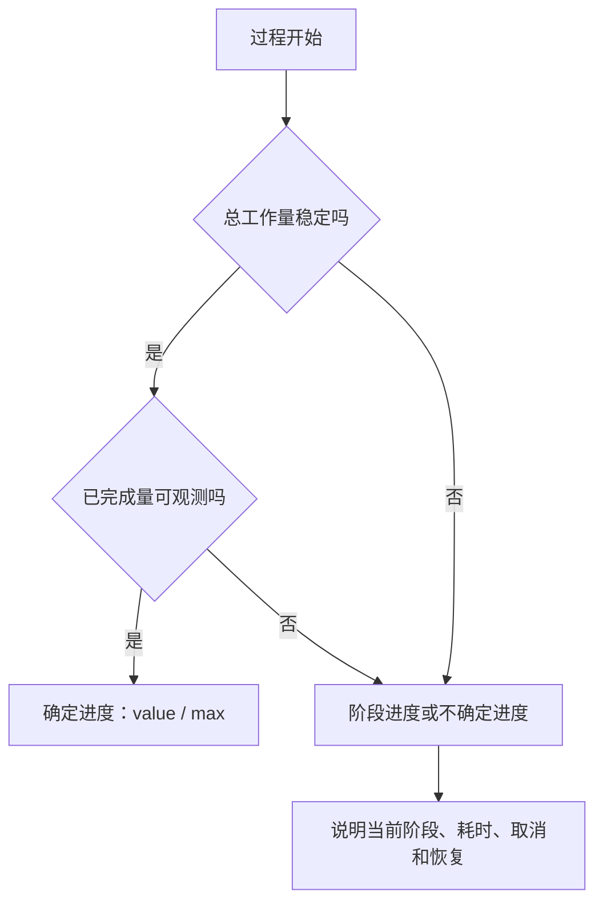
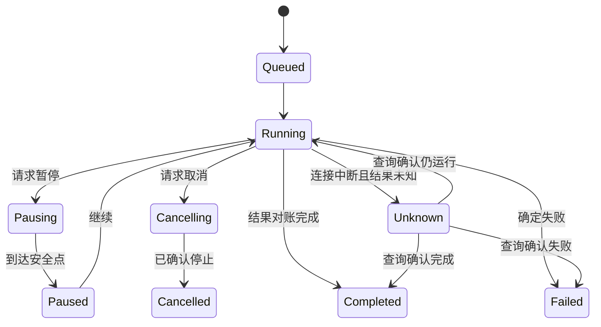

# Progress 进度

进度反馈说明一个已经开始的过程处于什么阶段、完成了多少、是否仍在运行，以及用户当前能做什么。

进度条只是进度反馈的一种视觉形式。

没有真实分母的动画条、无法恢复的百分比、已经卡死却仍循环的 Spinner，都不能提供可信进度。

## 进度反馈的基本问题

用户需要知道：

1. 操作是否已经开始。
2. 系统是否仍在工作。
3. 已完成多少。
4. 还需要多久或还剩多少工作。
5. 能否取消、离开或稍后返回。
6. 失败后从哪里继续。
7. 最终结果是否已经被权威系统确认。

不同任务不一定能回答全部问题。

设计必须区分“无法计算”与“没有实现”。

## 确定进度与不确定进度

### 确定进度

存在稳定总量和已完成量。

例如：

- 已上传字节 / 文件总字节。
- 已处理记录 / 冻结批次记录总数。
- 已完成步骤 / 固定步骤总数。

### 不确定进度

过程正在运行，但总工作量未知。

例如：

- 等待第三方审核。
- 搜索开放网络直到满足停止条件。
- 模型推理时间无法可靠预测。
- 服务启动时依赖数量动态变化。

不确定进度只能说明系统仍在工作和已经经过的阶段，不能伪造百分比。



## 真实分母

百分比成立需要：

- 分母定义明确。
- 分母在过程期间不会无说明地变化。
- 分子与分母使用相同单位。
- 已完成项不会回退或重复计算。
- 失败、跳过和取消项有独立语义。

批量任务可使用：

```text
total = succeeded + failed + skipped + running + pending
```

终态：

```text
running = 0
pending = 0
total = succeeded + failed + skipped
```

如果扫描过程中不断发现新文件，分母会增长。

这时应显示：

- 已发现对象数。
- 已处理对象数。
- 当前阶段。
- 分母仍在发现中。

不能显示从 82% 回退到 41% 却不解释原因。

## 进度的单位

选择能反映真实工作量的单位。

| 任务 | 较可信单位 | 容易误导的单位 |
| --- | --- | --- |
| 文件上传 | 字节 | 文件数 |
| 批量邮件 | 收件人结果数 | 已启动 worker 数 |
| 视频转码 | 媒体时间或编码帧 | 输入文件大小 |
| 数据迁移 | 已提交记录或分区 | 已读取记录 |
| 多步骤申请 | 已完成业务步骤 | 页面数量 |

一个 10 GB 文件和十个 1 KB 文件不能只按文件数等权计算上传进度。

## 阶段进度

复杂任务可拆成阶段：

1. 验证输入。
2. 上传。
3. 解析。
4. 执行。
5. 对账。
6. 生成结果。

阶段权重不能随意平均。

如果“上传”占 5 秒，“处理”占 20 分钟，把六阶段等权显示会让界面长期停在某个位置。

可选择：

- 每阶段独立显示，不合成总百分比。
- 使用历史数据估计权重，并标注估算。
- 只显示当前阶段与已用时间。

## 时间估计

剩余时间是估计，不是承诺。

最简单估计：

```text
rate = completedWork / elapsedTime
remaining = (totalWork - completedWork) / rate
```

它会受启动成本、缓存、并行度和长尾对象影响。

工程实现可以使用滑动窗口或指数平滑，减少剧烈跳动。

显示策略：

- 样本不足时不显示 ETA。
- 速率不稳定时使用范围：“约 2–4 分钟”。
- 进入长尾阶段时更新原因：“正在处理 3 个大文件”。
- 不使用虚假精度：“还需 1 分 17 秒”。
- 任务暂停时停止倒计时。

## 状态模型



`cancel-requested` 不等于 `cancelled`。

`request-sent` 不等于 `running`。

`worker-finished` 不等于业务结果已对账。

## 权威进度契约

长任务应返回稳定任务 ID：

```json
{
  "jobId": "import-20260718-731",
  "state": "running",
  "phase": "validate",
  "counts": {
    "total": 10000,
    "succeeded": 6120,
    "failed": 30,
    "skipped": 10,
    "running": 40,
    "pending": 3800
  },
  "revision": 48,
  "updatedAt": "2026-07-18T10:18:32Z",
  "canCancel": true,
  "canPause": false
}
```

关键字段：

- `jobId`：跨页面恢复同一任务。
- `state`：受控状态枚举。
- `phase`：当前业务阶段。
- `counts`：满足守恒关系。
- `revision`：忽略迟到状态。
- `updatedAt`：判断数据是否过期。
- 能力字段：说明当前允许的操作。

客户端不能仅靠本地计时器推断服务端进度。

## 轮询

轮询适合状态变化不要求毫秒级推送的任务。

需要定义：

- 首次间隔。
- 最大间隔。
- 抖动。
- 页面后台策略。
- 认证失效。
- 404 与任务过期。
- 429 的 `Retry-After`。
- 停止条件。

```js
async function pollJob(jobId, signal) {
  let delay = 1000;

  while (!signal.aborted) {
    const response = await fetch(`/api/jobs/${jobId}`, { signal });

    if (response.status === 429) {
      delay = readRetryAfter(response) ?? Math.min(delay * 2, 30000);
      await wait(delay, signal);
      continue;
    }

    if (!response.ok) throw new Error(`status_${response.status}`);

    const job = await response.json();
    renderIfNewer(job);

    if (["completed", "failed", "cancelled"].includes(job.state)) return;

    await wait(addJitter(delay), signal);
    delay = Math.min(delay * 1.5, 10000);
  }
}
```

示例省略的 `wait`、`addJitter` 和 `readRetryAfter` 需要由项目实现并测试。

轮询停止不能取消服务端任务。

它只停止当前客户端查询。

## Server-Sent Events 与 WebSocket

推送可以降低延迟，但仍需恢复契约。

连接断开后：

- 客户端保存最后事件 ID 或 revision。
- 重连时请求缺失事件或最新快照。
- 重复事件按 ID 去重。
- 迟到事件按 revision 丢弃。
- 终态由快照再次确认。

连接状态不能替代任务状态。

WebSocket 断开不表示任务失败；连接仍在也不表示 worker 健康。

## 页面刷新与跨设备恢复

任务 ID 应进入：

- URL。
-任务中心。
- 服务端当前用户任务列表。
- 必要时浏览器本地恢复索引。

刷新页面后：

1. 从 URL 或任务列表取得 ID。
2. 重新认证和授权。
3. 获取当前快照。
4. 恢复阶段、计数和可用动作。
5. 继续订阅或轮询。

不能依赖内存中的 Promise 或组件状态。

跨设备查看时，服务端根据当前权限过滤任务详情。

## 取消

取消需要回答：

- 哪些部分尚未开始。
- 哪些部分正在执行且不能立即停止。
- 已完成部分是否保留。
- 是否需要补偿。
- 取消何时生效。
- 能否再次继续。

用户点击取消后显示：

“正在停止新任务；已开始的 3 项仍在完成。”

服务端确认后才能显示：

“已取消。完成 72 项，未开始 25 项，3 项失败。”

不能立即把进度归零。

## 暂停

暂停适合有安全检查点的任务。

例如分片上传或批次处理可以在当前分片完成后暂停。

暂停状态需要保存：

- 检查点。
- 已提交结果。
- 依赖版本。
- 恢复令牌。
- 过期时间。
- 重新授权要求。

进程被冻结不等于业务可恢复。

如果系统不能持久化检查点，就不应提供“暂停”按钮。

## 失败与部分成功

进度过程中的失败至少分为：

- 单项失败，整体继续。
- 当前阶段失败，任务暂停。
- 系统失败，任务终止。
- 客户端断连，结果未知。

终态摘要不能只显示红色进度条。

需要说明：

- 成功数量。
- 失败数量。
- 跳过数量。
- 未知数量。
- 可重试范围。
- 结果明细入口。

如果部分成功合法，成功项目不能因重试全部任务而重复执行。

## HTML `<progress>`

确定进度优先使用原生 `<progress>`：

```html
<label for="upload-progress">上传产品视频</label>
<progress id="upload-progress" max="52428800" value="18350080">
  35%
</progress>
<p>已上传 17.5 MB，共 50 MB</p>
```

`value` 表示当前完成量，`max` 表示总量。

移除 `value` 可表示不确定进度：

```html
<label for="analysis-progress">正在分析日志</label>
<progress id="analysis-progress">正在分析</progress>
```

`<progress>` 表示任务进度，不表示普通测量值。

磁盘使用率、评分和容量应考虑 `<meter>` 或普通文本。

## ARIA `progressbar`

只有无法使用原生元素时，才实现自定义 `role="progressbar"`。

```html
<div
  role="progressbar"
  aria-labelledby="migration-label"
  aria-valuemin="0"
  aria-valuemax="10000"
  aria-valuenow="6120"
  aria-valuetext="已处理 6120 条，共 10000 条"
>
  <span style="width: 61.2%"></span>
</div>
```

要求：

- 提供可访问名称。
- 确定进度提供 `aria-valuenow`。
- 单位不直观时提供 `aria-valuetext`。
- 不确定进度省略 `aria-valuenow`。
- 视觉值与无障碍值一致。

进度条的子元素在无障碍树中可能被按 presentation 处理。

不要把需要朗读的复杂说明只放在进度条内部。

## 状态消息

进度变化需要可感知，但不能每 1% 都播报。

可以在以下时机更新 polite 状态：

- 任务开始。
- 阶段变化。
- 达到有意义的里程碑。
- 暂停或恢复。
- 出现需要处理的失败。
- 到达终态。

```html
<div role="status" id="job-status"></div>
```

示例播报：

- “导入已开始，共 10000 行。”
- “验证完成，开始写入。”
- “已完成 5000 行，共 10000 行。”
- “导入完成：成功 9960 行，失败 40 行。”

不要逐行播报。

## `aria-busy`

区域正在批量更新时可以使用 `aria-busy="true"`。

更新完成后必须恢复为 `false`。

```html
<section aria-busy="true" aria-describedby="report-progress">
  <div id="report-progress" role="status">正在刷新报表</div>
  <!-- stale report remains visible -->
</section>
```

`aria-busy` 不会自动提供完整进度或错误说明。

它只表示区域当前正在更新。

## 案例一：大文件分片上传

### 场景

用户上传 8.4 GB 视频。

网络间歇断开，浏览器可能刷新，服务端支持分片去重。

### 分母

总字节数固定为文件大小。

已上传量只能统计服务端确认的唯一分片字节，不能统计客户端已读取或已发送但未确认的字节。

### 契约

```json
{
  "uploadId": "upl-731",
  "file": {
    "name": "launch.mp4",
    "size": 9019431321,
    "sha256": "..."
  },
  "partSize": 8388608,
  "confirmedParts": [1, 2, 4],
  "expiresAt": "2026-07-20T10:00:00Z"
}
```

分片 3 超时后先查询确认状态。

不能直接把超时当作未上传并产生重复计费或覆盖。

### 界面

- 进度文本显示已确认字节与总字节。
- 速率使用最近窗口平滑。
- 网络断开显示“已暂停，已上传部分保留至 7 月 20 日 18:00”。
- 刷新后通过 `uploadId` 恢复。
- 完成所有分片后仍显示“正在校验文件”阶段。
- 服务端完成哈希和对象提交后才显示成功。

### 取消

取消请求删除未提交分片。

界面显示 `cancelling`，服务端确认清理后显示 `cancelled`。

本地原文件不受影响。

### 验收

- 断网恢复后进度不会回退或重复累计。
- 同一分片重复请求只确认一次。
- 刷新可恢复。
- 文件修改后不能沿用旧 uploadId。
- 进度条名称包含文件身份。
- 每 1% 不会产生一次屏幕阅读器播报。

## 案例二：商品目录导入

### 场景

CSV 有 120000 行。

任务包含上传、解析、校验、写入和索引刷新。

### 阶段

| 阶段 | 进度单位 | 终点 |
| --- | --- | --- |
| 上传 | 字节 | 服务端确认完整文件 |
| 解析 | 行 | 所有行产生解析结果 |
| 校验 | 行 | 所有候选得到规则结果 |
| 写入 | 合法对象 | 数据库事务提交 |
| 索引 | 分区 | 搜索索引达到目标 revision |

不能把五个阶段简单等权。

界面逐阶段显示当前分母，并在摘要中保留已完成阶段。

### 部分成功

写入结束：

- 118400 行成功。
- 1200 行字段无效。
- 300 行 SKU 冲突。
- 100 行权限受限。

最终状态为 `completed-with-errors`。

进度 100% 表示处理结束，不表示全部成功。

结果页必须说明各类数量和修正入口。

### 恢复

用户修正失败行后创建关联的新导入任务。

成功行不重复写入。

### 验收

- 每阶段计数满足守恒。
- 100% 后仍显示真实结果分类。
- 任务中心可以跨设备恢复。
- 页面后台不会继续高频轮询。
- 重新导入失败行不会重复成功对象。

## 案例三：AI 报告生成

### 场景

系统检索资料、构建上下文、生成草稿、运行检查并保存报告。

模型无法提供可信 token 到业务完成百分比。

### 设计

使用阶段状态：

1. 正在检索资料。
2. 正在整理证据。
3. 正在生成草稿。
4. 正在检查引用。
5. 正在保存。

同时显示：

- 已用时间。
- 预算上限。
- 当前可取消性。
- 已生成的安全预览。
- 任务中心入口。

不要使用每隔固定时间增长到 95% 的假进度条。

### 超时

客户端超时后按 task ID 查询。

如果任务仍运行，恢复订阅。

如果预算耗尽，显示部分产物、未完成检查和继续所需条件。

### 验收

- 阶段来自服务端事实。
- 取消后明确已产生的费用和产物。
- 引用检查失败不会显示“报告完成”。
- 页面关闭不丢失任务。
- 多个模型 worker 的内部完成数不直接冒充用户进度。

## 视觉与动效

进度动画应说明活动，而不是制造速度感。

要求：

- 确定进度的填充长度与真实数值一致。
- 进度不能只靠颜色区分暂停、失败和完成。
- 低速刷新不产生闪烁。
- `prefers-reduced-motion` 下减少循环位移动画。
- 高对比度模式仍可辨识轨道与填充。
- 文本数值不被进度条遮挡。

不要用无限旋转图标掩盖已经超时的任务。

达到异常阈值后，反馈应升级为：

- 仍在运行但比通常更慢。
- 已失去连接，正在确认结果。
- 已失败，可以重试。

## 性能与刷新频率

服务端每处理一条记录就推送一次会造成负载。

可以按以下条件聚合：

- 固定时间窗口。
- 数量里程碑。
- 阶段变化。
- 终态。
- 重要错误。

客户端渲染进度应避免：

- 每帧触发完整页面布局。
- 大量 DOM 节点同时更新。
- 后台标签继续动画。
- 更新 live region 与视觉进度使用相同高频率。

视觉可以每 250–1000 ms 平滑更新；无障碍播报频率更低。

## 安全与隐私

进度详情可能泄露：

- 文件名称。
- 成员数量。
- 项目规模。
- 内部阶段。
- 失败对象身份。
- 服务架构。

任务查询必须重新授权。

任务 ID 不能被当作访问凭据。

共享链接只显示授权范围内的信息。

日志记录 job ID、阶段、计数和错误类别，不记录敏感输入正文。

## 观测

需要观察：

- 排队时间。
- 各阶段耗时分布。
- 首次反馈延迟。
- 进度更新间隔。
- ETA 误差分布。
- 任务完成、失败、取消和未知比例。
- 断线恢复成功率。
- 长尾对象类型。
- 进度停滞告警。
- 重复任务与重复副作用。

平均耗时会隐藏长尾。

应同时查看 P50、P95、P99 和按数据规模分层的耗时。

## 测试清单

### 语义

- 总量与已完成量单位一致。
- 百分比来自真实分母。
- 100% 不等于全部成功。
- 结果未知与失败分开。
- 取消请求与取消完成分开。

### 恢复

- 页面刷新后按任务 ID 恢复。
- 跨设备按当前权限读取。
- 推送断开后补齐事件。
- 迟到 revision 不覆盖新状态。
- 任务过期有明确说明。

### 无障碍

- 进度具有可访问名称。
- 确定进度提供当前值。
- 不确定进度不伪造 `aria-valuenow`。
- 里程碑播报，不高频打断。
- 颜色不是唯一状态线索。
- 减少动态效果设置生效。

### 故障

- 网络断开显示已确认进度。
- 401 触发安全恢复，不丢任务身份。
- 403 停止展示无权详情。
- 429 遵守重试时间。
- 服务端 5xx 不清空已完成结果。
- 客户端超时先查询，不盲目重复。

### 数据

- 计数满足守恒。
- 重试不重复成功项目。
- 跳过项有明确原因。
- 分页结果基于稳定快照。
- 最终摘要可与数据库和审计对账。

## 综合练习

为“从 60 个代码仓库生成依赖安全报告”设计进度系统。

要求：

1. 定义仓库发现、克隆、解析、漏洞匹配和报告生成阶段。
2. 说明分母何时稳定。
3. 设计单仓库失败但整体继续的结果。
4. 设计仓库权限在执行期间被撤销的处理。
5. 设计暂停、取消和跨页面恢复。
6. 说明哪些里程碑需要播报。
7. 给出最终守恒关系。
8. 防止重试重复生成审计副作用。

结果需要同时表达过程完成度和业务结果，不能只交付一条从 0 到 100 的动画。

## 来源

- [WHATWG：HTML Living Standard，The progress element](https://html.spec.whatwg.org/multipage/form-elements.html#the-progress-element)（访问日期：2026-07-18）
- [W3C：WAI-ARIA 1.2，progressbar role](https://www.w3.org/TR/wai-aria-1.2/#progressbar)（访问日期：2026-07-18）
- [W3C：WCAG 2.2，Status Messages](https://www.w3.org/TR/WCAG22/#status-messages)（访问日期：2026-07-18）
- [W3C WAI：Understanding Status Messages](https://www.w3.org/WAI/WCAG22/Understanding/status-messages.html)（访问日期：2026-07-18）
- [MDN：ARIA progressbar role](https://developer.mozilla.org/en-US/docs/Web/Accessibility/ARIA/Reference/Roles/progressbar_role)（访问日期：2026-07-18）
