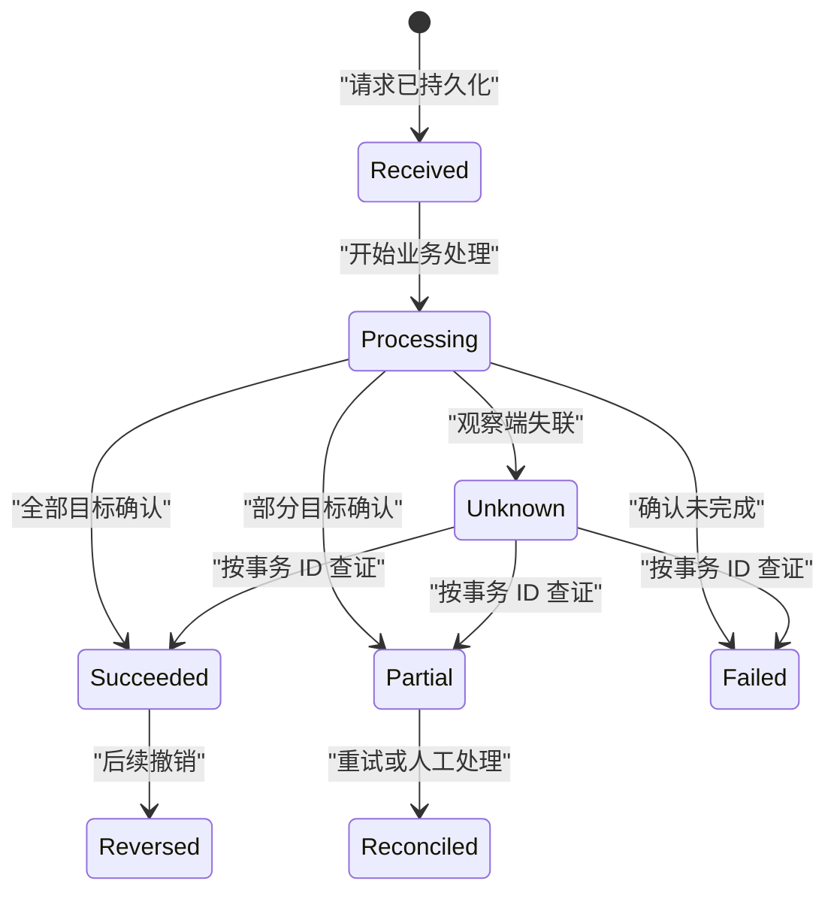
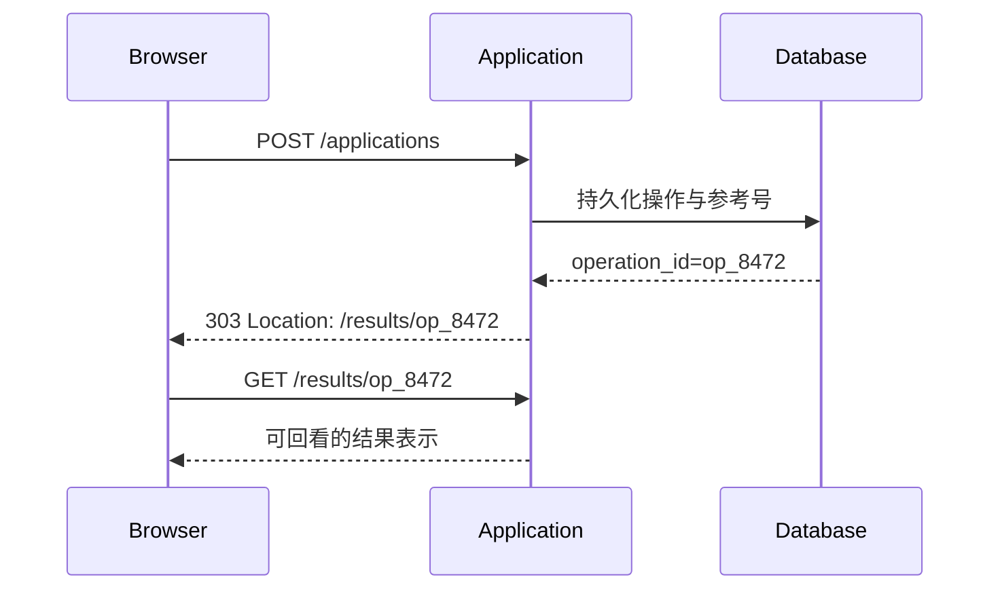

# Result Page 结果页

Result Page 是一次提交、事务或批处理产生可持久识别结果后，用于说明终态、证据、影响范围和下一步的页面。结果页不是放大的成功提示；它必须让用户在刷新、回看、支持排障和部分失败条件下仍能回答“系统实际完成了什么”。

## 能力边界与前置知识

本文处理：

- 区分已接收、处理中、成功、部分成功、失败与结果未知。
- 设计参考号、时间、金额、对象范围和凭证。
- 让结果拥有稳定 URL，并安全处理刷新与书签。
- 展示批量操作的逐项结果和恢复入口。
- 处理敏感信息、重复提交、并发状态变化与审计。

前置知识：

- 能定义业务事务的权威状态机。
- 理解 HTTP 请求成功不等于业务最终成功。
- 能区分客户端展示状态、服务端记录和外部系统确认。

Result Page 只展示已经由权威系统确定或明确标记为待定的结果。它不能根据按钮点击、客户端计时器或支付窗口关闭来推断成功。

## 结果页与相邻模式

| 模式 | 责任 | 是否适合保存和回看 |
| --- | --- | --- |
| Toast | 当前界面的轻量、短期反馈 | 否 |
| Alert | 页面范围内持续警示或状态 | 取决于页面 |
| Progress | 过程中的进度和控制 | 不是最终凭证 |
| Result Page | 一次事务或批处理的持久结果 | 是 |
| 对象详情 | 对象当前完整状态 | 是，但不一定保留提交时快照 |

事务结束后可从结果页链接到对象详情。两者不能混为一谈：结果页回答“这次操作产生了什么”，对象详情回答“对象现在是什么状态”。

## 先定义结果语义

### 已接收

系统已持久保存请求并分配参考号，但尚未完成业务处理。例如申请已提交、等待人工审核。标题应写“申请已提交”，不能写“申请已批准”。

### 成功

本次操作要求的所有原子结果都已确认。成功条件由业务不变量定义，例如转账账务分录已提交并获得支付网络确认，而不是接口返回 `200`。

### 部分成功

批量目标中部分项目完成、部分未完成，且已完成部分不会自动回滚。结果页需要汇总、逐项明细、失败原因和可安全重试范围。

### 失败

权威系统确认本次操作未产生要求的结果。若存在副作用，不能简单写“失败”；应说明已经发生的部分与恢复状态。

### 结果未知

客户端未能取得最终结果，但服务端可能已经处理，例如提交后网络中断。此时不能鼓励立即再次提交。页面应使用事务标识查询状态，或提供支持参考号。

### 已撤销或已取代

用户回看旧结果时，后续操作可能撤销或替代原结果。页面需要同时保留提交时事实与当前状态：

- “2026-07-18 10:32 已批准。”
- “该批准于 11:05 被撤销。”

不能改写历史结果，好像第一次操作从未发生。

## 权威状态机

`Unknown` 是观察状态，不一定是业务数据库中的终态。恢复时以同一个事务 ID 查询，不能创建新的事务来“确认”旧事务。

## 结果页的信息层级

### 1. 准确终态标题

标题包含结果和对象范围：

- “报税申报已提交。”
- “20 个策略中有 17 个已部署。”
- “无法确认转账结果。”

避免“完成”“操作成功”等缺少对象与阶段的文本。

### 2. 参考号

参考号用于用户沟通、支持检索和跨渠道确认。它应：

- 在事务持久化时生成。
- 在重试和刷新中保持不变。
- 可复制但不包含密码、访问令牌或可预测敏感标识。
- 与内部追踪 ID 分开；内部 trace ID 不一定适合公开。
- 在打印、PDF 和窄屏中完整可读。

### 3. 关键事实

根据业务选择：

| 事实 | 展示要求 | 风险 |
| --- | --- | --- |
| 时间 | 时区、精度和含义明确 | 客户端时间不可信 |
| 金额 | 币种、费用、税和总额分开 | 四舍五入口径不一致 |
| 主体 | 说明由谁或代表谁提交 | 隐私与越权 |
| 对象范围 | 单个、项目、组织或批量选择 | 选择在提交后变化 |
| 生效时间 | 立即、计划时间或待审批 | 不应把预计写成已发生 |
| 渠道 | Web、API、人工或外部支付 | 可能暴露内部实现 |
| 当前状态 | 与提交时结果分开 | 回看时可能已变化 |

### 4. 下一步

下一步回答：

- 还需要谁做什么。
- 预计或承诺的时间边界。
- 怎样查看进展或对象当前状态。
- 何时需要联系支持。
- 哪些部分可以安全重试。

下一步不是推荐内容列表。每个操作都要与结果直接相关。

### 5. 凭证

用户可能需要下载、打印、保存或稍后回看。凭证至少包含足以证明本次事务的非敏感事实，并有版本或生成时间。下载文件不是唯一凭证；结果页本身也应可访问。

## 提交结果与当前状态

结果页的数据模型应同时保留：

| 字段 | 含义 |
| --- | --- |
| `operation_id` | 本次操作稳定标识 |
| `submitted_at` | 服务端接收时间 |
| `submitted_by` | 经授权可展示的主体 |
| `input_snapshot` | 本次确认的关键输入快照 |
| `outcome` | 已接收、成功、部分成功、失败等 |
| `completed_at` | 达到该结果的时间 |
| `result_items` | 批量目标逐项结果 |
| `receipt_version` | 凭证格式与口径版本 |
| `current_resource_links` | 相关对象当前详情 |
| `superseded_by` | 后续撤销或替代操作 |

只读取对象当前状态会丢失提交时证据。例如订单地址之后被修改，旧付款凭证仍应显示当时确认的收货摘要，而不是把历史凭证动态改成新地址。

## 稳定 URL 与 Post/Redirect/Get

表单 `POST` 成功后，可以使用 `303 See Other` 把用户引导到可 `GET` 的结果资源：

这样刷新结果页执行 GET，不会重新提交原 POST。`303` 指向的是原操作的间接结果资源，不表示两个 URI 等价。

稳定 URL 还需：

- 服务端重新授权每次查看。
- 不在 URL 中放敏感凭证或完整个人信息。
- 对过期结果给出明确保留策略。
- 结果不存在时区分错误、过期与无权限，但遵守存在性泄露策略。
- 书签回看时展示提交时结果和必要的当前更新。

## 防止重复提交

结果页不能单独解决重复写入。提交端与服务端需要：

- 提交按钮在请求期间防止同一界面重复触发，但不能把禁用当成唯一防线。
- 客户端为一次逻辑操作生成幂等键或业务去重标识。
- 服务端在规定范围与期限内对同一标识返回同一操作结果。
- 超时后按标识查询，不立即创建新请求。
- 用户明确“再次执行”时生成新的操作 ID，并说明影响。

幂等边界要包含主体、操作类型和业务范围。全局复用一个键会把不同操作错误合并。

## 部分成功的表达

### 汇总

先给出可核对总数：

\[
Requested = Succeeded + Failed + Skipped + Unknown
\]

四项必须覆盖本次提交的所有目标。`Skipped` 表示未尝试，例如前置校验不通过；`Unknown` 表示无法确认，不得并入失败。

### 明细

逐项结果至少包含：

- 稳定对象标识或可识别名称。
- 本次目标动作。
- 结果类型。
- 用户可理解的原因。
- 是否可重试。
- 当前对象链接。

大量明细采用可下载机器可读文件时，页面仍要提供汇总和关键失败示例。下载不能成为唯一可访问结果。

### 重试

“重试失败项”必须从原结果中的可重试目标建立新操作，并记录父子关系。重试前重新授权和校验当前状态；某项可能已被他人修复，不应盲目重复。

## 凭证与证据边界

### 什么是凭证

凭证是对一次事务结果的可保存表示，不等于法律意义上的发票、电子签名或监管回执。是否具有法律效力由具体业务和法规决定，界面不能自行承诺。

### 完整性

凭证数据来自服务端结果快照。客户端打印当前 DOM 可能遗漏分页明细、时区、版本和隐藏字段。重要凭证宜由受控服务生成，并记录：

- operation ID。
- 生成时间。
- 结果版本。
- 适用主体。
- 内容哈希或签名机制（仅在业务确有验证需求时）。

### 隐私

- 屏幕默认遮蔽不必要的完整账号、证件和支付标识。
- 下载前再次授权，短期签名 URL 不进入分析系统。
- 共享链接不能仅凭不可猜 URL 获得访问。
- 打印样式隐藏导航，但保留结果标题、参考号和必要说明。
- 结果页缓存策略与敏感等级一致。

## 焦点与无障碍

### 页面导航后的焦点

提交后若导航到新结果页，更新文档标题，并把焦点移动到主内容标题或主内容起点。焦点顺序按结果、参考号、关键事实、下一步和操作展开。

不要自动把焦点送到“继续”按钮，这会跳过结果事实。复制参考号后焦点留在触发按钮。

### 语义

- 结果标题使用真实页面标题。
- 关键事实用列表、描述列表或表格表达，不用仅视觉卡片位置。
- 成功颜色和图标不是唯一结果线索。
- 部分成功的汇总和各项状态都有文本。
- 下载、查看详情、重试失败项使用能说明目标的名称。
- 状态后来在同页更新时，简短变化可使用状态消息；整页结果本身通过页面导航和标题被感知。

### 缩放与打印

在 200% 文本缩放、320 CSS px、长参考号和长对象名条件下，关键信息不截断。表格在窄屏可转为逐项卡片，但行列关系必须保持。打印与 PDF 验证分页、重复表头和链接目标。

## 案例一：年度申报“已提交”而非“已批准”

### 输入与业务状态

企业提交年度申报后，监管系统先返回接收号，随后进行格式校验和人工审核。提交成功只表示材料已接收，不表示申报获批。

权威状态：

- `received`：已持久接收并分配接收号。
- `needs-information`：需要补充材料。
- `under-review`：审核中。
- `accepted`：审核通过。
- `rejected`：审核拒绝。

### 结果页

首次结果标题：“年度申报已提交。”页面显示：

- 接收号。
- 服务器接收时间和时区。
- 申报主体与申报年度。
- 已接收文件清单及摘要。
- “接下来进行格式校验，结果会显示在申报详情中。”
- 下载提交凭证。
- 查看申报状态。

不显示“申报成功”或绿色“已批准”，因为业务终态尚未达到。

### 回看

结果 URL `/filings/results/op_8472` 可回看。两天后若进入补充材料状态，页面保留“当时已提交”事实，同时增加“当前需要补充材料”和指向申报详情的操作。

提交凭证保留当时文件名、摘要和接收号，不随用户后来替换草稿附件而改变。

### 验证

- 提交后断网再刷新，不产生第二份申报。
- 使用同一幂等键重试，返回同一 operation ID。
- 回看时权限已撤销，服务端拒绝访问并清理缓存内容。
- 申报进入补充材料状态后，历史与当前状态同时准确。
- PDF 凭证包含接收号、时间、主体和文件摘要。
- 键盘焦点先到结果标题，再到凭证和下一步。

### 失败分支

如果外部监管接口超时，但本地系统已保存并发送请求，页面不能写“提交失败，请重试”。应显示“正在确认提交结果”或“暂时无法确认”，使用 operation ID 对账；人工支持也用同一参考号查询。

## 案例二：云策略批量部署的部分成功

### 输入

管理员选择 20 个项目部署新的数据保留策略。提交时其中 2 个项目已被删除，1 个项目权限在执行中撤销，17 个项目完成部署。

结果分类：

| 类别 | 数量 | 含义 |
| --- | ---: | --- |
| 成功 | 17 | 策略版本已写入并确认 |
| 失败 | 1 | 执行时无部署权限 |
| 跳过 | 2 | 执行前目标已不存在 |
| 未知 | 0 | 所有目标均可确认 |

### 结果页结构

标题：“20 个项目中有 17 个已部署。”首先显示汇总和策略版本，再显示失败与跳过项。成功明细默认折叠但可下载完整清单。

“重试失败项”只包含权限失败的一个项目；已删除项目不能重试，提供返回项目列表。重试会创建新的 operation ID，并在新旧结果之间建立链接。

结果页保留提交时项目集合。用户随后新增项目不会自动加入这次结果。

### 工程契约

每个结果项包含目标 ID、目标名称快照、最终状态、问题类型、完成时间和当前资源链接。名称后来改变时，页面可以同时显示快照名称和当前名称，但不能丢失原目标身份。

HTTP 整体响应的成功码不能表达所有逐项业务结果。API 返回操作资源，客户端根据操作的结果项展示。若使用 RFC 9457 描述失败问题，问题类型必须是稳定 URI；不同批量问题如何汇总由该 API 明确定义，不能假设通用 HTTP 状态自动代表部分成功。

### 验证

- 汇总满足 `20 = 17 + 1 + 2 + 0`。
- 对成功项目读取权威策略版本。
- 重试只选择仍存在且当前可授权的目标。
- 下载清单与页面汇总使用同一结果快照。
- 回看旧结果时显示后续重试链接和最新调和状态。
- 1,000 个目标时分页不改变汇总，键盘可访问失败项。

### 失败分支

若结果页只显示“85% 成功”，管理员不知道哪些项目仍不合规，也无法安全重试。比例可以辅助概览，但必须提供计数、对象范围和逐项可执行结果。

## 案例三：转账请求后连接中断

### 输入

用户提交 8,000 元转账，服务端已创建交易并发送到账务系统，但响应在返回浏览器前中断。客户端只知道网络错误。

### 恢复

提交前已生成幂等键。页面进入“无法确认转账结果”，显示非敏感参考号并自动按 operation ID 查询。用户可离开页面，稍后从交易记录打开同一结果。

若最终确认成功，结果页显示金额、收款方遮蔽信息、费用、交易时间和电子回单。若确认失败，显示资金是否已解冻及可执行下一步。持续未知时提供联系支持边界，不提供“再次转账”主按钮。

### 验证

- 在持久化前、持久化后和外部确认后分别切断连接。
- 连续点击不会产生两个账务交易。
- 未知状态恢复为成功后只生成一个回单。
- 结果页面和交易详情金额、币种与费用一致。
- 敏感账号不进入 URL、日志和分析事件。

### 失败分支

如果网络错误立即跳回表单并保留可提交按钮，用户可能重复转账。应先查询原 operation ID；只有权威系统确认未创建交易，才允许明确发起新操作。

## 观测与审计

### 观测指标

- 结果页成功加载率，按 outcome 分组。
- 从 `unknown` 调和到各终态的比例与耗时。
- 重复提交被幂等机制命中的数量。
- 部分成功后重试的目标数与最终调和率。
- 凭证下载、回看和支持入口使用。
- 汇总与逐项结果不一致的校验告警。
- 结果 URL 的 403、404、过期和缓存错误。

高凭证下载率不代表页面好或坏，可能是业务要求。指标必须与任务需求解释。

### 审计记录

记录操作 ID、主体、目标范围、结果版本、关键状态转移和后续重试关系。审计数据不能依赖用户是否停留在结果页，也不能由前端埋点替代。

## 调试顺序

1. 取得 operation ID 和服务端接收时间。
2. 检查业务状态机与目标逐项结果。
3. 检查幂等键是否命中已有操作。
4. 对比提交快照、当前对象和凭证版本。
5. 检查 303 重定向与结果 GET 的授权。
6. 检查缓存、书签和过期行为。
7. 对比页面汇总、下载文件和权威记录。
8. 复测焦点、打印、窄屏和长文本。

## 失败注入

1. POST 持久化后丢失响应。
2. 结果页 GET 第一次返回超时。
3. 批量目标执行中权限撤销。
4. 回看时对象已改名、删除或撤销。
5. 凭证生成服务失败但业务操作成功。
6. 用户在两个标签页提交相同操作。
7. 结果页缓存被另一账户复用。
8. 部分成功汇总与明细故意不一致。

业务结果、凭证和展示可分别失败，界面必须准确说明是哪一层。

## 综合练习：设计可回看的复杂结果

为一个包含外部处理、批量目标和凭证下载的事务设计：

1. 权威状态机和每个终态的进入条件。
2. 操作资源、提交快照和逐项结果契约。
3. 303 重定向、稳定 URL、刷新和书签行为。
4. 成功、部分成功、失败、未知和已撤销页面。
5. 幂等、重试和父子操作关系。
6. 权限、隐私、打印与 PDF 验收。
7. 断网、并发、权限撤销和凭证失败注入。

验收标准：

- 页面标题不会把“已接收”写成“已批准”。
- 刷新结果页不会再次执行原操作。
- 未知状态不会鼓励无条件重复提交。
- 部分成功的汇总与逐项结果守恒。
- 提交时快照与对象当前状态明确分开。
- 参考号可用于支持查询且不包含敏感凭据。
- 回看、下载和重试都重新执行服务端授权。

## 来源

- [GOV.UK Design System：Confirmation Pages](https://design-system.service.gov.uk/patterns/confirmation-pages/)（访问日期：2026-07-18）
- [RFC 9110：HTTP Semantics — 303 See Other](https://www.rfc-editor.org/rfc/rfc9110.html#name-303-see-other)（访问日期：2026-07-18）
- [RFC 9457：Problem Details for HTTP APIs](https://www.rfc-editor.org/rfc/rfc9457.html)（访问日期：2026-07-18）
- [W3C WAI：Understanding SC 2.4.2 Page Titled](https://www.w3.org/WAI/WCAG22/Understanding/page-titled)（访问日期：2026-07-18）
- [W3C WAI：Understanding SC 2.4.3 Focus Order](https://www.w3.org/WAI/WCAG22/Understanding/focus-order.html)（访问日期：2026-07-18）
