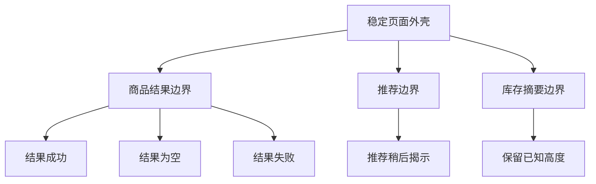
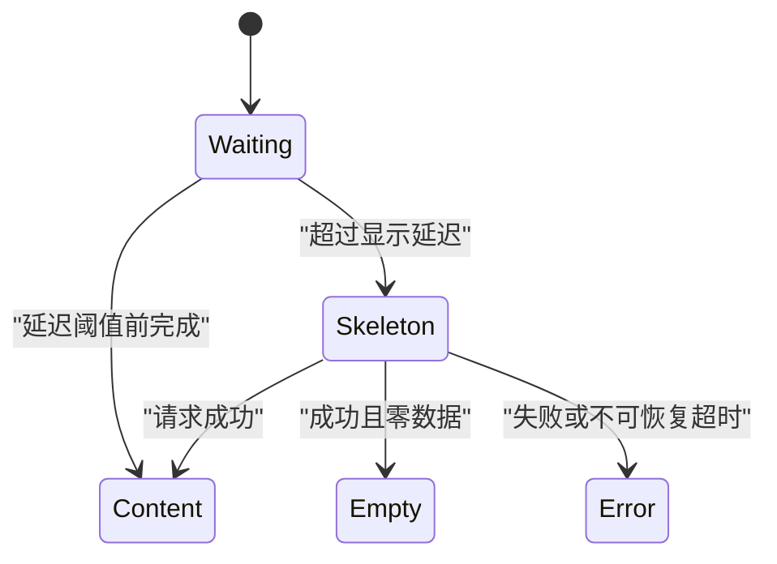

# Skeleton 骨架屏

Skeleton 是在内容首次可用前，用接近最终结构的非交互占位保留布局。它的核心责任是表达“哪些区域正在等待”和“最终结构大致在哪里”，不是伪造数据，也不是让慢请求看起来已经完成。

## 能力边界与前置知识

本文聚焦：

- 根据最终内容几何设计占位结构。
- 用加载边界控制整页、分区和列表项的揭示。
- 避免占位与真实内容替换造成布局偏移。
- 区分首次加载、后台刷新、延迟内容、错误和真实空状态。
- 验证感知性能、CLS、辅助技术反馈与慢网行为。

前置知识：

- 能把界面拆成稳定外壳、数据区域和独立请求。
- 理解请求可能成功、失败、取消、超时或返回零数据。
- 能检查响应式布局、DOM 顺序和焦点。

Skeleton 不负责显示可计算进度；已知完成比例属于 Progress。它也不应覆盖已经可用的旧数据，只因为后台正在刷新。

## Skeleton 的结构契约

一个骨架块需要对应最终内容中的真实区域：

| 骨架元素 | 对应内容 | 要保留的几何 | 不应伪造 |
| --- | --- | --- | --- |
| 媒体占位 | 图片、视频、图表画布 | 宽高比或稳定高度 | 具体图片含义 |
| 标题条 | 一行或两行标题 | 行高、最大宽度、换行上限 | 真实字数 |
| 正文条 | 摘要或元数据 | 行数范围与行距 | 文本内容 |
| 图标块 | 头像或对象图标 | 尺寸与对齐 | 身份、状态 |
| 列表行 | 表格或列表记录 | 行高、列结构 | 记录数量与值 |
| 操作区占位 | 加载后才知道是否存在的动作 | 空间边界 | 可点击按钮 |

骨架形状不获得焦点、不接受点击，也不应使用会让辅助技术误认为真实内容的名称。

## 加载边界决定揭示方式

### 页面外壳

标题、返回入口、导航、筛选条件和已知对象身份通常可先显示。将这些稳定内容也替换成骨架，会让用户失去位置，并在路由切换时看到整页闪烁。

### 分区边界

独立请求、独立失败、独立价值的区域可以分别揭示：

一个次要推荐接口失败，不应阻止主要商品结果显示。反过来，过细边界会让页面持续零碎闪动；每个字段一个骨架通常破坏整体阅读。

### 列表项边界

流式返回或分页加载时，可以逐组加入真实项。已显示项目保持稳定，不要因后续项目到达而重新变回占位。无限列表底部占位只表示正在取下一页，不能与“列表初次加载”混为一体。

### 数据依赖边界

若子区域必须依赖父数据才能正确解释，例如价格需要先确定币种，则父信息未到达前不应提前显示无上下文数值。边界按语义依赖划分，而不是按接口数量机械划分。

## 首次加载与后台刷新

| 状态 | 已有可信内容 | 推荐表现 |
| --- | --- | --- |
| 首次加载 | 没有 | 在目标区域使用 Skeleton |
| 路由切换到新对象 | 旧对象内容不适用于新对象 | 保留外壳，新对象数据区使用 Skeleton |
| 同一对象刷新 | 有 | 保留旧内容，标明正在刷新 |
| 筛选变更 | 旧结果可能仍有参考价值 | 根据任务选择保留旧结果或立即保留结果区几何 |
| 乐观更新 | 已显示预期结果 | 标记待确认，不用骨架覆盖 |
| 请求失败 | 没有可用新内容 | 转为错误与恢复操作 |
| 成功零数据 | 已确认集合为空 | 转为 Empty State |

已经显示过的内容再次被大面积骨架替换，会破坏视觉连续性，还可能使用户刚准备点击的目标消失。React Suspense 中，已经揭示的子树若再次挂起，最近的边界可能重新显示 `fallback`；需要通过边界位置、Transition 或保留旧值策略避免不必要回退。

## 占位几何与 CLS

### CLS 是什么

Cumulative Layout Shift 衡量页面生命周期中最大的意外布局偏移突发。单次布局偏移分数由受影响视口比例与移动距离比例相乘：

\[
LayoutShiftScore = ImpactFraction \times DistanceFraction
\]

CLS 是无单位分数，不是毫秒。骨架屏不保证低 CLS；若骨架高度与真实内容不同，替换时仍会推动后续内容。

### 为媒体保留尺寸

图片、视频和图表应在资源到达前具有可计算尺寸。优先使用：

- HTML 图片的固有 `width`、`height`。
- CSS `aspect-ratio`。
- 由组件契约确定的稳定卡片媒体比例。
- 图表容器的响应式高度规则。

如果实际媒体比例由数据决定，选择方案：

| 方案 | 条件 | 代价 |
| --- | --- | --- |
| 统一裁切比例 | 列表视觉一致，可接受裁切 | 必须定义裁切焦点 |
| 服务端先返回尺寸元数据 | 原图比例必须保留 | API 与缓存需携带尺寸 |
| 使用保守最小高度 | 内容高度有范围但不可提前知道 | 可能留下短暂空白 |
| 内容到达后在独立区域扩展 | 扩展不会推动关键操作 | 仍需检查偏移影响 |

### 文本高度不可精确伪造

标题长度、字体回退、本地化和用户文字缩放都会改变行数。可降低差异：

- 与真实内容使用相同容器宽度、字体尺寸和行高。
- 按产品内容约束设置相同的最大行数。
- 让最后一条骨架线较短，但不要随机到每次布局不同。
- 使用真实断点规则，不按设计稿固定像素复制。
- 测试最长语言、200% 文本缩放与自定义字体加载。

无法保证固定高度时，优先保持关键操作和已呈现内容不移动，而不是追求每个像素完全一致。

### 列表数量不是实际数据量

骨架行数只需要填充预期可视区域并表达结构。显示 20 行骨架并不承诺会有 20 条结果。分页大小、视口高度和行高共同决定合理数量。

## 出现时机与闪烁

极快请求若立即显示 Skeleton，可能产生一次无价值闪烁。可以设置短暂显示延迟，但规则必须可预测：

显示延迟只改变占位何时出现，不延迟真实内容。不要为了让动画“完整播放”强行等待数秒。若为避免一帧闪现设置最短展示时间，该时间应很短，并验证不会明显推迟可用内容。

延迟期间仍要保留目标区域尺寸，否则内容到达时发生偏移。

## 动画与视觉

Skeleton 可以静态显示，也可使用低强度脉冲或扫光表达仍在等待。动画不是必要条件。

动画约束：

- 不依赖动画方向表达信息。
- 遵循 `prefers-reduced-motion`，减少或停止非必要运动。
- 大面积高对比扫光会持续吸引注意，应限制范围与频率。
- 不为每个小块启动独立、不同相位的动画。
- 页面切到后台时无需继续高频更新。
- 骨架与背景具有可辨识边界，但不伪装成禁用控件。

不要把真实品牌图片、广告轮廓或假文字放入骨架，这会造成内容已知的错误暗示。

## 无障碍语义

### `aria-busy`

WAI-ARIA 的 `aria-busy="true"` 表示元素正在更新，辅助技术可以延后处理其内部变化；默认值为 `false`。它适合标记正在被整体替换的内容区域，但不能单独告诉用户在加载什么。

可用的组合：

- 稳定区域标题：“商品结果”。
- 区域在等待时设为 busy。
- 一条简短、非重复的状态文本：“正在加载商品。”
- 完成后清除 busy，并在必要时提供“24 件商品”或“没有匹配商品”的状态。

不要给每条骨架线添加 `aria-label="加载中"`，否则屏幕阅读器会听到大量重复项。装饰骨架应从可访问树中隐藏。

### 焦点

- 骨架内部没有可聚焦元素。
- 用户触发局部刷新后，焦点通常留在触发控件或当前任务位置。
- 路由进入新页面时，焦点管理由页面导航负责，不由骨架随意抢夺。
- 内容替换后不能把焦点元素删除；若必须替换，先定义合理的新焦点目标。
- 已可用的导航和取消操作不能因数据区 busy 而不可访问。

### 状态消息频率

首次显示、显著等待和最终结果需要反馈；每个子请求完成都播报会形成噪声。将同一边界内的多个 DOM 更新合并，在最终可用时清除 busy。

## Skeleton、Spinner 与保留旧内容

| 方式 | 适用条件 | 优点 | 风险 |
| --- | --- | --- | --- |
| Skeleton | 首次加载且最终结构可预测 | 保留几何与内容结构 | 错误尺寸制造偏移 |
| Spinner | 小区域、结构未知或短暂动作 | 实现简单，不伪造结构 | 无法表达占用空间 |
| 保留旧内容 | 同一对象后台刷新 | 连续可读、减少闪动 | 必须标出数据新鲜度 |
| 空白保留区 | 内容次要且尺寸已知 | 视觉安静 | 用户可能不知仍在加载 |
| 渐进揭示 | 区域相互独立 | 主要内容更早可用 | 过细会持续跳动 |

不要因“Skeleton 看起来更现代”选择它。若最终内容结构完全未知，例如服务器可能返回文档、视频或复杂审批表，通用骨架会给出错误预期。

## 工程状态模型

一个数据区域至少区分：

| 状态 | 数据 | 请求 | 界面 |
| --- | --- | --- | --- |
| `idle` | 无 | 未开始 | 不显示加载占位 |
| `delaying` | 无 | 进行中 | 保留空间，尚未显示 Skeleton |
| `initial-loading` | 无 | 进行中 | Skeleton 与加载状态 |
| `ready` | 有 | 无 | 真实内容 |
| `refreshing` | 有 | 进行中 | 旧内容与刷新标识 |
| `empty` | 已确认空 | 无 | 对应原因的空状态 |
| `error` | 无或旧数据 | 失败 | 错误、重试或旧数据 |
| `cancelled` | 无或旧数据 | 已取消 | 恢复到稳定状态 |

请求身份要与对象、筛选和版本绑定。用户快速切换筛选时，旧请求晚到不能覆盖新结果。Skeleton 只能反映当前有效请求，不能由任意 pending 布尔值控制。

## 案例一：商品搜索结果网格

### 输入与约束

搜索页在 1440 CSS px 下每行 4 张卡片，在 390 CSS px 下每行 2 张。商品图统一裁切为 4:3；标题最多两行；价格一行；促销标签可能不存在。搜索接口和推荐接口独立。

目标是：

- 首次搜索时保留结果区结构。
- 筛选切换时不让页面工具栏和分页跳动。
- 零结果、接口错误与仍在加载可区分。

### 边界设计

页面标题、查询词、筛选控件和排序保持真实。只有结果集合进入加载边界。推荐区在主要结果之后独立加载，不阻塞结果。

骨架卡片按真实断点使用相同网格：

- 媒体区固定 4:3。
- 标题区保留两行最大高度。
- 价格区保留一行。
- 促销标签不预留固定位置，因为真实布局把它叠加在媒体区，不会推动正文。

第一页骨架数量覆盖首个视口和一部分滚动区域；它不显示虚假商品数量。

### 状态转换

首次请求超过短延迟才显示骨架。用户改变筛选时，旧结果可保留但降低“当前筛选已应用”的暗示，并显示结果区正在更新；新结果到达后原位替换。

若筛选导致零结果，转为空状态并保留筛选栏。若请求失败，保留旧结果并标记它们对应上一次成功条件，同时提供重试；没有旧结果时显示区域级错误。

### 验证

- 在 Chrome DevTools 以慢速网络记录布局偏移。
- 检查骨架和真实卡片的媒体比例、行高与网格断点。
- 快速连续修改品牌、价格和排序，确认过期响应不会覆盖最新条件。
- 断网时区分旧数据与失败请求。
- 用键盘修改筛选，焦点不进入骨架，也不在结果替换时丢失。
- 屏幕阅读器只听到一次加载状态和一次最终结果数量。

### 失败分支

若商品标题本地化后从两行增长到三行，而真实卡片未限制行数，后续每一行网格都会被推移。修复应统一真实内容约束或采用能容纳三行的稳定布局，不是只把骨架做高来掩盖卡片规则不一致。

## 案例二：财务看板的分区加载

### 输入与约束

看板包含账户余额、现金流图、应收账款表和汇率更新时间。四个区域来自不同服务；余额是关键数据，汇率说明决定金额是否可比较。用户常在后台刷新时继续查看上次结果。

### 边界设计

首次进入：

- 页面标题、期间选择和币种显示真实。
- 余额摘要与汇率说明作为同一语义边界，避免先显示无汇率上下文的总额。
- 现金流图保留固定画布高度。
- 应收表按真实表头和行高保留结构，但表头文字保持可见。

后台刷新：

- 保留上次数据和“数据时间”。
- 各区域显示非阻塞刷新状态。
- 新数据只有在同一快照版本完整时一起提交，避免余额与汇率来自不同时间。

### 快照与显示规则

每个区域返回 `snapshot_id`、`as_of` 和状态。页面只把具有兼容快照的余额与汇率组合。现金流可以独立更新，但标题明确期间与数据时间。

首次加载失败时不显示虚假零值；旧快照存在时继续显示，并标明刷新失败。Skeleton 只用于没有任何可用快照的区域。

### 验证

- 分别延迟余额、汇率、图表和表格请求，检查边界是否符合语义依赖。
- 让汇率失败，确认余额不会被错误解释为最新换算值。
- 记录图表骨架替换后的 CLS 与滚动位置。
- 切换期间后立即切回，确认请求取消与快照身份。
- 检查旧数据状态在屏幕阅读器中包含数据时间，不只靠降低透明度。

### 失败分支

若所有分区共享一个全页 Skeleton，次要图表超时会遮住已到达的余额；若每个数值独立揭示，又会形成不同快照拼接。正确边界由数据一致性决定：余额与汇率成组，图表和表格可独立。

## 调试与观测

### 调试顺序

1. 固定视口、网络、缓存、字体和数据内容。
2. 记录哪个边界进入加载以及触发请求的身份。
3. 比较骨架和真实内容的盒模型、网格轨道、行高与媒体比例。
4. 在 Performance 面板查看 Layout Shift 记录和受影响元素。
5. 检查请求竞争、取消和旧响应覆盖。
6. 检查 busy 状态何时设置与清除。
7. 在错误、零数据和后台刷新条件下重复。

### 观测信号

- Skeleton 实际可见时长分布，而不是请求总时长。
- 首次加载与后台刷新分别统计。
- 从 Skeleton 到内容、空状态和错误的转换比例。
- 页面与关键区域的 CLS，按移动和桌面第 75 百分位观察。
- 请求完成到真实内容可交互的延迟。
- 骨架期间的重复点击、返回或离开。

骨架可见时长下降不一定表示性能改善，可能只是显示延迟变长。必须同时看真实内容可用时间。

## 失败注入

1. 让接口在显示延迟前后交替完成，检查闪烁。
2. 让图片尺寸元数据缺失。
3. 使用 40 字标题和 200% 文本缩放。
4. 让旧请求在新筛选后晚到。
5. 让一个分区成功、一个失败、一个持续等待。
6. 在 Skeleton 显示时浏览器后退再前进。
7. 开启减少动态效果偏好。
8. 让字体在内容替换后才加载。

每次检查布局、焦点、辅助技术状态、请求身份和最终数据是否一致。

## 综合练习：设计可验证的加载边界

为一个含列表、媒体和三个独立摘要区的页面交付：

1. 稳定外壳与加载边界图。
2. 每个骨架块到真实内容的几何映射。
3. 首次加载、刷新、零数据、错误和取消状态表。
4. 慢网、长文本、字体延迟与旧响应的失败注入结果。
5. CLS、骨架可见时长和内容可用时间观测方案。
6. 键盘、屏幕阅读器和减少动态效果验收。

验收标准：

- 每个占位都对应真实结构，不伪造可点击控件。
- 首次加载与后台刷新采用不同反馈。
- 骨架替换不会让关键操作发生意外位移。
- 空、错误和权限状态不会永久停留在 Skeleton。
- 过期响应不能覆盖当前对象或筛选。
- 装饰骨架不进入可访问树，区域 busy 状态能正确结束。

## 来源

- [web.dev：Cumulative Layout Shift (CLS)](https://web.dev/articles/cls)（访问日期：2026-07-18）
- [web.dev：Optimize Cumulative Layout Shift](https://web.dev/articles/optimize-cls)（访问日期：2026-07-18）
- [W3C：Accessible Rich Internet Applications 1.2 — `aria-busy`](https://www.w3.org/TR/wai-aria-1.2/#aria-busy)（访问日期：2026-07-18）
- [React：`<Suspense>`](https://react.dev/reference/react/Suspense)（访问日期：2026-07-18）
- [W3C：CSS Box Sizing Module Level 4](https://www.w3.org/TR/css-sizing-4/)（访问日期：2026-07-18）
