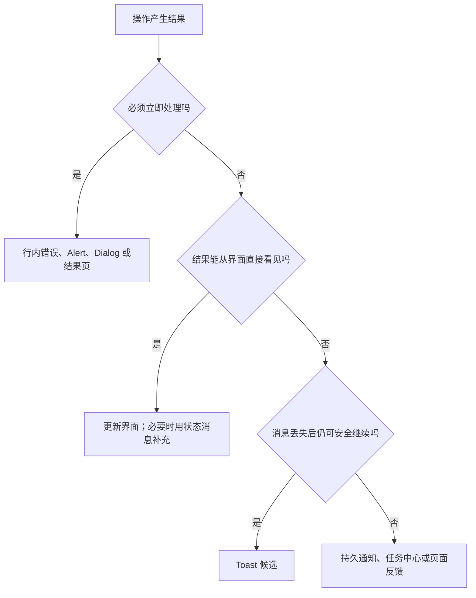
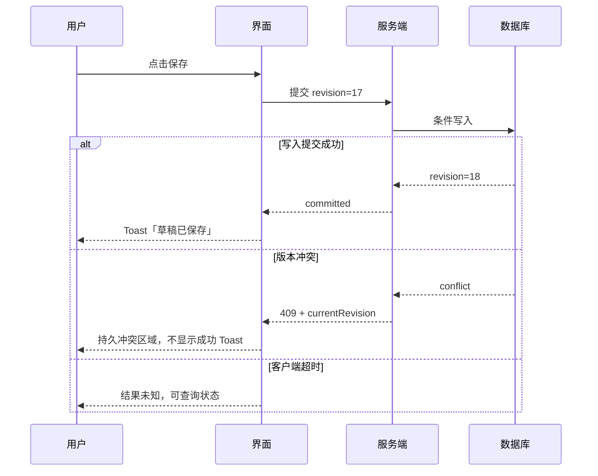
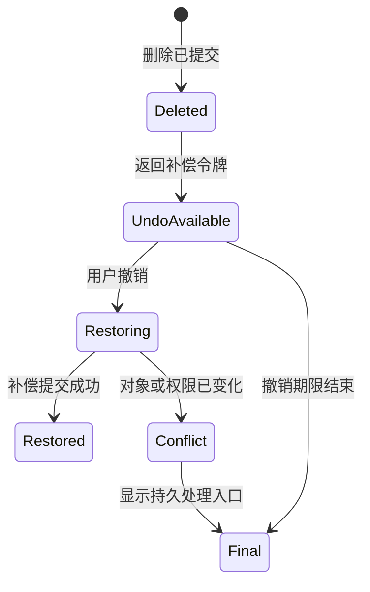

# Toast 轻提示

Toast 是覆盖在当前界面之上的短时状态消息。

它用于告知用户：刚才的低风险操作已经产生结果，但用户不需要因此离开当前任务。

典型内容包括：

- “链接已复制”
- “草稿已保存”
- “已加入收藏”
- “筛选条件已清除”

Toast 不是所有反馈的统一容器。

字段错误、权限阻断、不可逆失败、长任务进度和必须阅读的警告都不应只放在会自动消失的 Toast 中。

## Toast 解决的问题

用户执行操作后，需要判断三个事实：

1. 系统是否接收了操作。
2. 操作是否已经完成。
3. 用户是否需要继续处理。

Toast 适合第三个答案为“否”的情况。

如果用户必须修正问题、比较结果、等待任务、确认风险或保存证据，应使用更持久的反馈载体。



## 与相邻反馈模式的区别

| 模式 | 是否抢焦点 | 是否持久 | 主要用途 |
| --- | --- | --- | --- |
| Toast | 否 | 通常短时 | 非阻断操作结果 |
| 行内反馈 | 否 | 条件解除前保留 | 字段、对象或局部区域的问题 |
| Alert | 否 | 通常保留到被理解或条件解除 | 重要、及时但不要求立即决策的信息 |
| Alert Dialog | 是 | 用户响应前保留 | 必须立即确认或选择 |
| Banner | 否 | 通常持久 | 页面、账户或系统范围状态 |
| 任务中心 | 否 | 可回看 | 长任务、后台任务和历史结果 |
| 结果页 | 页面上下文变化 | 可回看 | 复杂结果、凭证或下一步操作 |

Toast 的外观可能与 Alert 相似，但语义不同。

WAI-ARIA 的 `alert` 表示重要且及时的消息，会以更高优先级播报；普通成功信息不应全部使用 `alert`。

## 适用条件

Toast 同时满足以下条件时才成立：

- 信息由刚发生的操作触发。
- 操作风险较低。
- 用户无需立即决策。
- 消息消失不会造成任务中断。
- 结果可以从对象状态、历史记录或其他入口再次确认。
- Toast 不承载唯一的修正入口。
- Toast 不承载必须复制保存的凭证。

适合的例子：

- 已复制到剪贴板。
- 当前页面的显示偏好已保存。
- 已撤销刚才的移动操作。
- 当前对象已加入收藏，收藏状态同时在按钮上更新。

不适合的例子：

- 信用卡扣款失败。
- 表单有五个字段错误。
- 文件导入耗时十分钟。
- 账户将在一分钟后被删除。
- 权限申请被拒绝且用户需要查看原因。
- 批量删除中有 37 项失败。

## 结果语义必须准确

Toast 文案必须对应权威事实。

“已保存”只能用于服务端确认写入成功，或明确表示“已保存到本机草稿”。

请求刚发送时只能使用：

- 正在保存
- 正在提交
- 已加入处理队列

不能因为按钮点击成功、HTTP 请求开始或乐观更新完成就显示“已保存”。



## 消息内容

一个可操作的 Toast 至少回答：

- 发生了什么。
- 影响了哪个对象或多少对象。
- 是否还有可选的下一步。

推荐结构：

`结果 + 对象/范围 + 可选动作`

示例：

- “链接已复制”
- “设计稿已移到「归档」”
- “已更新 12 个成员的角色”
- “评论已删除。撤销”

避免：

- “成功”
- “操作完成”
- “发生错误”
- “请稍后再试”

这些文案没有说明结果、范围和恢复方法。

## 严重度

Toast 常见严重度可以分为：

- `success`：低风险操作已完成。
- `info`：非阻断状态变化。
- `warning`：用户可继续，但存在值得注意的后果。
- `error`：低风险动作失败，且恢复入口在其他位置仍然存在。

严重度不能只靠颜色表示。

文本必须明确说明结果；图标可以辅助扫描，但不能承担唯一含义。

错误 Toast 的使用范围很窄。

如果错误与具体字段或对象有关，应在相应位置显示。

如果错误阻止当前任务，应使用持久反馈。

如果错误会造成数据损失，应保留输入并提供明确恢复路径。

## 持续时间

自动消失时间不能只按组件库默认值决定。

需要考虑：

- 文本长度。
- 用户阅读速度。
- 是否有操作按钮。
- 是否可能被屏幕放大。
- 用户是否正在使用屏幕阅读器。
- 页面是否同时出现其他变化。

没有操作的短消息可以自动消失。

包含“撤销”“查看”等操作时，应满足至少一个条件：

- 停留时间足以完成理解和操作。
- 鼠标悬停或键盘焦点进入后暂停计时。
- 同一操作可以在持久位置再次执行。
- 用户可以设置更长的显示时间。

重要消息不应依赖自动消失。

WAI-ARIA Alert Pattern 也要求避免让重要 Alert 过快消失；Toast 即使采用不同角色，也应遵守相同的信息可达性原则。

## 位置与布局

Toast 通常固定在视口边缘，但位置必须避开：

- 顶部导航和面包屑。
- 移动端安全区域。
- 虚拟键盘。
- 底部主操作。
- 浏览器缩放后的关键内容。
- 系统级通知和画中画控件。

移动端底部 Toast 需要使用安全区：

```css
.toast-region {
  position: fixed;
  inset-inline: 1rem;
  inset-block-end: calc(1rem + env(safe-area-inset-bottom));
  z-index: 30;
}
```

`z-index` 不应任意设为最大值。

Toast 不应覆盖 Modal、系统级阻断层或需要立即完成的确认操作。

## 多条消息的调度

连续操作可能产生大量结果。

如果每次保存、复制或移动都创建新 Toast，会造成视觉噪声和重复播报。

调度器需要定义：

- 最大可见数量。
- 队列长度上限。
- 同类消息合并规则。
- 高优先级是否可抢占。
- 被合并消息如何回看。
- 页面切换后队列是否保留。

建议策略：

| 情况 | 处理 |
| --- | --- |
| 相同结果连续发生 | 更新同一条消息或合并计数 |
| 后一个结果使前一个失效 | 替换前一条 |
| 多对象独立失败 | 转到持久结果列表 |
| 高优先级警告到达 | 保留或升级载体，不只是插队 |
| 页面即将卸载 | 不等待 Toast；先保证数据和导航正确 |

合并示例：

- 第一次：“文件已加入收藏”
- 连续操作后：“已将 5 个文件加入收藏”

## 焦点与键盘

普通 Toast 出现时不移动焦点。

状态消息的目的正是让用户在不改变上下文的情况下获知结果。

如果 Toast 包含按钮：

- 按钮必须能通过正常 `Tab` 顺序到达。
- 焦点进入后应暂停自动关闭。
- Toast 消失时不能让焦点落到 `body`。
- 若按钮在获得焦点时因超时被移除，应把焦点送到合理的后续位置。
- 不应创建需要方向键操作却没有复合控件语义的自定义键盘模型。

对于只有一条短消息的 Toast，通常不需要把容器设为可聚焦。

## 屏幕阅读器语义

WCAG 2.2 的 4.1.3 要求状态消息能够被程序化确定，而不需要获得焦点。

普通成功或信息消息可使用预先存在的 `role="status"` 区域。

`status` 隐含：

- `aria-live="polite"`
- `aria-atomic="true"`

重要且及时的错误可以使用 `role="alert"`，但不能把所有 Toast 都设为 `alert`。

`alert` 通常会中断当前播报；高频使用会让界面难以操作。

```html
<div class="toast-region" aria-label="操作状态">
  <div id="polite-status" role="status"></div>
  <div id="urgent-status" role="alert"></div>
</div>
```

Live region 最好在页面初始渲染时就存在。

先创建包含完整文本的节点，再同时添加 `aria-live`，部分浏览器与辅助技术组合可能不会播报。

更可靠的流程是：

1. 页面先渲染空的 live region。
2. 操作发生。
3. 更新该区域的文本内容。

不要同时在 `role="alert"` 上重复添加 `aria-live="assertive"`，因为部分组合可能产生重复播报。

## 可访问实现示例

```html
<section class="toast-layer" aria-label="状态通知">
  <div id="toast-status" role="status"></div>
</section>

<button id="copy-link" type="button">复制链接</button>
```

```js
const copyButton = document.querySelector("#copy-link");
const statusRegion = document.querySelector("#toast-status");

function announceStatus(message) {
  statusRegion.textContent = "";
  requestAnimationFrame(() => {
    statusRegion.textContent = message;
  });
}

copyButton.addEventListener("click", async () => {
  try {
    await navigator.clipboard.writeText(location.href);
    announceStatus("链接已复制");
  } catch {
    announceStatus("无法复制链接，请手动复制地址栏内容");
  }
});
```

失败消息中的“手动复制地址栏内容”是实际恢复路径。

如果页面提供可选中文本框，应把焦点管理交给用户，不应由错误 Toast 强制跳转。

## React 状态模型

Toast 队列至少需要稳定 ID、语义、创建时间、关闭策略和可选动作。

```ts
type ToastTone = "success" | "info" | "warning" | "error";

type ToastRecord = {
  id: string;
  dedupeKey?: string;
  tone: ToastTone;
  message: string;
  createdAt: number;
  expiresAt: number | null;
  action?: {
    label: string;
    run: () => Promise<void> | void;
  };
};
```

不要用数组下标作为 ID。

消息被替换、排序或关闭时，数组下标会改变，可能造成错误节点复用和播报混乱。

### 去重

`dedupeKey` 表示同一类可合并结果。

例如连续自动保存使用：

`draft-saved:${documentId}`

新的保存结果到达时更新原记录，不创建无限队列。

### 计时

计时器应由队列状态驱动，并在以下条件暂停：

- 页面进入后台。
- 用户指针停留在 Toast 上。
- Toast 内有键盘焦点。
- 用户启用了减少干扰或更长显示时间。

关闭只是移除消息，不应改变业务结果。

## 与乐观更新配合

乐观更新先改变本地界面，再等待服务端确认。

Toast 必须区分：

- 本地状态已更新。
- 服务端已经确认。
- 服务端拒绝，界面已回滚。
- 结果未知，正在对账。

示例：

1. 用户点击收藏。
2. 图标立即切换为已收藏。
3. 服务端确认后显示“已加入收藏”。
4. 服务端拒绝时回滚图标，并在按钮附近显示原因。

不能只弹出“收藏失败”，却让按钮仍保持已收藏状态。

## 撤销操作

Toast 常被用作撤销入口。

撤销不是把界面恢复到旧样子，而是执行一个真实的补偿操作。

必须定义：

- 可撤销期限。
- 原操作的稳定 ID。
- 撤销是否仍需要权限。
- 对象被其他人修改时如何处理。
- 撤销失败后的持久反馈。
- Toast 消失后是否仍可在活动记录中撤销。



高风险删除不应只依赖几秒钟的撤销 Toast。

## 案例一：复制分享链接

### 任务

用户在文档页复制当前分享链接，随后继续编辑文档。

### 权威结果

Clipboard API 的 Promise 成功完成。

### 设计

- 成功：“分享链接已复制”
- 失败：“无法复制。选择链接并手动复制”
- Toast 不获得焦点。
- 分享按钮的按下状态不被永久改变。
- 失败时页面同时显示可选择的链接文本。

### 边界

- 页面不在安全上下文中，Clipboard API 可能不可用。
- 浏览器权限可能拒绝写入。
- 复制内容可能因分享权限变化而失效。
- “复制成功”不等于收件人一定能访问文档。

因此不能显示“分享成功”。

### 验收

- 键盘触发后仍停留在分享按钮。
- 屏幕阅读器能听到一次成功消息。
- 连续触发十次不会产生十次重叠播报。
- 权限拒绝时能访问手动复制入口。
- Toast 消失不移除页面中的分享链接。

## 案例二：自动保存产品需求

### 任务

编辑器每隔一段时间保存草稿。

### 状态

| 状态 | 页面反馈 |
| --- | --- |
| 本地有未提交修改 | 标题附近显示“未保存” |
| 请求进行中 | 标题附近显示“正在保存” |
| 服务端提交成功 | 状态改为“已保存”；可选显示一次 Toast |
| 版本冲突 | 编辑区上方显示持久冲突面板 |
| 离线 | 显示“已保存在此设备，尚未同步” |
| 结果未知 | 显示“正在确认保存结果” |

频繁自动保存不应每次都弹 Toast。

稳定的标题附近状态比连续 Toast 更适合。

Toast 只可用于首次明确完成、从离线恢复同步等值得提醒的转折。

### 竞态

请求 A 保存 revision 17。

用户继续编辑后，请求 B 保存 revision 18。

如果 B 先返回，A 后返回，不能让 A 的旧成功消息把页面状态改回 revision 18 之前。

客户端必须按文档 ID 和请求代次核对结果。

### 验收

- 迟到响应不会覆盖新状态。
- 断网时不显示“已同步”。
- 刷新后以服务端 revision 为准。
- 冲突信息不会自动消失。
- 高频保存不会让 live region 持续打断阅读。

## 案例三：删除评论并撤销

### 任务

用户删除自己的一条普通评论。

### 设计

服务端完成软删除并返回补偿令牌。

Toast 显示：

“评论已删除” + “撤销”

撤销按钮发送补偿令牌，不是重新创建一条相似评论。

### 失败分支

- 评论已被管理员永久删除。
- 用户权限在撤销前被收回。
- 撤销期限已结束。
- 网络超时，补偿结果未知。

这些失败都需要在评论区域或活动记录中给出持久结果。

不能让 Toast 消失后只剩不确定状态。

### 验收

- 删除请求重复发送只产生一次逻辑删除。
- 撤销请求重复发送只恢复一次。
- Toast 获得焦点时不会自动关闭。
- 撤销成功后评论列表和计数同步恢复。
- 撤销冲突时说明最终对象状态。

## 响应式与动效

Toast 进入和退出动效不能成为理解结果的必要条件。

用户启用 `prefers-reduced-motion: reduce` 时，应减少大幅位移和弹性动画。

```css
.toast {
  opacity: 0;
  transform: translateY(0.5rem);
  transition: opacity 160ms ease, transform 160ms ease;
}

.toast[data-open="true"] {
  opacity: 1;
  transform: translateY(0);
}

@media (prefers-reduced-motion: reduce) {
  .toast {
    transform: none;
    transition-duration: 1ms;
  }
}
```

退出动画开始时不应立即从无障碍树移除仍有焦点的操作按钮。

## 国际化

Toast 文案需要适应：

- 文本长度变化。
- 从右到左的书写方向。
- 数字、日期和对象名称的本地格式。
- 复数规则。
- 用户生成内容中的长单词和 URL。

布局应使用逻辑属性，如 `inset-inline`、`padding-inline`。

不要用固定宽度截断唯一的结果对象名称。

对象名称很长时，可以保留结果词和可辨识部分，并提供持久位置查看完整信息。

## 安全与隐私

Toast 可能出现在共享屏幕、录屏和系统截图中。

不要显示：

- 完整访问令牌。
- 支付卡号。
- 密码或一次性验证码。
- 医疗或身份敏感正文。
- 未经脱敏的服务端异常堆栈。

错误信息应对用户可执行，对内部诊断可关联。

页面可以显示：

“保存失败。请重试。错误编号 E7M4。”

日志保存内部错误详情，并通过相关 ID 关联。

## 观测指标

Toast 展示次数不是价值指标。

应观察：

- 同一操作重复触发率。
- 错误后恢复成功率。
- 撤销使用率与撤销失败率。
- 消息队列峰值。
- 同类消息合并率。
- Toast 操作按钮的键盘到达率。
- live region 重复播报缺陷。
- Toast 消失后仍需寻找结果的支持请求。

高频 Toast 可能说明反馈被放错位置，而不是用户更活跃。

## 测试清单

### 内容

- 文案说明具体结果。
- 文案不提前宣称成功。
- 对象和影响范围可辨识。
- 错误包含实际恢复路径。

### 行为

- 出现时不抢焦点。
- 获得焦点后暂停关闭。
- 消失后焦点位置合理。
- 连续消息按规则合并。
- 页面切换不会让业务请求依赖 Toast 生命周期。

### 无障碍

- 状态消息能被程序化识别。
- 普通消息使用 polite 语义。
- 只有及时重要信息使用 alert。
- 单次变化只播报一次。
- 颜色不是唯一状态线索。
- 200% 文本缩放时内容和操作仍可见。
- 减少动态效果设置生效。

### 异常

- 弱网下不提前显示成功。
- 超时被标记为结果未知。
- 401、403、409 和 5xx 有不同恢复策略。
- 页面后台恢复后不会集中播放过期消息。
- 重复提交不会造成重复副作用。

## 综合练习

为“批量移动 80 个文件到归档”设计反馈。

要求：

1. 写出任务提交、逐项执行、部分成功和最终完成的状态。
2. 判断哪些状态可以使用 Toast。
3. 设计 12 项成功、68 项失败时的持久结果。
4. 定义重试是否针对全部对象或仅失败对象。
5. 说明 Toast 消失后从哪里查看任务。
6. 给出屏幕阅读器播报策略。
7. 测试重复提交和页面刷新。

可接受方案通常是：

- 提交成功时用状态消息说明“任务已开始”。
- 后台任务进入任务中心。
- 最终全部成功时可用 Toast 补充通知。
- 部分成功进入持久结果页，不只显示错误 Toast。
- 重试只处理明确失败且仍满足权限与版本条件的对象。

## 来源

- [W3C：WCAG 2.2，4.1.3 Status Messages](https://www.w3.org/TR/WCAG22/#status-messages)（访问日期：2026-07-18）
- [W3C WAI：Understanding SC 4.1.3 Status Messages](https://www.w3.org/WAI/WCAG22/Understanding/status-messages.html)（访问日期：2026-07-18）
- [W3C WAI-ARIA APG：Alert Pattern](https://www.w3.org/WAI/ARIA/apg/patterns/alert/)（访问日期：2026-07-18）
- [W3C：Accessible Rich Internet Applications 1.2，status role](https://www.w3.org/TR/wai-aria-1.2/#status)（访问日期：2026-07-18）
- [W3C：Accessible Rich Internet Applications 1.2，alert role](https://www.w3.org/TR/wai-aria-1.2/#alert)（访问日期：2026-07-18）
