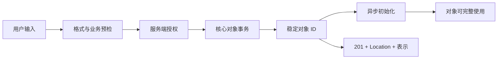
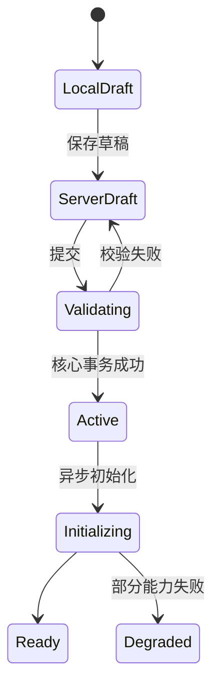
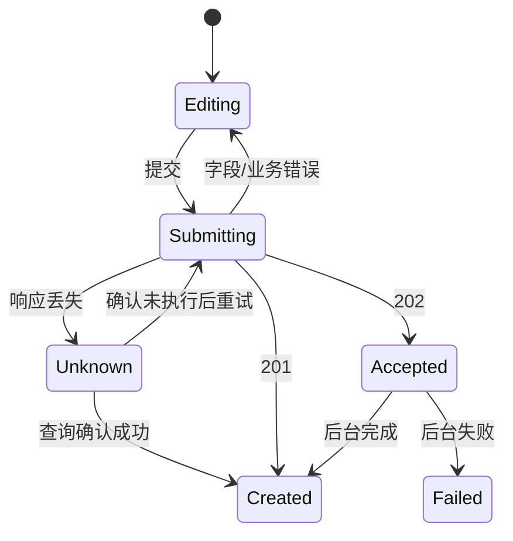

# Create 创建

创建操作把用户输入和当前上下文转换为一个新的、可被稳定识别的业务对象。

创建成功不等于表单提交成功，也不等于客户端显示了新卡片。

完成条件至少包括：

- 服务端确认对象已经建立。
- 对象获得稳定身份。
- 对象所属范围正确。
- 当前用户拥有预期能力。
- 创建结果可以重新读取。
- 失败、超时和重复提交不会产生不可解释的副作用。

## 创建对象的边界

创建前先回答“什么是一个对象”。

例如“创建项目”可能同时涉及：

- 项目记录。
- 默认空间。
- 所有者成员关系。
- 初始权限策略。
- 审计事件。
- 异步初始化任务。

这些写入不一定都在一个事务中完成。

产品必须定义哪个完成点允许告诉用户“项目已创建”，以及哪些能力仍在初始化。



如果核心对象已建立但异步索引仍在运行，界面可以显示：

“项目已创建，搜索功能正在初始化。”

不能把已提交对象误写为“仍在创建”，也不能把未完成能力伪装成可用。

## 创建入口

入口应靠近对象集合或任务上下文：

- 列表页的“新建项目”。
- 空状态中的“创建第一个规则”。
- 当前客户详情中的“创建工单”。
- 命令面板中的“新建文档”。
- 从模板库进入的“使用此模板创建”。

入口必须说明作用范围。

在多组织、多项目或多环境产品中，“新建”可能创建到错误容器。

入口文案或创建页应显示：

- 当前组织。
- 当前项目。
- 当前环境。
- 创建后的所有者。
- 关键默认权限。

## 选择创建载体

| 载体 | 适用条件 | 风险 |
| --- | --- | --- |
| 行内创建 | 字段少、低风险、创建后留在列表 | 校验空间有限 |
| Modal | 输入短、无需大量比较 | 深链、恢复和窄屏成本 |
| Drawer | 需要保留集合上下文 | 内容过长时难操作 |
| 独立页面 | 字段多、可保存草稿、需要 URL | 进入退出成本较高 |
| 多步骤流程 | 依赖关系复杂、需要分段确认 | 返回、跨步校验和草稿更复杂 |
| 基于模板 | 对象结构可复用 | 模板过期和隐含默认值 |

载体由任务复杂度决定，不由“创建都用 Modal”的组件规则决定。

需要上传文件、配置权限、比较资源或恢复草稿时，独立页面通常更可靠。

## 最小输入

创建表单只收集建立可用对象所需的信息。

可以分为：

- **身份字段**：名称、Key、所属范围。
- **核心规则**：决定对象能否工作的配置。
- **权限字段**：所有者、可见范围、协作者。
- **可延后字段**：描述、标签、外观。
- **服务端字段**：ID、创建者、时间、版本。

服务端字段不能信任客户端提交。

`createdBy`、租户、价格、系统状态应从当前会话和权威数据推导。

## 默认值

默认值是产品决策，不是表单填充技巧。

每个默认值要说明：

- 来源。
- 适用范围。
- 用户是否能理解。
- 是否可修改。
- 是否随时间变化。
- 是否包含权限或费用后果。

来源优先级示例：

```text
明确 URL / 当前对象上下文
> 用户最近选择
> 组织策略
> 产品默认
```

权限、公开范围、付费资源等高后果字段不应使用难以发现的默认值。

## 名称与稳定 ID

对象显示名称可以重复或修改。

内部身份必须稳定。

```json
{
  "id": "project_01JZ8K7W2Q",
  "key": "PAY",
  "name": "支付重构",
  "version": 1,
  "createdAt": "2026-07-18T12:00:00Z"
}
```

- `id` 用于数据库和引用。
- `key` 可能是用户可见的稳定短标识。
- `name` 用于显示，可允许修改。
- `version` 支持后续条件更新。

不要用名称作为 React key、URL 唯一身份或审计关联。

## 草稿

长创建流程应定义草稿语义：

- 只保存在当前标签页。
- 保存在当前设备。
- 保存到服务端草稿对象。
- 可跨设备继续。
- 保存多久。
- 谁能读取。
- 是否占用配额。
- 是否已经触发外部副作用。

草稿不应与正式对象共享模糊状态。



如果服务端草稿已经具有 ID，界面仍需明确它不会出现在正式集合、不会对外通知或计费。

## 客户端验证

客户端快速验证：

- 必填。
- 格式。
- 长度。
- 本地可判断的字段关系。

服务端仍需验证：

- 身份和权限。
- 唯一性。
- 当前配额。
- 业务不变量。
- 依赖对象是否存在。
- 并发变化。
- 安全策略。

客户端曾显示“名称可用”不保证提交时仍唯一。

创建请求必须处理服务端 409 或业务冲突。

## 重复提交

创建通常使用 POST。

POST 本身不自动具有幂等语义。

按钮禁用只能减少前端重复点击，不能防止：

- 网络重试。
- 多标签页提交。
- 客户端崩溃后恢复。
- 网关重放。
- 用户刷新后再次提交。

创建接口可以接受一次逻辑创建的幂等键：

```http
POST /api/projects HTTP/1.1
Content-Type: application/json
Idempotency-Key: 8c55816f-5f1f-4c8d-879f-a052d4d6826d
```

服务端按：

- 认证主体。
- 作用范围。
- 接口。
- 幂等键。
- 请求体摘要。

共同识别一次意图。

相同键和相同请求返回第一次结果。

相同键配不同请求体应拒绝，而不是静默创建第二个对象。

幂等记录需要过期策略，但过期前必须覆盖客户端可能恢复的窗口。

## HTTP 结果

同步完成创建可返回 `201 Created`。

`Location` 指向主要新资源。

```http
HTTP/1.1 201 Created
Location: /api/projects/project_01JZ8K7W2Q
ETag: "v1"
Content-Type: application/json
```

响应正文可以包含新对象表示和当前能力。

异步受理可返回 `202 Accepted`，但它只表示请求已接受，不表示对象已经完成创建。

`202` 需要提供任务状态入口：

```json
{
  "jobId": "create-project-job-731",
  "state": "queued",
  "statusUrl": "/api/jobs/create-project-job-731"
}
```

界面应显示“创建任务已提交”，并在权威完成后进入对象。

## 结果未知

客户端超时不能自动解释为创建失败。

请求可能已经提交，只是响应丢失。

恢复流程：

1. 保留幂等键。
2. 查询该键或创建任务的结果。
3. 若服务端确认成功，进入已经创建的对象。
4. 若确认未执行，安全重试。
5. 若仍未知，显示可回看的状态入口。

不能生成新幂等键盲目重试。

## 权限

创建权限至少有两层：

- 是否能在当前范围创建该对象。
- 是否能设置提交的字段和关联对象。

用户能创建项目，不一定能：

- 把其他人设为所有者。
- 选择公开可见。
- 绑定生产环境密钥。
- 开启付费计算。
- 使用受限模板。

服务端逐字段重新授权。

前端隐藏字段不构成授权。

## 配额与计费

创建可能消耗：

- 席位。
- 存储。
- 并发任务额度。
- 云资源。
- 许可证。
- 外部服务费用。

界面应在提交前显示会产生的关键后果。

配额在打开表单与提交之间可能变化。

服务端提交时重新检查，并返回：

- 当前上限。
- 当前使用量。
- 创建所需数量。
- 合法恢复动作。

不能用笼统的“创建失败”隐藏费用或配额问题。

## 安全

创建是状态修改请求。

需要：

- 认证。
- 授权。
- CSRF 防护或等效机制。
- 输入验证。
- 输出编码。
- 速率限制。
- 审计。
- 敏感字段脱敏。

只允许 POST 不能单独防止 CSRF。

Cookie 会随跨站请求发送时，需要使用框架支持的 token、Fetch Metadata、SameSite 等组合防线。

创建成功日志记录对象 ID、主体、租户、策略决策和相关 ID，不记录密钥正文。

## 表单语义

使用真实 `<form>`：

```html
<form action="/projects" method="post">
  <label for="project-name">项目名称</label>
  <input
    id="project-name"
    name="name"
    autocomplete="off"
    required
  >

  <label for="project-key">项目 Key</label>
  <input
    id="project-key"
    name="key"
    pattern="[A-Z]{2,10}"
    aria-describedby="project-key-hint"
    required
  >
  <p id="project-key-hint">使用 2–10 个大写英文字母。</p>

  <button type="submit">创建项目</button>
  <a href="/projects">取消</a>
</form>
```

提交按钮名称说明具体对象。

“创建项目”比“确定”清楚。

按 Enter 提交应遵循表单语义，不依赖点击事件。

## 提交状态



提交期间可以防止同一表单重复触发，但：

- 不应清空输入。
- 不应永久禁用取消或安全返回。
- 不应让屏幕阅读器只能从按钮文字变化猜测状态。
- 需要用状态消息说明“正在创建项目”。

## 创建成功后的导航

常见选择：

- 进入新对象详情。
- 留在集合并高亮新对象。
- 继续创建下一个对象。
- 进入初始化流程。
- 展示结果页或凭证。

根据下一任务决定。

创建项目后通常进入项目。

批量录入商品时可能保留在创建页。

创建 API 密钥后需要立即显示一次性凭证。

URL、标题、当前导航项和对象 ID 必须一致。

浏览器后退不能再次提交 POST；使用 Post/Redirect/Get 或客户端路由的等价结果恢复。

## 焦点

打开创建页时：

- 页面焦点通常落在主标题或自然阅读起点。
- 不必自动聚焦第一个输入，尤其在移动端会立刻弹出键盘。

提交失败：

- 显示错误摘要。
- 焦点进入摘要或第一个错误。
- 保留输入。

成功后：

- 导航到新页面时，焦点进入新页面主标题。
- 留在列表时，状态消息说明结果，必要时提供“查看新对象”。
- 继续创建时，清空值前确认上一对象已提交。

## 取消创建

取消不一定需要确认。

只有存在未保存且难以恢复的输入时，才提示：

- 继续编辑。
- 放弃未保存内容。
- 保存草稿。

空表单或没有修改时直接返回。

不要对每次关闭都弹确认框。

如果浏览器刷新、后退或标签关闭可能丢失重要输入，可结合服务端草稿和 `beforeunload` 提示；浏览器提示不可定制，也不能替代草稿。

## 基于模板创建

模板创建需要冻结模板身份和版本：

```json
{
  "templateId": "incident-response",
  "templateVersion": 12,
  "overrides": {
    "name": "支付服务事故响应"
  }
}
```

不能只提交模板显示名称。

模板在用户预览后可能更新。

提交时需要：

- 按预览版本创建。
- 或提示模板已更新并让用户重新检查。

模板中的权限、自动化、费用和外部连接必须在创建前可见。

## 批量创建

批量创建要定义原子性：

- 全部成功或全部失败。
- 每项独立，允许部分成功。
- 按分组原子。

结果必须按源行或稳定临时 ID 对账。

```json
{
  "batchId": "product-import-731",
  "total": 100,
  "succeeded": 94,
  "failed": 6,
  "resultsUrl": "/imports/product-import-731/results"
}
```

不能只显示“94% 成功”。

失败项需要：

- 原始行身份。
- 错误类别。
- 修正方式。
- 是否可重试。
- 已成功项的稳定 ID。

## 案例一：创建云环境

### 输入

- 所属组织和项目。
- 环境名称。
- 区域。
- 计算规格。
- 网络。
- 费用上限。
- 密钥引用。

### 风险

- 创建立即计费。
- 区域不可修改。
- 网络和密钥受权限限制。
- 初始化耗时数分钟。
- 重复提交会建立两个环境。

### 流程

1. 在项目上下文显示组织、项目和预计费用。
2. 客户端检查格式与必填。
3. 服务端重新授权区域、网络和密钥。
4. 提交前提供摘要，允许返回修正。
5. POST 携带幂等键。
6. 服务端创建核心环境记录，返回 202 和任务 ID。
7. 任务中心展示网络、计算和健康检查阶段。
8. 完成后进入环境详情。

### 失败

网络创建成功、计算实例失败。

系统必须定义：

- 自动补偿网络资源。
- 或保留降级环境并提供继续初始化。

不能只显示“创建失败”却留下计费资源。

### 验收

- 双击只创建一个环境。
- 响应丢失后按幂等键恢复。
- 费用、区域和项目在确认页可见。
- 无权使用密钥时不泄露密钥详情。
- 初始化失败能看到已创建资源和补偿状态。
- 任务完成前不显示“环境可用”。

## 案例二：创建 API 密钥

### 输入

- 名称。
- Scope。
- 到期时间。
- IP allowlist。

### 特殊结果

密钥明文只显示一次。

创建成功页必须：

- 明确说明仅显示一次。
- 提供复制操作。
- 不把明文放入 URL、日志或分析事件。
- 刷新后不再次返回明文。
- 提供撤销入口和密钥 ID。

### 请求

服务端创建密钥后只保存安全摘要或哈希。

响应通过安全通道返回一次性秘密。

如果客户端在收到响应前断开，不能通过普通 GET 重新读取秘密。

恢复策略可以是：

- 确认密钥对象已创建。
- 提示秘密无法恢复。
- 允许撤销并创建新密钥。

### 验收

- 浏览器历史不包含秘密。
- 复制成功不等于保存安全，页面明确提醒。
- 屏幕共享和辅助技术读取风险被说明。
- 超时不会盲目生成多个有效密钥。
- 撤销后所有验证节点及时失效。

## 案例三：创建团队邀请

### 输入

- 邮箱。
- 角色。
- 项目范围。
- 到期时间。

### 并发

提交时可能：

- 用户已经是成员。
- 已存在未过期邀请。
- 许可证数量不足。
- 操作者权限被撤销。

结果应区分：

- `created`
- `already-member`
- `existing-invitation`
- `quota-exceeded`
- `forbidden`

“已存在邀请”可以返回现有邀请身份，而不是创建重复记录。

### 隐私

对无权查看组织成员的角色，错误不能泄露完整成员资料。

### 验收

- 重复提交不会发多封邀请邮件。
- 已存在邀请给出可执行下一步。
- 配额失败保留邮箱和角色输入。
- 角色权限由服务端验证。
- 邮件发送失败与邀请对象创建结果分开表达。

## 响应式与国际化

窄屏创建流程需要：

- 当前范围在主操作前可见。
- 错误不会被虚拟键盘遮挡。
- 底部固定操作不覆盖最后字段。
- 多步骤返回保留输入。
- 长对象名称和本地化文案可换行。

国际化检查：

- 名称允许实际语言字符。
- 不把所有标识符规则套到显示名称。
- 日期、数字、货币和时区明确。
- 地址和姓名不强制单一国家格式。
- RTL 下布局使用逻辑方向。

## 观测

记录：

- 创建流程开始、提交和权威成功。
- 各错误类别。
- 草稿恢复率。
- 重复请求命中率。
- 结果未知恢复率。
- 创建后首次成功任务。
- 初始化阶段失败率。
- 创建后短期删除或撤销率。

不要把点击“创建”当作创建成功。

不要记录敏感字段原文。

高放弃率可能来自费用、权限、字段过多或默认值不可信，需要按步骤和错误分层。

## 测试清单

### 对象

- 新对象有稳定 ID。
- 名称修改不改变身份。
- 作用范围正确。
- 创建结果可以重新读取。
- 异步能力状态准确。

### 请求

- 重复提交只产生一次逻辑结果。
- 相同幂等键不同正文被拒绝。
- 超时先查询结果。
- 201 包含正确 Location。
- 202 提供状态入口。

### 表单

- 原生表单语义可用。
- Enter 提交行为正确。
- 错误保留输入。
- 动态字段关联正确。
- 客户端与服务端规则一致。

### 权限与安全

- 租户来自会话和路由权威上下文。
- 字段级权限重新验证。
- CSRF 防护生效。
- 无权限错误不泄露对象。
- 审计关联主体和对象。

### 恢复

- 页面刷新能恢复服务端草稿或任务。
- 取消不会误删正式对象。
- 任务部分失败有补偿或继续路径。
- 跨设备读取按当前权限。
- 一次性秘密不能被重新读取。

### 无障碍

- 标签和说明建立程序化关系。
- 错误摘要和字段错误可达。
- 提交状态可被感知。
- 成功导航焦点进入合理标题。
- 颜色不是唯一结果线索。

## 综合练习

设计“创建定时数据同步”流程。

对象包含：

- 数据源凭据引用。
- 目标仓库。
- 字段映射。
- 时间计划。
- 失败重试。
- 通知接收人。

要求：

1. 定义草稿与正式对象。
2. 说明哪些字段由服务端重新授权。
3. 设计连接测试与正式创建的关系。
4. 处理连接测试成功后凭据被撤销。
5. 设计幂等键和超时恢复。
6. 设计创建成功但首次同步失败的状态。
7. 给出取消与删除的区别。
8. 说明创建后页面和焦点落点。

创建完成必须由稳定对象和可对账结果证明，不能由按钮动画或临时消息证明。

## 来源

- [IETF RFC 9110：HTTP Semantics，POST、PUT 与 Idempotent Methods](https://www.rfc-editor.org/rfc/rfc9110.html)（访问日期：2026-07-18）
- [W3C：WCAG 2.2，Error Prevention (Legal, Financial, Data)](https://www.w3.org/TR/WCAG22/#error-prevention-legal-financial-data)（访问日期：2026-07-18）
- [WHATWG：HTML Living Standard，Forms](https://html.spec.whatwg.org/multipage/forms.html)（访问日期：2026-07-18）
- [OWASP：Cross-Site Request Forgery Prevention Cheat Sheet](https://cheatsheetseries.owasp.org/cheatsheets/Cross-Site_Request_Forgery_Prevention_Cheat_Sheet.html)（访问日期：2026-07-18）
- [IETF RFC 9457：Problem Details for HTTP APIs](https://www.rfc-editor.org/rfc/rfc9457.html)（访问日期：2026-07-18）
