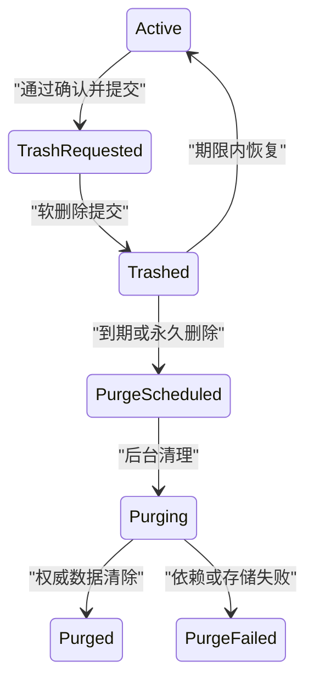

# Delete 删除

删除是让对象退出正常使用范围，并按生命周期政策处理引用、保留、恢复和永久清除。界面上的垃圾桶按钮只是入口，真正设计对象是资源生命周期。

## 删除语义分类

| 操作 | 对象是否可正常访问 | 数据是否仍保存 | 能否恢复 |
| --- | --- | --- | --- |
| 归档 | 从活跃视图移出 | 是 | 可以重新启用 |
| 软删除 | 进入已删除状态 | 是，受保留期约束 | 通常可以 |
| 回收站 | 软删除的可见管理视图 | 是 | 在期限内恢复 |
| 匿名化 | 移除可识别信息 | 部分数据保留 | 通常不可逆 |
| 硬删除 | 从权威存储清除 | 否或仅剩审计摘要 | 不可恢复 |
| 解除关联 | 关系删除，对象保留 | 是 | 可重新关联 |

产品文案必须使用真实语义。“删除成员”可能只是移出团队；“删除文件”可能进入回收站；“永久删除账户”可能仍按法律保留部分记录。

## HTTP DELETE 的边界

HTTP DELETE 请求删除目标资源与当前功能的关联。它是非安全、幂等方法：多次相同请求的预期效果等同于一次，但每次仍可产生审计日志。

成功状态：

- 202：已接受，尚未完成；
- 204：已执行且没有返回表示；
- 200：已执行并返回状态表示。

DELETE 请求体没有通用语义。需要复杂删除参数时，可以设计专门的删除任务资源或动作端点，而不是假设所有代理都理解请求体。

删除不能通过 GET 查询参数触发。预取、爬虫或链接检查可能访问 GET。

## 生命周期模型

```json
{
  "resourceId": "project-42",
  "version": 31,
  "lifecycle": "trashed",
  "deletedAt": "2026-07-18T02:20:00Z",
  "deletedBy": "user-72",
  "retentionUntil": "2026-08-17T02:20:00Z",
  "restorable": true,
  "purge": {
    "state": "not-scheduled"
  },
  "dependencies": {
    "children": 12,
    "externalLinks": 3
  }
}
```

`version` 用于阻止基于旧页面删除已改变对象。`retentionUntil` 使用服务端时间。`restorable` 由资源类型、权限和保留政策计算，不能由前端猜测。

## 状态流



进入 `trashed` 后可以提供撤销；进入 `purging` 后能否取消取决于服务端协议。不能让 toast 中的“撤销”在实际硬删除后仍可点击。

## 影响分析

确认前由服务端计算影响：

- 直接子对象数量；
- 共享链接；
- 自动化和 webhook；
- 成员访问；
- 账单或保留义务；
- 搜索索引和缓存；
- 外部存储对象；
- 下游报表；
- 是否有阻止删除的依赖。

影响摘要带版本和过期时间。用户停留确认框期间，依赖可能变化；提交时服务端重新计算并拒绝过期影响快照。

```json
{
  "deletionPlanId": "delete-plan-8841",
  "resourceVersion": 31,
  "effect": {
    "trashResource": true,
    "trashChildren": 12,
    "disableLinks": 3,
    "retainAudit": true
  },
  "expiresAt": "2026-07-18T02:25:00Z"
}
```

计划 ID 绑定对象、操作者权限、版本和删除模式，仅用于本次影响确认。

## 确认策略

不是每个删除都需要对话框。

| 风险 | 交互 |
| --- | --- |
| 可撤销、低价值、单项 | 执行后提供持久撤销 |
| 可撤销但影响多人 | 简短确认并展示范围 |
| 不可恢复或高价值 | 强确认、对象名、影响和替代方案 |
| 批量永久删除 | 二次范围确认和后台任务 |
| 法律/财务保留冲突 | 拒绝删除并解释允许动作 |

确认标题使用对象和动作：“将项目‘支付平台’移到回收站？”而不是“你确定吗？”。

输入对象名确认只适合高风险且对象名稳定的场景；它增加摩擦，不替代权限、版本与影响校验。

## 软删除

软删除通常实现为生命周期字段，而不是简单 boolean：

- `active`；
- `trashed`；
- `restoring`；
- `purge-scheduled`；
- `purging`；
- `purged`。

所有正常查询默认排除 trashed，但管理员回收站按权限读取。唯一名称是否释放要定义：立即释放可能让恢复时名称冲突；保留 30 天会阻止新对象使用同名。

附件、搜索和缓存也要同步失效。只更新数据库行而公开下载 URL 仍可访问，不算完成软删除。

## 恢复

恢复前检查：

- 原父对象仍存在；
- 名称是否被占用；
- 当前用户是否有恢复权限；
- 子对象是否仍在保留期；
- 外部链接能否恢复；
- 权限继承是否变化；
- schema 是否仍兼容。

名称冲突可提供：

- 使用新名称恢复；
- 恢复到其他父对象；
- 管理员解决占用；
- 保留删除状态。

不能静默覆盖新同名对象。

## 硬删除与后台清理

大对象清理通常异步：

1. 锁定资源进入 purge-scheduled；
2. 阻止恢复和新引用；
3. 删除主记录或标记墓碑；
4. 清理附件；
5. 清理索引和缓存；
6. 清理派生数据；
7. 保留允许的审计摘要；
8. 对账全部存储；
9. 进入 purged。

清理失败要可恢复。部分附件删掉、部分仍在时不能显示“永久删除完成”。

## 墓碑与 ID 再利用

分布式系统常在主数据清除后保留最小墓碑：

```json
{
  "resourceId": "project-42",
  "purgedAt": "2026-08-17T02:20:00Z",
  "purgeRevision": 7,
  "reasonCode": "retention-expired"
}
```

墓碑用于拒绝迟到复制事件、避免旧缓存把对象复活，并帮助下游确认删除已经处理。它不能保留本应清除的名称、正文或个人身份。

业务 ID 是否可以再利用必须明确。若 `project-42` 在清除后指向新项目，旧链接、缓存、审计和重试请求可能误作用于新对象。通常使用永不复用的内部 ID，新对象获得新 ID。

## 备份与删除承诺

“永久删除”还要解释备份：

- 在线系统何时不可访问；
- 备份保留周期；
- 备份是否只用于灾难恢复；
- 恢复备份后怎样重新应用删除墓碑；
- 加密密钥删除是否参与清除；
- 法律保留怎样覆盖普通保留期。

界面不需要展示基础设施拓扑，但删除政策必须能支撑承诺。若备份会保留 30 天，不能宣称所有物理副本瞬时消失。

灾难恢复演练要验证删除不会“复活”：恢复旧快照后重放墓碑或删除日志，再开放业务流量。

## 删除审计与隐私

审计至少记录资源类型、安全 ID、操作者、删除模式、政策版本、影响计数和结果。审计内容与被删资源正文分离。

恢复操作也记录原删除事件、恢复者、新父级和名称变化。永久清除完成后，审计只能保留允许的最小信息，客服不能通过审计接口取得已清除正文。

## 级联与引用

数据库级联只解决一部分存储关系。产品需决定：

- 子项目跟随删除；
- 评论保留但作者匿名化；
- 报表保留历史快照；
- 外部引用变为失效；
- 共享资源从关系中移除但本体保留。

级联范围必须与用户心智一致。删除团队不能意外删除被其他团队共享的文件。

## 并发

确认打开后可能发生：

- 对象被编辑；
- 新增子对象；
- 其他用户已经删除；
- 权限被撤销；
- 对象移动到其他父级；
- 法律保留开启。

提交带 `If-Match` 或领域版本。版本不匹配时重新展示影响，不自动刷新版本后继续删除。

重复 DELETE 若资源已按同一政策删除，可以返回当前删除状态；若同 ID 已被重新创建为不同资源，必须用资源身份和版本防止误删。

## 撤销

撤销是真实恢复命令，不是只把列表项插回前端。

撤销入口需要：

- 对象名；
- 截止时间；
- 恢复范围；
- 失败反馈；
- 跨页面可达性；
- 服务端恢复状态。

低风险删除的撤销不应只存在 5 秒 toast。回收站或活动日志可以提供持续入口。

## 焦点

删除列表项后：

1. 优先聚焦原位置的下一项；
2. 没有下一项则聚焦上一项；
3. 集合为空则聚焦列表标题或空状态主动作；
4. 状态消息说明对象已移到回收站。

确认对话框关闭后，取消时焦点回触发按钮；删除成功且按钮节点消失时按上述规则迁移。焦点不能掉到 `body`。

## 案例一：项目移到回收站

### 输入

- 项目 version 31；
- 12 个服务、3 条共享链接；
- 30 天保留；
- 用户是项目管理员；
- 确认期间另一个成员新增服务。

### 处理

1. 服务端生成 deletionPlan：12 服务、3 链接；
2. 对话框显示项目名、保留期和影响；
3. 用户确认时提交 planId 与 version 31；
4. 新服务使 version 变为 32；
5. 服务端拒绝旧计划；
6. 界面重新取得 13 服务的新影响；
7. 用户再次确认；
8. 事务把项目和从属服务标为 trashed；
9. 共享链接立即失效；
10. 列表移除项目并显示回收站入口。

### 验收

- version 31 计划不能删除 version 32；
- 13 个服务均进入同一删除批次；
- 共享下载 URL 立即失效；
- 正常搜索不再返回项目；
- 回收站显示 retentionUntil；
- 删除当前焦点卡后焦点到下一项目；
- 撤销恢复项目与 13 服务，不恢复已独立删除对象。

### 失败分支

前端确认框展示 12 服务，提交时服务端按最新数据直接级联 13 个且不提示。修正为版本化影响计划与二次确认。

## 案例二：永久删除用户账户

### 输入

- 用户主动关闭账户；
- 法律要求财务交易保留 7 年；
- 个人资料和上传头像需清除；
- 评论允许保留但作者匿名化；
- 清理跨主库、对象存储和搜索索引。

### 处理

1. 页面区分停用账户与永久数据清除；
2. 强确认说明不可恢复部分和法定保留；
3. 重新认证用户；
4. 服务端冻结账户登录；
5. 建立 purge task；
6. 删除个人资料和头像；
7. 评论作者替换为不可逆匿名主体；
8. 财务交易保留但移除非必要身份字段；
9. 搜索和缓存清理；
10. 所有存储对账后任务完成。

### 验收

- 清除任务完成前不宣称永久删除完成；
- 头像原 URL 无法访问；
- 搜索索引不含用户名；
- 评论内容保留但不能反查账户；
- 财务保留范围有政策证据；
- 重复请求不创建第二个账户清理流程；
- 客服仅能使用安全参考号查看进度。

### 失败分支

数据库账户行删除成功后立即显示完成，但对象存储头像仍公开。修正为跨存储清理任务与最终对账。

## 调试与观测

调试记录：

- 资源 ID 和版本；
- deletionPlan；
- 权限和政策版本；
- 软删事务；
- 缓存与链接失效；
- purge 子任务；
- 恢复结果；
- 焦点迁移；
- 审计摘要。

观测：

- 软删、恢复和永久清除数量；
- 删除后撤销率；
- 影响计划过期；
- 级联计数不一致；
- purge 最老任务年龄；
- 孤儿附件；
- 删除后仍可访问的资源；
- 恢复名称冲突；
- 误删与客服恢复；
- 无障碍操作失败。

分析事件记录资源类型和影响数量，不记录对象名或敏感内容。

## 综合练习：文件夹回收站

实现文件夹软删、30 天回收站与异步永久清除：

- 版本化影响计划；
- 文件夹和子项生命周期；
- 共享链接立即失效；
- 同名恢复冲突；
- 跨存储附件清理；
- 法律保留对象拒绝清除；
- 删除与新增子项并发；
- 可持续撤销入口；
- 列表焦点恢复；
- purge 对账。

验收注入清理 worker 崩溃、对象存储失败、版本冲突和权限撤销。任何“永久删除完成”都有全存储证据。

## 来源

- [IETF — RFC 9110：DELETE 与幂等方法](https://www.rfc-editor.org/rfc/rfc9110.html)（访问日期：2026-07-18）
- [IETF — RFC 9110：If-Match 与 412](https://www.rfc-editor.org/rfc/rfc9110.html#name-if-match)（访问日期：2026-07-18）
- [WHATWG — HTML Standard：dialog 元素](https://html.spec.whatwg.org/multipage/interactive-elements.html#the-dialog-element)（访问日期：2026-07-18）
- [W3C WAI — WCAG 2.2 焦点顺序](https://www.w3.org/WAI/WCAG22/Understanding/focus-order.html)（访问日期：2026-07-18）
