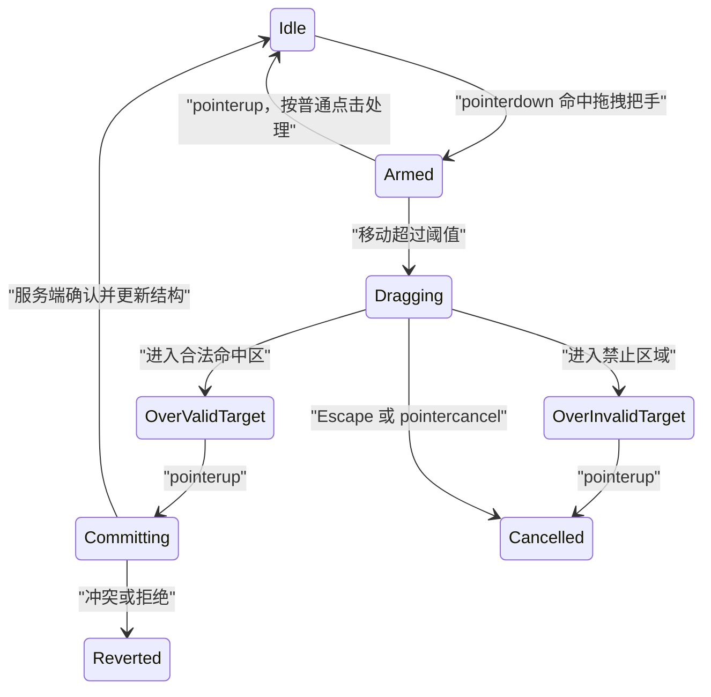

# Drag 拖拽

拖拽是用户按下并持续操控一个对象表示，将它移动到目标位置后释放的直接操控方式。只有起点与终点决定结果时属于拖拽；路径本身具有含义时属于手势或绘制。

## 三类任务

| 任务 | 结果 | 典型命令 |
| --- | --- | --- |
| 排序 | 同一集合内改变相对次序 | move before/after anchor |
| 移动 | 对象更换父级或状态列 | move to container |
| 拖入 | 外部或新对象进入区域 | upload/import/attach |

三者不能共用一个只含 `{fromIndex,toIndex}` 的接口。排序需要稳定锚点，移动需要目标权限与路径，拖入需要文件校验和上传状态。

## 直接操控的阶段



按下不立即开始拖动，否则点击、选择文本和滚动会被误判。移动阈值按输入类型调整，但不能要求用户完成极精细路径。

## 数据命令

排序命令：

```json
{
  "kind": "reorder",
  "itemId": "task-42",
  "position": {
    "relation": "before",
    "anchorId": "task-51"
  },
  "listVersion": 31
}
```

移动命令：

```json
{
  "kind": "move",
  "itemId": "file-42",
  "sourceParentId": "folder-a",
  "targetParentId": "folder-b",
  "targetVersion": 18
}
```

使用稳定 ID 和语义关系，不使用 DOM 索引。虚拟化、实时插入和筛选会让索引失去业务含义。

## 拖拽不是唯一入口

WCAG 2.2 的 Dragging Movements 要求拖拽功能具有无需拖动的单指针替代，除非拖拽本质上不可替代。键盘可访问是另一项要求；只有键盘快捷键仍不能满足只用点击/轻触的用户。

可用替代：

- 每项“上移/下移”按钮；
- 选择项后点击目标列；
- “移动到…”菜单或对话框；
- 点击起点再点击终点；
- 输入精确数值；
- 选择目标文件夹；
- 文件选择器替代把文件拖入。

所有入口调用同一领域命令并得到同一验证、结果和审计。

## 拖拽把手

将拖动限定在把手可避免整个卡片阻断文本选择和链接点击。把手需要可访问名称，例如“移动任务：修复支付回调”。

把手不是只能响应 pointer。键盘到达后可以进入移动模式，或提供相邻按钮/菜单。若卡片包含按钮和链接，拖动监听不能吞掉它们的点击。

触摸设备上长按可能与浏览器上下文菜单、滚动和文本选择冲突。不要仅依赖不可发现的长按。

## 命中区

命中区由任务语义定义：

- 排序：项目前、项目后、集合开头、集合末尾；
- 看板移动：整列内容区与空列；
- 文件夹移动：可写目录节点；
- 上传：明确文件接收区域；
- 连接：合法端点。

目标视觉面积不能小于真实命中面积。无效目标显示原因，例如只读、循环移动或类型不兼容，而不是只改变鼠标形状。

嵌套命中区按最具体合法目标解析。拖到子文件夹上不能被外层文件列表截获。

## 命中算法

排序列表可以把每项矩形的中线作为 before/after 分界，但要处理不同高度、空白间距和缩放：

```text
pointerY < target.top + target.height / 2  → before target
pointerY ≥ target.top + target.height / 2 → after target
```

计算使用当前布局坐标，不缓存拖动开始时的矩形。自动滚动、图片加载和响应式布局都会改变位置。

二维网格不能简单选择欧氏距离最近元素，因为视觉最近不一定是合法阅读位置。应先根据业务排列确定目标行列，再生成稳定 anchor 命令。

命中算法测试至少覆盖：

- 高度不等的项目；
- 项目间空隙；
- 容器内边距；
- 页面滚动；
- 嵌套滚动；
- CSS transform；
- 200% 缩放；
- RTL；
- 空集合；
- 指针位于边界像素。

## 坐标与缩放

`clientX/clientY`、`pageX/pageY` 和元素矩形处于不同坐标语境。选择一套视口坐标计算并显式加入滚动影响，不能混用后通过常数修正。

CSS transform 可能让视觉几何与布局几何不同。命中应依据浏览器返回的实际边界，并验证旋转或缩放容器是否仍适合拖拽；复杂变换下提供菜单替代更可靠。

RTL 排序不等于把所有左右键机械反转。逻辑的 previous/next、视觉方向和 DOM 顺序需统一定义，尤其是横向列表。

## 指针事件与捕获

开始拖动后可以使用 pointer capture 持续接收该 pointer 的事件。仍需处理：

- `pointercancel`；
- 设备切换；
- 窗口失焦；
- Escape；
- 滚动容器；
- 多指输入；
- 组件卸载；
- 浏览器默认拖放。

结束路径统一释放捕获和临时状态。取消不能留下 `aria-grabbed` 等过时或错误状态，也不能保留全局 `user-select:none`。

## 视觉反馈

拖动中同时展示：

- 被操作对象；
- 当前合法目标；
- 插入位置；
- 无效原因；
- 自动滚动方向；
- 按 Escape 取消的提示。

半透明幽灵不能是唯一反馈。插入线与目标高亮要有足够对比，并在缩放和高对比模式下可见。

拖动预览不要复制敏感内容到屏幕外 DOM。多选拖动显示“3 个文件”，不堆叠巨大预览。

## 自动滚动

指针靠近边缘时自动滚动要控制：

- 边缘阈值；
- 最大速度；
- 距边缘越近速度越高；
- pointer 离开时停止；
- 目标变化后重新计算；
- 不跨越用户无法观察的大段内容；
- Escape 立即停止。

虚拟列表滚动后 DOM 节点会回收。拖动状态绑定 itemId，不绑定节点引用。

## 排序

排序后的权威结果可以由服务端返回：

```json
{
  "listId": "backlog-9",
  "version": 32,
  "movedItemId": "task-42",
  "beforeId": "task-51",
  "afterId": "task-37"
}
```

服务端验证 item、anchor 同属可排序集合，列表版本匹配，用户有排序权限。

大量列表可使用分数键或可排序标识减少重编号，但需要处理同一区间并发插入和键重平衡。

## 跨容器移动

移动到另一列可能触发业务状态转换。把工单拖到“已解决”不仅改变 `columnId`，还可能要求解决原因、权限和必填字段。

若目标状态需要额外输入：

1. 拖放只选择目标；
2. 打开明确对话框；
3. 收集必要字段；
4. 用户确认；
5. 服务端执行转换；
6. 失败时对象回到原位置。

不能因拖入目标就绕过正常表单校验。

## 文件拖入

浏览器提供的文件对象需要验证：

- 数量；
- 大小；
- MIME 与真实文件特征；
- 扩展名；
- 目录结构；
- 权限；
- 配额；
- 恶意内容扫描。

拖入区在 `dragenter`/`dragover` 不宣称上传成功。释放后才获得候选文件，上传、校验和业务导入各有独立状态。

同时提供 `<input type="file">`，实现同一限制和结果。

## 浏览器原生拖放与自定义指针拖动

HTML 原生 drag-and-drop 提供 `dragstart`、`dragover`、`drop` 与 `DataTransfer`，适合文件和跨应用数据交换；自定义 Pointer Events 更适合触摸排序与精确直接操控。

两套机制不要在同一把手上相互竞争。若使用原生 `draggable=true`：

- 明确允许的数据类型；
- 不把敏感正文写入 DataTransfer；
- 处理拖出应用；
- 提供触摸与键盘替代；
- 验证不同浏览器的拖动预览。

若使用 Pointer Events：

- 业务数据不依赖 DataTransfer；
- 手动处理命中、滚动和取消；
- 不阻断浏览器必要滚动；
- 对外部文件仍使用 drop/file input。

## 乐观更新与回滚

低延迟排序可先更新视觉，但必须保存：

- 原父级；
- 原锚点；
- 原列表版本；
- 当前命令序列；
- 服务端响应版本。

若失败，按当前最新结构决定恢复，不能简单写回旧数组覆盖其他实时变化。可以重新拉取列表并把焦点定位到移动项。

高风险状态转换宜等服务端确认或使用明确 pending 表示。

## 并发

拖动期间：

- 目标项被删除；
- 新项插入；
- 列表重排；
- 项目被别人移动；
- 目标权限撤销；
- 虚拟窗口改变。

提交使用 listVersion 与 anchorId。412/409 后重新读取并说明冲突，不能把 `toIndex=4` 应用到新列表。

实时事件不要在拖动中重排可见结构。可暂存事件，结束后合并；高风险删除目标事件则取消拖动并说明。

## 键盘排序

一种明确模式：

1. Tab 到拖拽把手；
2. Enter 或 Space 进入移动模式；
3. 上下箭头改变候选位置；
4. Home/End 到首尾；
5. Enter 确认；
6. Escape 取消；
7. 状态消息说明“已移动到第 3 项，共 8 项”。

焦点始终留在被移动对象。DOM 顺序在确认后与视觉顺序一致。

也可以直接提供上移/下移按钮，通常更容易发现，并同时满足单指针替代。

## 案例一：看板任务跨列移动

### 输入

- 任务 `task-42` 在“处理中”；
- 目标“已解决”要求解决原因；
- 用户有解决权限；
- 看板 version 31；
- 拖动期间另一个用户修改任务标题。

### 处理

1. 拖拽把手开始，不阻断标题链接；
2. “已解决”列显示合法目标；
3. pointerup 后打开解决对话框；
4. 用户填写原因；
5. 提交状态转换，携带 task version 与 board version；
6. 标题修改使 task version 冲突；
7. 服务端返回当前任务；
8. 对话框保留解决原因；
9. 用户确认基于新标题继续；
10. 服务端提交 resolved 并返回新位置。

### 验收

- 仅拖入列不会绕过解决原因；
- 无解决权限时目标显示原因且不可提交；
- “移动到…”菜单可完成同一流程；
- 单击把手不会误触拖动；
- 冲突后原因输入不丢失；
- 完成后焦点留在 task-42；
- DOM 与视觉列一致；
- 状态消息说明任务已移到已解决。

### 失败分支

前端释放时直接改 columnId，服务端稍后拒绝，但实时事件已把任务从原列删除。修正为 pending 状态和基于稳定 ID 的权威回滚。

## 案例二：课程章节排序

### 输入

- 课程有 120 个章节，使用虚拟列表；
- 用户把 chapter-90 移到 chapter-12 前；
- 另一个编辑者同时在 chapter-12 前插入新章节；
- 支持拖拽、上移/下移和“移动到位置”。

### 处理

1. 拖动状态保存 chapter-90 ID；
2. 自动滚动加载 chapter-12 附近；
3. 目标使用 before chapter-12，不使用 index 11；
4. 提交 listVersion 44；
5. 并发插入使版本成为 45；
6. 服务端返回冲突和新锚点状态；
7. 界面重新展示“仍移动到 chapter-12 前？”；
8. 用户确认后以 version 45 提交；
9. 返回 version 46 和相邻 ID；
10. 焦点定位 chapter-90。

### 验收

- 虚拟化回收节点不丢 chapter-90 身份；
- 目标由 anchorId 表达；
- version 44 不覆盖 version 45；
- 键盘“移动到位置”得到相同 version 46；
- 单指针用户能用按钮完成；
- 读屏听到新位置和总数；
- 自动滚动在取消后立即停止；
- 刷新后服务器顺序与 DOM 一致。

### 失败分支

接口只接收 fromIndex/toIndex，并发插入后 chapter-90 落到错误位置。修正为稳定锚点和版本条件。

## 调试

记录：

- pointerId、pointerType；
- armed 与 dragging 阈值；
- itemId；
- 命中 targetId 和合法性；
- 滚动容器与速度；
- 取消原因；
- 提交命令；
- 列表版本；
- 服务端结果；
- 焦点位置。

测试矩阵：

- 鼠标、触摸、笔；
- 键盘；
- 单击替代；
- 200% 缩放；
- 高对比；
- RTL；
- 空容器；
- 虚拟列表；
- 网络延迟；
- 实时插入；
- 权限撤销；
- pointercancel。

## 观测

- armed 后取消；
- 无效目标释放；
- 拖拽与替代入口使用率；
- 移动冲突；
- 服务端拒绝；
- 回滚失败；
- 自动滚动失控；
- 完成任务耗时；
- 键盘移动成功率；
- 单指针替代缺陷。

分析记录操作类型和位置关系，不记录文件名或任务标题。

## 综合练习：文件管理器移动

实现列表到目录树的文件移动：

- 拖拽把手；
- “移动到”对话框；
- 单指针目标选择；
- 目录权限；
- 循环移动拒绝；
- 同名冲突；
- 虚拟文件列表；
- 目录懒加载；
- pointercancel；
- 服务端版本；
- 失败后焦点恢复；
- 实时事件合并。

验收注入目标删除、权限撤销、同名文件、响应乱序和 2000 个节点。前后端都必须阻止把目录移动到自身后代。

## 来源

- [W3C WAI — WCAG 2.2 Dragging Movements](https://www.w3.org/WAI/WCAG22/Understanding/dragging-movements.html)（访问日期：2026-07-18）
- [W3C WAI — WCAG 2.2 Pointer Cancellation](https://www.w3.org/WAI/WCAG22/Understanding/pointer-cancellation.html)（访问日期：2026-07-18）
- [W3C WAI APG — 可重排 Listbox 示例与键盘模式](https://www.w3.org/WAI/ARIA/apg/patterns/listbox/)（访问日期：2026-07-18）
- [W3C — Pointer Events](https://www.w3.org/TR/pointerevents3/)（访问日期：2026-07-18）
