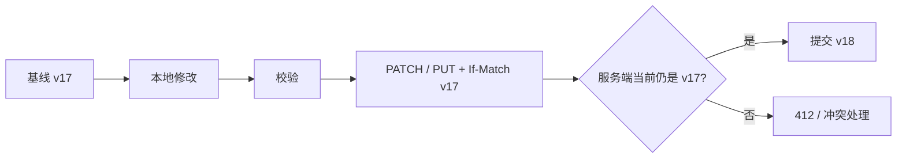
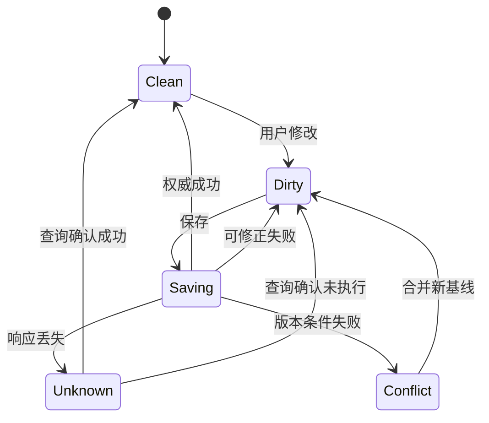
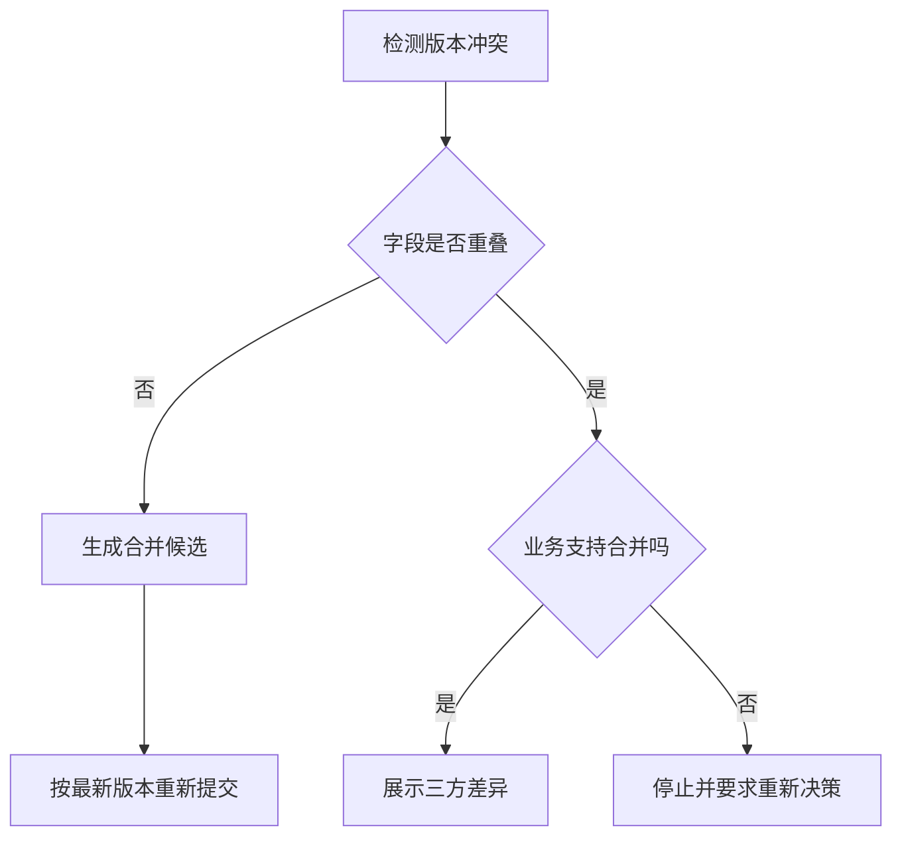

# Edit 编辑

编辑操作修改一个已经存在的业务对象。

可靠编辑必须同时管理四份事实：

- 用户开始编辑时读取的基线版本。
- 用户当前尚未提交的修改。
- 服务端当前权威版本。
- 保存请求的确定、失败或未知结果。

只把输入框的值发送到接口，无法处理并发修改、迟到响应、自动保存、离线草稿和权限变化。

## 编辑与创建的区别

创建从没有对象到产生稳定对象。

编辑从一个确定版本迁移到下一个版本。

因此编辑请求必须携带对象身份和版本条件。



## 编辑载体

| 载体 | 适用条件 | 关键边界 |
| --- | --- | --- |
| 独立编辑页 | 字段多、支持草稿、需要深链 | 返回和未保存保护 |
| 查看/编辑模式切换 | 对象详情需要完整预览 | 模式状态与焦点 |
| 行内编辑 | 单字段、高频、上下文明确 | 保存触发和错误位置 |
| Drawer | 需要保留列表上下文 | 长内容与窄屏 |
| Modal | 少量字段、短时任务 | 恢复和 URL |
| 表格单元格编辑 | 大量结构化数据 | 键盘模型、批量保存、冲突 |
| 实时协作编辑器 | 多人同时修改 | 操作合并、存在感和历史 |

行内编辑不适合高风险、跨字段或需要比较大量上下文的修改。

实时协作也不能只靠更快自动保存实现。

## 基线、当前值与脏字段

客户端至少保存：

```ts
type EditSession<T> = {
  objectId: string;
  baseVersion: string;
  baseline: T;
  current: T;
  dirtyFields: Set<keyof T>;
  saveState:
    | "idle"
    | "saving"
    | "saved"
    | "conflict"
    | "unknown"
    | "failed";
};
```

`baseline` 是读取时的权威数据。

`current` 是当前输入。

`dirtyFields` 说明用户实际改变的字段。

不能通过“当前值与空对象不同”推断修改。

默认值、规范化和服务端回填都会改变表面值。

## 脏状态

字段是否脏需要定义比较规则：

- 字符串是否忽略首尾空白。
- 数组顺序是否有业务意义。
- 空字符串与 `null` 是否等价。
- 日期比较使用哪个时区。
- 富文本比较语义树还是序列化文本。
- 文件是否通过内容摘要判断。

表单库的 `dirty` 只是实现信号。

业务是否需要保存，应使用规范化后的业务值判断。

## 保存策略

### 显式保存

用户点击“保存修改”。

适合：

- 多字段需要一起验证。
- 保存有明显后果。
- 用户需要控制提交时机。
- 修改必须原子提交。

### 自动保存

值改变后自动提交。

适合：

- 低风险。
- 高频编辑。
- 单次修改可恢复。
- 状态反馈稳定。
- 服务端支持版本与去重。

### 混合

本地自动保存草稿，用户显式发布正式版本。

适合内容、配置和复杂审批。

不要把“每次输入都发请求”直接称为自动保存。

自动保存需要防抖、代次、版本、恢复和冲突策略。

## 显式保存状态



保存成功后：

- `baseline` 更新为服务端响应。
- `baseVersion` 更新。
- 只清除属于该保存快照的脏字段。

如果保存期间用户继续输入，不能把后续输入一起标为已保存。

## 保存快照

保存请求发送时冻结一次快照：

```json
{
  "requestId": "save-731",
  "objectId": "doc-42",
  "baseVersion": 17,
  "changedFields": {
    "title": "新的标题",
    "status": "review"
  },
  "clientRevision": 8
}
```

请求返回时比较 `clientRevision`。

如果当前已到 revision 9：

- 服务端成功仍可更新权威基线。
- 不能覆盖 revision 9 的本地新输入。
- 新输入仍保持脏状态。

## PUT 与 PATCH

PUT 表达替换目标资源的状态。

PATCH 表达对资源应用一组修改。

选择取决于接口语义，不取决于请求体大小。

PATCH 需要定义 patch document 类型。

常见：

- JSON Patch：操作序列。
- JSON Merge Patch：合并式部分表示。
- 领域专用命令。

领域命令可能更适合高风险操作：

```json
{
  "action": "change_invoice_due_date",
  "dueDate": "2026-08-01",
  "reason": "contract-amendment"
}
```

它比对整个发票任意字段 PATCH 更容易授权和审计。

## 条件更新

HTTP 可以使用 ETag 与 `If-Match` 防止 lost update。

读取：

```http
HTTP/1.1 200 OK
ETag: "project-v17"
```

写入：

```http
PATCH /api/projects/project-42 HTTP/1.1
If-Match: "project-v17"
Content-Type: application/merge-patch+json

{"name":"支付平台"}
```

如果当前表示不再匹配，服务端返回 `412 Precondition Failed`。

服务端不能忽略条件后静默覆盖。

## 版本字段

非 HTTP 内部 API 也可使用版本：

```sql
UPDATE projects
SET name = $1, version = version + 1
WHERE id = $2
  AND tenant_id = $3
  AND version = $4;
```

受影响行数为 0 时，需要区分：

- 对象不存在。
- 当前主体无权访问。
- 版本冲突。

错误表达不能泄露受限对象。

## 冲突处理

冲突不是一个 Toast。

需要比较：

- 基线值。
- 用户本地值。
- 服务端新值。

### 无重叠字段

A 修改标题，B 修改描述。

可以在明确策略下自动合并，但仍需以最新版本条件提交。

### 同字段冲突

A 和 B 都修改标题。

需要：

- 选择本地。
- 选择服务端。
- 手动合并。
- 保存副本。

### 不可合并

库存、余额、权限和状态机不能通用 last-write-wins。

必须使用领域规则或事务。



## 自动保存

自动保存不能在每次键击后立即提交。

常见流程：

1. 用户输入。
2. 本地 revision 增加。
3. 防抖时间重新开始。
4. 生成保存快照。
5. 请求带 baseVersion。
6. 当前请求可取消读取，但服务端副作用仍需去重。
7. 返回后按 revision 合并。

```js
let editRevision = 0;
let saveTimer;

function onDocumentChange(nextValue) {
  editRevision += 1;
  renderLocal(nextValue);
  clearTimeout(saveTimer);

  const revisionToSave = editRevision;
  saveTimer = setTimeout(() => {
    saveSnapshot(revisionToSave, nextValue);
  }, 800);
}
```

示例只表达防抖。

完整实现还需服务端版本、请求代次、错误、重试和页面退出恢复。

## 自动保存文案

至少区分：

- 未保存修改。
- 正在保存。
- 已保存到服务端。
- 已保存到此设备，尚未同步。
- 保存失败，输入已保留。
- 正在确认结果。
- 版本冲突。

“已保存”必须说明保存到哪里。

高频保存状态适合放在标题或编辑器附近，不应每次使用 Toast。

## 规范化

服务端可能：

- 去除空白。
- 规范化大小写。
- 生成 slug。
- 补充默认值。
- 排序集合。
- 计算派生字段。

保存成功响应应返回当前表示或足够的变更。

客户端用响应更新基线，但不能覆盖保存后继续输入的字段。

如果规范化明显改变用户值，应显示真实结果。

## 字段级与对象级保存

字段级保存：

- 请求小。
- 错误定位直接。
- 多字段原子规则更难处理。

对象级保存：

- 跨字段验证清楚。
- 事务边界稳定。
- 冲突范围可能更大。

可以使用字段组作为事务单位。

例如账单地址作为一组，通知偏好各项独立。

保存边界必须与业务不变量一致，不能只按界面卡片拆分。

## 权限变化

用户打开编辑页后，权限可能被撤销。

服务端每次保存重新授权。

拒绝时需要说明：

- 哪些输入仍在本地。
- 是否可以下载。
- 是否可以复制到新对象。
- 如何申请权限。
- 哪些敏感字段不能继续保留。

页面不能因为按钮仍可见就假设权限持续有效。

## 对象删除

编辑期间对象可能被删除。

恢复路径取决于领域：

- 有回收站：恢复对象后重新合并。
- 可复制：以本地输入创建副本。
- 不可恢复：下载允许保留的内容。
- 敏感数据：安全清除并说明原因。

不能把 404 当作临时网络错误无限重试。

## 取消编辑

取消的含义：

- 放弃未保存本地修改。
- 回到基线。
- 不撤销已经自动保存的修改。

如果自动保存已经提交，按钮不能叫“取消修改”却只关闭页面。

可提供：

- 关闭编辑。
- 放弃未保存修改。
- 恢复上一版本。

三者语义不同。

## 撤销与版本历史

撤销可以是：

- 当前会话本地操作栈。
- 服务端补偿写入。
- 恢复历史版本为新版本。

恢复历史版本不应删除后续历史。

例如从 v25 恢复 v18，应产生 v26，其内容来源于 v18。

审计保留恢复主体、来源版本和原因。

## 表单重置

HTML `reset` 会恢复控件初始值，但不自动理解应用的服务端基线和异步数据。

在 React 等受控表单中，原生 reset 与状态可能不一致。

产品按钮应明确：

- “恢复打开时的值”
- “恢复服务端最新值”
- “清空表单”
- “恢复默认设置”

不能都叫“重置”。

## 行内编辑

行内编辑需要定义进入：

- 点击值。
- 独立编辑按钮。
- 键盘 Enter/F2。

保存触发：

- Enter。
- 明确保存按钮。
- 焦点离开。

取消：

- Escape。
- 取消按钮。

焦点离开自动保存有风险：

- 用户只是打开帮助。
- 验证失败后焦点被错误拉回。
- 触屏没有同等 blur 心智。

高后果字段应使用明确保存。

## 表格编辑

表格单元格编辑还需：

- 行和列标题。
- 键盘移动规则。
- 编辑模式与导航模式。
- 脏单元格标识。
- 行级或批次保存。
- 虚拟滚动中的状态持久化。
- 多行验证和部分成功。

虚拟化卸载 DOM 不能丢失未保存值和错误。

按对象 ID、字段和版本保存状态，不能按视觉行号。

## 案例一：编辑告警规则

### 对象

告警规则包含：

- 查询表达式。
- 阈值。
- 持续时间。
- 通知目标。
- 启用状态。

### 保存边界

表达式、阈值和持续时间共同形成执行规则，应原子保存。

通知目标可以在同一版本中保存，避免新规则与旧通知组合。

### 预检

“测试查询”只执行预览，不保存。

测试成功不保证保存时权限、数据源和配额仍有效。

### 冲突

A 修改阈值。

B 修改查询表达式并发布 v18。

A 基于 v17 提交，服务端返回冲突。

虽然字段不重叠，表达式与阈值存在业务关系，不能自动合并。

页面展示两个版本并要求重新测试组合。

### 发布

保存配置后，规则分发到执行节点。

界面区分：

- 配置已提交。
- 正在分发。
- 全部执行节点已应用。
- 部分节点失败。

### 验收

- 旧版本不能静默覆盖。
- 测试操作不修改正式规则。
- 权限撤销后保存被拒绝。
- 分发失败不误报“规则已生效”。
- 本地输入可安全导出。

## 案例二：编辑商品库存

### 不适合普通表单覆盖

库存受：

- 入库。
- 订单预留。
- 取消释放。
- 盘点调整。
- 多仓库转移。

共同影响。

“把库存从 100 改成 95”会覆盖并发交易。

### 领域操作

改为提交调整：

```json
{
  "warehouseId": "wh-31",
  "sku": "SKU-812",
  "adjustment": -5,
  "reason": "cycle-count",
  "observedQuantity": 100,
  "observedVersion": 731
}
```

服务端在事务中：

1. 读取当前数量和版本。
2. 检查操作者权限。
3. 验证调整原因。
4. 应用增量。
5. 写库存流水。
6. 返回新数量和版本。

### 冲突

当前数量已变为 92 时，不应直接设为 95。

页面让盘点人员重新确认实际数量，或把操作表达为“盘点实际为 95”，由领域规则计算调整。

### 验收

- 每次变化有流水。
- 并发订单不会丢失。
- 重复提交使用操作 ID 去重。
- 负库存规则由服务端执行。
- 结果显示实际新数量。

## 案例三：自动保存 PRD

### 状态

标题和正文持续编辑。

评论和发布状态使用独立操作。

### 保存

- 正文在本地立即更新。
- 800 ms 无输入后生成保存快照。
- 服务端用文档版本条件提交。
- 保存结果按客户端 revision 合并。
- 离线时写入本地 outbox。

### 多标签

同一用户打开两个标签页。

每个标签有独立 session ID，但共享服务端文档版本。

旧标签提交时触发冲突。

可以使用 BroadcastChannel 提醒本机其他标签，但服务端版本仍是最终保护。

### 结果未知

客户端超时后通过保存请求 ID 查询。

不能直接再发送一份新快照。

### 验收

- 快速输入不会被迟到响应覆盖。
- 离线消息说明“保存在此设备”。
- 页面刷新恢复草稿并重新对账。
- 发布操作不与自动保存混合。
- 屏幕阅读器不会每次保存都被打断。

## 无障碍

编辑模式需要：

- 清楚的模式标题。
- 输入标签和说明。
- 可感知错误。
- 保存状态消息。
- 键盘可达的保存、取消和历史。
- 焦点进入和离开模式后的合理位置。

行内编辑不能只在 hover 显示编辑按钮。

图标按钮需要可访问名称，例如“编辑项目名称”。

自动保存状态使用 polite 状态区，并按阶段去重。

冲突出现时使用持久区域，不强制把焦点从当前输入移走。

## 安全

- 服务端按对象和字段授权。
- 请求体不能改变 tenant、createdBy 等权威字段。
- 富文本和 URL 在保存与渲染时安全处理。
- CSRF 防护覆盖状态修改。
- 版本历史也受访问控制。
- 日志不记录密码、令牌或敏感正文。
- 导出未保存内容遵守数据策略。

权限错误不能泄露当前受限版本内容。

## 观测

记录：

- 开始编辑、产生脏状态、保存尝试、权威成功。
- 字段与业务错误类别。
- 冲突率和冲突解决率。
- 自动保存延迟。
- 结果未知恢复率。
- 页面离开时未保存比例。
- 历史恢复使用率。
- 保存后短期反向修改率。

不记录敏感值。

高冲突率可能说明对象粒度太大、保存边界不合理或协作提示不足。

## 测试清单

### 基线

- 加载版本与表单基线一致。
- 默认值不会误标为用户修改。
- 规范化比较规则明确。
- 对象名称变化不改变身份。

### 保存

- 快速双击不会重复副作用。
- 保存中继续输入仍保持脏状态。
- 迟到响应不会覆盖新值。
- 成功响应更新版本。
- 超时进入未知并查询。

### 冲突

- If-Match 不匹配时服务端拒绝写入。
- 无重叠字段只按领域规则合并。
- 同字段提供三方比较。
- 余额、库存和权限不使用通用覆盖。
- 冲突解决产生新版本。

### 恢复

- 刷新后恢复允许保留的草稿。
- 对象删除有合法出口。
- 权限撤销停止写入。
- 服务端失败保留输入。
- 离线与同步状态区分。

### 无障碍

- 编辑入口不依赖 hover。
- 表单标签和错误关联。
- 保存状态可被感知但不高频打断。
- 焦点不会因自动保存移动。
- 200% 缩放下操作可见。

## 综合练习

设计“编辑生产发布策略”的交互。

字段包括：

- 分支规则。
- 审批人数。
- 可发布时段。
- 回滚策略。
- 环境变量引用。

要求：

1. 定义原子保存边界。
2. 设计基线、脏字段和版本。
3. 区分预检、保存和发布。
4. 处理审批进行中时的编辑权限。
5. 处理两个管理员的冲突。
6. 处理保存成功但分发失败。
7. 设计审计和历史恢复。
8. 给出焦点、错误和状态播报策略。

最终方案应证明修改对应哪个版本、由谁提交、应用到哪些系统，以及失败后如何恢复。

## 来源

- [IETF RFC 5789：PATCH Method for HTTP](https://www.rfc-editor.org/rfc/rfc5789.html)（访问日期：2026-07-18）
- [IETF RFC 9110：HTTP Semantics，Conditional Requests](https://www.rfc-editor.org/rfc/rfc9110.html#name-conditional-requests)（访问日期：2026-07-18）
- [W3C：WCAG 2.2，Error Prevention (Legal, Financial, Data)](https://www.w3.org/TR/WCAG22/#error-prevention-legal-financial-data)（访问日期：2026-07-18）
- [WHATWG：HTML Living Standard，The input element](https://html.spec.whatwg.org/multipage/input.html)（访问日期：2026-07-18）
- [IETF RFC 9457：Problem Details for HTTP APIs](https://www.rfc-editor.org/rfc/rfc9457.html)（访问日期：2026-07-18）
