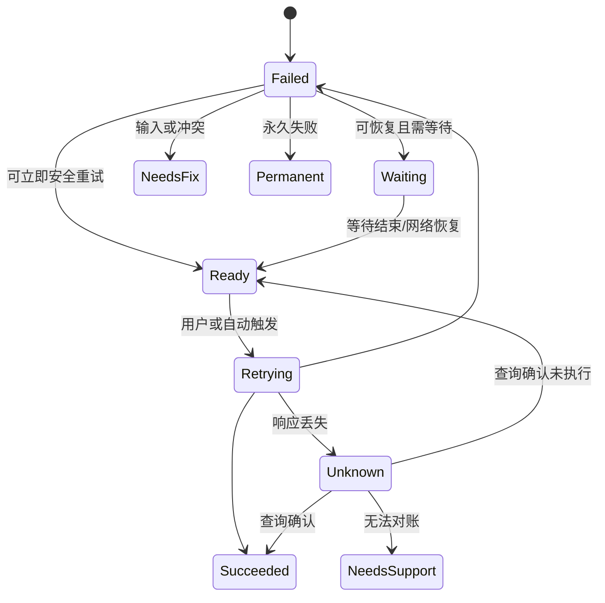
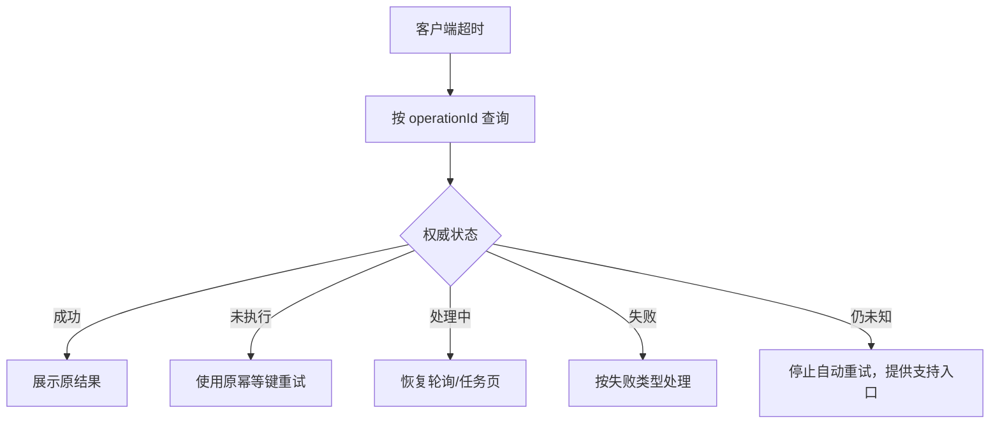

# Retry 重试

重试是在确认条件允许后，再次尝试完成同一个目标。

它不是把失败请求原样无限发送。

用户看到“重试”前，系统必须知道：

- 上一次结果是失败、未执行还是未知。
- 原输入是否仍有效。
- 操作是否可安全重复。
- 当前权限和对象版本是否仍满足。
- 需要重试全部还是失败子集。
- 服务端是否要求等待。

## 重试的三个前提

### 失败可恢复

临时网络错误、服务短暂不可用和速率限制可能恢复。

格式错误、无权限、对象删除和业务规则拒绝不会因立刻再点一次而改变。

### 重复安全

读取通常可以重试。

创建订单、扣款、发送通知等写入必须具有幂等键、去重或状态查询。

### 上下文仍有效

重试前重新检查：

- 会话。
- 权限。
- 对象版本。
- 输入。
- 作用范围。
- 配额。
- 截止时间。

旧页面的“重试”不能绕过新状态。

## 错误到动作的映射

| 错误 | 是否显示重试 | 先做什么 |
| --- | --- | --- |
| 客户端格式错误 | 否 | 定位并修正字段 |
| 401 未认证 | 不直接 | 重新认证并恢复 |
| 403 无权限 | 否 | 申请权限或返回 |
| 404 对象不存在 | 通常否 | 刷新集合或返回 |
| 409/412 冲突 | 不原样重试 | 取得新版本并合并 |
| 429 速率限制 | 等待后 | 遵守 Retry-After |
| 500 | 视错误合同 | 保留输入并有限重试 |
| 503 | 是，受预算限制 | 等待服务恢复 |
| 网络断开 | 网络恢复后 | 判断请求是否已发送 |
| 客户端超时 | 先查询 | 确认结果后决定 |

不能只按 HTTP 状态码决定。

同一个 500 可能发生在写入前，也可能发生在写入后响应序列化阶段。

写操作需要业务操作 ID。

## 状态模型



重试按钮只在 `Ready` 可用。

倒计时结束、网络恢复或重新认证后仍需重新计算状态。

## 用户触发与自动重试

### 自动重试

适合：

- 幂等读取。
- 后台刷新。
- 短暂网络错误。
- 用户无需修正。
- 总预算有限。

自动重试应避免打扰。

但达到预算后必须显示真实失败和手动恢复。

### 手动重试

适合：

- 用户需要确认继续。
- 请求成本较高。
- 需要重新选择输入。
- 服务端恢复时间不确定。
- 上一次失败可能已改变上下文。

### 自动等待 + 手动触发

429 或维护状态可以显示：

“请求过于频繁，可在 24 秒后重试。”

按钮倒计时结束后启用。

不要每秒通过 live region 播报。

## 重试作用范围

重试入口应靠近失败区域：

- 字段验证：字段附近修正，不用“重试表单”。
- 单卡片加载：卡片内重试。
- 页面主数据：页面级错误。
- 批量部分失败：失败项筛选和重试。
- 后台任务：任务中心。

全局“重试”如果不知道作用于哪个请求，会造成：

- 重复成功请求。
- 丢失筛选。
- 重新执行高风险写入。
- 覆盖当前输入。

按钮名称写明对象：

- 重新加载订单
- 重新上传第 3 个分片
- 重试 12 个失败项目
- 再次检查连接

## 保留输入

失败后保留：

- 合法字段。
- 当前选择。
- 上传文件引用（在浏览器允许范围内）。
- 筛选和排序。
- 当前步骤。
- 服务端已确认部分结果。

不要因一次 503 清空整个表单。

敏感值是否保留由安全策略决定。

密码、一次性验证码和支付认证可能需要重新输入，但要明确说明。

## 请求身份

写操作使用稳定逻辑 ID：

```json
{
  "operationId": "order-create-731",
  "idempotencyKey": "b5eb7dca-...",
  "attempt": 2,
  "payloadHash": "sha256:...",
  "previousAttemptId": "attempt-1"
}
```

相同业务操作的重试保持幂等键。

用户明确发起全新操作时生成新键。

服务端将键绑定：

- 主体。
- 租户。
- 操作类型。
- 请求摘要。
- 有效期。

相同键不同正文应拒绝。

## 结果未知

客户端没有响应可能是：

- 请求从未离开浏览器。
- 网关收到但服务端未执行。
- 服务端已经提交，响应丢失。
- 外部系统正在处理。

因此写操作恢复顺序：



不能先生成新订单再检查旧订单。

## HTTP 幂等语义

RFC 9110 把一个方法称为幂等，是指多个相同请求的预期效果与一次相同。

GET、PUT、DELETE 等具有定义的幂等属性，但具体 API 仍需正确实现。

POST 不自动幂等。

客户端只有在知道请求语义可重试，或能确认原请求未应用时，才自动重试非幂等方法。

“DELETE 是幂等”不表示每次响应相同，也不表示审计日志只写一条。

## `Retry-After`

`Retry-After` 可以是：

- 延迟秒数。
- HTTP 日期。

常用于 429 和 503。

客户端需要：

- 正确解析。
- 考虑服务端日期与本地时间差。
- 不早于允许时间重试。
- 仍受总截止时间限制。
- 倒计时结束后重新检查权限和上下文。

服务端没有提供时，可以使用受控退避。

不能用固定 100 ms 高频请求。

## 指数退避与抖动

基础公式：

```text
delay_n = min(cap, base × 2^n)
```

加入随机抖动，避免大量客户端同时恢复形成惊群。

```js
function fullJitterDelay(attempt, baseMs = 500, capMs = 30000) {
  const ceiling = Math.min(capMs, baseMs * 2 ** attempt);
  return Math.floor(Math.random() * ceiling);
}
```

界面不需要向用户展示每个内部毫秒延迟。

显示有意义状态：

- 正在重新连接。
- 24 秒后可重试。
- 已尝试 3 次，停止自动重试。

## 总预算

每个操作定义：

- 最大尝试次数。
- 最大总时间。
- 最大费用。
- 最大上传字节。
- 最晚完成时间。
- 是否允许跨页面恢复。

单个请求重试 3 次、下游 SDK 重试 3 次、网关再重试 3 次，可能放大成大量调用。

需要端到端预算，并让各层知道剩余 deadline。

## 取消

等待重试期间用户可以：

- 取消自动重试。
- 修改输入。
- 离开页面。

取消本地重试不一定取消服务端已经运行的任务。

如果任务仍运行，需要显示任务入口。

用户修改输入后，旧重试计划失效。

新输入是新请求或新 revision，不能让旧定时器稍后发送旧值。

## 焦点

用户激活重试按钮后：

- 焦点通常留在按钮或区域。
- 按钮可显示处理中状态。
- 结果成功后，用状态消息说明。
- 区域内容重建时确保焦点不丢失。
- 如果错误区域移除，焦点移动到恢复的内容标题或合理对象。

普通重试不需要把焦点强制移到页面顶部。

批量结果页更新时，焦点保持在当前控制区域，摘要通过状态消息更新。

## 可用与禁用

原生 `disabled` 按钮不会进入 Tab 顺序。

如果用户需要发现“为什么现在不能重试”，可以：

- 保留说明文本。
- 使用倒计时状态。
- 使用 `aria-disabled="true"` 保持可发现，但代码必须阻止执行。

```html
<button type="button" aria-disabled="true" aria-describedby="retry-wait">
  重试导出
</button>
<p id="retry-wait">服务限制请求频率，24 秒后可重试。</p>
```

仅设置 `aria-disabled` 不会阻止点击。

事件处理器必须检查状态。

## 状态消息

适合播报：

- “正在重新加载订单。”
- “订单已加载。”
- “仍无法连接，已停止自动重试。”
- “12 个失败项目中有 10 个已恢复。”

避免：

- 每次倒计时秒数。
- 每个内部尝试。
- 页面多个组件同时高频播报。

错误和建议需要可见文本。

不要只让屏幕阅读器听到“重试失败”，视觉用户却只看到红色边框。

## 页面级读取案例

读取订单详情失败。

页面已知订单 ID，但没有缓存内容。

设计：

- 主标题保留“订单详情”。
- 内容区域显示“无法加载订单 ORD-731”。
- 说明网络或服务状态，不虚构业务失败。
- 提供“重新加载订单”。
- 保留返回订单列表。

重试成功后：

- 真实内容替换错误区域。
- 焦点保持在合理位置。
- 状态消息说明订单已加载。

如果返回 404，不继续显示网络重试。

## 局部刷新案例

仪表盘中只有汇率卡片失败。

其他卡片正常。

重试应限于汇率卡片。

不要刷新整个页面并丢失：

- 日期筛选。
- 展开状态。
- 其他成功数据。
- 用户滚动位置。

汇率卡片使用自己的请求身份和更新时间。

## 案例一：创建订单响应丢失

### 场景

用户提交订单。

支付尚未发生，但库存预留与订单创建在服务端事务中已经完成。

客户端在接收 201 前断网。

### 错误设计

页面显示“下单失败，请重试”。

用户再次点击，产生第二个订单。

### 正确恢复

1. 首次提交生成幂等键。
2. 服务端创建订单并保存键到结果映射。
3. 客户端超时进入结果未知。
4. 网络恢复后按键查询。
5. 服务端返回原订单 `order-812`。
6. 页面进入原订单结果页。

### 页面文案

> 正在确认订单结果
>
> 请不要重复提交。网络恢复后会继续确认。

长时间仍未知：

> 暂时无法确认订单。参考号 REQ-731。
>
> [再次查询] [联系支持]

### 验收

- 相同键只创建一个订单。
- 相同键不同购物车被拒绝。
- 页面刷新后继续查询同一操作。
- 结果未知不显示失败。
- 支持人员可用公开参考号检索。

## 案例二：分片上传失败

### 场景

上传 4 GB 文件，分为 8 MB 分片。

第 31 个分片连接中断。

### 重试单位

只重试未确认分片。

服务端按：

- upload ID。
- part number。
- checksum。

识别分片。

不能从头上传全部文件。

### 状态

- 已确认字节保持。
- 当前分片显示正在重试。
- 网络断开后暂停。
- 网络恢复后先查询已确认分片。
- 文件变化时旧上传会话失效。

### 故障

服务器对分片 31 已保存，但响应丢失。

查询确认后不再上传同一分片。

### 验收

- 进度只统计服务端确认字节。
- 分片重复不会重复累计。
- 页面刷新按 upload ID 恢复。
- 过期会话说明需要重新选择文件。
- 用户取消停止后续重试并请求清理。

## 案例三：批量策略部署

### 场景

向 50 个环境部署策略。

结果：

- 42 成功。
- 5 临时失败。
- 2 权限拒绝。
- 1 结果未知。

### 重试入口

页面显示：

- “重试 5 个临时失败环境”
- “查询 1 个未知环境”
- 权限拒绝项提供申请权限，不进入重试。

成功 42 个不重复部署。

### 快照

重试前读取每个环境当前版本。

如果策略或环境已变化，要求重新确认，不能使用旧批次输入。

### 对账

新重试批次关联原批次。

原结果不被覆盖。

组合视图显示截至当前的最终状态。

### 验收

- 数量守恒。
- 仅可恢复项进入新批次。
- 未知项先查询。
- 权限错误不自动重试。
- 新批次和原批次可审计。

## 安全

- 每次重试重新认证和授权。
- 幂等键不当作访问凭据。
- 重试不能放宽输入验证。
- Fallback 不能使用权限更大的服务身份。
- 受限对象的失败信息不泄露存在性。
- 日志记录错误类别、attempt 和操作 ID，不记录敏感正文。
- 429 等待不能通过切换前端绕过服务端限流。

攻击者输入不能控制无限重试次数、目标 URL 或任意延迟。

## 观测

记录：

- 首次失败类别。
- 自动与手动尝试次数。
- 每次等待。
- 最终结果。
- 结果未知查询次数。
- 幂等命中。
- 重试后成功率。
- 按 endpoint、版本和网络分层。
- 重试放大系数。

```text
retry_amplification
  = total_request_attempts / logical_operations
```

成功率高但放大系数很高，说明系统可能通过大量额外负载掩盖不稳定。

## 测试清单

### 分类

- 格式错误不显示原样重试。
- 权限错误提供合法路径。
- 冲突进入合并。
- 429 遵守 Retry-After。
- 超时进入未知。

### 请求

- 写操作有稳定 ID。
- 相同键不同正文拒绝。
- 自动重试受总预算约束。
- 多层 SDK 不重复放大。
- 用户修改输入取消旧计划。

### 范围

- 局部失败只重试局部。
- 批量成功项不重复。
- 未知项先查询。
- 筛选和输入保留。
- 页面刷新可恢复任务。

### 无障碍

- 重试按钮名称说明对象。
- 等待原因可发现。
- 状态变化程序化可感知。
- 焦点不因区域重建丢失。
- 倒计时不每秒播报。

### 安全

- 重试重新授权。
- Token 和敏感输入不进日志。
- 服务限流不可由客户端绕过。
- 回退路径不扩大权限。
- 支持参考号不泄露内部 trace。

## 综合练习

设计“导出 500 万行财务数据”的重试体验。

要求：

1. 区分提交、排队、生成、上传对象存储和下载阶段。
2. 为每阶段定义失败、未知和恢复。
3. 设计 429、503、会话过期和权限撤销。
4. 说明何时自动重试，何时用户触发。
5. 设计任务 ID 与幂等键。
6. 页面刷新后恢复同一任务。
7. 下载链接过期不重新生成整份导出。
8. 给出状态消息与焦点策略。

完成标准是同一逻辑导出最多产生一个可对账任务，错误后不会丢失作用范围或重复生成敏感数据。

## 来源

- [IETF RFC 9110：HTTP Semantics，Idempotent Methods 与 Retry-After](https://www.rfc-editor.org/rfc/rfc9110.html)（访问日期：2026-07-18）
- [IETF RFC 6585：Additional HTTP Status Codes，429 Too Many Requests](https://www.rfc-editor.org/rfc/rfc6585.html)（访问日期：2026-07-18）
- [W3C：WCAG 2.2，Status Messages](https://www.w3.org/TR/WCAG22/#status-messages)（访问日期：2026-07-18）
- [W3C WAI-ARIA APG：Button Pattern](https://www.w3.org/WAI/ARIA/apg/patterns/button/)（访问日期：2026-07-18）
- [IETF RFC 9457：Problem Details for HTTP APIs](https://www.rfc-editor.org/rfc/rfc9457.html)（访问日期：2026-07-18）
