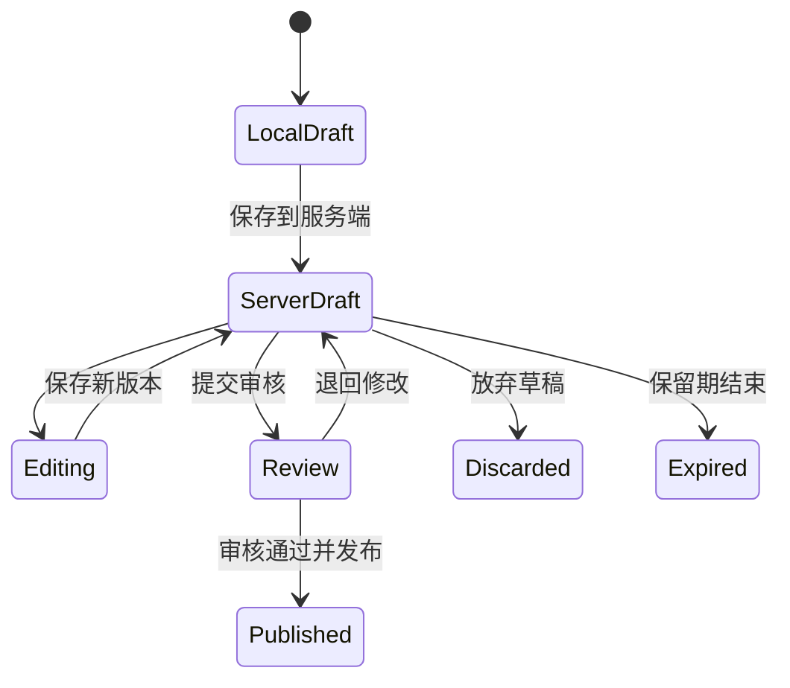
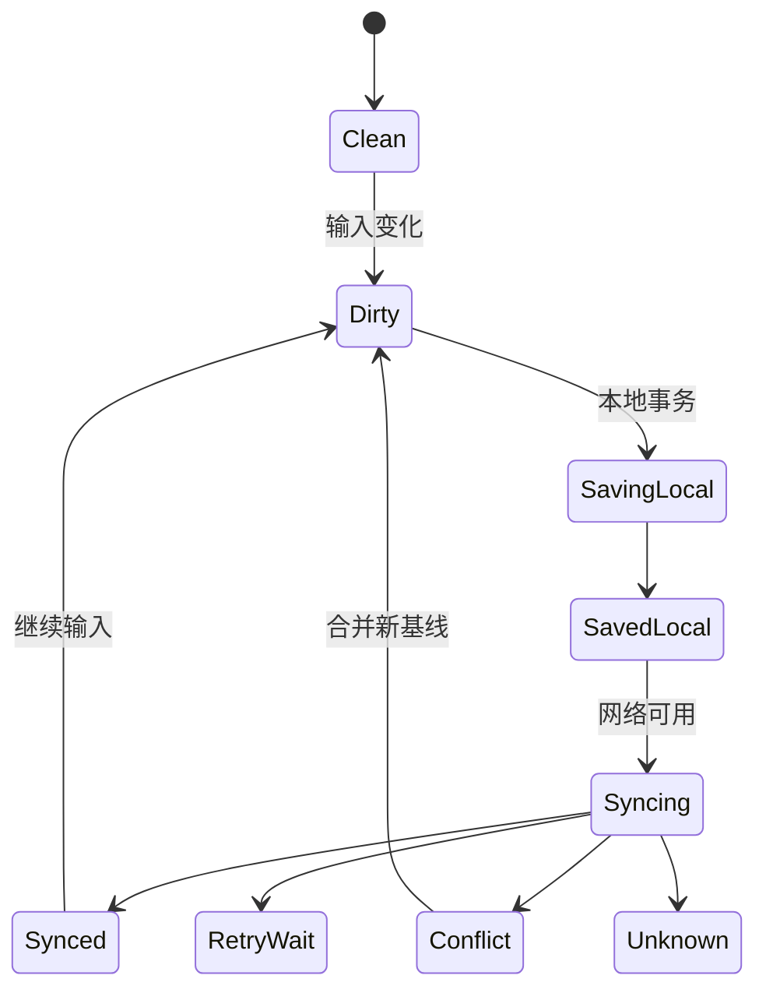

# Save Draft 保存草稿

草稿是在正式提交、发布或生效之前保存的未完成工作。

它的价值是让用户可以中断、恢复和跨步骤继续，而不是把不完整数据伪装成正式对象。

设计草稿必须说明：

- 保存在哪里。
- 谁可以读取。
- 保存了哪些字段。
- 何时过期。
- 是否跨设备。
- 是否已经产生业务副作用。
- 如何升级为正式对象。

## 草稿的四种范围

### 内存草稿

只存在当前页面或应用进程。

刷新、崩溃或标签关闭会丢失。

适合短时、低风险输入。

### 当前设备草稿

保存在 IndexedDB 等浏览器存储。

可在同一浏览器恢复，但受配额、清理、账户切换和共享设备隐私影响。

### 服务端个人草稿

绑定用户和租户，可跨设备继续。

需要稳定 ID、权限、版本、保留期和审计。

### 协作草稿

多名成员可共同编辑。

需要成员权限、并发模型、存在感、版本历史和发布责任。

这四种草稿不能都显示为“已保存”。

文案应说明：

- 已保存在此页面。
- 已保存在此设备。
- 已同步到草稿。
- 已与团队成员同步。

## 草稿与正式对象

草稿状态不能通过“某些字段为空”推断。

需要显式生命周期：



`Published` 不是把 `draft=true` 改成 false 就结束。

发布可能需要：

- 完整校验。
- 权限和审批。
- 生成正式版本。
- 建立公开 URL。
- 发送通知。
- 更新索引。
- 冻结审计快照。

## 草稿身份

服务端草稿需要稳定 ID：

```json
{
  "draftId": "draft-01JZ8K7W2Q",
  "kind": "product-requirement",
  "ownerId": "user-72",
  "tenantId": "org-31",
  "version": 8,
  "state": "draft",
  "updatedAt": "2026-07-18T12:00:00Z",
  "expiresAt": "2026-10-18T12:00:00Z"
}
```

正式对象创建后可以：

- 继续使用同一业务对象 ID，只新增正式版本。
- 或产生新正式对象，并记录 `sourceDraftId`。

选择必须明确。

URL、附件和评论都依赖身份策略。

## 保存时机

### 手动保存草稿

用户明确点击。

适合：

- 高风险内容。
- 需要控制同步时机。
- 草稿保存有费用或权限影响。
- 当前网络或隐私要求不允许自动上传。

### 自动保存

输入后定期保存。

适合：

- 长内容。
- 高频修改。
- 保存低风险。
- 服务端支持版本与恢复。

### 生命周期保存

页面隐藏、路由切换或失焦时尝试保存。

只能作为补充。

浏览器关闭、崩溃或系统终止时不保证异步请求完成。

可靠方案需要在编辑过程中持续保存，而不是把所有希望寄托在 `beforeunload`。

## 保存状态



界面需要区分：

- 有未保存修改。
- 正在保存到设备。
- 已保存到设备，尚未同步。
- 正在同步。
- 已同步。
- 同步失败。
- 版本冲突。
- 结果未知。

## 本地存储选择

### `sessionStorage`

- 当前标签页会话范围。
- 字符串键值。
- 适合少量短时数据。

### `localStorage`

- 同源持久键值。
- 同步 API。
- 不适合大型、频繁写入或结构化草稿。

### IndexedDB

- 结构化对象。
- 索引。
- 异步 API。
- 事务。
- 适合草稿、附件元数据和 outbox。

### Cache Storage

适合请求/响应缓存，不适合作为可编辑草稿数据库。

## 存储不是永久承诺

浏览器存储受：

- 配额。
- 存储压力清理。
- 隐私模式。
- 用户清除站点数据。
- 浏览器策略。
- Origin 变化。
- 设备故障。

应用可以请求持久存储，但是否授予由用户代理决定。

```js
async function requestPersistentStorage() {
  if (!navigator.storage?.persist) return false;
  return navigator.storage.persist();
}
```

即使返回 `true`，也不等于备份。

关键草稿仍需要服务端同步或用户导出能力。

## IndexedDB 事务

保存草稿和待同步命令应在同一事务中：

```text
transaction(drafts, outbox, readwrite)
  put draft snapshot
  put sync command
commit
```

只有事务 `complete` 后才能显示“已保存在此设备”。

单个 request `success` 不一定表示整个事务已经提交。

事务失败时：

- 保留内存输入。
- 显示本地保存失败。
- 说明是否仍可复制或下载。
- 检查配额与数据可序列化性。

## 本地草稿结构

```json
{
  "localDraftId": "local-draft-731",
  "serverDraftId": "draft-01JZ8K7W2Q",
  "baseVersion": 8,
  "localRevision": 12,
  "schemaVersion": 4,
  "fields": {
    "title": "支付重构需求",
    "body": "..."
  },
  "dirtyFields": [
    "body"
  ],
  "savedAt": "2026-07-18T12:00:10+08:00",
  "syncState": "queued"
}
```

不要保存：

- 访问令牌。
- 密码。
- 一次性验证码。
- 服务端权限结论。
- 可重新计算的大型缓存。

## Schema 版本

产品升级后草稿结构可能变化。

打开草稿时：

1. 读取 `schemaVersion`。
2. 按受控迁移链转换。
3. 验证迁移结果。
4. 保存新版本前保留旧快照或可恢复备份。
5. 无法迁移时提供安全导出。

不能直接把旧 JSON 填入新表单。

字段被删除、拆分或权限变化都需要迁移策略。

## 自动保存防抖

```js
let localRevision = 0;
let saveTimer;

function onDraftInput(nextFields) {
  localRevision += 1;
  const revision = localRevision;

  clearTimeout(saveTimer);
  saveTimer = setTimeout(async () => {
    await saveLocalDraft({
      revision,
      fields: nextFields
    });
  }, 700);
}
```

完整实现还需：

- 页面隐藏时 flush。
- 同一草稿的写入串行化。
- 事务完成判断。
- 配额错误。
- 多标签冲突。
- 服务端版本。
- 敏感字段过滤。

## 多标签页

同一草稿在多个标签打开时可能互相覆盖。

可以使用：

- 服务端版本。
- IndexedDB 中本地 revision。
- BroadcastChannel 通知。
- Web Locks 协调同源标签。
- 只读提示或显式接管。

Web Locks 只能协调同一浏览器存储桶中的 agent。

它不能替代跨设备和服务端版本控制。

策略示例：

> 此草稿已在另一个标签页编辑。当前页面为只读。 [在此处继续编辑]

接管后仍需比较版本。

## 服务端保存

请求附带基线：

```http
PATCH /api/drafts/draft-01JZ8K7W2Q HTTP/1.1
If-Match: "draft-v8"
Content-Type: application/merge-patch+json
```

响应返回：

- 新版本。
- 规范化后的字段。
- 更新时间。
- 保存状态。
- 当前能力。

保存期间继续输入时，迟到响应不能覆盖新内容。

只清除属于提交快照的脏字段。

## 冲突

草稿也会冲突：

- 同一用户两个设备编辑。
- 协作者同时编辑。
- 管理员修改模板。
- 自动化更新字段。

保存本地值、服务端值和共同基线，执行三方比较。

字段未重叠时可按策略合并。

同字段冲突需要用户选择。

富文本可使用专门协作算法，但发布状态、权限和附件仍需领域规则。

## 离线

离线编辑应明确：

- 哪些字段能离线。
- 附件是否已保存在设备。
- 待同步数量。
- 最近服务端版本。
- 重新联网后的授权。
- 冲突处理。

Outbox 不保存旧会话令牌。

联网后使用当前身份重新授权。

若用户已退出或切换账户，不能把旧账户草稿同步到新账户。

## 草稿保留期

保留策略包括：

- 最后更新时间。
- 到期日。
- 到期前提醒。
- 自动延长条件。
- 删除后的恢复期。
- 法律或隐私要求。

到期不能只发生在客户端。

服务端后台任务执行权威到期，并在 API 中返回状态。

重要草稿到期前提供：

- 继续编辑以延长。
- 导出。
- 提交。
- 主动删除。

## 放弃草稿

“放弃”可能是：

- 清除当前设备副本。
- 删除服务端草稿。
- 离开但保留草稿。
- 从共享草稿退出。

按钮必须使用具体文案。

删除服务端草稿前说明：

- 是否影响协作者。
- 附件是否删除。
- 是否可恢复。
- 是否保留审计。

本地与服务端删除可能部分成功，需要对账。

## 草稿列表

草稿中心应显示：

- 草稿标题或安全占位。
- 类型。
- 所属范围。
- 最后编辑者。
- 设备/服务端状态。
- 更新时间。
- 到期时间。
- 冲突或同步失败。

同名草稿通过范围和时间区分。

不要把只有本地副本的草稿展示为“已同步”。

## 恢复入口

恢复草稿时验证：

- 当前用户身份。
- 租户。
- 草稿权限。
- Schema 版本。
- 当前正式对象状态。
- 依赖对象是否仍存在。
- 附件是否完整。

恢复不是简单“继续填写”。

如果关联项目已删除或权限撤销，提供：

- 另存到允许的范围。
- 下载允许保留的内容。
- 申请权限。
- 安全删除。

## 正式提交

提交前：

1. 确认使用最新草稿版本。
2. 执行完整客户端校验。
3. 服务端重新认证和授权。
4. 执行业务与数据校验。
5. 显示高后果摘要。
6. 以草稿版本条件提交。
7. 生成正式对象或正式版本。
8. 记录来源草稿和审计。

提交成功后：

- 草稿进入 `submitted` 或 `published`。
- 不再接受旧版本保存。
- 本地缓存清除或标记只读。
- 页面进入正式对象。

## 提交与保存竞态

自动保存请求 A 尚未返回，用户点击提交 B。

处理方式：

- 提交等待 A 收敛，再基于最新版本。
- 或 B 携带完整当前快照和基线，服务端原子提交。

不能让迟到的 A 在 B 发布后把正式状态改回草稿。

服务端状态机禁止 `published → draft` 的普通保存。

## 隐私

草稿可能比正式内容更敏感，因为包含：

- 未批准计划。
- 个人备注。
- 凭据片段。
- 未脱敏数据。
- 法律或人事信息。

要求：

- 数据最小化。
- 本地存储按账户隔离。
- 登出清理策略。
- 服务端加密和访问控制。
- 保留期。
- 分析事件不记录正文。
- 共享设备重新认证。
- 导出受权限控制。

不要默认把所有输入同步到云端而不说明。

## 案例一：贷款申请草稿

### 特点

- 多步骤。
- 包含身份和财务信息。
- 提交具有法律后果。
- 会话可能超时。
- 用户需要跨设备完成。

### 设计

- 草稿保存在服务端加密存储。
- 当前设备只缓存最小恢复索引。
- 敏感字段不写入普通 localStorage。
- 每一步明确“保存并稍后继续”。
- 重新打开需要重新认证。
- 上一步已输入信息在后续步骤可选择，不要求重复输入。
- 提交前提供完整摘要和修正入口。

### 超时

会话到期前：

- 已保存字段继续保留在服务端草稿。
- 未保存字段在允许范围内先写加密本地暂存或提示保存。
- 重新认证后按草稿版本恢复。

不能把密码或验证码保存进草稿。

### 验收

- 多步骤返回不丢值。
- 重新认证不要求重复所有信息。
- 共享设备退出后本地敏感缓存清理。
- 草稿过期前通知。
- 提交后旧草稿不能再次编辑。
- 审计区分保存草稿与正式申请。

## 案例二：离线现场巡检草稿

### 特点

- 无网络。
- 包含照片。
- 设备存储有限。
- 多个检查点。
- 回网后可能有版本冲突。

### 本地事务

同一 IndexedDB 事务写：

- 巡检记录。
- 附件元数据。
- Outbox 命令。

照片 blob 单独保存并用摘要关联。

只有记录和 outbox 提交后显示“已保存在此设备”。

### 配额失败

照片保存失败时：

- 文本草稿仍可保存。
- 明确指出哪张照片没有保存。
- 允许降低质量或删除其他本地下载。
- 不显示全部保存成功。

### 同步

回网后：

1. 重新认证。
2. 读取检查任务当前版本。
3. 上传附件。
4. 提交草稿。
5. 处理检查点删除或权限变化。
6. 返回服务端 ID 和版本。

### 验收

- 重启浏览器可恢复。
- 附件缺失能检测。
- 切换账号不显示旧草稿。
- 同步重试不重复创建记录。
- 冲突不覆盖本地观察。
- 用户可以查看待同步项目。

## 案例三：多人 PRD 草稿

### 状态

- 草稿。
- 待评审。
- 已退回。
- 已批准。
- 已发布。

编辑正文和改变审批状态是不同操作。

### 协作

- 文本使用协作编辑。
- 关键字段有版本。
- 评论不混入正文草稿。
- 发布锁定明确快照。
- 发布后新修改产生下一草稿版本。

### 竞态

评审者批准 snapshot 18。

作者同时编辑出 snapshot 19。

系统只能发布被批准的 18，或要求 19 重新审批。

不能把“当前最新”19 自动替换进已经批准的发布任务。

### 验收

- 审批绑定快照。
- 发布记录来源版本。
- 发布后新编辑不改已发布内容。
- 评论权限与正文权限分开。
- 历史版本可对账。

## 无障碍

- 保存按钮名称具体。
- 自动保存状态可被感知但不过度播报。
- 草稿列表使用清楚标题和范围。
- 多步骤进度与当前步骤可识别。
- 重新认证后焦点回到合理位置。
- 错误保留输入并定位问题。
- 到期时间不只靠颜色。
- 键盘可以执行保存、继续和放弃。

自动保存不应每次触发 `alert`。

用稳定 `status` 区域按“保存中、已保存、失败”等显著状态更新。

## 观测

记录：

- 草稿创建。
- 本地保存成功/失败。
- 服务端同步。
- 冲突。
- 恢复。
- 提交。
- 过期。
- 放弃。
- 配额错误。
- Schema 迁移错误。

不记录正文和敏感字段。

指标包括：

- 草稿恢复率。
- 恢复后完成率。
- 未保存离开率。
- 本地到服务端同步延迟。
- 冲突率。
- 到期前提交率。
- 附件保存失败率。
- Schema 迁移成功率。

## 测试清单

### 本地

- IndexedDB 事务完成后才显示已保存。
- 配额不足保留内存输入。
- 浏览器重启恢复。
- 清除站点数据后给出真实结果。
- 多标签不会静默覆盖。

### 服务端

- 草稿有稳定 ID 和版本。
- 同一请求重试不重复创建。
- 权限每次保存重新检查。
- 到期由服务端判断。
- 提交后旧保存被拒绝。

### 同步

- 离线与在线状态区分。
- Outbox 不保存令牌。
- 账号切换隔离。
- 响应乱序不覆盖新 revision。
- 结果未知先查询。

### 生命周期

- 草稿、评审和正式状态不可混淆。
- 审批绑定明确快照。
- 丢弃范围明确。
- 到期前有恢复或导出。
- 历史可审计。

### 无障碍

- 保存状态通过适当语义播报。
- 表单值和错误可恢复。
- 多步骤不要求重复输入。
- 焦点不会因自动保存移动。
- 到期和同步失败使用文本说明。

## 综合练习

设计“创建年度预算方案”的草稿系统。

要求：

1. 支持 12 个部门分步填写。
2. 支持离线查看和有限编辑。
3. 定义个人草稿与共享草稿。
4. 处理多标签和跨设备冲突。
5. 处理附件、配额和 Schema 升级。
6. 审批绑定固定快照。
7. 发布后新修改产生下一版本。
8. 设计保留期、权限和审计。
9. 给出自动保存与状态播报策略。

完成标准是用户能知道工作保存在哪里、哪个版本进入审批，以及故障后能恢复多少，而不是页面显示一个“已保存”图标。

## 来源

- [WHATWG：Storage Standard](https://storage.spec.whatwg.org/)（访问日期：2026-07-18）
- [W3C：Indexed Database API 3.0](https://www.w3.org/TR/IndexedDB/)（访问日期：2026-07-18）
- [W3C：Web Locks API](https://www.w3.org/TR/web-locks/)（访问日期：2026-07-18）
- [W3C：WCAG 2.2，Redundant Entry](https://www.w3.org/TR/WCAG22/#redundant-entry)（访问日期：2026-07-18）
- [WHATWG：HTML Living Standard，Forms](https://html.spec.whatwg.org/multipage/forms.html)（访问日期：2026-07-18）
