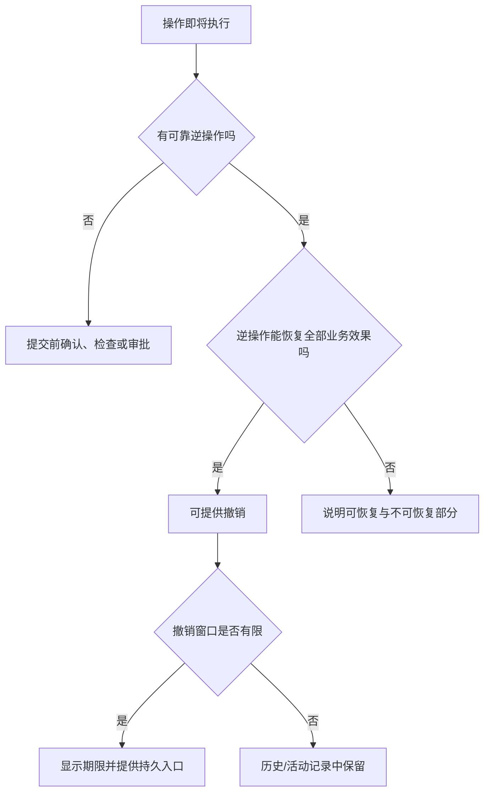
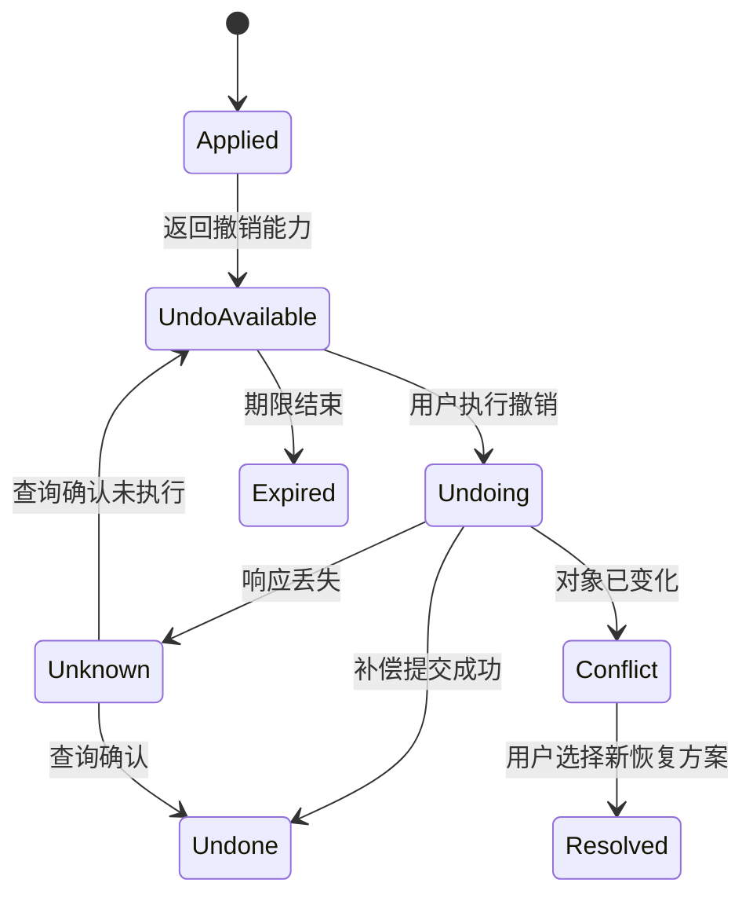
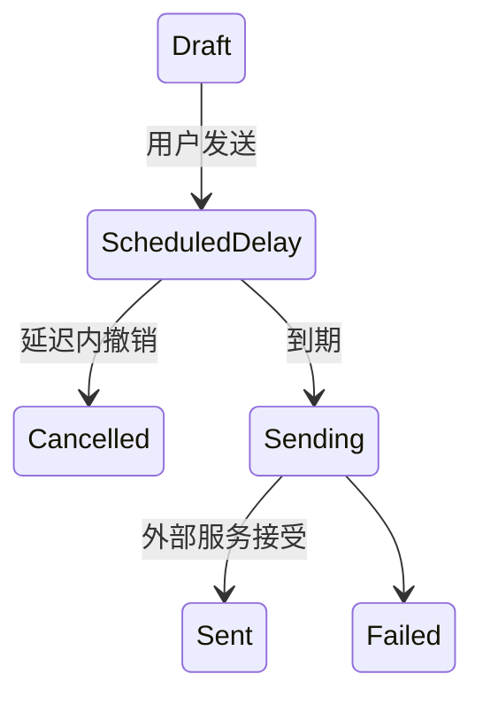

# Undo 撤销

撤销把已经执行的操作转换为一个新的、可验证的恢复结果。

它不是把界面画回原样。

如果原操作已经提交到服务端，撤销也必须提交一个真实的逆向操作、补偿操作或历史恢复版本。

## 三种撤销

### 本地编辑撤销

只改变当前编辑会话中的未提交状态。

例如文本编辑器的 `Cmd/Ctrl + Z`。

### 已提交操作撤销

原操作已经改变服务端对象。

撤销发送新的业务命令，例如恢复已删除评论、把文件移回原目录。

### 历史版本恢复

把某个旧版本的内容作为新版本提交。

例如从 v31 恢复 v18，产生 v32。

不应删除 v19–v31 的历史。

三者的范围、权限、持续时间和失败模式完全不同。

## 可逆性判断



以下操作通常不能完全撤销：

- 已发送邮件或通知。
- 已被第三方读取的公开信息。
- 金融结算。
- 已触发的外部 webhook。
- 已下载的秘密。
- 已执行的物理操作。

可以补偿不等于回到从未发生。

例如退款补偿扣款，但账务流水、手续费和外部通知仍然存在。

## 撤销契约

原操作成功响应可以返回撤销能力：

```json
{
  "operationId": "move-731",
  "result": {
    "objectId": "file-42",
    "fromParentId": "folder-a",
    "toParentId": "folder-b",
    "newVersion": 19
  },
  "undo": {
    "token": "undo-token-redacted",
    "expiresAt": "2026-07-18T12:10:00Z",
    "action": "file.move.undo"
  }
}
```

撤销令牌至少绑定：

- 原操作。
- 当前主体或授权范围。
- 对象。
- 版本或逆操作前置条件。
- 到期时间。
- 是否已使用。

令牌不能包含可被客户端篡改后扩展权限的明文状态。

## 状态模型



“撤销按钮被点击”不是 `undone`。

服务端确认补偿结果后，界面才能声明撤销完成。

## 撤销窗口

窗口取决于业务：

- 本地编辑：通常持续到新操作改变历史栈。
- 软删除：可能持续 30 天。
- 移动操作：可能在后续修改前有效。
- 发送邮件：可能只是发送队列真正出站前的延迟。
- 权限修改：直到更高风险操作使用新权限前。

界面不能只依赖几秒 Toast 暴露唯一撤销入口。

重要撤销应同时存在于：

- 活动记录。
- 回收站。
- 版本历史。
- 对象详情。
- 任务结果页。

## Toast 中的撤销

Toast 适合低风险、短时的快速撤销。

要求：

- 文案说明已经发生的操作。
- 撤销按钮可用键盘到达。
- 获得焦点时暂停关闭。
- Toast 消失后仍有必要入口。
- 撤销请求有结果反馈。
- 失败不会静默恢复旧视觉状态。

```html
<div role="status">
  评论已删除。
  <button type="button">撤销删除</button>
</div>
```

普通成功消息可用 `status`。

重要失败不应因为放在 Toast 中就自动消失。

## 焦点

原操作移除当前获得焦点的对象时，焦点要移动到：

- 下一逻辑对象。
- 上一对象。
- 集合标题。
- 空状态的主操作。

撤销恢复对象后，不一定强制把焦点移回恢复对象。

可以：

- 用状态消息说明“评论已恢复”。
- 提供“查看恢复的评论”链接。
- 在用户主动查看时移动焦点。

如果撤销按钮本身随 Toast 消失，焦点不能落到 `body`。

## 键盘快捷键

编辑器常见：

- macOS：`Command + Z`
- Windows/Linux：`Control + Z`
- 重做：平台相应约定

Web 应用需要避免：

- 阻止浏览器或操作系统的预期快捷键却没有等价实现。
- 在普通输入框内把撤销错误映射到全局对象操作。
- 焦点在编辑器外时仍撤销文本。
- 快捷键执行高风险服务端补偿但没有状态反馈。

快捷键作用域由当前焦点和模式决定。

按钮或菜单中仍应提供可发现入口。

## 历史栈

本地编辑历史记录的是操作，不一定是完整快照。

```ts
type EditCommand = {
  id: string;
  apply(): void;
  revert(): void;
  mergeWith?(next: EditCommand): EditCommand | null;
};
```

连续输入字符可以合并为一个撤销单元。

合并边界可使用：

- 时间间隔。
- 光标移动。
- 字段切换。
- 粘贴。
- 格式操作。
- 显式提交。

每个按键一个历史项会让撤销体验过碎，也消耗内存。

## 重做

撤销后执行新操作通常清空 redo 分支。

```text
A → B → C
撤销到 B
执行 D
新历史：A → B → D
```

如果产品保留分支历史，应显式展示版本树，不能让“重做”在两个分支间随机选择。

服务端历史恢复不是同一客户端 redo 栈。

## 补偿操作

分布式业务通常不能回滚已经提交的跨系统事务。

撤销使用补偿：

- 创建对象 → 归档或删除对象。
- 扣款 → 退款。
- 分配席位 → 释放席位。
- 发送任务排队 → 在真正发送前取消。

补偿必须：

- 幂等。
- 可审计。
- 有独立操作 ID。
- 验证当前权限。
- 验证对象当前状态。
- 明确部分失败。

```json
{
  "operationId": "refund-8841",
  "compensates": "charge-731",
  "amount": 29900,
  "currency": "CNY",
  "reason": "user-cancelled",
  "idempotencyKey": "..."
}
```

退款不是删除扣款记录。

账务历史必须同时保留。

## 并发

原操作后对象可能继续变化。

例：

1. A 把文件从文件夹 X 移到 Y。
2. B 在 Y 中重命名文件。
3. A 撤销移动。

撤销应决定：

- 仅恢复父目录，保留 B 的新名称。
- 因版本变化进入冲突。
- 若 B 无权访问 X，是否仍能移动。

不能把原对象完整旧快照覆盖回去，否则会丢失 B 的修改。

逆操作应只改变原操作负责的领域字段，并使用当前版本条件。

## 删除撤销

软删除记录：

```json
{
  "id": "comment-42",
  "deletedAt": "2026-07-18T12:00:00Z",
  "deletedBy": "user-7",
  "deleteOperationId": "delete-731",
  "version": 19
}
```

恢复需要检查：

- 对象仍在保留期。
- 当前主体有恢复权限。
- 父对象仍存在。
- 名称或唯一键没有被占用。
- 子对象如何恢复。
- 删除后新对象是否产生冲突。

恢复不是把 `deletedAt` 设为 `null` 就结束。

索引、缓存、引用和权限都需要恢复或重新计算。

## 移动撤销

移动命令保存：

- 对象 ID。
- 原父对象 ID。
- 新父对象 ID。
- 原相对位置锚点。
- 执行后版本。

撤销时：

1. 读取当前对象。
2. 检查它是否仍在新父对象。
3. 检查原父对象是否存在且可写。
4. 重新授权。
5. 按可用锚点恢复位置。
6. 提交新版本。

如果原锚点已删除，可选择：

- 放到原父对象末尾。
- 让用户选择位置。
- 进入冲突。

策略必须明确。

## 批量撤销

批量操作产生逐项结果。

批量撤销也要逐项执行：

```json
{
  "undoBatchId": "undo-batch-99",
  "originalBatchId": "move-batch-88",
  "counts": {
    "restored": 72,
    "conflicted": 3,
    "forbidden": 2,
    "expired": 1
  }
}
```

不能只显示“撤销失败”。

用户需要查看：

- 哪些对象恢复。
- 哪些保持原结果。
- 哪些需要手动处理。
- 是否可再次尝试。

## 权限

能执行原操作不必然能撤销。

原因：

- 角色被撤销。
- 对象移动到新权限范围。
- 撤销会影响其他用户。
- 补偿需要更高权限。
- 合规保留禁止恢复。

界面可以预先显示撤销窗口，但服务端每次撤销仍重新授权。

不能把撤销 token 当作 bearer 权限。

## 安全与隐私

- 撤销令牌不放 URL 查询参数。
- Token 不写日志和分析。
- 恢复受限对象不能泄露内容。
- 审计记录原操作与补偿关系。
- 高风险撤销需要重新认证或审批。
- 历史版本也受当前访问控制。
- 回收站不能绕过删除后的权限变化。

恢复个人数据时还需遵守保留和删除政策。

合规硬删除后不能提供虚假撤销。

## 案例一：撤销文件移动

### 场景

用户把“合同.pdf”从“法务”移动到“公开资料”。

服务端完成移动，返回 60 秒撤销能力。

### 风险

目标目录可能让更多成员获得读取权。

文件移动后可能：

- 被重命名。
- 被再次移动。
- 被下载。
- 权限继承改变。
- 原目录被删除。

### 设计

移动成功后：

> “合同.pdf”已移到“公开资料”。 [撤销]

同时活动记录保留移动事件。

如果暴露风险高，系统不应依赖用户撤销，而应在移动前显示权限变化并确认。

### 撤销

服务端只逆转父目录字段。

保留移动后的重命名。

若文件已再次移动，返回冲突，不把它强行移回。

若原目录已删除，提供选择合法目标。

### 验收

- 双击撤销只执行一次。
- 迟到响应不重复移动。
- 文件权限重新计算。
- 搜索索引与面包屑更新。
- 失败时说明文件当前真实位置。
- 屏幕阅读器能获知恢复结果。

## 案例二：撤销成员角色变更

### 场景

管理员把成员从 Editor 改为 Viewer。

修改立即生效。

### 业务边界

恢复 Editor 是新的授权操作。

需要检查：

- 操作者仍有管理权限。
- 成员仍属于组织。
- Editor 席位仍有额度。
- 没有新的策略禁止。
- 恢复不会覆盖其他管理员的后续角色变更。

### 并发

另一管理员随后把成员改为 Billing Admin。

旧撤销不能把 Billing Admin 覆盖回 Editor。

服务端检测当前版本不等于原操作产生的版本，返回冲突。

界面显示当前角色，并允许有权限用户作新的明确选择。

### 审计

记录：

- v17：Editor → Viewer，操作 A。
- v18：Viewer → Billing Admin，操作 B。
- 旧操作 A 的撤销尝试被拒绝。

不能删除 v17。

### 验收

- 撤销使用版本条件。
- 席位额度重新检查。
- 权限缓存及时失效。
- 冲突不显示虚假恢复。
- 角色历史可对账。

## 案例三：撤销邮件发送

### 真实语义

多数“撤销发送”是在短暂延迟队列中取消尚未出站的邮件。

邮件已经交给外部服务器后，无法保证收回。

### 状态



只有 `ScheduledDelay` 可以可靠撤销。

### 文案

发送后：

> 邮件将在 10 秒后发送。 [撤销发送]

进入 Sending 后撤销入口消失或变为明确不可用。

不能在 Sent 后显示“撤销成功”，只把邮件从本地已发送列表隐藏。

### 验收

- 倒计时使用服务端绝对截止时间。
- 页面刷新后仍能看到剩余窗口。
- 多标签撤销只执行一次。
- 网络超时后查询消息状态。
- 外部服务器接受后不承诺收回。

## 历史版本恢复案例

文档当前 v31，用户选择恢复 v18。

确认页面应显示：

- 当前版本 v31。
- 目标内容来源 v18。
- 从 v19 到 v31 的更改不会消失于历史。
- 恢复将产生 v32。
- 评论、附件或权限是否包含在恢复范围。

恢复请求：

```json
{
  "documentId": "doc-42",
  "sourceVersion": 18,
  "expectedCurrentVersion": 31,
  "restoreFields": [
    "title",
    "body"
  ]
}
```

服务端提交前重新检查当前仍是 v31。

如果已经是 v32，要求重新比较。

## 反馈

撤销过程至少有：

- 正在撤销。
- 已撤销。
- 撤销期限已过。
- 当前状态已变化，无法直接撤销。
- 结果未知，正在确认。
- 部分撤销。

普通低风险结果可以用状态消息。

冲突、部分失败和需要选择的情况使用持久区域或结果页。

不要在撤销请求发出时立即把界面恢复并宣称完成。

可以乐观恢复视觉，但必须：

- 标记待确认。
- 服务端失败时正确回滚。
- 不丢失当前权威状态。

## 观测

记录：

- 可撤销操作数量。
- 撤销入口展示与使用。
- 撤销成功、冲突、过期和未知。
- 原操作到撤销的时间。
- 撤销后再次执行同操作。
- 批量撤销的逐项结果。
- 补偿失败。
- 恢复版本来源与结果版本。

撤销率高可能说明：

- 操作入口容易误触。
- 默认范围不清。
- 结果反馈太慢。
- 用户在试探系统。
- 批量选择不可信。

不能简单解释为“撤销功能受欢迎”。

## 测试清单

### 语义

- 明确撤销的是本地修改、服务端操作还是历史版本。
- 可恢复范围准确。
- 不可恢复副作用被说明。
- 撤销不删除审计历史。

### 请求

- 撤销幂等。
- 令牌绑定原操作和主体。
- 超时先查询结果。
- 重复点击不重复补偿。
- 到期由服务端判断。

### 并发

- 对象后续变化触发版本冲突。
- 逆操作只改变负责字段。
- 原父对象删除有替代路径。
- 批量撤销逐项对账。
- 高风险领域不通用覆盖。

### 无障碍

- 撤销按钮有具体名称。
- 键盘可以到达。
- 获得焦点时不会因 Toast 超时被移除。
- 恢复结果使用状态消息。
- 焦点不会落到已删除节点。

### 安全

- 当前权限重新验证。
- Token 不进入 URL 和日志。
- 回收站内容受当前 ACL 控制。
- 合规硬删除没有虚假恢复入口。
- 审计连接原操作与补偿。

## 综合练习

设计“撤销批量归档 500 个客户”的流程。

要求：

1. 定义归档对订单、自动化和权限的影响。
2. 判断哪些副作用可逆。
3. 设计撤销窗口与持久入口。
4. 处理 20 个客户在归档后被再次修改。
5. 处理操作者权限撤销。
6. 定义逐项结果和计数守恒。
7. 设计超时与重复请求恢复。
8. 给出焦点和状态播报策略。

完成标准不是列表重新出现，而是每个客户的权威状态、关联副作用和审计关系都能被解释。

## 来源

- [W3C：WCAG 2.2，Error Prevention (Legal, Financial, Data)](https://www.w3.org/TR/WCAG22/#error-prevention-legal-financial-data)（访问日期：2026-07-18）
- [W3C WAI-ARIA APG：Button Pattern](https://www.w3.org/WAI/ARIA/apg/patterns/button/)（访问日期：2026-07-18）
- [W3C WAI-ARIA APG：Alert Pattern](https://www.w3.org/WAI/ARIA/apg/patterns/alert/)（访问日期：2026-07-18）
- [IETF RFC 5789：PATCH Method for HTTP](https://www.rfc-editor.org/rfc/rfc5789.html)（访问日期：2026-07-18）
- [MDN：Element beforeinput event](https://developer.mozilla.org/en-US/docs/Web/API/Element/beforeinput_event)（访问日期：2026-07-18）
