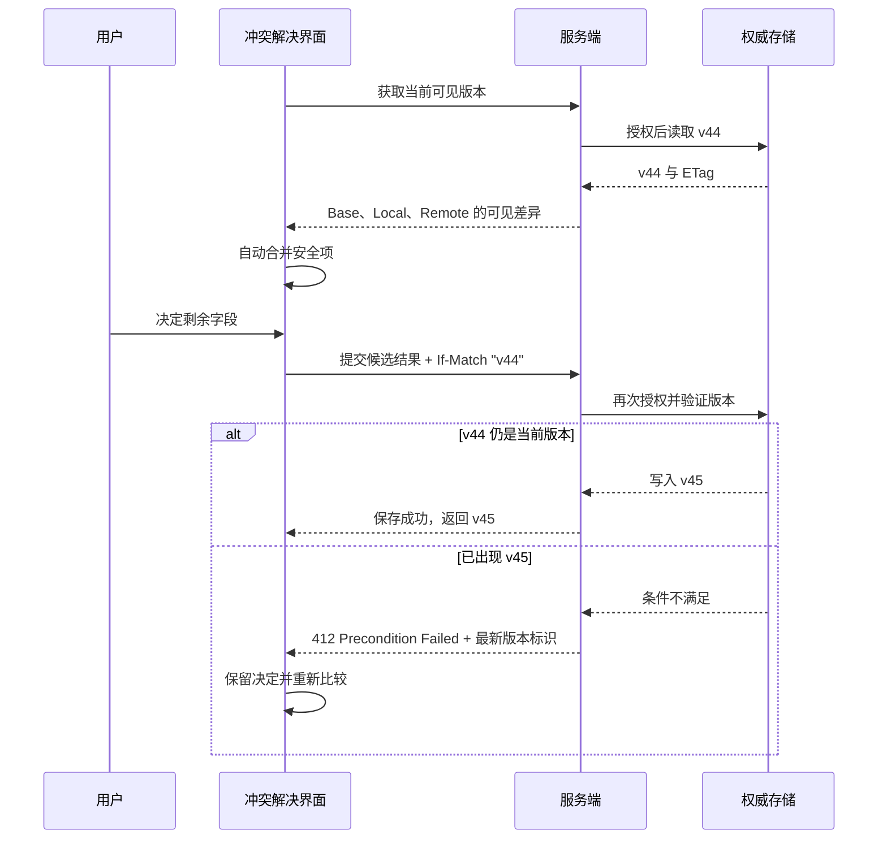

# 冲突解决：把并发覆盖变成可理解的合并决策

冲突解决界面用于处理这样的情况：用户基于旧版本完成了一批修改，但权威对象已经被其他人或自动化流程更新，系统无法安全地直接保存。

它不是一句“内容已被他人修改，请刷新”的错误提示，也不是把两个版本并排展示后让用户自己猜。完整的冲突解决流程必须帮助用户：

1. 确认哪些内容没有冲突，哪些内容需要决定。
2. 理解本地修改、当前线上内容和共同基础版本之间的关系。
3. 按字段或结构单元选择结果，而不是被迫接受整个版本。
4. 在不丢失本地工作的前提下，基于最新版本重新提交。
5. 当权限或数据再次变化时，继续恢复，而不是进入刷新循环。

本文讨论的是冲突发生后的**比较、决策与恢复交互**。并发写入检测、锁、条件请求与服务端不变量的完整状态设计，见[并发冲突状态设计](../../05-flows-states/12-concurrent-conflict.md)。两篇文章的分工如下：

| 问题 | 并发冲突状态设计 | 本文 |
| --- | --- | --- |
| 怎样发现版本已经变化 | 重点 | 作为输入 |
| 是否使用锁、版本号或条件请求 | 重点 | 只说明交互所依赖的契约 |
| 系统应该返回什么冲突状态 | 重点 | 解释界面怎样消费该状态 |
| 用户怎样比较差异 | 简述 | 重点 |
| 自动合并后怎样解释结果 | 简述 | 重点 |
| 用户怎样逐项选择与再次提交 | 简述 | 重点 |
| 权限受限时怎样展示差异 | 简述 | 重点 |
| 长内容、窄屏、键盘和焦点怎样处理 | 简述 | 重点 |

## 1. 冲突解决的本质：支持一次有证据的决策

冲突不是“两个值不一样”，而是系统无法根据现有规则证明某个合并结果符合用户意图和业务约束。

例如，基础版本中的活动开始时间是 09:00：

- 本地把开始时间改成 10:00。
- 线上把结束时间从 11:00 改成 09:30。

两个修改发生在不同字段，但合并后会得到“结束时间早于开始时间”的非法区间。文本层面没有同字段冲突，业务层面仍然冲突。

因此，冲突解决界面承担三项责任：

- **保留事实**：明确展示各个版本的来源、时间和作者，但不能把显示名当稳定身份。
- **降低判断成本**：自动处理能够证明安全的修改，把注意力集中到真正未解决的部分。
- **保护提交结果**：用户做完决定后仍要带最新版本条件提交，不能把冲突页面当作绕过并发检查的特权入口。

不需要人工冲突界面的情况包括：

- 本地值没有变化，可以直接使用线上值。
- 线上值没有变化，可以安全保留本地值。
- 双方独立修改能够按确定规则合并，且合并结果通过业务校验。
- 操作可交换，例如两个集合分别新增不同且合法的成员。
- 用户只有查看权限，系统只需说明本地草稿无法写入并提供导出或复制入口。

需要人工判断的情况包括：

- 双方把同一字段改成不同值。
- 一方删除结构单元，另一方修改该单元。
- 双方分别做出的合法修改组合后违反业务规则。
- 自动合并会改变顺序、优先级、金额、权限或发布范围。
- 线上值因权限而不可见，客户端没有足够信息完成合并。
- 无法可靠找到共同基础版本。

## 2. 冲突案例需要稳定身份

界面不能只保存“左边文本”和“右边文本”。一次冲突解决至少要关联对象身份、三个版本和当前决策状态。

```json
{
  "conflictCaseId": "conflict-8f5e",
  "resource": {
    "id": "campaign-2048",
    "type": "campaign",
    "displayName": "夏季会员召回"
  },
  "versions": {
    "base": {
      "id": "campaign-2048:v41",
      "etag": "\"v41\""
    },
    "local": {
      "draftId": "draft-731",
      "revision": 9,
      "basedOnVersionId": "campaign-2048:v41"
    },
    "remote": {
      "id": "campaign-2048:v44",
      "etag": "\"v44\""
    }
  },
  "fields": [
    {
      "fieldId": "schedule",
      "status": "unresolved",
      "allowedDecisions": ["use-local", "use-remote", "edit-result"],
      "decision": null
    }
  ]
}
```

这些标识分别解决不同问题：

| 标识 | 作用 | 不能替代它的值 |
| --- | --- | --- |
| `resource.id` | 确认正在合并哪个权威对象 | 对象名称、页面标题 |
| `base.id` | 确认本地编辑从哪个共同版本开始 | 本地打开时间 |
| `local.draftId` | 保存和恢复未提交工作 | 浏览器标签页 ID |
| `local.revision` | 防止旧页面覆盖更新后的本地草稿 | 草稿最后保存时间 |
| `remote.id` | 绑定当前比较对象 | 作者显示名 |
| `remote.etag` | 作为条件提交的验证器 | 客户端生成的递增数字 |
| `fieldId` | 将决定绑定到稳定字段或块 | 字段中文标签、数组下标 |
| `conflictCaseId` | 串联检测、决策、提交和审计 | 一次网络请求 ID |

数组下标不适合作为结构单元身份。另一位用户在列表开头插入一项后，原来的第 5 项会变成第 6 项；如果决策仍绑定“第 5 项”，系统会把选择应用到错误对象。段落、任务、规则、附件和排序项都应有稳定 ID。

版本身份也不能只依赖时间。客户端时钟可能不准，多个写入可能发生在同一时间粒度内，历史数据还可能被迁移。版本应由权威系统分配，并能够恢复其内容或至少恢复计算差异所需的数据。

## 3. 三方比较：Base、Local、Remote

三方比较使用：

- **Base**：本地编辑开始时的共同基础版本。
- **Local**：用户尚未成功提交的本地修改。
- **Remote**：当前权威系统中的最新可见版本。

Git 的三方合并同样依赖共同祖先：先找到双方共同基础，再判断各自相对基础做了什么。界面不需要模仿代码合并工具的外观，但必须保留这个判断结构。

### 3.1 单字段的基础判断表

设基础值为 `B`，本地值为 `L`，线上值为 `R`：

| 条件 | 含义 | 默认结果 |
| --- | --- | --- |
| `L = B` 且 `R ≠ B` | 本地未改，线上已改 | 使用线上值 |
| `R = B` 且 `L ≠ B` | 线上未改，本地已改 | 保留本地值 |
| `L = R` | 双方得到相同结果 | 使用该共同值 |
| `L ≠ B`、`R ≠ B` 且 `L ≠ R` | 双方作出不同修改 | 等待规则或人工判断 |
| 三个值都相同 | 没有变化 | 不需要展示 |

一个最小判断函数可以写成：

```js
function compareScalar(base, local, remote) {
  if (Object.is(local, remote)) {
    return { status: "resolved", value: local, reason: "same-result" };
  }

  if (Object.is(local, base)) {
    return { status: "resolved", value: remote, reason: "local-unchanged" };
  }

  if (Object.is(remote, base)) {
    return { status: "resolved", value: local, reason: "remote-unchanged" };
  }

  return { status: "unresolved", value: null, reason: "both-changed" };
}
```

这个函数只适用于已经归一化的标量值。它不能直接处理富文本、浮点计算结果、时区、集合、排序列表和有业务约束的组合字段。

### 3.2 为什么不能只比较 Local 和 Remote

假设线上标题为“7 月活动”，本地也是“7 月活动”。只看两个结果会认为双方没有冲突。

加入 Base 后才能知道：

- Base 是“夏季活动”。
- 本地把它改成“7 月活动”。
- 另一位用户也把它改成“7 月活动”。

两条修改路径不同，但结果一致，可以直接合并。

另一个例子：

- Base 是“草稿”。
- Local 仍是“草稿”。
- Remote 是“已批准”。

只看 Local 与 Remote 会显示冲突；三方比较能证明本地没有修改状态，应使用线上值。

### 3.3 Base 不一定默认展示

Base 是计算必需的数据，不一定是所有用户都需要持续阅读的一列。

- 对短标量，默认显示“你的版本”和“当前版本”，并用“查看原值”展开 Base。
- 对删除与修改冲突，Base 能证明被删除内容原来是什么，应直接提供。
- 对长文本，默认突出变更片段，允许按块查看 Base。
- 对高风险金额、权限和发布时间，Base 应与两个新值同时可见。

隐藏 Base 不能导致用户误以为 Local 或 Remote 是原始值。标签应表达版本角色，例如“你基于 v41 的修改”“当前线上 v44”，而不是含糊的“旧版”“新版”。

## 4. 不同数据类型需要不同的合并规则

### 4.1 标量字段

标题、布尔开关、单选项可以使用三方标量判断，但保存前仍要进行字段级和对象级校验。

布尔值尤其不能只显示两个开关。应显示有语义的标签，如：

- 你的修改：允许访客评论
- 当前线上：不允许访客评论

否则用户需要反推开关位置与版本列的关系。

### 4.2 普通文本与富文本

纯文本可以按行、词或字符计算差异。选择粒度取决于任务：

- 代码、配置和地址列表通常需要行级差异。
- 普通句子适合词级差异。
- 中文没有天然空格分词，字符级高亮容易破碎，宜按句子、标点分段或结构块展示。

富文本不能先转为 HTML 字符串再做普通文本合并。标签顺序、编辑器内部标记和等价 HTML 会制造无意义差异。应基于编辑器的结构模型比较段落、标题、列表项、链接和内联标记，并使用稳定节点 ID。

### 4.3 无序集合

标签、成员和关联对象通常表现为集合：

- 本地新增 A，线上新增 B：可以合并为 A、B。
- 本地删除 A，线上没有修改 A：可以删除 A。
- 本地删除 A，线上修改了 A 的角色：需要业务判断。

必须先定义“同一个成员”的身份。显示名相同不代表同一账户，显示名变化也不代表成员被删除后重新添加。

### 4.4 有序列表

优先级队列、章节、步骤和导航项的顺序本身是数据。

如果双方分别移动不同项目，位置索引可能互相影响。合并规则要回答：

- 顺序是否允许并列。
- 移动是表达“放在 B 前面”，还是表达“放在第 3 位”。
- 被参照项删除后怎样处理。
- 双方同时移动同一项时由谁决定。

界面应展示“移动了什么”和“相对于谁移动”，不要只显示整个列表的前后快照。

### 4.5 结构化对象

日期区间、价格规则、权限策略和发布条件由多个字段共同形成一个业务值。它们应作为一个决策组验证。

例如活动排期包含：

- 开始日期和时间。
- 结束日期和时间。
- 时区。
- 是否跨自然日。
- 发布前缓冲时间。

即使每个字段都能自动合并，组合结果也可能无效。自动合并必须在对象级校验通过后才能标记为“已解决”。

### 4.6 删除与修改

“本地修改、线上删除”不能自动解释为恢复，也不能自动丢弃本地工作。可提供：

- 接受删除。
- 将本地内容恢复为一个新对象。
- 复制内容后离开。
- 对有权限的用户申请恢复原对象。

“恢复为新对象”必须生成新 ID，重新校验父级、引用和权限。它不是让已删除对象悄悄复活。

## 5. 自动合并与领域冲突

自动合并的条件不是“算法能够生成一个结果”，而是系统能够解释该结果为什么安全。

一个可靠的自动合并至少满足：

1. 三个版本身份明确。
2. 对象和结构单元具有稳定 ID。
3. 合并规则与字段语义匹配。
4. 合并结果通过当前业务校验。
5. 当前用户有权读取参与计算的数据，也有权提交结果。
6. 自动决定可追踪，并允许用户查看其依据。

领域冲突由业务不变量决定，例如：

- 结束时间必须晚于开始时间。
- 折扣后价格不能低于审批下限。
- 至少保留一名项目管理员。
- 已批准内容的法律条款不能由普通编辑修改。
- 同一渠道的投放时间不能重叠。

领域冲突不应伪装成字段冲突。界面需要说明组合结果违反了什么规则，并把相关字段放在同一决策区。

### 5.1 自动合并的反馈

自动处理的内容不应完全消失。顶部摘要可以显示：

> 已安全合并 6 项修改，仍有 2 项需要决定。

用户可以展开“已自动合并”区域，看到：

- 字段或结构单元名称。
- 本地与线上分别改了什么。
- 使用了哪条确定规则。
- 最终候选结果。

不要用“AI 已解决”代替规则说明。合并是否安全取决于可验证的数据语义，不取决于生成式模型是否能产出流畅文本。

### 5.2 人工决定的粒度

首选按独立字段或结构单元决定：

- 使用我的修改。
- 使用当前线上内容。
- 编辑合并结果。

不应默认提供醒目的“全部使用我的版本”。它会把多个不同风险的决定压缩成一次覆盖操作。确需批量选择时，应先展示影响数量和受限字段，并允许逐项撤回。

## 6. 信息架构与差异呈现

一个中等复杂度的冲突页面可以分为五区：

1. **对象与版本上下文**：对象名称、当前线上版本、草稿来源、最近更新者。
2. **冲突摘要**：自动合并数量、待决定数量、因权限不可处理数量。
3. **待决定内容**：按业务分组排列字段或结构单元。
4. **已自动合并内容**：默认折叠但可检查。
5. **提交与退出**：保存合并结果、保存草稿、复制或导出、放弃本地修改。

### 6.1 双栏不是唯一布局

桌面宽屏可以并列展示 Local 与 Remote，但要保持：

- 两列标题在滚动时仍可辨认。
- 对应片段垂直关联。
- 不能依靠红绿颜色区分来源。
- 长内容不会产生横向和纵向双重滚动陷阱。

窄屏应改为每个字段内部的纵向结构：

```text
排期（需要决定）

你的修改
7 月 22 日 10:00 — 12:00，Asia/Shanghai

当前线上
7 月 22 日 09:00 — 09:30，Asia/Shanghai

[使用我的修改] [使用当前线上]
[编辑结果]
```

不要在窄屏保留被压缩到无法阅读的双栏。版本角色应随每个值一起出现，避免用户滚动后失去列标题。

### 6.2 差异高亮

差异高亮是定位辅助，不是完整说明：

- 删除内容同时使用删除线、符号或文字标签。
- 新增内容同时使用下划线、背景或“新增”标签。
- 移动内容显示原位置和目标位置。
- 颜色满足对比度要求，但意义不只由颜色传达。
- 屏幕阅读器可访问“新增”“删除”“由 A 移至 B”等文字。

对包含大量未变化文本的文档，应折叠上下文，但保留展开入口。上下文折叠不能打断标题层级、列表编号或表格表头。

### 6.3 决策状态

每个待处理项至少有四种状态：

| 状态 | 含义 | 界面要求 |
| --- | --- | --- |
| 未决定 | 需要用户选择 | 清楚显示可选结果和原因 |
| 已选择 | 用户已决定但未提交 | 显示当前候选值与撤销入口 |
| 已自动合并 | 规则已生成候选值 | 可检查规则和结果 |
| 无法决定 | 权限或数据不足 | 不提供虚假的选择，给出合法路径 |

主提交按钮可以在存在未决定项时禁用，但必须同时提供文本原因，例如“还需处理 2 项”。只改变按钮颜色或仅依赖悬停提示无法帮助键盘和触屏用户。

## 7. 基于最新版本重新应用：Rebase onto latest

用户的决定不是直接覆盖线上版本，而是生成一个以当前线上版本为基础的候选版本。

完整流程如下：



### 7.1 为什么使用 `If-Match`

HTTP `If-Match` 请求头让写入以当前实体标签为条件。服务端只有在目标资源仍匹配指定的强验证器时才执行写入；条件不满足时返回 `412 Precondition Failed`。

```http
PUT /campaigns/campaign-2048 HTTP/1.1
Content-Type: application/json
If-Match: "v44"

{
  "title": "7 月会员召回",
  "audienceId": "segment-93",
  "schedule": {
    "start": "2026-07-22T10:00:00+08:00",
    "end": "2026-07-22T12:00:00+08:00"
  }
}
```

这一步必须在服务端原子验证。客户端先请求“版本还是 v44 吗”，再发送无条件写入，会在两个请求之间留下新的竞态窗口。

`409 Conflict` 可以表达资源当前状态与操作冲突；`412` 更准确地表达客户端发送的前置条件不成立。界面可将两者映射到不同恢复路径，不能只显示统一的“保存失败”。

### 7.2 收到第二次 412 后怎样保留工作

如果用户解决期间又有人提交了 v45，界面应：

1. 保留本地草稿与用户已经作出的决定。
2. 获取当前用户有权读取的 v45。
3. 以 v44 为旧的 Remote、v45 为新的 Remote，重新计算候选结果。
4. 标记哪些决定仍然适用，哪些决定涉及再次变化的字段。
5. 只把受影响项重新打开，不要求用户从第一项重新开始。
6. 最终提交改用 v45 的验证器。

“保留决定”不等于机械复用结果。决定必须记录语义和依据版本：

```json
{
  "fieldId": "schedule",
  "choice": "use-local",
  "localRevision": 9,
  "comparedRemoteVersionId": "campaign-2048:v44",
  "selectedAt": "2026-07-18T08:12:41Z"
}
```

如果 v45 再次修改了 `schedule`，该决定应回到“需复核”。如果 v45 只修改了无关的 `description`，`schedule` 的决定可以保留，但仍需重新通过对象级业务校验。

### 7.3 退出与草稿

用户应能在解决过程中安全离开：

- 保存允许持久化的合并草稿。
- 复制本地修改。
- 导出不含受限线上数据的草稿。
- 明确放弃本地修改。

关闭窗口不能默认等于放弃。若存在未持久化决定，应提供确认；确认内容说明会丢失什么，并把焦点放在低风险的“继续解决”动作上。

## 8. 权限、脱敏与受限差异

冲突解决界面可能比普通详情页更容易泄露信息，因为它同时读取历史版本、本地草稿和当前线上值。

### 8.1 每次读取都按当前权限过滤

服务端返回 Remote 和 Base 前，都要使用当前身份重新授权。不能因为用户曾经看过 v41，就默认其仍可查看 v41 中的敏感字段。

权限可能在解决期间发生变化：

- 用户被移出项目。
- 字段从公开改为受限。
- 对象进入已批准或法律保留状态。
- 会话续期后角色发生变化。

客户端缓存的旧明文不能在权限撤销后继续显示。高敏感场景需要清理内存状态、持久化草稿和离线缓存，并回到安全入口。

### 8.2 脱敏冲突不是空值

受限字段不能用 `null` 或空字符串冒充，否则客户端可能误判为“线上删除了内容”。

服务端可以返回明确的受限状态：

```json
{
  "fieldId": "audience",
  "status": "restricted-conflict",
  "remote": {
    "visibility": "redacted",
    "changedSinceBase": true,
    "safeSummary": "目标人群已由有权限的成员更新"
  },
  "allowedDecisions": ["accept-remote", "request-review"]
}
```

界面可以说明“当前线上值已变化，但你无权查看具体内容”，并只提供合法动作。不要：

- 通过差异长度、选项数量或旧缓存推断受限内容。
- 允许“使用我的版本”绕过字段写权限。
- 在分析事件、错误日志或 URL 中记录敏感值。
- 把完整 Remote 先发到客户端，再用 CSS 隐藏。

### 8.3 保存时再次授权

能打开冲突页面不代表能提交所有字段。服务端保存时必须重新判断：

- 对象写权限。
- 每个字段的写权限。
- 当前流程状态允许的动作。
- 引用对象是否仍可访问。
- 合并后的对象是否满足业务不变量。

权限拒绝应返回字段级安全错误，但响应本身也不能暴露受限字段值。

## 9. 冲突循环与热点对象

冲突循环是指用户每次完成解决，提交时都发现线上版本再次变化。

常见原因：

- 热点对象由多人频繁编辑。
- 自动化任务持续写入同一字段。
- 冲突解决耗时长，比较对象不断过期。
- 客户端每次都重放整个旧对象，制造不必要冲突。
- 结构单元没有稳定 ID，小变化被识别为整段替换。

### 9.1 界面不能无限要求“再来一次”

系统应记录同一草稿的连续冲突次数和持续时间。达到产品定义的阈值后，可以提供：

- 暂停提交并保存草稿。
- 显示当前活跃编辑者，但 presence 只作提示，不能作为权限依据。
- 建议稍后重试或联系对象负责人。
- 对高价值任务申请短期编辑租约。
- 将本地修改导出为补丁或副本。
- 切换到真正的实时协作模型，而不是继续依赖整对象保存。

阈值不是通用固定数字。应根据对象风险、平均解决时间和协作频率设定，并验证不会过早阻断正常恢复。

### 9.2 决定哪些内容需要重新检查

每次出现新 Remote 时，将字段分成：

- **未受影响**：新 Remote 没改该字段，可保留原决定。
- **结果相同**：新 Remote 已得到与候选值相同的结果，可自动关闭。
- **再次变化**：新 Remote 修改了该字段，必须复核。
- **关联失效**：字段本身未变，但组合约束或引用对象变化，需要重新校验。
- **权限变化**：先前可见或可写的值变为受限，清理旧展示并停止提交。

用户需要看到“为什么又要检查”，例如“排期在你解决期间再次被更新”，而不是回到一个看似完全相同的页面。

## 10. 键盘、焦点与可访问对话框

冲突可能在保存表单时由对话框承载，也可能进入独立页面。内容长、字段多、需要跨区域比较时，独立页面通常更稳妥；短小且上下文必须保留时可以使用模态对话框。

### 10.1 模态对话框的基本契约

符合 WAI-ARIA APG 的模态对话框应满足：

- 打开时焦点进入对话框。
- `Tab` 和 `Shift+Tab` 在对话框的可操作内容中循环。
- `Escape` 关闭对话框；如果关闭会丢失决定，应先进入明确的退出确认。
- 关闭后焦点通常回到触发控件；如果触发控件已不存在，则移动到符合后续任务的合理位置。
- 容器使用 `role="dialog"` 和 `aria-modal="true"`。
- 对话框具有可访问名称，通常由可见标题通过 `aria-labelledby` 提供。

只有在交互行为确实阻止用户操作背景内容时才能设置 `aria-modal="true"`。视觉上遮挡背景但键盘仍能进入背景，会造成严重不一致。

### 10.2 长结构内容的初始焦点

如果对话框包含说明、冲突摘要和多组字段，把焦点直接放在第一个单选按钮会让屏幕阅读器用户错过结构。

可在标题下放置可聚焦的静态摘要：

```html
<div
  role="dialog"
  aria-modal="true"
  aria-labelledby="conflict-title"
>
  <h2 id="conflict-title" tabindex="-1">
    解决“夏季会员召回”的 2 项冲突
  </h2>

  <p>已自动合并 4 项。请检查排期和目标人群。</p>

  <!-- 冲突字段与操作 -->
</div>
```

打开时以脚本把焦点移动到标题。长而复杂的结构不宜全部放入 `aria-describedby`，否则辅助技术可能把大量内容作为一个连续字符串朗读，失去标题、列表和表格结构。

### 10.3 字段级选择

每组决定都应使用原生单选按钮或按钮，并具有明确组名：

```html
<fieldset>
  <legend>排期：选择合并结果</legend>

  <label>
    <input type="radio" name="schedule" value="local">
    使用我的修改：7 月 22 日 10:00—12:00
  </label>

  <label>
    <input type="radio" name="schedule" value="remote">
    使用当前线上：7 月 22 日 09:00—09:30
  </label>

  <button type="button">编辑合并结果</button>
</fieldset>
```

选择后不要自动移动焦点到下一组。用户可能还要检查说明或撤销选择。可以更新顶部进度，并通过简短状态消息播报“排期已选择，还剩 1 项”。

### 10.4 焦点恢复与异步更新

出现第二次冲突时：

- 不要把焦点强制移回页面顶部。
- 保留焦点所在的稳定字段；如果该字段被移除，移动到相邻冲突组标题。
- 新增冲突用状态消息通知。
- 展开或折叠已自动合并区域时，触发按钮维护 `aria-expanded`。
- 保存成功后，将焦点移动到成功摘要或返回后的对象标题，并提供下一步。

键盘顺序应由 DOM 顺序决定。不要用正值 `tabindex` 修补视觉顺序，也不要让两列 CSS 布局改变阅读顺序。

## 11. 案例一：营销活动表单的排期冲突

### 11.1 三个版本

活动对象在 v41 时为：

| 字段 | Base v41 |
| --- | --- |
| 标题 | 夏季会员召回 |
| 目标人群 | 90 天未购买会员 |
| 开始时间 | 7 月 22 日 09:00 |
| 结束时间 | 7 月 22 日 11:00 |
| 时区 | Asia/Shanghai |

运营成员基于 v41 创建本地草稿：

- 标题改为“7 月会员召回”。
- 开始时间改为 10:00。
- 结束时间改为 12:00。

与此同时，数据团队提交 v44：

- 目标人群改为新的受限分群。
- 结束时间改为 09:30。

### 11.2 自动判断

| 项目 | 判断 | 结果 |
| --- | --- | --- |
| 标题 | Remote 与 Base 相同 | 保留 Local |
| 目标人群 | Local 与 Base 相同 | 使用 Remote |
| 开始时间 | Remote 与 Base 相同 | 暂时保留 Local |
| 结束时间 | Local、Remote 都相对 Base 变化 | 未解决 |
| 时区 | 三方相同 | 不展示 |

开始时间虽然满足字段级自动合并条件，但它与结束时间构成一个排期。候选结果 10:00—09:30 无效，因此界面把整个排期组标记为领域冲突。

### 11.3 权限受限的目标人群

运营成员可以投放已有分群，但无权查看受限分群的完整规则。界面显示：

> 目标人群已由数据团队更新。你可以接受当前线上设置，或请求有权限的成员复核。

界面不显示人数差值、规则数量或旧版受限条件，也不提供“使用我的目标人群”，因为该成员无权覆盖 v44 的受限字段。

### 11.4 用户决定与再次提交

用户在排期组选择“编辑结果”，将时间改为 10:00—12:00。候选对象通过：

- 时间区间校验。
- 渠道排期重叠校验。
- 字段写权限校验。
- 受限目标人群引用校验。

客户端用 `If-Match: "v44"` 提交。如果服务端仍为 v44，生成 v45；如果自动化任务已经生成 v45，则返回 412。

第二次比较只要求用户检查 v45 发生变化的字段。标题和排期决定不能因为出现 412 而全部清空。

### 11.5 验收条件

- 用户能区分 v41、本地草稿和 v44 的来源。
- 标题与目标人群的安全合并无需人工重复确认。
- 排期按组合字段校验，不产生结束早于开始的候选结果。
- 无权限用户无法从界面、响应、日志或缓存读取受限分群规则。
- 第二次 412 后，本地草稿和未受影响决定仍然存在。
- 窄屏使用逐字段堆叠布局，不依赖横向滚动完成任务。
- 只用键盘可以查看差异、选择结果、编辑排期并提交。

## 12. 案例二：发布运行手册的结构化合并

### 12.1 数据结构

团队的发布运行手册由稳定块组成：

```json
[
  {
    "blockId": "block-prerequisites",
    "type": "checklist",
    "title": "发布前检查"
  },
  {
    "blockId": "block-deploy",
    "type": "steps",
    "title": "部署"
  },
  {
    "blockId": "block-rollback",
    "type": "steps",
    "title": "回滚"
  }
]
```

技术写作者基于 v18：

- 修改 `block-deploy` 的第 3 步命令和说明。
- 在 `block-rollback` 中新增数据库回退检查。

值班负责人提交 v20：

- 把 `block-rollback` 移到部署步骤之前。
- 删除已经废弃的 `block-deploy` 第 3 步。
- 在发布前检查中增加审批项。

### 12.2 结构差异

系统按块 ID 和步骤 ID 比较，而不是按文档行号比较：

- 发布前检查只被 Remote 修改，直接采用 v20。
- 回滚块的内容只被 Local 修改，位置只被 Remote 修改，可合并内容与移动。
- 部署第 3 步出现“Local 修改、Remote 删除”，需要人工判断。

界面为删除与修改冲突提供：

1. 接受删除。
2. 将本地修改作为一个新步骤插入。
3. 复制本地文本，不写入手册。

不提供“保留原步骤”作为无条件动作，因为原步骤已被负责人明确删除。若用户选择新增步骤，系统生成新步骤 ID，并重新校验编号、引用和执行权限。

### 12.3 差异界面

桌面端按冲突块组织，而不是展示两个完整文档：

```text
需要决定：部署 / 原第 3 步

共同基础 v18
运行旧版数据库迁移脚本

你的修改
运行带 dry-run 检查的新迁移脚本

当前线上 v20
该步骤已删除

[接受删除]
[作为新步骤添加]
[复制文本]
```

块移动以文字说明“回滚：从部署之后移至部署之前”，并允许展开查看相邻块。内容修改与位置修改分别解释，避免把整章标成删除和新增。

### 12.4 键盘流程

- 页面标题获得初始焦点并说明有 1 项需要决定。
- “跳到下一项冲突”链接把焦点移动到冲突组标题。
- 三个选择使用同一 `fieldset`。
- 展开 Base 时，焦点留在展开按钮，`aria-expanded` 更新。
- 选择“作为新步骤添加”后出现编辑区，焦点移动到新步骤标题输入框。
- 保存成功后焦点移动到结果摘要：“已基于 v20 创建 v21”。

### 12.5 验收条件

- 块和步骤使用稳定 ID；插入、删除、移动不会导致选择应用到错误位置。
- 系统能够区分内容编辑与结构移动。
- “修改与删除”不被自动合并为恢复或丢弃。
- 新增步骤生成新 ID，并通过运行手册结构校验。
- 折叠上下文后仍能访问章节标题和必要的前后关系。
- 200% 文本缩放时不需要横向滚动比较正文。
- 屏幕阅读器能听到新增、删除、移动和当前决定状态。

## 13. 错误分类与恢复

| 结果 | 含义 | 界面恢复 |
| --- | --- | --- |
| `412 Precondition Failed` | 提交依据的线上版本已过期 | 保留草稿，获取最新版本并重新比较 |
| `409 Conflict` | 操作与当前业务状态冲突 | 显示业务原因，定位相关字段 |
| `403 Forbidden` | 当前用户无权读取或写入 | 清理受限信息，提供申请权限或导出合法内容 |
| `404 Not Found` | 对象已删除或当前身份不可见 | 不泄露存在性，提供返回与本地草稿处理 |
| `422 Unprocessable Content` | 候选结果未通过语义校验 | 保留决定，定位到无效组合 |
| 网络超时 | 不知道服务端是否已接收 | 查询权威对象或提交意图状态，避免盲目重复 |

错误文案至少回答：

- 哪个对象或字段未保存。
- 已保存和未保存的范围。
- 本地工作是否仍然保留。
- 用户现在可以做什么。
- 是否需要重新检查先前决定。

“合并失败，请重试”没有提供任何恢复信息。

## 14. 观测与诊断

冲突解决不能只统计打开次数和保存点击。需要观察用户是否成功保护了工作并完成决定。

建议事件：

| 事件 | 关键字段 |
| --- | --- |
| `conflict_detected` | 对象类型、Base/Remote 版本、冲突类型数量 |
| `resolution_opened` | 入口、自动合并数量、待决定数量 |
| `decision_changed` | 字段类型、选择类型，不记录正文 |
| `resolution_rebased` | 原 Remote、新 Remote、保留决定数、需复核数 |
| `resolution_saved` | 新版本、耗时、人工决定数、循环次数 |
| `resolution_abandoned` | 是否保存草稿、退出阶段、原因类别 |
| `resolution_permission_changed` | 变化类型、受影响字段数量 |

核心指标可以包括：

- 冲突解决完成率。
- 从打开到成功保存的中位时长。
- 每次解决需要人工决定的字段数。
- 自动合并后被用户改写的比例。
- 连续发生 412 的循环分布。
- 本地草稿丢失或用户投诉数量。
- 无障碍输入方式下的任务完成率和错误率。

不要把“自动合并率越高”直接视为越好。自动合并如果经常被改写、撤销或引发业务错误，说明规则过度激进。

日志不能保存完整冲突正文、访问令牌、受限字段或个人敏感信息。诊断通常只需要对象类型、版本标识、字段类别和结果状态。

## 15. 测试矩阵

### 数据与版本

- Local 未变、Remote 已变。
- Remote 未变、Local 已变。
- 双方得到相同结果。
- 双方修改同一字段为不同值。
- 双方修改不同字段但组合结果非法。
- Local 修改、Remote 删除。
- Local 删除、Remote 修改。
- 结构单元移动、插入和重命名同时发生。
- Base 无法恢复或历史版本损坏。

### 权限

- 打开页面前权限已撤销。
- 解决过程中字段变为受限。
- 用户能读但不能写。
- 用户能写普通字段但不能写受限字段。
- Base 曾可见、当前已不可见。
- 日志和分析事件不包含脱敏前值。

### 并发与网络

- 首次提交成功。
- 提交前产生一个新版本。
- 连续两次出现 412。
- 请求超时但服务端已经写入。
- 相同提交被重复发送。
- 自动化持续修改热点字段。

### 交互与无障碍

- 仅键盘完成所有决定。
- 对话框打开、循环 Tab、Escape 与焦点恢复。
- 屏幕阅读器读取版本角色和差异类型。
- 200% 文本缩放。
- 320 CSS px 等效宽度。
- 长标题、长正文、中文和英文混排。
- 不辨颜色时仍能识别新增、删除和选中状态。
- 异步重新比较后焦点不丢失。

## 16. 实践任务：实现字段级冲突解决器

选择一个包含标量、集合、日期区间和结构列表的真实表单，完成以下内容。

### 16.1 数据准备

为对象建立：

- Base、Local、Remote 三个可恢复版本。
- 对象、字段、列表项和文本块的稳定 ID。
- 字段级读取与写入权限。
- 至少两条跨字段业务不变量。
- 强 ETag 或等价的权威版本验证器。

### 16.2 交互实现

实现：

- 自动合并摘要。
- 未解决项的逐项选择。
- 展开 Base 和上下文。
- 窄屏堆叠布局。
- 保存草稿和放弃确认。
- 使用 `If-Match` 的条件提交。
- 收到 412 后基于最新版本重新比较。
- 权限变化后的脱敏与恢复。

### 16.3 验收证据

提交以下证据：

- 三方比较规则表和领域冲突清单。
- 两次连续 412 的录屏或自动化测试。
- 键盘完整操作录屏。
- 屏幕阅读器朗读关键差异和决定状态的记录。
- 权限撤销后网络响应、界面和缓存检查。
- 服务端最终对象与本地候选结果的对账。

完成标准不是“能够弹出冲突框”，而是用户的本地工作可恢复、每个决定有明确依据、最终写入基于最新权威版本，并且受限数据没有泄露。

## 来源

- [Git Documentation: git-merge-base](https://git-scm.com/docs/git-merge-base)（访问日期：2026-07-18）
- [Git Documentation: git-merge-tree](https://git-scm.com/docs/git-merge-tree.html)（访问日期：2026-07-18）
- [RFC 9110: HTTP Semantics](https://www.rfc-editor.org/rfc/rfc9110.html)（访问日期：2026-07-18）
- [WAI-ARIA Authoring Practices: Modal Dialog Pattern](https://www.w3.org/WAI/ARIA/apg/patterns/dialog-modal/)（访问日期：2026-07-18）
- [WAI-ARIA Authoring Practices: Developing a Keyboard Interface](https://www.w3.org/WAI/ARIA/apg/practices/keyboard-interface/)（访问日期：2026-07-18）
