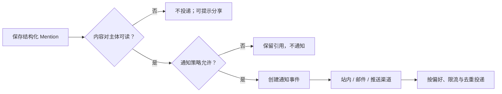

# Mention 提及

Mention 是内容中的结构化身份引用，可选择性触发收件箱或通知路由。显示出来的 `@名称` 只是表示层；可靠系统必须保存被提及主体的稳定身份、提及发生时的可见范围、通知决策和后续身份变化。

## 能力边界与前置知识

本文聚焦：

- 输入过程中怎样过滤、排序和选择候选人或团队。
- 怎样区分稳定身份、用户名、显示名和历史名称。
- 提及与通知、授权、任务分派之间的边界。
- 编辑、删除、重命名、停用和跨组织身份的行为。
- 候选目录、通知预览和分析数据的隐私保护。

前置知识：

- 能为用户、服务账号和团队分配稳定 ID。
- 理解读取内容的权限不应由通知授予。
- 能实现可访问的可编辑输入与候选弹层。

提及不是访问授权。把某人写进评论，不应自动让其读取原本无权访问的文档；若产品希望同时邀请，必须作为独立、可确认的分享操作。

## 提及的结构

一条提及至少包含：

| 字段 | 含义 | 边界 |
| --- | --- | --- |
| `mention_id` | 该次提及稳定标识 | 用于去重和撤销通知 |
| `content_id` | 所属评论、文档或事件 | 必须先授权读取 |
| `subject_type` | user、team、role、service | 不同类型路由不同 |
| `subject_id` | 被引用主体稳定 ID | 重命名后不变 |
| `display_snapshot` | 创建时显示文本 | 用于历史与离线呈现 |
| `range` | 在结构化正文中的节点或范围 | 不依赖重新正则解析 |
| `created_by` | 发起主体 | 用于授权与限流 |
| `created_at` | 服务端时间 | 通知排序 |
| `notify_policy` | 是否有通知意图 | 不是最终投递结果 |
| `visibility_scope` | 提及时内容范围 | 防止通知预览越权 |

W3C Activity Vocabulary 将 `Mention` 定义为一种专门的 Link。规范还指出，系统不应被迫解析正文中的 `@username` 字符串来决定通知路由；结构化 audience、tag 或 mention 关系更可靠。

## 身份与显示名称

### 稳定身份

`subject_id` 指向目录中的主体，不因以下变化而改变：

- 用户修改显示名。
- 用户名大小写或格式变化。
- 婚姻、语言或品牌名称变化。
- 团队改名。
- 头像更换。
- 账号被停用后恢复。

内容渲染时可以使用当前显示名，也可在审计场景显示创建时快照。两者作用不同：

| 名称 | 用途 | 风险 |
| --- | --- | --- |
| 当前显示名 | 便于现在识别人 | 历史内容外观变化 |
| 创建时快照 | 保留当时语境 | 可能含已更正或应删除的个人信息 |
| 唯一用户名 | 辅助消歧 | 可能被回收或改变 |
| 组织与团队标签 | 区分同名主体 | 可能泄露组织关系 |

目录应避免回收已使用的唯一标识。若公开 handle 可回收，历史 mention 必须仍绑定不可回收的内部主体 ID，不能自动指向新账户。

### 同名消歧

候选中出现两个“王晨”时，展示完成选择所需的最小附加信息，例如团队、岗位或组织。不要默认暴露邮箱、手机号、员工编号。

选择后内容可显示短名，但聚焦或打开详情时提供安全的身份说明。

### 停用与删除

账号停用后：

- 历史提及保留身份关系与允许展示的快照。
- 不再成为普通候选。
- 不发送新通知。
- 深链进入主体资料遵守当前目录权限。
- 若因数据删除要求清除姓名，历史内容显示去标识化主体。

团队删除后，历史提及不能重新绑定同名新团队。

## 候选过滤

### 先授权再检索

候选集合不是完整用户目录。服务端按以下条件求交集：

\[
Candidates = DirectoryScope \cap MentionablePolicy \cap ContentVisibility \cap QueryMatch
\]

- `DirectoryScope`：当前主体可搜索的组织或协作空间。
- `MentionablePolicy`：允许被提及的主体类型与状态。
- `ContentVisibility`：提及后能合法读取内容的主体。
- `QueryMatch`：显示名、允许的用户名或别名匹配。

若产品允许“提及并邀请”，候选必须明确分成已有访问者与可邀请者；选择可邀请者后进入分享确认，不能静默扩权。

### 查询触发

`@` 后输入可打开候选，但要定义：

- 最少字符数。
- 中文拼音、英文前缀和多语言搜索。
- 空查询是否显示最近协作者。
- 是否允许空格和标点结束提及。
- 输入法 composition 期间不提前提交。
- 粘贴 `@名称` 是否只保留文本，还是解析受控结构。

空查询显示“所有员工”会泄露目录并增加载荷。更安全的默认集合是当前对象协作者、最近互动者和明确允许的团队。

### 排序

排序可以组合：

- 当前内容参与者。
- 当前项目成员。
- 最近协作者。
- 精确名称匹配。
- 前缀与别名匹配。
- 团队或角色类型。

不应使用敏感绩效、私聊频率或不可解释画像。排序规则改变要监测同名误选，而不只看首项点击。

### 服务端搜索

客户端缓存只保存当前范围的最小候选。查询使用防抖、取消和请求身份，旧响应不能覆盖新输入。返回值只包含渲染候选所需字段。

零结果要区分：

- 没有匹配的可提及主体。
- 查询失败。
- 输入过短。
- 目录受限。

## 输入控件与结构化内容

### 候选弹层

Mention 输入通常表现为富文本编辑器中的可编辑 combobox：

- 文本光标留在编辑器。
- 候选弹层具有列表或网格语义。
- 上下键移动活动候选。
- Enter 接受候选。
- Escape 关闭并保留已输入文本。
- 普通文本编辑键继续由浏览器和操作系统处理。

WAI-ARIA APG 给出 combobox/listbox 的键盘与 `aria-activedescendant` 模式，但富文本编辑器需在真实浏览器和辅助技术中验证；仅添加角色不能自动获得行为。

### 提及节点

选择后插入不可分割或受控编辑的结构节点：

- 保存 `subject_type` 与 `subject_id`。
- 显示当前或快照名称。
- Backspace 在边界处可一次删除整个节点，或先选中再删除。
- 光标不能停在内部并破坏 ID。
- 复制到支持结构的编辑器时保留节点；复制到纯文本时降级为 `@显示名`。
- 从外部粘贴纯文本不自动变成可通知身份，除非用户重新确认候选。

重新解析正文字符串会在重命名、同名和邮箱样式文本中产生错误。

## 提及与通知是两个决定

Activity Vocabulary 也区分 mention 引用与 audience/通知路由：可以存在不触发通知的 mention。

### 最终通知策略

最终投递由多项决定：

- 发起人是否有提及该主体或团队的能力。
- 被提及者能否读取内容。
- 被提及者的通知偏好、免打扰和渠道。
- 组织对敏感内容的邮件预览策略。
- 同一内容短时间内的去重。
- 团队 mention 的人数与限流。
- 内容是否仍存在、mention 是否已删除。

界面可以说明“将通知 8 人”，但数量必须按当前可投递范围计算，且不能泄露隐藏团队成员。

### 通知内容

通知只包含被提及者有权查看的最小信息：

- 发起人显示名。
- 内容类型与安全标题。
- 受控摘要。
- 指向规范内容和锚点的深链。

邮件和推送可能出现在锁屏或第三方基础设施中。敏感空间可只写“你有一条新的提及”，登录后再授权读取正文。

## 团队、角色和广播提及

### 团队

团队 mention 保存团队 ID，而不是发布时展开为一串用户节点。投递时记录当时实际接收成员集合或投递事件，便于解释谁收到通知。

团队改名不改变历史身份。成员后来加入，不应因旧 mention 自动收到旧通知，除非产品明确提供“未读团队收件箱”语义。

### 角色

`@值班人员` 可能在不同时间指向不同人。内容引用的是角色还是当时承担角色的人，必须明确：

- 角色 mention：显示动态角色，投递给事件发生时的当班主体。
- 人员快照：将当班人员解析为具体用户 mention。

审计场景通常同时记录角色 ID 和解析到的用户 ID。

### 广播

`@所有人`、`@频道` 等可能产生大量通知。需要：

- 限定发起角色。
- 提交前显示影响范围。
- 支持组织禁用。
- 频率限制和滥用检测。
- 不在候选首位诱导使用。
- 对大群体使用摘要或收件箱，避免每次邮件。

## 编辑、删除与通知生命周期

### 编辑新增 Mention

编辑内容新增主体时，可以创建新通知事件。使用 `mention_id` 去重，保存成功前不投递。

### 编辑移除 Mention

移除后不可能收回已读邮件，但可以：

- 将站内通知标记为已撤销或隐藏。
- 防止未发送渠道继续投递。
- 深链进入时不再高亮该 mention。
- 保留必要审计事件。

### 改写显示文本

结构节点显示名更新不应重新通知。只有主体 ID 新增或变化才产生通知候选。

### 删除内容

删除评论或文档后，通知深链应显示对象已删除或不可访问，不应回退到包含敏感摘要的通知详情。

### 批量编辑

导入或自动化修改大量内容时，默认不应为历史 mention 批量发送新通知。通知需要明确的发布事件与策略。

## 权限和隐私

### 候选目录

- 不把完整组织目录下载到浏览器。
- 搜索响应按当前主体、对象和组织范围过滤。
- 不暴露邮箱等非必要字段。
- 外部协作者只看到允许互动的内部主体。
- 失败与零结果文案不泄露某人是否在组织中。
- 查询日志最小化并设置保留期。

### 内容读取

通知不会创建内容访问。打开深链时服务端重新授权；预览、搜索索引和缓存使用同一规则。

### 阻止与安全

社交产品中的被屏蔽关系、骚扰保护与未成年人安全可能覆盖普通项目成员关系。系统应在候选和投递两处执行，不能只隐藏通知。

### 自动主体

机器人、集成和服务账号应明确标识。mention 机器人可能触发命令，确定性授权与业务校验必须在服务端执行，不能把自然语言提及当成安全命令。

## 案例一：代码审查中的同名工程师

### 输入

跨组织仓库有两名显示名为“Alex Chen”的成员：一名属于核心团队，一名是外部供应商。评论作者输入 `@alex`，希望请核心团队的数据库负责人检查迁移脚本。

### 候选设计

服务端只返回对当前私有仓库有读取权限、状态有效且允许被提及的主体。候选显示：

- Alex Chen — 数据平台 — `@alex-db`
- Alex Chen — 外部协作者 — `@alex-vendor`

不显示完整邮箱。精确用户名匹配优先，但当前文件的 code owner 和已有审阅者也提高排序。

选择后插入 `subject_id=user_483` 的节点。即使核心工程师后来将用户名改为 `@alex-data`，历史 mention 仍指向同一账户，渲染为新名或带历史快照。

### 通知

保存评论后创建通知事件。若该用户已订阅整个 Pull Request，mention 通知与订阅更新去重为一个收件箱条目，但保留“被直接提及”原因。

编辑评论只是修正文案，不重新通知；将 mention 改成供应商主体时，为新主体创建新事件并撤销尚未投递的旧事件。

### 验证

- 两个同名主体不会仅靠显示名解析。
- 外部供应商失去仓库权限后从候选消失。
- 修改用户名后历史 mention 深链仍正确。
- 保存失败不发送通知。
- 同一 mention 在 POST 响应重试时不重复投递。
- 键盘完成搜索、消歧、选择和删除节点。

### 失败分支

如果正文只保存 `@alex-db` 字符串，用户名被回收后可能链接到新人，通知重放也会错投。稳定主体 ID 必须随内容保存，显示用户名只是快照。

## 案例二：医疗会诊记录中的受限提及

### 输入

会诊记录包含敏感健康信息。主治医生、当前会诊团队和患者授权的外部专家可见。医院目录中还有大量与该病例无关的员工。

### 候选与范围

空查询只显示当前病例团队，不显示全院目录。输入至少两个字符后，服务端在“可参与该病例”的受控目录中搜索。需要邀请外部专家时，使用独立分享流程完成身份验证、合规确认和访问期限，再允许 mention。

候选只显示姓名、专业和机构；不显示私人联系方式。无法访问病例的员工不会出现在候选，界面也不说明其是否存在。

### 通知

站内通知写“你在一份会诊记录中被提及”，锁屏推送不包含患者姓名、诊断或正文。打开后重新检查病例访问期限和患者授权。

团队 mention 保存团队 ID 和当时实际投递的临床人员 ID。轮班结束后，新成员不会收到旧邮件，但可以在有权限的病例活动中查看历史。

### 编辑与撤权

医生误提及错误专家后立即移除。未发送通知被取消；若已经投递，站内条目改为“提及已移除”，且正文深链不再可读。患者撤销外部专家授权时，内容、通知预览、搜索和附件访问同时失效。

### 验证

- 非病例成员搜索不到患者团队。
- 锁屏和邮件不包含敏感摘要。
- 访问到期后旧通知不能打开内容。
- 团队换班不会把旧 mention 投给新人。
- 删除 mention 后不会因内容重新索引再次触发。
- 查询日志不保存患者姓名或完整输入。

### 失败分支

若系统允许先提及任意医院员工，再在点击时显示无权限，候选列表本身已经泄露目录，通知也可能泄露病例存在性。过滤必须发生在搜索和投递之前。

## 案例三：值班角色的动态身份

### 输入

运维记录允许 `@数据库值班`。值班角色每 8 小时轮换，提交事件时由排班系统返回当前主值班和备份。

### 建模

内容保存角色 mention：

- `subject_type=role`
- `subject_id=oncall-database`
- 显示快照“数据库值班”

通知事件另存解析结果 `user_72` 和 `user_19`，以及排班版本。这样历史内容仍引用职责，审计能回答当时实际通知了谁。

### 异常

排班服务不可用时，不猜测上一次值班人。保存内容可以成功，但通知状态标为未路由，并触发受控恢复；界面明确“提及已保存，值班通知尚未确认”。

### 验证

- 切班边界前后使用服务端事件时间解析。
- 排班服务恢复后同一 mention 只路由一次。
- 角色改名不改变 ID。
- 旧值班人离职后审计仍保留允许的主体记录。

### 失败分支

若渲染页面时才动态展开角色，历史页面会显示当前值班人，好像当时通知了他。展示职责与实际投递快照必须分开。

## 无障碍与输入法

- 编辑器有明确名称，mention 候选弹层状态可程序化确定。
- 活动候选的姓名、类型和消歧信息组成完整可访问名称。
- 候选数量变化使用适度状态消息，不逐个朗读所有结果。
- `Escape` 关闭候选但不丢失草稿。
- 输入法组合期间不截断文本或触发 Enter 选择。
- 提及节点有可读文本，不能只显示头像或颜色。
- 删除节点的键盘行为可预测，并可撤销本地误删。
- 200% 文本缩放与窄屏下候选不遮挡光标和当前输入。

## 观测与调试

### 观测

- 候选查询零结果、取消、延迟和错误。
- 同名候选的误选后删除或替换。
- mention 保存到通知创建、投递和打开的转化。
- 团队广播影响人数与限流。
- 无内容权限而被阻止的投递。
- 重命名、停用和删除后的失效引用。
- 重复通知去重与错误重投。

不要记录原始敏感查询。成功打开率也不能证明通知内容合适。

### 调试顺序

1. 固定发起人、内容、组织和主体范围。
2. 检查目录授权与候选字段。
3. 检查结构节点是否保存稳定主体 ID。
4. 检查内容读取权限和通知策略。
5. 检查 mention ID、编辑差异和投递去重。
6. 检查重命名、停用与撤权后的渲染。
7. 复测输入法、键盘和辅助技术。

## 失败注入

1. 候选搜索期间撤销内容权限。
2. 两个主体同名且用户名相近。
3. 选择后、保存前主体停用。
4. 保存成功但通知队列延迟。
5. 编辑新增、替换和移除 mention。
6. 团队在投递期间增删成员。
7. 用户名被修改或公开 handle 被回收。
8. 邮件已发送后内容被删除。

## 综合练习：设计结构化 Mention

为支持用户、团队和动态角色的富文本评论系统交付：

1. mention 节点、主体目录与通知事件模型。
2. 候选集合的权限求交和排序规则。
3. combobox 键盘、输入法和复制粘贴契约。
4. 编辑、删除、重命名、停用与团队变更规则。
5. 个人、团队、广播和角色通知策略。
6. 隐私字段、日志保留和深链授权。
7. 乱序、撤权、同名和重复投递测试。

验收标准：

- 正文不靠解析 `@字符串` 决定主体和通知。
- 候选列表不会泄露不可见目录。
- 提及不会隐式授予内容权限。
- 重命名和 handle 回收不会改变历史主体。
- 编辑只通知真正新增的主体。
- 团队 mention 能回答当时实际投递给谁。
- 键盘与输入法可完成全部选择和取消流程。

## 来源

- [W3C：Activity Vocabulary — Mention](https://www.w3.org/TR/activitystreams-vocabulary/#dfn-mention)（访问日期：2026-07-18）
- [W3C：Activity Streams 2.0](https://www.w3.org/TR/activitystreams-core/)（访问日期：2026-07-18）
- [W3C WAI：ARIA Authoring Practices — Combobox Pattern](https://www.w3.org/WAI/ARIA/apg/patterns/combobox/)（访问日期：2026-07-18）
- [GitHub Docs：About Organization Teams](https://docs.github.com/en/organizations/organizing-members-into-teams/about-teams)（访问日期：2026-07-18）
- [W3C WAI：Understanding SC 4.1.3 Status Messages](https://www.w3.org/WAI/WCAG22/Understanding/status-messages.html)（访问日期：2026-07-18）
