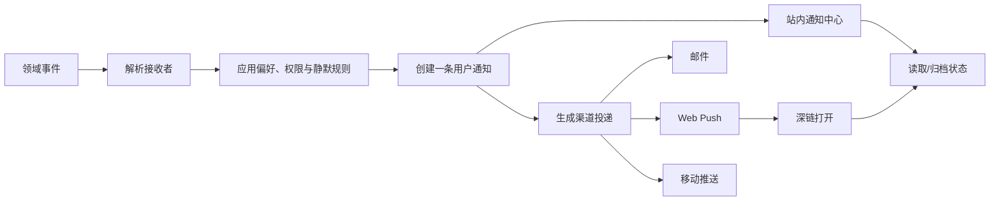

# Notification 通知

通知是系统基于领域事件，为特定接收者生成可行动信息，并通过一个或多个渠道投递。事件发生、通知生成、渠道送达和用户已读是四个不同事实。

## 四层模型

| 层 | 核心问题 | 示例 |
| --- | --- | --- |
| 领域事件 | 发生了什么 | 工单被指派 |
| 用户通知 | 谁需要知道 | 指派给李明的通知 |
| 渠道投递 | 通过哪里送达 | 站内、邮件、Push |
| 阅读状态 | 用户是否打开 | 在站内通知中心读过 |

邮件服务接受消息不代表用户已读；用户在站内读过不代表系统应召回已经发送的邮件。

## 事件契约

```json
{
  "eventId": "evt-8841",
  "type": "ticket.assigned",
  "occurredAt": "2026-07-18T02:20:00Z",
  "actorId": "user-51",
  "subject": {
    "type": "ticket",
    "id": "ticket-731",
    "version": 18
  },
  "data": {
    "assigneeId": "user-72",
    "priority": "p1"
  }
}
```

事件是不可变事实。`eventId` 用于下游去重；`subject.version` 帮助判断通知是否已过时；事件数据只放生成通知所需的最小字段。

## 通知记录

```json
{
  "notificationId": "note-2048",
  "recipientId": "user-72",
  "sourceEventId": "evt-8841",
  "category": "ticket-assignment",
  "subjectId": "ticket-731",
  "createdAt": "2026-07-18T02:20:01Z",
  "importance": "high",
  "state": "unread",
  "deepLink": "/tickets/ticket-731?from=notification",
  "groupKey": "ticket-731",
  "expiresAt": null
}
```

同一事件可为多个接收者生成不同通知；同一接收者只有一条领域通知，再产生多个渠道投递。

## 渠道投递

```json
{
  "deliveryId": "delivery-9001",
  "notificationId": "note-2048",
  "channel": "web-push",
  "subscriptionId": "push-sub-7",
  "state": "accepted",
  "attempt": 1,
  "providerReference": "provider-551",
  "acceptedAt": "2026-07-18T02:20:03Z"
}
```

投递状态：

- `queued`：等待发送；
- `accepted`：渠道服务已接受；
- `delivered`：只有渠道确实提供送达回执时使用；
- `failed-temporary`：可以退避重试；
- `failed-permanent`：地址或订阅失效；
- `suppressed`：偏好、静默期或聚合规则阻止发送。

不要把没有回执能力的渠道标记 delivered。

## 数据流



通知生成和投递使用 outbox 或事务消息，避免业务提交成功但通知事件丢失。

## 接收者计算

接收者可能来自：

- 明确被指派人；
- 关注者；
- 团队角色；
- @提及；
- 值班表；
- 资源所有者；
- 管理策略；
- 订阅查询。

计算时以事件发生时还是投递时的关系为准，需要按业务定义。安全告警通常投递时读取当前值班；评论提及记录事件时被提及主体。

移除无权接收者。即使事件含资源标题，投递前也要验证当前接收者能否知道该资源。

## 去重

至少三层去重：

1. 事件消费：同一 eventId 不重复生成用户通知；
2. 用户通知：同一 recipient/event/category 唯一；
3. 渠道投递：同一 notification/channel/subscription 唯一。

重试发送使用同一 deliveryId 或提供者去重键。不能让消息队列重复投递生成三封邮件。

通知中心仍可把多条不同事件聚合显示，例如“支付平台有 8 条新评论”，但底层事件和阅读状态不能丢失。

## 聚合与批量

高频事件适合时间窗聚合：

- 同一文档评论；
- 同一工单状态变化；
- 同一构建连续失败；
- 同一项目成员加入。

聚合规则包含 groupKey、窗口、最大数量和摘要字段。P1 告警不应与低优先评论一起等待日汇总。

批量摘要必须能下钻具体对象，并在对象权限变化后重新过滤。

## 偏好

偏好维度：

| 维度 | 示例 |
| --- | --- |
| 类别 | 指派、评论、营销 |
| 渠道 | 站内、邮件、Push |
| 重要性 | 仅高优先级 |
| 时间 | 工作时间、每日摘要 |
| 资源 | 关注特定项目 |
| 设备 | 关闭某台设备 Push |

安全、合规或账户关键通知是否可关闭必须明确。不可关闭不等于所有渠道都强制；可以保留站内凭证并限制高干扰渠道。

偏好更新只影响新生成投递，还是取消尚未发送的队列，也要定义。

## 静默期

静默期不是丢弃通知。常见策略：

- 站内立即记录；
- 非紧急渠道延迟；
- 紧急事件绕过；
- 静默结束后聚合；
- 显示被静默数量；
- 时区变化重新计算。

使用用户时区和明确工作日规则。旅行导致时区变化时，已排队通知如何处理由服务端统一决定，不能依赖设备本地计时器。

## Web Push

Push API 将消息送到关联 Service Worker 的订阅。推送消息可以更新本地状态或显示系统通知。推送订阅有唯一 endpoint 和加密密钥材料，应视为敏感凭证。

Notifications API 定义系统级通知表示，包括 title、body、tag、data、timestamp 和 navigation URL 等。通知权限被拒绝时，站内通知中心仍应可用。

Push 不保证用户立即看见，也不等于站内已读。订阅失效后标记渠道永久失败并停止重试。

## 系统通知的 tag 与替换

同一持续事件可以用 `tag` 替换旧系统通知，例如构建进度；不同关键事件不能误用同 tag 互相覆盖。

替换只影响系统展示，不应删除站内通知历史。`timestamp` 表示事件实际时间，而不是设备最终收到时间。

通知正文不显示秘密、验证码之外的长期凭证、完整医疗或财务内容。锁屏可能公开通知。

## 深链

深链必须：

- 指向稳定对象或任务；
- 在打开时重新认证和授权；
- 支持对象删除、移动和权限撤销；
- 防止开放重定向；
- 保留最小来源上下文；
- 不在 URL 放敏感正文；
- 能定位相关评论或事件。

点击系统通知后优先聚焦已有同源窗口或安全打开新窗口，导航到目标页标题。通知点击本身不直接执行删除、付款等高风险命令。

## 已读、已看与已处理

| 状态 | 证据 |
| --- | --- |
| unread | 用户通知尚未被客户端标记读取 |
| read | 用户打开通知中心项或目标内容 |
| seen-in-list | 通知在视口出现，证据较弱 |
| archived | 用户从默认列表移除 |
| acted | 相关领域任务完成 |

已读不等于已处理。把工单通知读过不能自动把工单设为完成。

多设备读取使用服务端 readAt 和 notification version 合并。离线设备迟到的 unread 本地状态不能覆盖服务端已读。

## 通知中心

结构：

1. 标题和未读数量；
2. 类别筛选；
3. 按时间分组的通知列表；
4. 每项主体、动作、时间和状态；
5. 标记已读、归档和偏好入口；
6. 加载更多与集合结束。

“全部标为已读”明确范围：当前筛选还是所有未读。操作后保留通知内容，只改变阅读状态。

动态新增不抢焦点。用户正在读历史时显示“有 3 条新通知”，由用户决定插入。

## 失败与恢复

领域事件处理失败：重放 eventId，不能重复通知。

站内通知写入成功、邮件失败：保留同一用户通知，投递显示渠道失败，不复制站内项。

Push accepted、响应丢失：查询或按 deliveryId 去重，不能重新生成 notificationId。

深链对象删除：显示安全不存在状态，并允许返回通知中心。

偏好服务不可用：对营销等非必要通知默认抑制；关键通知按明确保守政策处理。

## 案例一：P1 工单指派

### 输入

- ticket-731 被指派给 user-72；
- 事件队列重复投递三次；
- 用户开启站内和 Web Push；
- 22:30 在静默期，但 P1 可绕过；
- 用户有两个 Push 订阅，其中一个失效。

### 处理

1. eventId 唯一消费；
2. 为 user-72 创建一条 notification；
3. 站内项立即可见；
4. P1 按偏好绕过静默；
5. 两个订阅分别建立 delivery；
6. 订阅 A accepted；
7. 订阅 B 返回永久失效并停用；
8. 重复事件命中唯一约束；
9. 用户点击 Push 深链；
10. 重新授权后打开工单并标记通知 read。

### 验收

- 三次事件只生成一条站内通知；
- 两个设备投递记录分开；
- 失效订阅不会无限重试；
- 静默绕过有 P1 政策证据；
- 锁屏通知不含客户敏感正文；
- 深链无权限时不泄露工单；
- read 不改变工单业务状态；
- 另一设备刷新后同步已读。

### 失败分支

每次队列重放都创建新 notificationId 和 Push，用户收到三条。修正为事件、用户通知和渠道投递三层唯一性。

## 案例二：文档评论每日摘要

### 输入

- 同一文档 4 小时内有 18 条评论；
- 用户偏好邮件每日 09:00 摘要；
- 3 条评论包含 @提及；
- 用户 08:30 失去文档权限；
- 文档标题后来修改。

### 处理

1. 每个评论事件产生站内通知；
2. @提及按高优先策略立即站内提示；
3. 邮件投递进入 groupKey 文档摘要；
4. 09:00 生成摘要前重新授权；
5. 用户已无权限，抑制邮件；
6. 站内历史按披露策略隐藏正文；
7. 标题不从旧事件直接泄露；
8. 管理审计保留 suppressed 原因；
9. 用户重新获得权限后只接收新事件，除非偏好明确补发。

### 验收

- 18 个事件身份可追踪；
- 摘要不会把提及和普通评论计数混淆；
- 权限撤销后不发送正文；
- suppressed 不标记 delivered；
- 标题更新不会造成错误深链；
- 全部已读只改变通知状态；
- 邮件摘要时区按用户设置；
- 站内列表键盘可浏览并归档。

### 失败分支

摘要队列在 08:00 已渲染完整邮件，09:00 未重新授权直接发送。修正为投递时授权和最小化预渲染敏感内容。

## 调试

逐层记录：

- eventId 与事件版本；
- recipient 计算；
- preference 版本；
- notificationId；
- groupKey；
- deliveryId 和渠道状态；
- provider reference；
- readAt；
- 深链授权结果；
- 抑制原因。

对账：

```text
领域事件 → 接收者 → 用户通知 → 渠道投递
```

任何层数量变化都有规则。不能只看邮件提供商日志判断站内通知正确。

## 观测

- 事件到通知生成延迟；
- 通知到渠道 accepted 延迟；
- 重复抑制；
- 永久失效订阅；
- 静默和摘要数量；
- 深链失败；
- 已读同步冲突；
- 通知后任务完成率；
- 退订和权限拒绝；
- 高频通知造成的关闭偏好。

不把打开率直接解释为用户理解。分析不记录通知正文和 Push endpoint。

## 综合练习：多渠道告警中心

实现站内、邮件和 Web Push：

- 领域事件 outbox；
- 接收者与权限；
- 三层去重；
- 类别/渠道/静默偏好；
- P1 绕过政策；
- 摘要聚合；
- 多设备订阅；
- readAt 合并；
- 深链授权；
- Push 权限拒绝回退；
- 订阅失效；
- 权限撤销。

验收重放事件、切换时区、两设备已读、摘要前撤权和 Push 响应丢失。每个 delivered 声明都必须有渠道证据。

## 来源

- [WHATWG — Notifications API Living Standard](https://notifications.spec.whatwg.org/)（访问日期：2026-07-18）
- [W3C — Push API](https://www.w3.org/TR/push-api/)（访问日期：2026-07-18）
- [W3C — Service Workers](https://www.w3.org/TR/service-workers/)（访问日期：2026-07-18）
- [W3C WAI — WCAG 2.2 状态消息](https://www.w3.org/WAI/WCAG22/Understanding/status-messages.html)（访问日期：2026-07-18）
