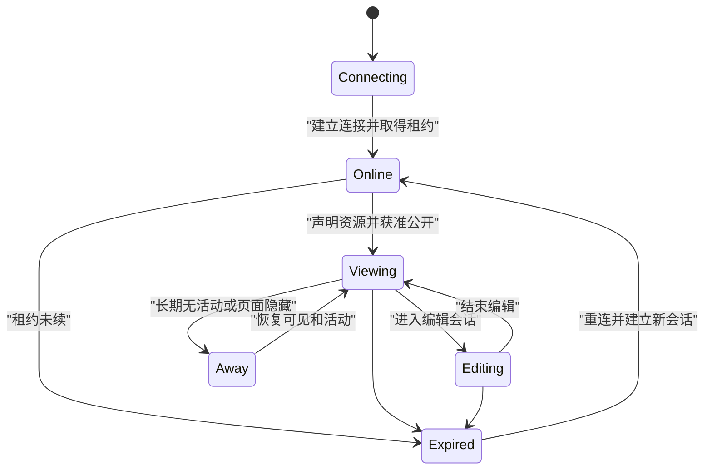

# Presence 在线状态

Presence 是系统根据连接、心跳、页面可见性和编辑租约推断的协作状态。它表达“最近观察到什么”，不能证明用户本人正在看屏幕，更不能作为授权依据。

## 证据强度

| 文案 | 需要的证据 | 仍不能证明 |
| --- | --- | --- |
| 在线 | 至少一个会话租约有效 | 用户正在操作 |
| 最近活跃 | 最近收到明确交互信号 | 用户仍在页面 |
| 正在查看 | 某设备声明目标资源并保持租约 | 用户正在阅读具体字段 |
| 正在编辑 | 持有编辑会话或租约 | 该用户有最终保存权限 |
| 正在输入 | 短期输入活动信号 | 内容将发送 |

“绿色圆点”通常只是租约未过期，不应写成“用户正在电脑前”。

## 会话模型

```json
{
  "presenceSessionId": "presence-8841",
  "userId": "user-72",
  "deviceId": "device-web-3",
  "connectionId": "ws-551",
  "state": "viewing",
  "resource": {
    "type": "document",
    "id": "doc-42"
  },
  "lastHeartbeatAt": "2026-07-18T02:20:00Z",
  "leaseExpiresAt": "2026-07-18T02:20:45Z",
  "visibility": "visible",
  "editor": {
    "sessionId": "edit-7",
    "baseVersion": 31
  }
}
```

Presence session 与认证会话分离。`deviceId` 是受控设备标识，不公开给其他用户。`resource` 只有产品允许显示“正在查看”时才记录。

## 心跳与租约

客户端每隔一段时间续租，服务端设置到期时间：

```text
heartbeat interval = 15 s
lease duration = 45 s
```

网络断开或标签崩溃时没有显式离线事件，租约到期后状态自然消失。间隔选择平衡：

- 在线状态延迟；
- 服务端负载；
- 移动电量；
- 网络抖动；
- 多标签数量；
- 后台节流。

不能只依赖 WebSocket close。设备休眠、NAT、进程被杀可能无法完成关闭握手。

## 状态流



服务端基于租约计算状态，不接受客户端直接写 `online=true`。

## WebSocket 连接

WebSocket 提供双向通信。浏览器 API 的连接 open 只证明该连接建立；代理、服务端和业务订阅仍可能部分失效。

应用层心跳可以包含：

- presenceSessionId；
- 客户端最后收到的事件序列；
- 当前可见资源；
- 编辑会话；
- 页面 visibility；
- 客户端时间仅作诊断。

服务端时间决定租约。WebSocket 协议 Ping/Pong 未直接暴露在浏览器 WebSocket API 中，应用需要自己的消息或由基础设施管理。

## 页面可见性

`document.visibilityState` 的 `visible`/`hidden` 说明文档可见性，不说明用户关注。

页面 hidden 时可以：

- 降低心跳频率；
- 把 viewing 降为 away；
- 结束正在输入信号；
- 保留必要编辑草稿；
- 不释放服务端授权；
- 恢复时重新同步。

分屏、多窗口和屏幕锁让“visible”仍不是注意力证明。不要把页面可见时间直接作为工时。

## 活动信号

活动可以来自：

- 键盘输入；
- 指针操作；
- 滚动；
- 焦点变化；
- 显式“我还在”；
- 编辑命令。

监听应节流，不上传具体按键、指针轨迹或文本。普通鼠标移动不一定表示有效活动。

“最近活跃”使用范围文案，例如“5 分钟内活跃”，避免伪精确到秒。

## 多设备与多标签

一个用户可能同时有：

- 桌面浏览器两个标签；
- 手机应用；
- 后台服务工作线程；
- 另一台电脑。

聚合规则示例：

1. 任一会话 editing → 用户在该资源显示正在编辑；
2. 否则任一会话 viewing → 正在查看；
3. 否则任一有效会话 recent active → 在线；
4. 全部到期 → 离线或不显示。

同一用户在两个资源上 viewing 时，是否向他人公开两个位置取决于隐私和产品价值。不能只保留最后一个连接并错误踢掉其他设备。

## 资源 Presence

资源页面可以显示：

- 当前查看人数；
- 已选择公开的成员头像；
- 正在编辑的用户；
- 输入指示；
- 选区或光标（实时协作）。

敏感资源不应把查看者名单泄露给所有成员。匿名计数也可能泄露某人是否正在处理事件。

用户进入资源前服务端先授权；Presence 广播只发送当前接收者有权看到的资源和用户字段。

## Presence 不是授权

错误做法：

- 因“管理员在线”就允许发布；
- 因“无人编辑”就跳过版本条件；
- 因用户离线就释放其业务所有权；
- 因连接来自某设备就信任角色；
- 用在线状态决定是否可下载附件。

每个业务动作仍重新认证、授权并校验对象版本。Presence 最多改善协调和冲突预警。

## 编辑租约

编辑 Presence 和独占锁不同。

```json
{
  "kind": "advisory-editing",
  "resourceId": "doc-42",
  "userId": "user-72",
  "expiresAt": "2026-07-18T02:20:45Z"
}
```

advisory 只提示“李明正在编辑”，不阻止其他人。

独占租约需要：

- leaseId；
- 持有者；
- 到期；
- 续租；
- 接管；
- 写入时检查 leaseId 和对象版本。

界面必须区分提示与锁。看到其他人在编辑不等于自己不能查看。

## 正在输入

typing 是高频、短寿命、低可靠信号：

```json
{
  "conversationId": "chat-42",
  "userId": "user-72",
  "state": "typing",
  "expiresInMs": 5000
}
```

不发送输入内容。停止输入、页面隐藏、发送消息或租约到期都使指示消失。

多人输入时聚合为“李明和另外 2 人正在输入”，不要无限列名字。typing 事件丢失必须靠短期到期恢复。

## 隐私控制

用户可以控制：

- 是否显示在线；
- 是否显示最近活跃时间；
- 是否显示正在查看资源；
- 是否显示正在输入；
- 对哪些团队公开；
- 隐身时自己能看到什么。

企业策略可能要求协作编辑显示参与者，但应明确目的与范围。Presence 数据不能默认用于绩效、出勤或监控。

服务端保存最短必要历史。实时状态通常不需要长期保留逐次心跳。

## 断线与恢复

断线期间：

- 本地立即标记连接中断；
- 不立刻把其他人显示离线，等待服务端租约；
- 停止发送本地 viewing/typing；
- 保留编辑草稿；
- 重连后建立新 connection；
- 使用事件序列补回成员变化；
- 重新声明当前资源；
- 重新授权。

旧连接迟到消息带旧 connectionId，应忽略，避免重连后状态倒退。

## 事件顺序

```json
{
  "stream": "presence:doc-42",
  "sequence": 9120,
  "type": "session.expired",
  "sessionId": "presence-8841"
}
```

客户端按 sequence 合并。发现缺口时重新拉取当前快照，不从现有头像列表猜测。

快照包含 snapshotVersion；快照之后只应用更高序列事件。

## 界面反馈

头像需要可访问名称和状态文本，例如“李明，正在编辑”。颜色圆点不是唯一信息。

成员列表动态变化不应抢焦点。高频加入离开不逐条朗读；与用户任务相关的变化，例如“王芳开始编辑当前段落”，可以节流提示。

头像重叠不能使键盘无法访问。提供“3 人正在查看”按钮打开具名列表。列表关闭后焦点返回按钮。

## 案例一：协作文档查看与编辑

### 输入

- user-72 桌面标签查看 doc-42；
- 同一用户手机在其他页面；
- user-51 正在编辑 doc-42；
- user-51 的网络突然断开；
- 文档本身 version 31。

### 处理

1. 桌面标签建立 viewing 租约；
2. 手机会话只聚合为 online，不覆盖资源状态；
3. user-51 建立 advisory editing；
4. 页面显示“王芳正在编辑”；
5. 网络断开没有 close 事件；
6. 服务端在 45 秒后让 edit session 到期；
7. 广播 session.expired；
8. user-72 页面移除编辑提示；
9. user-72 保存仍使用 doc version 31 条件；
10. Presence 消失不代表文档无人并发修改。

### 验收

- user-72 两设备聚合但不互相覆盖；
- user-51 断线后状态在租约期限内收敛；
- 客户端时钟快 2 分钟不影响到期；
- 旧连接迟到 heartbeat 不复活会话；
- “正在编辑”不绕过 If-Match；
- 无文档权限用户收不到成员列表；
- 头像状态有文本而非仅颜色；
- 页面 hidden 后 viewing 降级符合策略。

### 失败分支

连接 close 后客户端立即把 user-51 标离线，但服务端仍有手机会话。修正为服务端会话聚合和租约快照。

## 案例二：客服在线与工单分配

### 输入

- 20 名客服，12 个在线会话；
- 3 人页面 hidden 超过 10 分钟；
- 2 人选择隐身；
- 自动分配还需要技能、容量和班次；
- presence 服务短暂不可用。

### 决策

1. Presence 只提供候选活跃信号；
2. hidden 超阈值会话标 away；
3. 隐身用户不向同事公开，但调度是否可用由独立政策决定；
4. 分配服务读取班次、技能、当前任务数和授权；
5. Presence 不可用时停止自动分配或使用明确保守策略；
6. 不能把灰色头像当作不在班；
7. 工单分配后由领域事务确认；
8. 被分配用户接收通知；
9. 未接单超时触发重新分配规则，而不是根据瞬时离线。

### 验收

- 在线人数不等于可分配人数；
- hidden 和隐身语义分开；
- presence 故障不会越权分配；
- 同一客服多设备只计一个人；
- 调度日志记录业务条件而非指针活动；
- Presence 历史不被用作工时；
- 键盘可以打开在线成员详情；
- 用户偏好变化及时停止公开。

### 失败分支

系统看到客服在线就直接分配敏感工单，忽略技能与租户权限。修正为 Presence 只作弱候选信号，领域服务完整授权。

## 调试

记录：

- userId 的匿名诊断标识；
- presenceSessionId；
- connectionId；
- device 类别；
- heartbeat 服务端时间；
- leaseExpiresAt；
- visibility；
- resource 声明；
- stream sequence；
- 聚合后的公开状态；
- 隐私策略版本。

测试：

- 无 close 的断网；
- 设备休眠；
- 标签 hidden；
- 两设备；
- 旧连接迟到；
- 事件丢失；
- 客户端时钟偏差；
- 权限撤销；
- 隐身切换；
- Presence 服务故障。

## 观测

- 会话建立与租约到期；
- 重连次数；
- 状态收敛延迟；
- 序列缺口；
- 每用户平均设备数；
- viewing/editing 到期；
- 隐私设置使用；
- 未授权 Presence 泄露；
- typing 风暴；
- Presence 被错误用于授权的缺陷。

不记录具体按键、指针路径、文档正文或长期精确活动时间线。

## 综合练习：协作白板 Presence

实现：

- 多设备会话；
- viewing 与 editing 分开；
- 光标更新节流；
- typing/dragging 短租约；
- 页面 hidden 降级；
- 断线自然到期；
- 快照+序列恢复；
- 隐身偏好；
- 资源授权；
- advisory 编辑提示；
- 真正写入仍用版本条件；
- 高对比和键盘成员列表。

验收使用两个用户、三个设备、一次网络分区、一个旧连接复活尝试和一次权限撤销。所有公开状态都能指出当前证据及租约期限。

## 来源

- [WHATWG — WebSockets Living Standard](https://websockets.spec.whatwg.org/)（访问日期：2026-07-18）
- [IETF — RFC 6455：The WebSocket Protocol](https://www.rfc-editor.org/rfc/rfc6455.html)（访问日期：2026-07-18）
- [W3C — Page Visibility Level 2](https://www.w3.org/TR/page-visibility-2/)（访问日期：2026-07-18）
- [W3C WAI — WCAG 2.2 状态消息](https://www.w3.org/WAI/WCAG22/Understanding/status-messages.html)（访问日期：2026-07-18）
