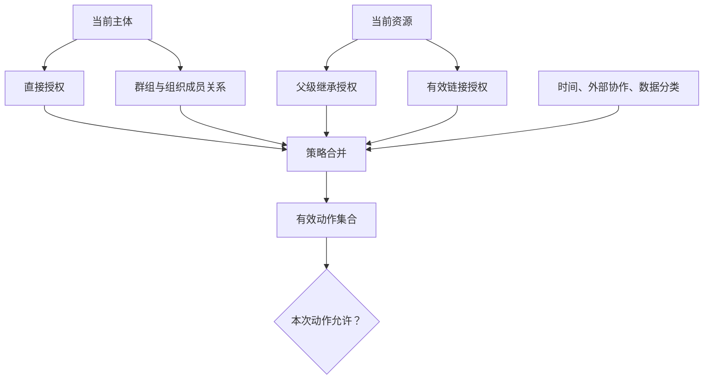

# Share 分享

Share 是为资源创建、修改或撤销访问关系的授权操作。分享界面必须准确表达“哪个主体、对哪个资源、可以做什么、在什么条件下、持续多久”，并让所有有效权限和链接可被复核。

## 能力边界与前置知识

本文聚焦：

- 直接 ACL、群组、继承权限和链接分享的差异。
- 查看、评论、编辑、管理等角色的能力边界。
- 外部协作者身份验证、邀请与到期。
- 链接复制、传播风险、撤销与轮换。
- 有效权限计算、审计、缓存失效和并发修改。

前置知识：

- 能定义资源、主体、动作和组织边界。
- 理解前端隐藏不能替代服务端授权。
- 能区分分享授权、通知投递和内容引用。

分享不是“把 URL 复制出去”。规范 URL 只标识资源；是否授予访问由 ACL、策略或具备访问能力的秘密链接决定。

## 授权的五个要素

\[
Decision = f(Principal, Resource, Action, Context, Policy)
\]

- `Principal`：用户、群组、组织、服务账号或匿名链接持有者。
- `Resource`：文档、文件夹、报表、项目或其特定版本。
- `Action`：read、comment、edit、share、download、delete 等。
- `Context`：时间、组织、设备、网络、数据分类和会话风险。
- `Policy`：ACL、继承、组织规则、外部协作限制和保留策略。

界面的“查看者”“编辑者”是能力集合的产品名称，不是跨产品通用标准。每个角色要展开实际动作。

## ACL 数据模型

### Access Control Entry

| 字段 | 作用 |
| --- | --- |
| `grant_id` | 一次授权的稳定标识 |
| `resource_id` | 被授权资源 |
| `principal_type` | user、group、domain、organization、link |
| `principal_id` | 主体或链接能力稳定 ID |
| `role_id` | 角色定义 |
| `source` | direct、inherited、policy、link |
| `granted_by` | 授权主体 |
| `granted_at` | 服务端授权时间 |
| `expires_at` | 可选到期时间 |
| `conditions` | 允许的上下文条件 |
| `status` | pending、active、expired、revoked |
| `version` | 并发修改版本 |

ACL 只存允许关系还是同时存拒绝关系，取决于授权模型。若支持 deny，需要明确它与 direct allow、group allow、继承 allow 的优先级；不能让界面自行猜测。

### 有效权限

“在共享列表中没有此人”不代表无权限，他可能通过群组、父文件夹或组织链接获得访问。分享界面应展示有效来源，至少能解释为何有权访问。

## 角色与动作

一个示例角色表：

| 动作 | 查看者 | 评论者 | 编辑者 | 管理者 |
| --- | ---: | ---: | ---: | ---: |
| 查看内容 | 是 | 是 | 是 | 是 |
| 下载 | 按资源策略 | 按资源策略 | 按资源策略 | 按资源策略 |
| 评论 | 否 | 是 | 是 | 是 |
| 修改正文 | 否 | 否 | 是 | 是 |
| 删除资源 | 否 | 否 | 依产品规则 | 是 |
| 邀请他人 | 否 | 否 | 依组织策略 | 是 |
| 修改 ACL | 否 | 否 | 否 | 是 |
| 转移所有权 | 否 | 否 | 否 | 按组织策略 |

“阻止下载”不能阻止有查看能力的人通过截图、拍照或手工复制所有信息。它只限制产品提供的下载功能，不应被承诺为绝对防泄漏。

角色变更是授权写入，需要重新检查操作者是否仍有管理权限，并防止最后一个必要管理者被误移除。

## 直接分享

### 选择主体

候选目录先按当前操作者可发现范围过滤，再标明：

- 已有访问者。
- 同组织可邀请者。
- 允许邀请的外部身份。
- 因策略不可邀请的主体。

同名用户使用最小必要信息消歧，不显示完整私人联系方式。

### 邀请

邀请与授权可以分为：

1. 创建 pending invitation。
2. 发送通知。
3. 收件人完成身份验证。
4. 校验邀请目标身份、域和到期时间。
5. 激活 grant。

若业务要求“发出邀请即获得权限”，也必须说明未登录访问怎样绑定到正确身份。仅凭邮件地址文本不能证明实际登录者拥有该地址。

### 通知

通知投递失败不一定回滚已创建授权。界面必须准确说明：

- “已授予访问，但邮件未发送。”
- “邀请尚待接受。”
- “邀请创建失败，未授予访问。”

授权数据库和邮件队列是两个结果，不要合成一个模糊成功状态。

## 群组、组织与域分享

群组授权便于成员变动，但使有效权限来自动态成员关系：

- 新成员加入群组后获得资源访问。
- 成员移除后应及时失效。
- 嵌套群组可能增加解释和缓存失效成本。
- 外部成员是否可加入群组由组织政策决定。
- 历史审计需要回答某一时刻群组中有哪些实际成员。

“组织内任何人”通常要求登录到指定租户；“某邮箱域”未必等同于同一组织身份。域所有权、受管账号和联合身份策略要由身份系统决定。

Google Drive API 的 permission scope 可为 user、group、domain 或 anyone，role 决定能力。Microsoft Graph 的链接 scope 可为 anonymous、organization 或 users。它们是各自平台的具体模型，产品应定义自己的语义而不是照抄名称。

## 继承权限

### 来源

文件夹、项目或空间可以向子资源传递授权。子资源页面需要显示：

- 直接授权。
- 继承自哪个父级。
- 组织策略授予。
- 链接授予。

对继承项的“移除”可能不可用，或实际操作是从父级移除、移动资源、停止继承、添加 deny。界面必须说明影响范围。

### 移动资源

资源从文件夹 A 移到 B 时，有效权限可能改变。移动前要计算：

- 哪些主体会获得访问。
- 哪些主体会失去访问。
- 哪些直接 ACL 保留。
- 现有外部链接是否继续有效。
- 评论、搜索、通知和缓存如何更新。

移动成功后异步索引未刷新，不能让旧权限继续从搜索或预览泄露。

### 停止继承

常见方式：

| 方式 | 结果 | 风险 |
| --- | --- | --- |
| 复制当前有效 ACL 为直接项 | 当下访问不变，未来与父级脱钩 | ACL 数量膨胀 |
| 只保留原直接项 | 立即移除继承访问 | 可能让协作者失联 |
| 添加受控例外 | 保留继承并限制某动作 | 优先级难解释 |
| 禁止停止继承 | 结构简单 | 无法隔离敏感子项 |

选择必须由数据分类和组织政策约束。

## 链接分享

### 链接类型

| 类型 | 访问主体 | 身份可追踪性 | 适用风险 |
| --- | --- | --- | --- |
| 指定用户链接 | 被列出的登录用户 | 高 | 外部审阅 |
| 组织链接 | 指定组织的登录用户 | 中到高 | 内部广泛分发 |
| 匿名能力链接 | 持有链接的任何人 | 低 | 低敏感、短期内容 |
| 一次性链接 | 首次合法使用者 | 取决于绑定方式 | 单次领取或验证 |
| 公开链接 | 所有人且可被索引 | 低 | 明确公开内容 |

匿名链接本质上是 capability URL：持有 URL 的主体获得相应能力。W3C TAG 指出这类 URL 可能暴露在浏览历史、日志、Referrer、第三方脚本和同步服务中，因此不应默认用于高风险资源。

### Token 设计

- 使用不可猜的高熵随机值，不用连续编号。
- 服务端只存 token 的安全摘要，泄露数据库时降低直接使用风险。
- 每条链接拥有独立 `grant_id`，可单独撤销。
- token 不进入分析事件、错误日志和第三方脚本。
- URL 使用 HTTPS。
- 页面控制 Referrer，并避免不可信第三方资源。
- GET 只读取，不通过访问链接执行删除等副作用。
- 规范资源 URL 与能力链接分开。

`robots.txt` 不能保护秘密链接；它是爬虫约定，而且列出具体路径本身可能泄露结构。

### 链接配置

创建前明确：

- 角色：view、comment 或其他。
- 范围：指定用户、组织、匿名。
- 到期时间与时区。
- 是否需要密码或二次验证。
- 是否允许下载。
- 是否允许再次分享。
- 当前组织策略是否允许。

密码与链接若通过同一渠道发送，附加保护有限。密码尝试需要限流，且密码本身安全存储。

### 复制

“复制链接”只在浏览器剪贴板写入成功后显示成功状态。失败时提供可选择的文本或重试，不能宣称已复制。

复制前或复制旁持续显示：

- 谁可以打开。
- 能做什么。
- 何时到期。
- 怎样撤销。

不要只用图标或颜色区分“任何人可访问”与“仅受邀者”。

## 过期、撤销与轮换

### 过期

`expires_at` 使用明确时区并由服务端执行。到期任务失败也不能让链接继续有效；授权检查直接比较当前服务端时间。

到期后：

- 链接访问返回过期或不可用结果。
- 缓存与 CDN 不再提供受限内容。
- 搜索、缩略图和嵌入失效。
- 当前打开的会话在下一次敏感请求重新授权。
- UI 将 grant 标为 expired，而不是 active。

### 撤销

撤销是写操作：

1. 校验操作者权限与 grant 版本。
2. 将 grant 状态改为 revoked。
3. 使授权缓存失效。
4. 停止未发送邀请和通知。
5. 终止或缩短已有会话能力。
6. 记录审计事件。

已经下载的副本不能通过撤销召回，界面必须避免这种承诺。

### 轮换

怀疑链接泄露时创建新链接并撤销旧链接。不要让多个不同 token 指向同一个不可区分的 grant，否则无法单独撤销或审计。

### 删除资源

资源删除应使所有 grant 和 capability URL 失效。恢复资源时，是否恢复旧分享必须按产品策略明确；高敏感资源通常需要重新确认，而不是自动复活旧匿名链接。

## 分享面板的信息架构

### 当前访问

按来源展示：

- 直接用户和群组。
- 继承访问。
- 组织或域范围。
- 活跃链接。
- 待接受邀请。
- 已到期或已撤销项（可放审计区域）。

用户需要回答“谁现在能访问”，因此默认视图应显示有效权限，不只显示自己创建的邀请。

### 添加访问

流程顺序：

1. 选择主体或链接范围。
2. 选择角色。
3. 设置到期与条件。
4. 显示影响摘要。
5. 确认授权。
6. 分别反馈授权与通知结果。

高风险范围扩张，例如匿名编辑链接，应有额外确认，但不把所有内部只读邀请都做成阻塞对话框。

### 修改与移除

操作名称包含主体和结果，例如：

- “将 Lin 改为只读。”
- “撤销外部审阅链接。”
- “从研究文件夹移除供应商组。”

若权限继承，操作应指向来源或解释无法在当前资源修改。

## 并发与一致性

### 版本控制

分享面板打开后，另一管理员可能修改 ACL。提交时携带 ACL 版本或 grant 版本；冲突后刷新并保留用户意图，不能静默覆盖对方新增权限。

### 缓存

授权缓存必须有精确失效机制。撤销后只更新主数据库但边缘缓存继续放行，是安全失败。关键读取和写入都应验证当前授权版本。

### 派生系统

权限传播到：

- 搜索索引。
- 缩略图与预览。
- 评论和 mention。
- 通知深链。
- 导出、打印和下载。
- API token 与集成。
- 离线缓存。

撤销测试必须覆盖这些入口。

## 案例一：临床研究文件夹邀请外部统计师

### 输入

研究文件夹包含去标识化数据、研究方案和内部伦理记录。外部统计师只需对去标识化数据发表评论，访问 14 天；不得查看内部伦理记录，也不能再次分享。

### 结构决策

不能直接分享整个研究根文件夹。建立“外部分析”子文件夹，并明确停止继承内部团队的宽泛编辑角色；仅复制必要的内部管理者授权。

为外部统计师创建指定用户邀请：

- 角色：commenter。
- 资源：外部分析子文件夹。
- 到期：服务端时间 14 天。
- 二次条件：完成组织身份验证。
- `reshare=false`。
- 下载能力由数据治理策略决定，不用评论角色名称隐含。

### 邀请与激活

授权初始为 pending。通知只包含研究代号，不包含敏感标题。收件人登录验证指定身份后 grant 激活。若邮件失败，界面显示邀请未送达，但授权仍是 pending；管理员可重新发送，不创建重复 grant。

### 到期与撤销

到期检查发生在每次请求。打开的浏览器会话在下一次读取评论或文件时被拒绝。搜索、预览和短期下载 URL 同时失效。

研究提前结束时，管理员撤销 grant。已经下载的文件不会被界面承诺召回，因此数据分类阶段必须先决定是否允许下载。

### 验证

- 外部统计师只能看到子文件夹及允许内容。
- 同邮箱的未受管账户不能接受邀请。
- 评论、mention 候选、搜索和通知遵守相同范围。
- 14 天边界使用服务端时区准确失效。
- 撤销后已有页面、预览 URL 和 API 请求全部拒绝。
- 内部伦理文件不会因父级或搜索索引泄露。

### 失败分支

如果只在子文件夹 UI 中隐藏伦理文件，但父级 ACL 仍授予读取，深链和搜索可能继续访问。资源边界必须在授权数据上隔离，不能由文件树显示规则承担。

## 案例二：董事会报表的短期查看链接

### 输入

季度报表需要发给不使用公司账号的董事。内容允许查看 48 小时，不允许匿名编辑。组织接受持有链接即可查看的风险，但要求每位董事使用独立链接以便单独撤销。

### 链接设计

为每位收件人创建独立 capability grant：

- 高熵 token。
- `role=view`.
- `expires_at` 精确到时区。
- 可选密码通过另一个渠道发送。
- 每条 grant 单独记录创建人、收件标签和访问事件。

页面不加载第三方分析脚本，不把 token 发到日志或外链 Referrer。打开后地址可在安全设计下换为规范 URL 与受控会话，但服务器不能依赖不可靠的 Referrer 传递权限。

### 复制界面

每一行显示“董事 A — 仅查看 — 7 月 20 日 18:00 到期”。复制成功才反馈。管理员可复制、轮换或撤销某一行，不影响其他链接。

### 验证

- token 不能由相邻值枚举。
- 两个链接有不同 grant 与审计。
- 到期、撤销和资源删除后无法从 CDN 读取。
- 链接不出现在分析、错误跟踪和页面 Referrer。
- `GET` 链接不会执行任何写操作。
- 320 CSS px 与键盘下到期和角色文本仍完整。

### 失败分支

若所有董事共用一个链接，发现泄露时只能全部撤销，也无法判断哪条分发链需要处理。独立链接提高撤销粒度，但不把访问 IP 当成可靠身份。

## 案例三：项目文件移动导致继承变化

### 输入

设计文件在“产品团队”文件夹中，继承 40 名员工的查看权限，并直接授予外部代理商编辑权限。文件要移动到“发布材料”文件夹，该父级对全组织可读。

### 影响预览

移动确认显示：

- 将新增全组织查看权限。
- 产品团队的继承来源将消失，但其成员仍因组织权限可查看。
- 外部代理商直接编辑权限将保留。
- 活跃的指定用户分享链接不变。

如果文件含尚未发布信息，策略阻止移动，或要求先调整目标文件夹权限。不能先移动再靠用户发现暴露。

### 一致性

移动与权限版本变更在同一受控事务或可恢复工作流中完成。搜索索引在收到新 ACL 版本前不向新增主体展示摘要；旧权限缓存失效。

### 验证

- 移动前后计算有效主体与动作差异。
- 并发管理员在确认期间修改目标文件夹 ACL 时触发重新评估。
- 外部直接权限是否保留符合明确策略。
- 撤销移动后权限来源恢复。
- 通知不会向新获得组织访问的所有人广播。

### 失败分支

如果预览只说“移动成功”，操作者不知道它同时扩大到全组织。改变父级就是潜在授权变更，确认必须展示新增和失去的有效范围。

## 无障碍与交互

- 分享触发按钮说明资源，例如“共享季度报表”。
- 对话框打开后焦点进入标题或首个合理字段，关闭后返回触发按钮。
- 主体候选使用可访问 combobox，键盘可搜索、选择和取消。
- 当前访问列表中，姓名、权限来源、角色和到期组成可理解单元。
- 角色不能只靠颜色或图标表达。
- 复制结果使用非打断状态消息。
- 撤销确认说明目标链接或主体及影响。
- 异步保存期间不让焦点元素消失，冲突后保留选择。
- 200% 文本缩放与窄屏下不截断主体、角色和到期信息。

## 观测与审计

### 观测信号

- 按 scope 和 role 统计新 grant，不记录秘密 token。
- 外部邀请接受、过期和撤销。
- 匿名链接创建、轮换与异常访问。
- 到期后被拒绝的访问和缓存放行告警。
- ACL 冲突、通知失败和目录误选。
- 权限变更后搜索与预览传播延迟。
- 资源移动导致的有效主体变化。

“分享次数”不是协作价值，也不能替代高风险范围审核。

### 审计事件

记录：

- 谁在何时对哪个资源创建或修改哪条 grant。
- 旧角色与新角色。
- 到期与撤销原因。
- 继承来源变化。
- 链接 grant ID，不记录完整 token。
- 策略拒绝与管理员覆盖。

审计读取本身需要严格授权和保留限制。

## 调试顺序

1. 固定主体、资源、动作和服务端时间。
2. 列出直接、群组、继承、策略和链接来源。
3. 计算有效动作集合。
4. 检查组织外部协作与数据分类策略。
5. 检查 grant 版本、到期和撤销状态。
6. 检查缓存、索引、预览、评论和下载入口。
7. 检查通知是否与授权结果分开。
8. 复测键盘、状态消息和窄屏。

## 失败注入

1. 分享面板打开时另一管理员改变 ACL。
2. 群组成员在请求期间被移除。
3. 链接在页面打开后立即撤销。
4. 到期任务停止运行。
5. 邮件发送失败但 grant 已创建。
6. 资源移动到更宽权限父级。
7. token 出现在错误上报或 Referrer。
8. 删除后恢复资源。
9. 最后一名管理者尝试移除自己。

## 综合练习：设计端到端分享系统

为支持文件夹继承、外部用户与匿名链接的资源库交付：

1. grant、role、principal 和 condition 数据模型。
2. 直接、群组、继承、策略和链接的有效权限算法。
3. 邀请 pending、active、expired、revoked 状态机。
4. 角色—动作表与高风险确认。
5. capability URL 的生成、存储、复制、过期、轮换和撤销。
6. 资源移动与停止继承的影响预览。
7. 缓存、索引、通知、附件和 API 的撤权测试。

验收标准：

- 分享面板能解释所有有效访问来源。
- 每个角色展开为明确动作集合。
- 通知失败不会被误写成授权失败或成功。
- 匿名链接可独立撤销且 token 不进入日志。
- 到期由每次服务端授权判断执行。
- 资源移动前展示权限扩大与缩小。
- 已下载副本不会被承诺可远程召回。

## 来源

- [NIST：Guide to Attribute Based Access Control](https://www.nist.gov/publications/guide-attribute-based-access-control-abac-definition-and-considerations-0)（访问日期：2026-07-18）
- [W3C TAG：Good Practices for Capability URLs](https://www.w3.org/TR/capability-urls/)（访问日期：2026-07-18）
- [Google Drive API：Share Files, Folders, and Drives](https://developers.google.com/workspace/drive/api/guides/manage-sharing)（访问日期：2026-07-18）
- [Google Drive API：Permissions Resource](https://developers.google.com/workspace/drive/api/reference/rest/v3/permissions)（访问日期：2026-07-18）
- [Microsoft Graph：Create a Sharing Link](https://learn.microsoft.com/en-us/graph/api/driveitem-createlink?view=graph-rest-1.0)（访问日期：2026-07-18）
