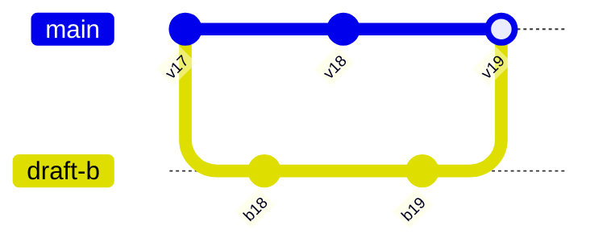

# Version History 版本历史

版本历史记录一个对象在不同时点的已提交状态，以及每次变化的主体、时间、来源和原因。

它用于：

- 查明发生了什么。
- 比较两个状态。
- 恢复旧内容。
- 审核高风险变化。
- 支持协作冲突处理。

版本历史不是活动日志的另一种样式。

活动日志记录事件；版本历史需要能够重建或读取对象的特定状态。

## 版本、事件和审计

| 数据 | 回答的问题 | 是否能恢复状态 |
| --- | --- | --- |
| 当前对象 | 现在是什么 | 不能解释过程 |
| 版本快照 | 某一版是什么 | 可以 |
| 变更集 | 从一版到下一版改了什么 | 结合基线可以 |
| 活动事件 | 谁执行了什么动作 | 不一定 |
| 审计记录 | 安全与合规上发生了什么 | 通常不用于直接恢复 |

一个“编辑文档”事件可能对应多次自动保存版本。

一条版本也可能包含多个字段变更。

产品需要分别建模，不能用一张 `activity` 表承担所有责任。

## 线性与分支历史

### 线性历史

```text
v17 → v18 → v19 → v20
```

适合单一正式对象和乐观并发控制。

### 分支历史



适合：

- 草稿分支。
- 候选方案。
- 独立环境配置。
- 代码或复杂内容协作。

普通业务页面若只允许单一正式版本，不应为了显示树形图而引入分支语义。

## 版本身份

版本需要稳定身份：

```json
{
  "resourceId": "doc-42",
  "versionId": "doc-42:v31",
  "sequence": 31,
  "parentVersionIds": [
    "doc-42:v30"
  ],
  "createdAt": "2026-07-18T12:00:00Z",
  "createdBy": "user-72",
  "operationId": "save-8841",
  "schemaVersion": 6,
  "contentHash": "sha256:..."
}
```

- `versionId` 唯一指向该状态。
- `sequence` 便于当前资源内排序，但不一定全球唯一。
- `parentVersionIds` 表达来源。
- `operationId` 连接触发操作。
- `schemaVersion` 支持旧数据读取。
- `contentHash` 可验证内容是否一致，但不是权限凭据。

不要只用更新时间作为版本身份。

两个提交可能落在同一秒，时钟也可能不同步。

## 快照与变更集

### 完整快照

每个版本保存完整对象。

优点：

- 读取简单。
- 版本独立。
- 恢复直接。

成本：

- 存储大。
- 大附件重复。

### 增量变更

保存 patch、事件或字段差异。

优点：

- 存储小。
- 能表达操作意图。

成本：

- 重建依赖整个链。
- 旧 patch Schema 难迁移。
- 链损坏影响后续版本。

### 混合

定期快照，中间保存变更。

读取某版本：

1. 找到不晚于目标的最近快照。
2. 按顺序应用变更。
3. 验证每一步 hash 或版本。
4. 得到目标状态。

快照间隔由数据量、读取延迟和恢复目标决定。

## 什么算一个版本

可能的边界：

- 每次显式保存。
- 自动保存聚合窗口。
- 每次发布。
- 每个审批节点。
- 每个外部同步。
- 每次高风险配置变更。

每个按键一个服务端版本会产生噪声。

只在发布时保存版本又会丢失草稿恢复能力。

可以区分：

- 编辑 revision：细粒度恢复。
- 命名版本：用户主动标记。
- 发布版本：对外生效。
- 审计版本：高风险业务节点。

## 版本元数据

列表项应显示：

- 提交者。
- 服务端时间和时区。
- 版本类型。
- 变更摘要。
- 来源设备或渠道（确有必要时）。
- 发布、审批或恢复关系。
- 是否为当前版本。

“Alice 在 2 分钟前编辑”不够稳定。

相对时间用于扫描，详情应提供绝对时间。

主体显示需要处理：

- 用户改名。
- 用户被删除。
- 服务账户。
- API Token。
- 自动化。
- 导入任务。

历史应保存安全主体 ID 和当时允许展示的身份摘要，不能只关联当前可变用户名。

## 时间排序

使用服务端提交时间或事务顺序。

客户端设备时间只能作为辅助诊断。

分布式系统可能有：

- 事件产生时间。
- 服务端接收时间。
- 数据库提交时间。
- 对外生效时间。

界面选择与用户任务匹配的时间，并明确含义。

不能混合后只标“时间”。

## 历史列表

长历史需要：

- 按日期或发布分组。
- 按主体、版本类型筛选。
- 分页或窗口化。
- 当前版本标识。
- 稳定深链。
- 加载失败恢复。

无限滚动不是唯一方案。

用户可能需要：

- 跳到某个日期。
- 找到某个提交者。
- 复制版本链接。
- 比较非相邻版本。

分页结果应基于稳定快照或游标。

新版本到达不能让用户查看中的页不断错位。

## 差异表示

差异按数据类型设计。

### 文本

- 行级 diff。
- 词级 diff。
- 富文本结构 diff。
- 移动段落识别。

### 结构化对象

- 字段旧值与新值。
- 数组插入、删除和重排。
- 关系变化。
- 权限变化。

### 二进制和媒体

- 图像并排或叠加。
- 文件 hash、尺寸和元数据。
- 无法语义比较时提供两个版本下载。

### 业务状态

使用领域语句：

- “审批人数从 1 改为 2”
- “生产发布时段新增周五 20:00–22:00”

不要只显示：

- `/approval/minApprovers: 1 → 2`

技术路径可以在高级视图提供。

## Diff 的基线

用户可能比较：

- 当前版本与前一版。
- 当前版本与任意历史版本。
- 两个历史版本。
- 本地草稿与服务端版本。
- 发布版本与草稿版本。

界面必须显示：

`Base v18 → Target v31`

颜色不能作为唯一增加/删除线索。

使用：

- “新增”
- “删除”
- “修改前”
- “修改后”

## 恢复不是倒退指针

当前 v31 恢复 v18 内容，应生成 v32：

```json
{
  "resourceId": "doc-42",
  "newVersion": 32,
  "restoredFromVersion": 18,
  "expectedCurrentVersion": 31,
  "restoredFields": [
    "title",
    "body"
  ]
}
```

历史仍保留 v19–v31。

如果恢复时当前已经是 v32，请求必须冲突，不能把新变化覆盖。

## 恢复范围

“恢复版本”可能包括：

- 正文。
- 标题。
- 附件引用。
- 评论。
- 权限。
- 自动化。
- 发布状态。

不能默认全部一起恢复。

例如恢复文档正文不应自动恢复已经撤销的成员权限。

确认页面列出：

- 将恢复的字段。
- 不受影响的字段。
- 可能失效的引用。
- 需要重新审批的状态。

## 版本删除

历史可能含敏感数据或错误上传的秘密。

删除某个版本很复杂：

- 后续增量是否依赖它。
- 搜索索引。
- 缓存。
- 导出。
- 备份。
- 审计保留。
- 法律义务。

不能只从历史列表隐藏。

可以：

- 对敏感字段做受控清除。
- 保留最小墓碑。
- 重新生成后续快照链。
- 标记版本不可查看。
- 保留审计事件但移除正文。

具体政策由数据分类和合规要求决定。

## 权限

能查看当前对象不必然能查看全部历史。

历史可能包含：

- 已删除字段。
- 旧成员名单。
- 过去的薪资。
- 旧密钥引用。
- 以前更宽的权限。

每次历史读取都按当前主体授权。

可采用：

- 只显示当前允许字段。
- 敏感版本只对管理员开放。
- 某字段修改只显示“受限字段已更新”。
- 下载旧附件重新授权。

版本 URL 不构成访问权限。

## 审计不可改写

普通版本说明可以修正文案。

安全审计记录需要追加式控制。

如果管理员修改版本备注：

- 保留原备注。
- 新增修正事件。
- 记录修改者和时间。

不能让历史编辑消除原事件。

## Schema 迁移

旧版本使用旧 Schema。

展示策略：

- 读取时迁移到当前显示模型。
- 保存原始数据与迁移版本。
- 无法迁移时提供原始安全视图。
- Diff 先转换到可比较的语义模型。

字段从 `ownerName` 变为 `ownerId` 时，不能把所有旧版本显示为 owner 被删除。

需要版本化迁移规则。

## 外部同步

对象可能与 Git、云配置或第三方文档同步。

历史需要区分：

- 本地版本。
- 外部来源 revision。
- 同步时间。
- 同步结果。
- 冲突。

```json
{
  "versionId": "policy:v42",
  "source": "git",
  "sourceRevision": "4f3a19b",
  "importOperationId": "sync-731",
  "syncState": "applied"
}
```

外部 revision 不能当作本系统权限令牌。

## 并发与快照

打开历史面板时当前是 v31。

查看期间产生 v32。

列表可以提示新版本，但不强制跳回顶部。

用户比较 v18 与 v31 时，比较输入保持固定。

如果用户点击“恢复 v18”，确认页必须说明当前已是 v32，并要求重新确认基线。

不要在后台自动把目标改为 v18 → v32 的新比较后直接提交。

## 焦点与键盘

历史面板通常包含：

- 版本列表。
- 版本详情。
- Diff。
- 操作区。

键盘要求：

- 列表项可按正常阅读顺序访问。
- 当前选中版本可感知。
- 选择版本后详情标题更新。
- 不强制让焦点在列表与详情间跳动。
- “比较”“恢复”“下载”具有版本名称。
- 面板关闭后焦点回到打开入口。

如果使用复合控件模式，需要完整实现其键盘规范。

普通链接列表往往比自定义 Listbox 更稳健。

## 动态更新与状态消息

新版本到达时：

- 不抢焦点。
- 不打断正在阅读的 Diff。
- 显示“有 1 个新版本”。
- 用户选择后刷新列表。

恢复完成时：

> 已从版本 18 恢复正文，生成版本 32。

这比“恢复成功”更可核对。

## 案例一：恢复产品需求文档

### 历史

- v18：评审通过的需求。
- v19–v29：实现期间修改。
- v30：误删验收条件。
- v31：自动保存继续修改。

### 任务

用户只想恢复 v18 的“验收条件”，保留 v31 的其他正文。

### 设计

1. 选择 v18。
2. 选择与当前 v31 比较。
3. Diff 显示验收条件被删除。
4. 用户选择该 Section。
5. 确认只恢复该字段。
6. 服务端以 v31 为条件生成 v32。
7. v32 记录 `restoredFrom=v18` 和字段范围。

### 并发

确认期间同事提交 v32。

原恢复请求被拒绝。

重新比较 v18 与 v32，避免覆盖同事修改。

### 验收

- 历史 v19–v31 仍可查看。
- 只恢复选定 Section。
- 新版本说明来源。
- 当前权限重新检查。
- Diff 不只靠红绿颜色。
- 焦点在恢复后进入合理结果标题。

## 案例二：生产配置历史

### 特点

- 修改高风险。
- 每次发布经过审批。
- 配置同步到多个区域。
- Secret 值不可显示。

### 版本元数据

- 配置 hash。
- 提交者。
- 审批者。
- 发布任务。
- 各区域结果。
- Secret 只显示引用版本。

### 恢复

所谓“回滚到 v42”是：

1. 从 v42 生成候选配置。
2. 重新解析当前 Secret 引用。
3. 按当前策略验证。
4. 重新审批。
5. 作为新版本 v58 发布。

不能把旧版本直接设为当前。

旧依赖、证书或区域可能已经不存在。

### 部分发布

v58 在三个区域成功、一个失败。

版本历史显示：

- 配置版本 v58 已建立。
- 发布任务部分成功。
- 每个区域实际生效版本。

不能把“版本创建”与“全区域生效”混为一条绿色记录。

### 验收

- Secret 正文从未进入 Diff。
- 回滚重新审批。
- 区域状态可对账。
- 权限撤销后不能下载旧配置。
- 审计记录不可覆盖。

## 案例三：设计文件历史

### 数据

文件包含：

- 画布树。
- 二进制图片。
- 评论。
- 共享权限。

### 版本范围

保存画布和资源引用。

评论与权限作为独立历史，不随画布恢复。

### Diff

为用户提供：

- 缩略图。
- 画布节点增删。
- 文本变化。
- 图片替换。
- 页面数量。

像素 Diff 可以辅助，但不能判断业务含义。

### 恢复

从旧版本创建新草稿分支，用户检查后再设为正式。

适合大范围视觉变化，避免立即覆盖当前团队工作。

### 验收

- 旧资源仍可授权读取。
- 恢复不改变评论权限。
- 被永久清除的图片显示明确缺失。
- 大文件 Diff 可以渐进加载。
- 缩略图不泄露受限页面。

## 性能

历史读取可能昂贵。

优化：

- 定期快照。
- Diff 缓存按版本对。
- 大附件内容寻址。
- 历史分页。
- 异步生成复杂 Diff。
- 限制一次比较范围。

缓存键包含：

- 资源 ID。
- Base version。
- Target version。
- Schema/Diff 算法版本。
- 权限过滤版本。

不能把管理员看到的 Diff 缓存直接返回普通成员。

## 观测

记录：

- 历史打开。
- 版本选择。
- 比较版本对。
- 恢复请求和结果。
- 下载。
- 权限拒绝。
- Diff 生成失败。
- Schema 迁移失败。
- 新版本提示。

指标：

- 历史任务完成率。
- 恢复成功率和冲突率。
- Diff 生成 p95。
- 打开后找到目标版本的时间。
- 受限字段泄露缺陷。
- 旧版本恢复后再次回退比例。

不记录敏感 Diff 正文。

## 测试清单

### 身份

- 每个版本有稳定 ID。
- 同秒提交仍可区分。
- 主体重命名不改历史身份。
- 自动化与人工来源分开。

### 差异

- Base 与 Target 明确。
- 文本、结构和媒体使用合适算法。
- 移动不总显示为删除加新增。
- 颜色不是唯一线索。
- Diff 算法版本可重放。

### 恢复

- 恢复产生新版本。
- 使用当前版本条件。
- 恢复范围可选择。
- 权限和业务规则重新验证。
- 后续历史不删除。

### 安全

- 历史按当前权限过滤。
- Secret 不进入 Diff。
- 旧附件重新授权。
- 缓存隔离主体。
- 删除政策覆盖历史副本。

### 无障碍

- 版本列表可用键盘访问。
- 当前版本可感知。
- Diff 具有文本标识。
- 新版本不抢焦点。
- 恢复结果通过状态消息说明。

## 综合练习

设计“客户自动化规则”的版本历史。

规则包含：

- 触发条件。
- 执行动作。
- Secret 引用。
- 启用状态。
- 发布区域。

要求：

1. 定义编辑 revision、发布版本和审计事件。
2. 设计快照与变更集。
3. Secret 不进入历史正文。
4. 比较两个非相邻版本。
5. 恢复旧规则作为新候选。
6. 重新验证当前依赖与权限。
7. 处理部分区域发布。
8. 设计版本删除与合规清除。

完成标准是每个版本、每次发布和每个区域的实际状态都能被分别解释。

## 来源

- [IETF RFC 9110：HTTP Semantics，ETag 与 Conditional Requests](https://www.rfc-editor.org/rfc/rfc9110.html)（访问日期：2026-07-18）
- [Git 官方文档：git-log](https://git-scm.com/docs/git-log)（访问日期：2026-07-18）
- [Git 官方文档：User Manual，History](https://git-scm.com/docs/user-manual)（访问日期：2026-07-18）
- [W3C WAI-ARIA APG：Feed Pattern](https://www.w3.org/WAI/ARIA/apg/patterns/feed/)（访问日期：2026-07-18）
- [W3C：WCAG 2.2，Status Messages](https://www.w3.org/TR/WCAG22/#status-messages)（访问日期：2026-07-18）
