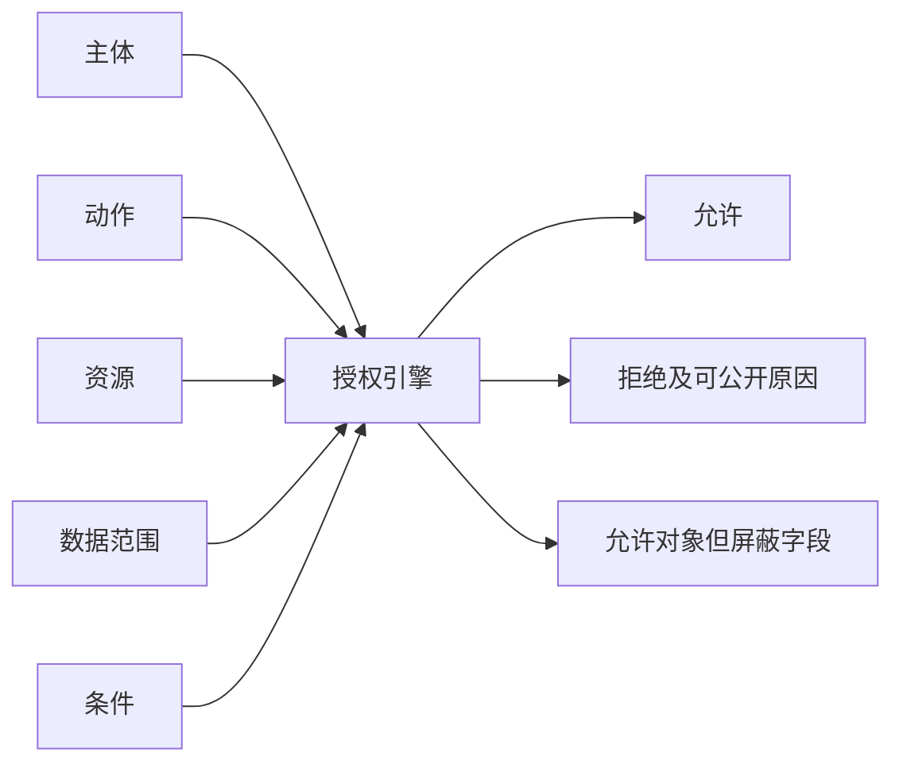
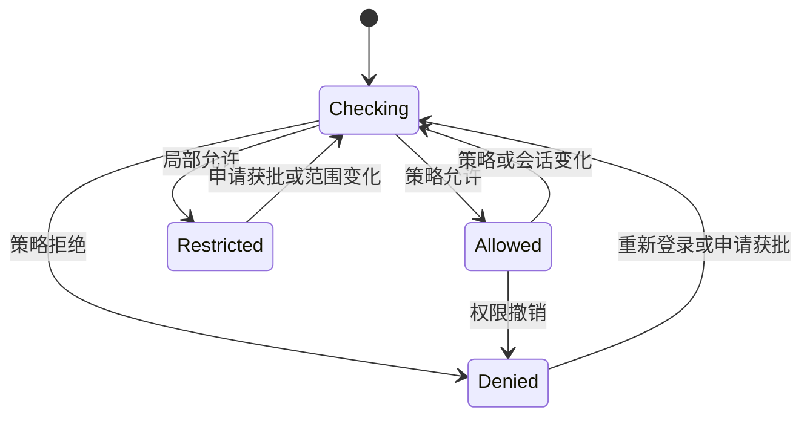

# B 端权限状态、字段权限与数据范围

权限交互把服务端的授权判定转化为用户可理解、可恢复且不会泄露敏感信息的界面状态。它不负责决定用户是否真的有权操作；最终授权必须由服务端在每次请求时执行。

## 能力边界与前置知识

本文处理三类权限结果：对象是否可见、对象是否可操作、字段是否可读写；同时处理角色、资源、动作和数据范围共同决定结果的情况。

前置知识：身份认证、角色与权限、资源 ID、HTTP 状态码、[无权限状态](../05-flows-states/07-no-permission.md)、[表单](../06-interaction-patterns/01-input/form.md)和[数据表格](../06-interaction-patterns/02-data/table.md)。

界面不能用“是否渲染按钮”代替授权。隐藏按钮只能减少无效尝试，不能阻止直接调用 API、修改请求、使用旧页面或从另一个入口触发动作。

## 权限判定模型

一次授权至少包含以下输入：

| 输入 | 含义 | 交互所需结果 |
| --- | --- | --- |
| principal | 当前主体，如用户、服务账号或会话 | 显示当前身份及代办身份 |
| action | read、update、approve、export 等动作 | 决定控制是否可用 |
| resource | 项目、订单、字段或文件 | 明确被操作对象 |
| scope | 组织、区域、部门、本人数据等范围 | 解释“为什么只看到这些” |
| context | 时间、网络、设备、风险等条件 | 表达临时限制与重试方式 |
| policy version | 判定所依据的策略版本 | 处理页面打开后权限变化 |



界面消费的是授权结果，不自行复刻策略。前端可以缓存能力摘要改善响应，但提交时服务端必须重新判定。

## 四种界面状态

### 不可发现

用户既不需要知道资源存在，也没有合法获取路径时，不展示入口。例如普通员工不应看到安全密钥管理页。搜索、最近访问、通知和快捷命令也不能旁路泄露标题。

不可发现不等于返回不存在。服务端可根据威胁模型对未授权资源统一返回 `404`，避免确认资源是否存在；界面文案因此只能说“页面不存在或你无权访问”。

### 可发现但不可操作

用户理解业务流程需要知道动作存在，或者可以申请权限时，保留控件并显示不可操作原因。禁用按钮附近要有持久说明或可操作的“申请权限”入口，不能只依赖 hover tooltip。

### 只读

用户可以读取对象但不能修改。只读页应保留字段值、版本、更新时间和允许的复制/导出范围；编辑入口显示谁可以修改以及申请路径。不要把输入框全部 `disabled` 后当作只读展示，因为禁用控件难以复制、不会提交且常被辅助技术以不同方式处理。

### 局部允许

对象可见，但部分字段或动作受限。例如客服能修改昵称，不能读取身份证号。每个字段需要 `hidden`、`masked`、`read-only`、`editable` 等明确结果，不能从页面级角色推导。

## 字段权限

字段权限至少区分四种行为：

| 行为 | 展示 | 提交 | 典型用途 |
| --- | --- | --- | --- |
| hidden | 不返回字段及其元数据 | 不接受该字段 | 用户不应知道字段存在 |
| masked | 返回脱敏值和掩码状态 | 仅通过专门流程更新 | 手机、证件、密钥片段 |
| read-only | 返回完整或许可范围内的值 | 拒绝修改 | 系统计算值、审批后冻结值 |
| editable | 返回值和编辑约束 | 校验后接受修改 | 当前职责内字段 |

掩码值不能与真实值混为一谈。`138****1234` 是展示表示，不应在保存时覆盖原号码；请求必须省略未修改字段，或显式携带 `unchanged: true`。

字段被隐藏后，布局、计数、导出列、排序选项、筛选器、错误信息和审计日志也要同步处理。仅从表格单元格隐藏字段，仍可能通过 CSV、URL 参数或聚合值泄露。

## 数据范围

数据范围决定“哪些对象进入查询集合”，常见范围包括：

- 本人创建或负责的数据；
- 所属团队、部门或组织的数据；
- 指定区域、客户分组或项目的数据；
- 通过对象关系继承的数据；
- 仅在特定任务期间授权的数据。

范围必须由服务端参与查询，而不是先返回全部记录再由前端过滤。总数、分页、图表、搜索建议和导出都应使用相同范围，否则用户会看到无法解释的数量差异或敏感聚合。

界面应显示范围摘要，例如“华东区 · 可查看 3 个团队”，并允许用户确认当前工作上下文。不要显示内部策略表达式、组 ID 或敏感组织结构。

## 状态转移



页面打开时的 `Allowed` 不是永久事实。长表单、批量任务和导出完成前都可能发生权限撤销，因此写请求和下载请求要重新授权。

## 案例一：客服查看与修改客户资料

### 约束与输入

- 一线客服可以读取昵称、地区和订单摘要；
- 手机号只显示后四位，只有二线客服可完整读取；
- 风控标签完全不可见；
- 客服只可修改自己队列中的客户备注；
- 主管可以查看本团队，不可查看其他地区。

### 处理过程

1. 客户详情 API 返回对象数据和字段能力摘要，不返回风控标签。
2. 手机字段返回 `displayValue`、`masked: true` 和可执行的“验证后查看”动作。
3. 备注编辑器只有在 `customer.note:update` 且对象仍属当前队列时启用。
4. 保存请求只发送备注和对象版本；服务端重新检查队列归属。
5. 队列在编辑期间变化时返回冲突，页面保留输入并说明客户已转交。

能力摘要示例：

```json
{
  "resourceVersion": 18,
  "fields": {
    "displayName": "read",
    "phone": "masked",
    "riskLabel": "hidden",
    "note": "update"
  },
  "actions": {
    "revealPhone": { "allowed": false, "requestable": true },
    "saveNote": { "allowed": true }
  }
}
```

### 失败分支

前端隐藏风控标签，但通用详情 API 仍返回该字段，浏览器网络面板可读取。修复必须在服务端序列化层执行字段授权，并检查日志、导出和搜索索引是否仍包含该字段。

### 验证

- 使用一线、二线、主管和跨区账号分别请求同一客户；
- 检查响应体、DOM、无障碍树、网络日志和导出文件；
- 编辑期间把客户转移到另一个队列，保存必须失败且输入仍可复制；
- 直接构造包含 `riskLabel` 的更新请求，服务端拒绝未知或无权字段；
- 总数、分页和搜索建议均不包含范围外客户。

## 案例二：财务表格的列级权限与批量操作

### 约束与输入

- 会计可看金额与供应商，不可看银行账号；
- 出纳可看脱敏账号并发起付款；
- 审计员只读全部字段，但不可发起付款；
- 用户可以保存个人列配置和筛选视图；
- 批量付款必须逐行重新授权。

### 处理过程

1. 列定义服务根据字段权限返回允许列；隐藏列不会进入列配置器。
2. 保存视图只存稳定字段 ID；重新打开时删除已失权字段并提示视图已调整。
3. 跨页选择令牌绑定查询、用户、数据范围和过期时间。
4. 批量预览显示可执行、无权限、状态不符三类数量。
5. 执行时对每张单据重新授权，返回逐项结果。

### 失败分支

审计员从旧书签打开包含 `bankAccount` 排序参数的 URL。即使页面不展示列，服务端也不能通过排序顺序侧信道泄露字段值；未授权排序字段应被拒绝或从白名单移除。

### 验证

- 四种角色的列配置器、表头、筛选器和导出字段保持一致；
- 撤销出纳权限后，旧选择令牌和下载链接失效；
- 批量执行中途撤权，已提交项保留真实结果，未处理项标为无权限；
- 保存视图不保存脱敏后的展示文本，也不恢复无权字段；
- 键盘用户能从不可操作动作到达原因和申请入口。

## 方案取舍

| 方案 | 优点 | 成本与边界 | 适用条件 |
| --- | --- | --- | --- |
| 隐藏入口 | 减少噪声与存在性泄露 | 用户不知道能力与申请路径 | 永不适用且不应被发现 |
| 禁用并解释 | 保留流程认知 | 禁用控件焦点与提示需设计 | 能力可申请或暂时不可用 |
| 允许点击后拦截 | 能拿到最新判定 | 产生挫败并可能泄露对象 | 权限高度动态且需服务端解释 |
| 只读详情 | 保留上下文和复制能力 | 需处理字段级屏蔽 | 可读不可写 |

权限变化频繁时，可以先显示控件并在加载能力后更新，但要避免可点击窗口；高风险动作默认不可用，得到允许结果后再启用。

## 文案与无障碍

权限消息回答三件事：当前限制是什么、为什么可以公开地说明、下一步是什么。

- “你没有权限”缺少对象和动作；改为“你可以查看合同，但不能修改付款条款”。
- 原因涉及安全策略时只说明必要信息，例如“此操作仅限财务管理员”。
- 申请入口说明审批人、预计有效期和申请范围。
- 状态变化不强制移动焦点；通过邻近文本或适当 live region 通知。
- 锁图标必须有文本名称，颜色不能是唯一差异。

原生 `disabled` 控件不会进入常规 Tab 顺序。如果用户必须理解原因，可将说明放在控件前后的可访问文本中，或保留一个可聚焦的申请按钮；不要把关键信息只放在禁用按钮的 tooltip。

## 安全与工程边界

- 认证回答“你是谁”，授权回答“你能对哪个资源做什么”，两者不可混用。
- 前端能力摘要只用于呈现，不作为服务端放行凭据。
- 对象级、字段级、行级、导出和搜索必须共享可审计策略。
- 拒绝日志记录主体、动作、资源类型、策略版本和结果，敏感值脱敏。
- 错误响应不返回内部角色拓扑、策略源码或其他用户身份。
- 缓存键包含主体和策略上下文，不能跨用户复用授权响应。
- 批量操作逐项授权，不因集合入口已允许就默认每行允许。
- 权限撤销后让旧会话、旧令牌、后台任务和下载链接按风险及时失效。

## 调试与失败注入

1. 在页面打开后撤销角色，再执行保存、导出和批量操作。
2. 修改 URL 中的资源 ID、字段 ID、排序字段和范围参数。
3. 用同名不同 ID 的对象验证界面不以显示名称授权。
4. 让对象在两个组织间迁移，检查缓存和已保存视图。
5. 对掩码字段提交展示值，确认不会覆盖真实值。
6. 比较列表、详情、搜索、通知、图表与导出的权限口径。
7. 关闭 JavaScript直接调用接口，确认服务端仍拒绝。
8. 用键盘和读屏检查只读、禁用和申请入口的名称与顺序。

观测至少记录授权拒绝率、申请入口到达率、申请成功率、因权限变化导致的提交冲突、范围不一致错误和导出撤权失败。指标用于定位问题，不能把“拒绝率下降”直接解释为权限设计更好。

## 发布检查

- 每个对象和字段状态有服务端权威来源；
- 隐藏字段不出现在响应、搜索、筛选、排序、导出和日志；
- 只读内容可阅读与复制，修改入口明确受限原因；
- 数据范围摘要与服务端查询一致；
- 页面打开后撤权不会绕过保存、下载或批量授权；
- 申请路径可键盘操作，结果可恢复到原任务；
- 拒绝信息不泄露敏感资源或策略细节；
- 自动化测试覆盖直接 API 请求和旧令牌。

## 综合练习

为“多组织合同管理”设计权限交互。角色包括合同专员、区域主管、法务和外部供应商；字段包括合同金额、付款账号、法务意见和内部风险等级；动作包括查看、编辑、提交审批、导出和分享。

交付物：

1. 主体—动作—资源—范围矩阵；
2. hidden、masked、read-only、editable 字段契约；
3. 列表、详情、表单和导出的一致权限状态；
4. 页面打开后撤权与对象迁移的失败流程；
5. 键盘和读屏验证记录；
6. 至少四个角色的 API 授权测试。

验收标准：任何未授权字段都不能从客户端响应取得；直接构造请求无法越权；权限变化后输入可保留且用户知道下一步；列表、详情、搜索、导出和批量结果使用同一数据范围。

## 来源

- [NIST SP 800-53 Rev. 5：Access Control 与 Least Privilege](https://csrc.nist.gov/pubs/sp/800/53/r5/upd1/final)（访问日期：2026-07-22）
- [Google Cloud IAM：Configure temporary access](https://docs.cloud.google.com/iam/docs/configuring-temporary-access)（访问日期：2026-07-22）
- [W3C WCAG 2.2：Name, Role, Value 与状态要求](https://www.w3.org/TR/WCAG22/)（访问日期：2026-07-22）
- [OWASP Authorization Cheat Sheet](https://cheatsheetseries.owasp.org/cheatsheets/Authorization_Cheat_Sheet.html)（访问日期：2026-07-22）
