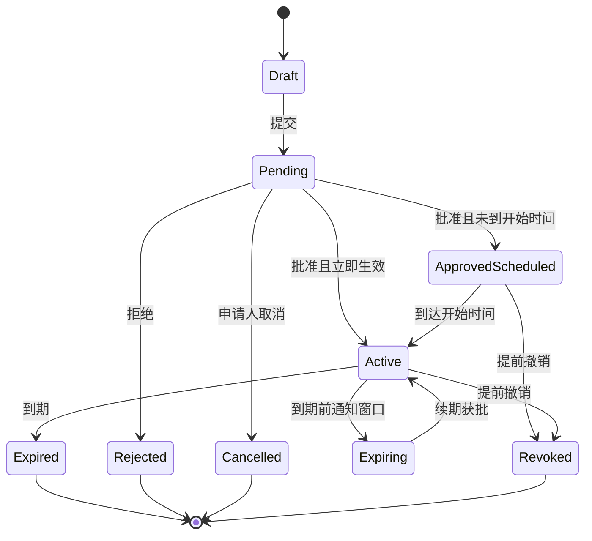

# 临时权限、权限申请与到期恢复

临时权限是在明确范围和时间窗口内授予的访问能力。权限申请交互必须让申请人、审批人和资源所有者理解访问对象、动作、理由、生效时间、到期时间及撤销结果；真正的到期和撤销由授权系统执行，不能依赖界面倒计时。

## 边界与前置知识

本文关注可申请权限的完整生命周期：发现限制、提出申请、审批、等待生效、使用、即将到期、续期、到期和提前撤销。

前置知识：[权限状态、字段权限与数据范围](01-permission-states-data-scope.md)、审批状态机、时间与时区、通知、幂等请求和审计日志。

临时权限不是“给永久角色再提醒管理员删除”。可靠实现需要带到期条件的授权记录或由受控系统在到期时撤销；界面只展示权威状态。

## 权限申请数据模型

| 字段 | 作用 | 约束 |
| --- | --- | --- |
| requestId | 稳定申请 ID | 重试不能创建重复申请 |
| requester | 申请主体 | 不从可编辑文本获取 |
| resource | 资源及环境 | 生产与测试必须区分 |
| actions | 申请动作集合 | 使用受控权限项，不填自由角色名 |
| scope | 对象、项目或数据范围 | 默认最小范围 |
| reason | 业务理由与任务关联 | 不收集无关敏感信息 |
| startsAt | 计划生效时间 | 明确时区并校验不早于允许窗口 |
| expiresAt | 到期时间 | 必须晚于开始且不超策略上限 |
| approvers | 当前审批责任 | 由策略计算，不由申请人任意指定 |
| policyVersion | 策略版本 | 策略变化时重新评估 |
| status | 当前状态 | 只能按允许转移变化 |

```json
{
  "requestId": "PAR-2048",
  "resource": "production/payments",
  "actions": ["logs.read"],
  "scope": { "service": "settlement-api" },
  "startsAt": "2026-07-22T02:00:00Z",
  "expiresAt": "2026-07-22T04:00:00Z",
  "status": "pending-approval",
  "policyVersion": 31
}
```

时间在传输和存储中使用带时区的明确时间点；界面同时显示本地时间、时区和持续时长，例如“10:00–12:00（Asia/Shanghai，共 2 小时）”。“今天下午”不能作为权威期限。

## 生命周期



`ApprovedScheduled` 与 `Active` 必须分开。批准不一定等于已经可用；授权传播延迟时还要显示“正在生效”，并由实际访问检查确认完成。

## 入口设计

权限限制页或禁用动作附近提供申请入口时，先展示：

- 缺少哪个能力；
- 将对哪个资源和范围生效；
- 是否允许申请；
- 默认期限和可选上限；
- 预计由谁或哪个责任组审批；
- 获批后怎样返回原任务。

若该权限不可申请，说明合法替代路径，例如联系资源所有者或使用脱敏数据。不要展示无效申请按钮制造死路。

## 申请表单

申请表单按决策需要分组：资源与环境、所需动作、范围、时间、理由、风险确认。默认值应朝最小权限：最窄范围、最短可用期限、只读动作优先。

高风险组合不能被一个“管理员”选项掩盖。将读取、修改、删除、授权他人和导出分别列出，使审批人看见实际影响。

字段依赖示例：选择生产环境后，最长时长从 7 天缩短为 4 小时并要求事故单号。改变环境时不能静默截断已填期限；先说明新限制，再让用户确认更新。

## 审批视图

审批人需要看到：

1. 申请人及其当前职责；
2. 资源、环境、动作和范围；
3. 开始与到期时间；
4. 业务理由和关联任务；
5. 当前已有权限，避免重复授权；
6. 策略风险提示与职责冲突；
7. 批准、缩小范围、缩短期限、拒绝等明确结果。

审批人修改范围或期限属于有语义的决策，结果页必须向申请人展示“申请值”和“批准值”的差异，不能只说已批准。

## 生效与返回原任务

申请入口保存返回位置，但不能保存可伪造的敏感操作。获批后返回原资源，再由服务端重新授权；如果对象已删除或任务已完成，显示真实新状态。

状态通知包含申请 ID、资源摘要、批准范围、到期时间和查看详情入口。邮件或消息中的链接不直接携带长期授权凭据。

## 到期、续期与撤销

到期提醒用于安排工作，不承担安全控制。界面可在到期前显示剩余时间，但服务端以权威时间判定。

续期不是直接改写旧截止时间。续期请求记录新增理由、期望期限和审批结果，保留原授权历史。高风险权限可要求重新审批；低风险策略也必须明确自动续期条件。

提前撤销后：

- 新请求立即拒绝；
- 现有页面刷新能力状态；
- 后台任务按风险取消或在下一安全点停止；
- 下载链接、访问令牌和缓存按策略失效；
- 用户输入尽量保留，并提供转交或导出非敏感草稿的方式。

## 案例一：生产事故的两小时日志读取

### 约束与输入

- 值班工程师处理支付服务错误；
- 只需读取一个服务的脱敏日志；
- 生产访问最长 4 小时；
- 需要值班负责人批准；
- 授权传播可能耗时 30 秒。

### 处理过程

1. 工程师从日志页的限制状态进入申请，资源和返回地址自动带入。
2. 默认动作是 `logs.read`，默认范围是当前服务，默认时长 2 小时。
3. 填入事故单号和需要查看的时间范围。
4. 负责人看到申请人当前班次、服务、只读动作和精确到期时间。
5. 批准后页面进入“正在生效”，每隔受控间隔查询授权状态。
6. 实际访问检查通过后返回日志页，页面持续显示到期时间。
7. 到期时查询失败为 `expired`，保存的非敏感筛选仍保留。

### 失败分支

通知显示“已批准”，但策略尚未传播，页面立即打开后只显示通用 403。修正为区分批准与生效，并在超时后展示申请 ID、状态和人工升级入口，不诱导反复提交申请。

### 验证

- 申请重试只产生一个 requestId；
- 批准前直接访问日志仍被拒绝；
- 到达开始时间且策略生效后才变为可用；
- 到期后旧页面、API、导出任务和下载链接均不能继续读取；
- 时区切换后绝对到期时间不改变；
- 收窄到单个服务后，其他服务查询仍被拒绝。

## 案例二：外部审计员七天只读访问

### 约束与输入

- 外部人员只可查看指定审计包；
- 访问在下周一 09:00 生效，七天后到期；
- 必须完成身份验证与保密确认；
- 不允许导出原始客户标识；
- 资源所有者可提前撤销。

### 处理过程

1. 内部负责人代发邀请，但受邀者身份与权限申请分开确认。
2. 申请列出审计包、只读动作、禁止导出字段和起止时间。
3. 批准后状态为“已排期”，入口不会提前开放。
4. 生效时通知外部审计员并要求完成强认证。
5. 页面显示范围和到期日，导出仅生成脱敏报告。
6. 负责人提前撤销时，当前会话在下一次授权检查时停止访问。

### 失败分支

外部用户被加入一个无条件永久查看者角色，同时又添加了七天条件。条件绑定到期后，无条件角色仍然有效。修复是展示“有效权限来源”，在授予前检测重叠授权，并阻止用临时申请制造虚假期限。

### 验证

- 生效前、有效期内和到期后分别执行同一访问测试；
- 检查是否存在其他角色或组关系提供相同能力；
- 原始标识在页面响应、导出、搜索和缓存中均不可取得；
- 提前撤销后，已打开标签页和短期下载链接失效；
- 审计日志能还原申请、修改、批准、生效和撤销主体。

## 方案取舍

| 方案 | 优点 | 风险与成本 | 适用条件 |
| --- | --- | --- | --- |
| 直接永久角色 | 实现简单 | 易遗忘撤销、范围过大 | 稳定岗位职责，不是临时任务 |
| 条件化到期绑定 | 到期由授权系统执行 | 需支持时间条件与冲突检测 | 云资源和明确时间窗口 |
| 临时凭据 | 生命周期短、可单独吊销 | 凭据分发与轮换复杂 | 自动化任务或紧急会话 |
| 人工定时撤销 | 兼容旧系统 | 失败后权限继续存在 | 仅作为受监控的过渡方案 |

界面必须准确反映所用机制。若旧系统只能人工撤销，应显示“计划撤销”和负责人，不能宣称“将在 12:00 自动失效”。

## 异常与边界

- 申请期间策略变化：重新计算审批链和最大期限，要求确认差异。
- 审批人离职：按责任组重新分配并保留历史，不静默改写原审批人。
- 多个重叠授权：展示综合有效期与每个来源，撤销一个来源后重新判定。
- 时钟偏差：安全判断使用授权服务时间，不信任浏览器倒计时。
- 后台任务跨越到期：执行每个敏感步骤前重新授权，定义是否停止或完成原子步骤。
- 申请被拒绝：保留可编辑副本，但新申请必须引用新证据，不能无限重复提醒审批人。
- 资源迁移：旧资源授权不自动扩展到新组织或环境。
- 紧急提权：增加更短期限、强审计和事后复核，不能绕过身份验证。

## 无障碍与内容

- 倒计时同时给出绝对时间，避免用户只依赖动态数字。
- 状态变化用文本和程序化状态表达，不只改变颜色。
- 申请表中动作名称使用业务语言，并提供影响说明。
- 审批差异用表格和明确文本表达，删除线或颜色不是唯一线索。
- 通知不频繁抢占焦点；即将到期的关键状态可用 `role="status"`。
- 拒绝原因与重新申请入口在键盘顺序中紧邻结果。

## 调试与观测

失败注入：审批重复点击、通知延迟、策略传播超时、浏览器时区错误、开始时间过去、到期时仍有导出任务、批准后立即撤销、同权限存在永久来源。

记录指标：从限制到申请的转化、审批等待时间、生效延迟、到期前续期比例、到期后拒绝次数、重叠授权率、人工撤销逾期率和恢复原任务成功率。所有时间指标区分业务等待、系统传播和用户未处理。

## 发布检查

- 申请精确到资源、动作、范围和期限；
- 默认期限与范围符合最小权限；
- 批准、排期、生效和到期是不同状态；
- 期限由授权系统执行，不依赖通知或前端计时；
- 能检测无条件角色等重叠授权；
- 到期与撤销覆盖会话、后台任务、缓存和下载；
- 审批修改对申请人显示差异；
- 获批后能安全返回原任务并重新授权。

## 综合练习

设计“供应商远程排障访问”流程：供应商需要在指定维护窗口读取测试环境日志，生产环境只允许内部工程师代查；访问需要资源所有者与安全负责人批准；维护窗口可能延期一次。

交付申请模型、状态图、审批视图、到期与续期流程、重叠授权检测、失败注入记录和审计事件表。

验收标准：任何状态都能回答谁、对什么、能做什么、何时生效、何时失效；延期不会覆盖原历史；到期后所有访问路径失效；键盘用户可完成申请、查看差异并回到原任务。

## 来源

- [Google Cloud IAM：Configure temporary access](https://docs.cloud.google.com/iam/docs/configuring-temporary-access)（访问日期：2026-07-22）
- [NIST SP 800-53 Rev. 5：AC-2、AC-6 与审计控制](https://csrc.nist.gov/pubs/sp/800/53/r5/upd1/final)（访问日期：2026-07-22）
- [Microsoft Entra：Privileged Identity Management](https://learn.microsoft.com/en-us/entra/id-governance/privileged-identity-management/pim-configure)（访问日期：2026-07-22）
- [OWASP Authorization Cheat Sheet](https://cheatsheetseries.owasp.org/cheatsheets/Authorization_Cheat_Sheet.html)（访问日期：2026-07-22）
