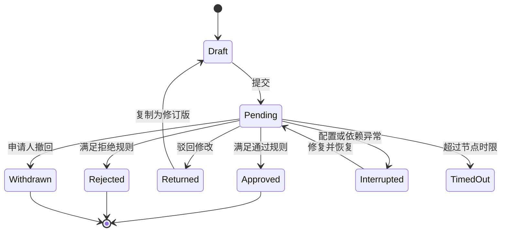

# 审批流程、并行决策与异常恢复

审批是由明确责任主体对业务对象的某个版本作出可审计决定的工作流。交互设计要表达当前节点、后续条件、审批人、时限、可执行动作和历史；服务端工作流负责状态转移、授权、并发和业务副作用。

## 能力边界与前置知识

本文覆盖顺序与并行审批、通过、驳回、撤回、转交、加签、抄送、超时、中断和历史。前置知识：[用户流程与状态](../05-flows-states/01-initial.md)、[并发冲突](../05-flows-states/12-concurrent-conflict.md)、权限、通知与幂等。

审批不等于留言。意见是证据的一部分，决定必须有结构化动作、操作者、时间、对象版本和工作流版本。

## 核心对象

| 对象 | 关键字段 | 作用 |
| --- | --- | --- |
| process | id、definitionVersion、status | 一次审批实例 |
| subject | type、id、version、summary | 被审批的精确业务版本 |
| node | id、type、rule、status、deadline | 当前决策单元 |
| assignment | assignee、delegation、status | 谁有权在节点行动 |
| decision | action、actor、comment、timestamp | 不可混淆的决定记录 |
| transition | from、to、reason | 状态变化依据 |
| event | id、type、payload、occurredAt | 审计与恢复依据 |

审批详情首先回答“正在审批什么”。金额、供应商、风险项等关键摘要要与提交时对象版本绑定；对象后来变化时，显示差异并按规则重新提交，不能让审批人对旧摘要做决定却作用于新数据。

## 状态机



`Rejected` 与 `Returned` 不同：拒绝结束当前流程；驳回修改允许申请人基于意见创建修订并重新进入指定节点。若业务只支持一种语义，按钮和后果必须准确命名。

## 节点与预计时间

当前节点显示节点名称、进入时间、负责人、决策规则、剩余时限和阻塞原因。下一节点只展示依据当前数据可确定的部分；条件分支未满足前，不承诺唯一审批人。

预计时间来自可解释口径，例如节点服务目标、历史分位数或确定的截止时间。不要显示无依据的精确分钟。页面应区分：业务承诺截止时间、系统超时时间和基于历史的预计完成时间。

## 顺序、并行和阈值规则

### 顺序审批

节点依次激活，后续审批人通常在前一节点完成后才取得行动权。适合前一步结论会改变后一步输入，或职责必须分层确认的流程。

### 全员并行

所有分支同时激活，通常要求全部通过；任一拒绝是否立即结束由规则决定。页面显示已响应、待响应和已失效分支，不能只显示总体百分比。

### 首个响应

任一授权人首个有效决定结束节点。适合值班组认领，不适合需要多方独立意见的高风险决策。其他人的晚到响应应明确标记为“节点已完成”，不能覆盖结果。

### n-of-m 阈值

`m` 个审批人中达到 `n` 个通过即通过；当剩余票数已不可能达到 `n` 时拒绝。界面需要显示规则，例如“已通过 2/3；还需 1 人”，并处理弃权、失效成员和重复身份。

## 操作语义

| 操作 | 操作者 | 状态效果 | 设计重点 |
| --- | --- | --- | --- |
| 通过 | 当前审批人 | 记录决定并推进规则 | 高风险时确认对象摘要 |
| 拒绝 | 当前审批人 | 结束或进入拒绝分支 | 必填结构化原因 |
| 驳回修改 | 当前审批人 | 回到草稿/指定节点 | 明确哪些数据可修改 |
| 撤回 | 申请人或管理员 | 终止未完成实例 | 说明已产生副作用是否回滚 |
| 转交 | 当前审批人/管理员 | 变更责任人 | 保留原指派和转交原因 |
| 加签 | 有权主体 | 插入串行或并行审批人 | 明确加入位置和决定规则 |
| 抄送 | 系统或有权主体 | 只通知，不获得决策权 | 与审批人视觉和语义分开 |

转交不是共享账号。历史记录应同时保存原审批人、接收人、操作者和时间。加签不能插入到已经完成的节点之前并改写过去；若必须重新评估，应创建新节点或新流程版本。

## 历史与审计

历史采用追加事件而不是覆盖当前字段。每条事件至少显示动作、操作者、实际代办身份、时间、节点、对象版本、公开意见和结果。

系统自动事件如“超时升级”“组织关系变化”“节点跳过”也应可见，并与人工决定区分。敏感审批意见按权限屏蔽，但不能因此让状态转移失去可解释性。

```json
{
  "eventId": "AE-7781",
  "type": "decision.recorded",
  "processId": "AP-1024",
  "nodeId": "finance-review",
  "subjectVersion": 7,
  "actor": "user:42",
  "actingFor": null,
  "decision": "approve",
  "occurredAt": "2026-07-22T03:18:42Z"
}
```

## 案例一：采购订单的顺序审批与驳回

### 约束与输入

- 订单 68,000 元；部门负责人先审，财务后审；
- 超过 50,000 元追加法务审查；
- 修改供应商或金额后必须重新审批；
- 申请人可以在首个决定前撤回；
- 每个节点目标时间为一个工作日。

### 处理过程

1. 提交时冻结订单版本 7 和关键字段摘要。
2. 部门负责人节点激活，财务和法务显示为后续节点但不可行动。
3. 部门负责人驳回修改，填写“缺少三家报价”的结构化原因。
4. 申请人基于版本 7 创建版本 8，补附件并重新提交。
5. 系统比较差异，金额仍超过阈值，生成部门—财务—法务顺序链。
6. 每个决定使用幂等键和期望流程版本，防止重复点击。

### 失败分支

申请人在部门审批后把金额从 48,000 改为 68,000，但流程仍跳过法务。修复是审批对象版本不可静默修改；影响规则的变化使当前流程失效，并基于新版本重新计算节点。

### 验证

- 对象版本、页面摘要、决定记录和最终执行金额一致；
- 驳回后原流程历史只读，修订版引用原申请；
- 同一批准请求重放不会推进两次；
- 撤回与批准并发时只有一个合法终态，另一请求得到明确冲突；
- 截止时间跨节假日时采用配置的工作日历并说明口径；
- 键盘用户能读取当前节点、错误摘要和历史顺序。

## 案例二：安全例外的 2-of-3 并行审批

### 约束与输入

- 安全、法务、业务负责人三方并行；
- 任意两方通过即可批准；
- 两方拒绝后立即失败；
- 负责人休假时允许转交；
- 24 小时无结果升级给责任组管理员。

### 处理过程

1. 三个分支同时激活，各自绑定独立 assignment。
2. 页面显示“通过 1、拒绝 0、待处理 2，还需 1 个通过”。
3. 法务将任务转交给代理人，原 assignment 失效并保留转交事件。
4. 代理人通过后达到 2-of-3，节点结束。
5. 安全负责人随后打开旧通知，页面显示流程已完成，不能再次决定。
6. 抄送对象只收到结果，不出现在分母 `m` 中。

### 失败分支

同一用户同时属于安全组和业务组，被计算为两票。若业务要求独立主体，流程生成时要对人员去重并暴露岗位冲突；如果岗位可以代表两种职责，则必须明确允许规则和审计表示，不能默认计两票。

### 验证

- 枚举三人所有响应顺序，结果符合阈值不变量；
- 节点完成后所有待处理 assignment 变为失效；
- 转交前后的通知链接和行动权正确变化；
- 超时升级不会自动代表审批人作出业务决定，除非策略明确；
- 抄送者不能调用决定 API；
- 两个响应同时到达时使用事务或条件更新只产生一个终态。

## 超时、异常中断与恢复

超时可以触发提醒、升级、转交、默认结果或流程失败。默认批准风险最高，只能在业务规则明确且可审计时使用；界面必须在提交前说明超时后果。

异常中断包括审批人无法解析、组织目录不可用、对象被删除、策略版本失效、下游副作用失败和通知失败。通知失败不应自动改变工作流决定；业务对象更新失败则不能显示审批全部完成。

恢复需要：

1. 保存最后成功事件和当前流程版本；
2. 重试幂等副作用；
3. 区分“决定已记录”和“业务变更已生效”；
4. 对无法自动恢复的实例提供管理员动作；
5. 管理员动作同样进入审计历史。

## 并发与幂等

提交决定时携带 `processVersion` 和 `assignmentId`。服务端在同一事务或等价原子边界中验证：流程仍在当前节点、assignment 仍有效、主体有权行动、对象版本未变化、幂等键未使用。

成功响应返回新版本和终态。`409 Conflict` 不应被客户端当作网络失败自动重复；页面刷新历史并说明“此节点已由其他审批人完成”。

## 信息架构与页面结构

审批详情建议按任务顺序组织：

1. 对象名称、版本和关键风险摘要；
2. 当前节点、决定规则、责任人和时限；
3. 允许动作及后果；
4. 支撑材料与字段差异；
5. 后续节点预览；
6. 完整历史与系统事件。

移动端快捷审批只适合信息足够且风险低的场景。需要比较附件、查看差异或输入结构化理由时，通知应跳转完整详情，不能把关键证据藏在第二个应用中。

## 无障碍与内容

- 时间线使用有序列表和真实标题，不能只靠连线位置表达顺序。
- 当前、完成、拒绝和失效状态同时使用文本，不只用颜色。
- 决定按钮名称包含对象或动作结果；危险动作提供后果确认。
- 新事件到达时不抢走正在填写意见的焦点，使用适度状态消息。
- 并行分支用列表或表格表达每人状态，读屏可取得阈值摘要。
- 审批意见错误与字符限制在输入前说明，提交失败保留内容。
- 动态倒计时同时给出绝对截止时间。

## 方案取舍

| 方案 | 优点 | 成本与失败边界 | 适用条件 |
| --- | --- | --- | --- |
| 顺序 | 前一步能约束后一步 | 周期长、前置节点成瓶颈 | 依赖关系强 |
| 全员并行 | 汇集全部独立意见 | 任一缺席阻塞 | 法规要求全员确认 |
| 首个响应 | 响应快 | 不能代表多方共识 | 值班认领与低风险批准 |
| n-of-m | 容忍个别缺席 | 身份去重与阈值解释复杂 | 委员会式决策 |

不要根据“步骤更少”选择规则。决策责任、独立性、风险和恢复成本是主要约束。

## 调试与失败注入

1. 两个审批人同时提交相反决定。
2. 提交成功后响应丢失，客户端使用同一幂等键重试。
3. 当前审批人离职、休假或被移出责任组。
4. 对象在审批期间修改、删除或跨组织迁移。
5. 并行阈值中同一人来自两个组。
6. 流程完成后晚到通知继续提交。
7. 决定已记录但下游业务更新超时。
8. 超时升级与人工决定同时发生。
9. 转交、加签、撤回与批准交叉并发。
10. 时区或工作日历配置变化。

观测包括节点等待时长、超时率、转交率、驳回后再次提交率、并发冲突、重复决定被抑制次数、下游生效延迟和异常人工恢复量。不能把“审批更快”单独当成质量提升，需同时看撤销、返工和越权。

## 发布检查

- 当前节点、下一节点条件、责任人和时限清晰；
- 决定绑定对象版本和流程版本；
- 驳回、拒绝、撤回、转交、加签与抄送语义不同；
- 顺序、全员、首个响应和 n-of-m 规则可解释；
- 历史追加记录人工和系统事件；
- 超时与中断有明确恢复策略；
- 并发决定与副作用具备幂等和原子保护；
- 页面、通知和 API 使用同一权威状态；
- 键盘、读屏和窄屏可完成完整审批任务。

## 综合练习

为“数据出境申请”设计审批：直属主管和数据负责人顺序确认，安全与法务 2-of-2 并行，金额或数据量超过阈值时加签高管；申请人可在首个决定前撤回；审批期间修改数据范围必须重新计算流程。

交付状态机、流程定义、节点阈值、对象版本策略、页面线框、事件历史、异常恢复表和至少 12 个并发测试。

验收标准：所有操作均有允许主体、进入条件、退出状态和审计事件；任意响应顺序不会产生两个终态；旧通知不能行动；下游失败不会显示虚假完成；辅助技术能理解节点顺序和并行结果。

## 来源

- [Microsoft Power Automate：Manage approval requests](https://learn.microsoft.com/en-us/power-automate/approve-reject-requests)（访问日期：2026-07-22）
- [Microsoft Power Automate：Approval flow scenarios](https://learn.microsoft.com/en-us/power-automate/approvals-howto)（访问日期：2026-07-22）
- [SAP Help：Parallel Approval Workflow](https://help.sap.com/docs/ABAP_PLATFORM_NEW/4400bdc8dd4648a5a2e5c1c8e05198d7/4f321722151f5540e10000000a421937.html)（访问日期：2026-07-22）
- [SAP Help：Adding Serial or Parallel Approvers](https://help.sap.com/docs/buying-invoicing/approval-flows/how-to-add-serial-or-parallel-approvers-to-approval-flow)（访问日期：2026-07-22）
