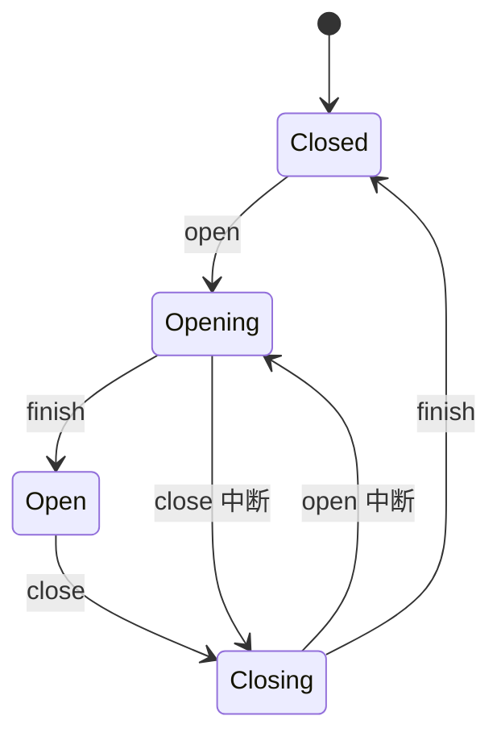

# 界面动效、状态转移与减少动画

界面动效是在两个可定义状态之间随时间变化的视觉与空间反馈。有效动效解释触发关系、元素来源、去向、层级或状态变化；它不能代替状态文本、业务完成确认或焦点管理。

## 能力边界与前置知识

本文覆盖进入、退出、位移、尺寸、共享元素、进度与反馈动效，处理高频操作、性能、打断、恢复和 `prefers-reduced-motion`。前置知识：[流程状态](../05-flows-states/01-initial.md)、[加载状态](../05-flows-states/03-loading.md)、[进度模式](../06-interaction-patterns/03-feedback/progress.md)和 CSS 动画基础。

动效完成不等于业务完成。按钮缩放回弹只能确认收到指针动作；订单是否创建成功必须来自服务端权威结果。

## 动效规格的组成

每个动效至少定义：

| 字段 | 问题 | 示例 |
| --- | --- | --- |
| trigger | 什么事件开始 | 用户打开详情 |
| from | 起始状态 | 行内对象位置 |
| to | 结束状态 | 右侧详情面板 |
| property | 哪些属性变化 | transform、opacity |
| duration | 持续时间 | 160ms 项目令牌 |
| easing | 时间分配 | 标准减速曲线 |
| interruption | 再次操作怎么办 | 反向到当前进度 |
| completion | 结束后权威状态 | 面板 open |
| focus | 键盘焦点如何变化 | 标题或首个任务控件 |
| reduced | 减少动画替代 | 直接显示加轻微淡入 |

具体时长不是普遍标准。距离、面积、信息复杂度、输入方式、设备性能和使用频率都会影响可接受范围；以任务反馈与系统令牌验证。

## 动效的功能类型

### 因果反馈

按下、选择和拖拽反馈说明哪个对象收到输入。反馈立即发生，但不能抢在授权或业务校验前宣称成功。

### 空间连续性

抽屉从触发侧出现、共享元素从列表位置过渡到详情，可帮助说明层级与来源。若来源不在视口或路径不稳定，强行共享元素会制造错误空间模型。

### 状态变化

展开、折叠、排序、筛选和保存可以通过变化提示受影响区域。状态文本、ARIA 状态和 DOM 结果仍是权威表达。

### 注意引导

短暂强调新增行或错误区域能帮助定位变化。不得持续闪烁、无限循环或让多个区域同时争夺注意。

### 进度表达

确定进度使用可测量值；不确定等待使用不承诺比例的指示。循环动画不能证明系统仍在工作，需要超时、取消和错误状态。

## 进入与退出

进入动效说明元素如何加入当前结构，退出说明它去向何处或为何消失。两者不必完全对称：打开详情可稍慢以建立关系，关闭可以更快以恢复上下文。

退出元素若仍拦截指针或保留焦点，会造成“看不见但可操作”。开始退出时定义何时从交互树移除；结束后把焦点移到合理位置。

`display: none` 不能直接插值。常见实现先改变 opacity/transform，结束后再切换 hidden；减少动画模式可直接切换，同时执行相同焦点与状态逻辑。

## 属性选择与性能

浏览器中 transform 和 opacity 通常更容易由合成阶段处理，但“使用它们就一定流畅”不成立。大图层、滤镜、阴影、视频、内存和大量并行动画仍可能产生开销。

改变 width、height、top 等布局属性可能触发布局和绘制。若必须展示真实尺寸变化，先测量目标环境，不要为了性能用 transform 缩放导致文字模糊或命中区域与视觉错位。

性能验证观察主线程长任务、布局、绘制、合成层、掉帧和输入延迟。低端设备、省电模式和后台恢复都要测试。

## 打断与可逆

用户在动效中再次触发反向操作时，应从当前视觉进度平滑转向，不先跳到终点。状态机必须防止“视觉已关闭但逻辑仍 open”。



使用 `transitionend` 时要处理：用户减少动画导致时长为 0、属性未变化、不在 DOM、事件被取消等情况。业务状态不能只靠结束事件推进；设置确定的状态提交路径和超时保护。

## 高频操作

高频键盘导航、表格录入、命令面板和连续筛选优先响应速度与位置稳定。避免：

- 每次选行都播放长距离移动；
- 光标每次移动都触发弹性回弹；
- 保存每个单元格都出现阻塞动画；
- 菜单连续操作时反复淡出再淡入；
- 排序后逐行错峰动画导致等待。

高频反馈可使用即时状态变化、短暂局部强调或无位移动效。用户必须能在动画未结束时继续操作。

## 减少动画

`prefers-reduced-motion: reduce` 表示用户请求减少非必要运动，不等于“用户关闭所有视觉反馈”。替代策略按功能选择：

| 原动效 | 减少动画替代 |
| --- | --- |
| 大幅滑入/缩放 | 直接出现或短淡入 |
| 视差滚动 | 固定背景与正常滚动 |
| 共享元素长距离移动 | 状态切换加标题/焦点 |
| 无限装饰循环 | 静态图或停止 |
| 进度旋转 | 静态文本与可更新进度 |
| 拖拽跟随 | 保留直接跟随，移除弹性和惯性 |

```css
.panel {
  transition: transform 180ms ease-out, opacity 120ms linear;
}

@media (prefers-reduced-motion: reduce) {
  .panel {
    transition: opacity 40ms linear;
  }
}
```

若用户需要额外的应用内开关，应用设置应覆盖系统偏好，并说明范围。必要运动是移除后会根本改变信息或功能的运动；品牌装饰、视差和弹性通常不属于必要运动。

## 案例一：列表到详情抽屉

### 约束与输入

- 桌面从表格行打开右侧非模态详情；
- 窄屏使用独立全屏页面；
- 用户可快速切换相邻行；
- 数据可能慢加载或失败；
- 支持键盘和减少动画。

### 处理过程

1. 点击行内“查看详情”后立即记录触发元素和对象 ID。
2. 桌面抽屉从右侧进入，表格宽度不连续抖动；标题先存在于 DOM 并有加载状态。
3. 焦点按非模态任务策略移到抽屉标题或首个操作，关闭后返回触发按钮。
4. 切换相邻行只更新内容并短暂强调标题，不反复退出整个抽屉。
5. 加载失败保留抽屉和对象身份，提供重试与关闭。
6. 减少动画模式直接显示面板，焦点和状态逻辑完全相同。

### 失败分支

抽屉退出 300ms 期间用户再次打开另一行，旧动画结束回调把新抽屉设为 hidden。修正为每次转移绑定实例版本或使用可取消动画；结束回调只提交自己对应的状态版本。

### 验证

- 打开、关闭、快速反向和连续切换 20 次，逻辑与视觉状态一致；
- 加载失败和重试不导致焦点丢失；
- 320px 宽度走页面导航而非挤压抽屉；
- 减少动画下没有长距离位移且功能不缺失；
- DOM、无障碍名称和控制台在动画前后无错误；
- 低性能模拟下输入仍可响应。

## 案例二：批量任务进度与完成

### 约束与输入

- 处理 500 个对象，服务端返回已处理数量；
- 用户可取消，结果可能部分成功；
- 标签页切后台后继续执行；
- 完成后显示逐项结果；
- 不用动画伪造进度。

### 处理过程

1. 提交后展示任务 ID、真实 `processed/total` 和取消动作。
2. 进度条只在服务端计数变化时更新，视觉插值不超过新权威值。
3. 状态文本使用节制的 live region，避免每个对象都朗读。
4. 标签页恢复时先拉取权威状态，再从当前视觉值更新。
5. 完成时停止动画并展示成功、失败和未处理数量。
6. 取消中显示“正在取消”，直到服务端确认最终边界。

### 失败分支

前端每秒自动增加 5%，网络断开后仍到 95%，用户误认为任务接近完成。修正为不确定时显示不确定等待；只有得到可测量总数和已处理数才显示确定比例。

### 验证

- 断网时进度不继续伪增，显示连接状态和最后更新时间；
- 部分成功与完全成功有不同文本和结果；
- 取消与完成并发只产生一个权威终态；
- 减少动画下进度信息仍完整；
- 后台恢复不从 0 重新播放；
- 状态播报频率不会淹没用户操作。

## 方案取舍

| 方案 | 优点 | 成本与边界 | 适用条件 |
| --- | --- | --- | --- |
| 无动画直接切换 | 最快、稳定 | 空间关系提示较少 | 高频任务、减少动画、简单变化 |
| 淡入淡出 | 干扰小 | 不能表达方向 | 内容替换和轻量反馈 |
| 位移 | 表达来源与去向 | 可能引发不适或拖慢 | 清晰空间模型、低频转场 |
| 共享元素 | 连续性强 | 实现和中断复杂 | 同一对象跨视图且几何稳定 |
| 错峰列表 | 可提示新增顺序 | 长列表耗时、注意分散 | 少量首次出现内容 |

## 无障碍与安全边界

- 自动播放且持续超过阈值的移动内容需要暂停、停止或隐藏机制，按适用 WCAG 条款检查。
- 避免超过闪烁阈值；错误提示不使用快速闪烁吸引注意。
- 动效不能是唯一状态线索，所有结果有文本或程序化状态。
- 焦点按任务语义移动，不跟着装饰元素路径移动。
- 减少动画样式必须与默认样式共同测试，而非最后统一设为 `animation: none` 后破坏逻辑。
- 高风险操作等待动画结束才发送请求会产生不必要延迟；请求时机由业务确认决定。

## 调试与观测

调试记录触发事件、状态版本、动画实例、开始/结束/取消时间、焦点元素、减少动画媒体查询和业务权威状态。

失败注入：快速双击、反向操作、路由切换、组件卸载、零时长动画、后台恢复、慢设备、数据失败、减少动画运行时变化和两个并行动画修改同一属性。

指标包括输入到首个视觉反馈、输入到业务确认、被中断比例、动画期间重复点击、掉帧、长任务和减少动画启用下的任务完成。不要以“动画播放完成率”作为用户成功指标。

## 发布检查

- 每个动效有触发、起点、终点和状态含义；
- 业务结果不依赖装饰动画完成；
- 可打断、反向和组件卸载不会产生旧回调覆盖新状态；
- 高频操作没有冗长或阻塞动画；
- 默认与减少动画模式功能、焦点和信息一致；
- 进度来自权威数据，不伪造比例；
- 低端设备、后台恢复和窄屏已测试；
- 自动运动、闪烁和交互触发动效符合适用无障碍要求。

## 综合练习

为“文件上传—解析—审核”三阶段任务设计动效。上传有字节进度，解析只有阶段状态，审核可逐项处理；用户可以暂停上传、取消解析并在后台恢复。

交付每个转移的规格表、状态机、默认/减少动画两套行为、可中断实现、性能记录和错误恢复。

验收标准：所有视觉进度均能追溯到权威状态；网络断开不伪增；快速反向不会状态错乱；减少动画无长距离运动；键盘焦点可预测；低性能环境仍可在动效期间操作。

## 来源

- [W3C WCAG 2.2：Animation from Interactions](https://www.w3.org/WAI/WCAG22/Understanding/animation-from-interactions.html)（访问日期：2026-07-22）
- [W3C WCAG 2.2](https://www.w3.org/TR/WCAG22/)（访问日期：2026-07-22）
- [Apple Human Interface Guidelines：Motion](https://developer.apple.com/design/human-interface-guidelines/motion)（访问日期：2026-07-22）
- [MDN：prefers-reduced-motion](https://developer.mozilla.org/en-US/docs/Web/CSS/@media/prefers-reduced-motion)（访问日期：2026-07-22）
- [Web Animations Level 1](https://www.w3.org/TR/web-animations-1/)（访问日期：2026-07-22）
