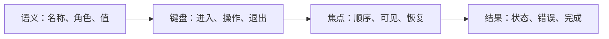

# 键盘、焦点与可访问交互

可访问交互让用户通过键盘、辅助技术、放大、不同输入设备和减少动画偏好完成同一任务。键盘支持不仅是“Tab 能走到按钮”，还包括语义、焦点顺序、组件内部导航、状态通知、错误恢复和焦点可见性。

## 能力边界与前置知识

本文面向 Web 中保真与实现规格，覆盖原生控件、复合组件、模态界面、动态内容和焦点恢复。前置知识：HTML 语义、DOM、无障碍树、[无障碍审计](../03-validation/05-accessibility-audit.md)、[状态审计](../03-validation/06-state-audit.md)及 APG 模式。

ARIA 可以表达角色、状态和关系，不能自动实现键盘行为、焦点管理或业务逻辑。优先使用原生 HTML 控件；自定义复合组件必须承担完整交互模型并进行真实辅助技术测试。

## 四层模型

任一层缺失都会形成死路：有语义但不能操作、有键盘事件但无焦点、有焦点但不可见、操作成功但结果未通知。

## 原生控件优先

| 任务 | 首选元素 | 不应默认替代为 |
| --- | --- | --- |
| 执行动作 | `button` | 带 click 的 `div` |
| 页面导航 | `a href` | 模拟链接的按钮 |
| 单值文本输入 | `input` | contenteditable 容器 |
| 多行输入 | `textarea` | 自制文本编辑区域 |
| 二元选择 | checkbox | 只有颜色的开关 |
| 单选组 | radio group | 一组独立切换按钮 |
| 数据关系 | `table` | 纯 div 网格 |
| 分组 | `fieldset` + `legend` | 只靠视觉卡片 |

原生控件提供基础键盘、名称计算、表单行为和平台适配，但仍需正确标签、错误、状态与样式。

## 焦点顺序

焦点顺序应保持内容含义和操作逻辑。通常依赖 DOM 顺序，而不是正数 `tabindex`。CSS Grid/Flex 的视觉重排不会自动改变键盘顺序，响应式断点必须同时检查两者。

`tabindex="0"` 把元素放入自然 Tab 顺序；`tabindex="-1"` 允许脚本聚焦但不加入常规 Tab 序列；正数 tabindex 建立脆弱的局部顺序，页面变化后容易跳跃，应避免。

不是所有文本都需要可聚焦。标题、说明和状态可由文档阅读或关联关系取得；过度添加 tabindex 会让 Tab 序列冗长。

## 焦点可见与不被遮挡

浏览器默认焦点样式可以自定义，但不能直接移除。焦点指示要在各主题、强制颜色、组件状态和背景上可见，并与 hover、selected、error 区分。

固定顶栏、底栏、Cookie 横幅和粘性工具栏可能遮挡焦点。通过滚动边距、布局空间或滚动逻辑确保获得焦点的组件至少不被完全遮挡；若项目追求更高标准，按 WCAG 2.2 Focus Appearance 的尺寸与对比要求验证。

## 复合组件键盘模型

Tab 通常进入和离开复合组件，方向键在组件内部移动。常见策略是 roving tabindex：只有一个子项 `tabindex="0"`，其余为 `-1`；移动后更新活动项。

| 组件 | 进入 | 内部操作 | 退出 |
| --- | --- | --- | --- |
| tabs | Tab 到活动 tab | 左右键切换焦点；是否自动激活需定义 | Tab 到面板内容 |
| menu | 触发按钮打开 | 上下键移动，Enter 执行，Escape 关闭 | 关闭后回触发按钮 |
| grid | Tab 到活动单元格 | 方向键移动，F2/Enter 进入编辑 | 按定义 Tab 离开或到内部控件 |
| tree | Tab 到活动节点 | 上下移动，左右展开/折叠 | Tab 离开树 |
| dialog | 触发后进入对话框 | Tab 在模态范围循环，Escape 按规则关闭 | 关闭后恢复触发点 |

APG 提供模式和示例，不是无需测试的强制组件库。自动激活 tabs 只有在内容无显著延迟时才合适；远程加载面板应考虑手动激活。

## 焦点进入规则

### 页面导航

正常页面导航后焦点通常由浏览器回到文档起点；单页应用需让路由变化可感知，可把焦点移动到主标题或主内容容器，并更新页面标题。

### 模态对话框

打开后焦点进入对话框。初始焦点根据内容和风险决定：短确认可放在最安全动作；长内容可聚焦静态标题；破坏性确认不自动聚焦危险按钮。背景在指针、键盘和辅助技术层面都不可操作。

### 新增内容

新增行不一定移动焦点。若用户触发“添加联系人”且下一步必须填写新行，可聚焦首个字段；后台新增通知则保持焦点并播报摘要。

### 删除当前对象

删除后把焦点移到可预测邻居、列表标题或结果摘要。不能留在已移除节点或重置到页面顶部而无说明。

## 焦点恢复

恢复目标按稳定业务 ID 记录，不依赖临时 DOM 引用。关闭抽屉、菜单和对话框后优先返回触发控件；触发控件已删除时，选择紧邻合法目标并说明结果。

虚拟化列表中原行可能卸载。恢复策略包括先滚动并重新渲染原对象、返回同一页的下一对象，或聚焦列表标题并播报原对象已不可用。策略必须可测试。

## 名称、角色、值与状态

每个控件具有可访问名称。按钮名称描述动作而不是图标外形；重复“删除”按钮应通过行上下文得到“删除发票 INV-2048”。

展开、选中、按下、无效、忙碌和当前项使用与组件匹配的原生/ARIA 状态：

- `aria-expanded` 表达可展开控件当前状态；
- `aria-selected` 用于允许选择的复合组件项；
- `aria-pressed` 用于 toggle button；
- `aria-invalid` 标记已判定无效的输入；
- `aria-busy` 表示区域正在更新；
- `aria-current` 表达当前页面、步骤或位置。

不要把这些属性当成通用视觉标签。例如普通按钮点击后不可用，不因此使用 `aria-selected`。

## 动态状态与错误

状态消息在不移动焦点时也要被辅助技术取得。成功、结果数量、等待和错误可按紧迫性使用已有 live region 或状态角色；不要每次渲染创建多个 alert，也不要把每个输入字符都高优先级播报。

表单提交失败时同时提供错误摘要和字段内错误。摘要链接到字段，字段通过 `aria-describedby` 等关系取得具体错误；输入值保留。错误提示必须用文本说明，颜色与图标只作补充。

## 案例一：可编辑数据 Grid

### 约束与输入

- 50 行发票，金额与备注可编辑；
- 方向键浏览单元格，Enter 进入编辑；
- 保存可能发生版本冲突；
- 列表虚拟化；
- 读屏用户需要行列位置。

### 处理过程

1. Grid 只把活动单元格放入页面 Tab 顺序。
2. 方向键按逻辑行列移动，Home/End 行为写入规格。
3. Enter 进入输入控件，Escape 取消当前编辑并回单元格。
4. 保存成功后保留活动单元格并播报“发票金额已保存”。
5. 冲突时保留用户输入，打开带标题的比较区域，并把焦点移到错误摘要。
6. 虚拟行使用稳定 ID、逻辑 rowindex 和总行数；卸载活动行前执行恢复策略。

### 失败分支

Grid 中的日期选择器也使用方向键，父 Grid 先捕获按键导致日期无法操作。修正为编辑模式下将相关按键交给内部控件，Escape 或 F2 恢复 Grid 导航。

### 验证

- 只用键盘浏览、编辑、取消、保存和解决冲突；
- Tab 序列不会经过每个静态单元格；
- 读屏取得列名、行位置、值和编辑状态；
- 排序后活动对象按业务 ID 恢复，不按旧行号跳错；
- 虚拟化滚动后总行数和逻辑位置正确；
- 200% 缩放时焦点不被粘性表头遮挡。

## 案例二：危险操作确认对话框

### 约束与输入

- 从项目设置删除生产环境；
- 需输入环境名确认；
- 删除请求可能超时或返回冲突；
- 关闭后回到原按钮；
- 减少动画时无位移。

### 处理过程

1. 触发按钮名称为“删除生产环境”，打开模态对话框。
2. 初始焦点放在标题或说明，不自动落到危险按钮。
3. 背景设置为不可交互，Tab 限制在对话框。
4. 输入名称匹配后启用删除，错误用文本关联。
5. 提交后对话框进入忙碌状态，按钮防重复，焦点不跳走。
6. 删除成功后关闭对话框；触发按钮已不存在，焦点移到环境列表标题并播报结果。
7. 冲突时保留输入并展示资源已变化的恢复动作。

### 失败分支

对话框由 CSS 隐藏，但背景按钮仍在 Tab 顺序，用户可以在模态层后执行操作。修正要同时处理 DOM/ARIA 模态语义、焦点范围、背景 inert 与关闭恢复，并在目标浏览器/辅助技术组合中测试。

### 验证

- 鼠标、键盘和读屏均无法操作背景；
- Escape 的后果与是否正在提交有明确定义；
- 错误、忙碌、成功和冲突状态可被通知；
- 成功后焦点落在仍存在的合理目标；
- 文本放大与窄屏下对话框内容可滚动且按钮可见；
- 减少动画不改变焦点时序。

## 方案取舍

| 决策 | 方案 | 适用条件 | 风险 |
| --- | --- | --- | --- |
| tabs 激活 | 自动 | 面板即时可用 | 远程延迟导致方向键卡顿 |
| tabs 激活 | 手动 Enter/Space | 面板加载慢 | 多一步操作 |
| 错误通知 | 移焦到摘要 | 提交后多错误 | 可能打断局部上下文 |
| 错误通知 | 保持字段并 live region | 单字段异步错误 | 播报频率难控制 |
| 新增行 | 自动聚焦 | 下一步必须编辑 | 后台新增会抢焦点 |
| 新增行 | 保持焦点并通知 | 用户仍在当前任务 | 需要可发现新增位置 |

## 响应式、缩放与多输入

键盘可用不代表触控可用，反之亦然。控件同时支持指针、触控、键盘和语音名称；不要根据最近一次 pointer 事件永久隐藏焦点样式。

在 320 CSS px 宽度和 400% 页面缩放检查重排。二维表格可以使用命名的局部滚动容器，但页面主任务不应因为固定宽度完全丢失。触控目标尺寸和间距按 WCAG 2.2 Target Size 及项目平台要求验证。

输入设备可并发切换，不能假设触屏设备没有键盘或鼠标。

## 失败与边界

- `outline: none` 无替代：恢复清晰焦点指示。
- 正数 tabindex 修复顺序：重构 DOM 顺序。
- 所有 div 加 `role=button`：换原生 button 或完整实现键盘和状态。
- 动态内容自动聚焦：只在任务上下文确实转移时移动。
- 关闭浮层后焦点到 body：记录触发目标并提供失效回退。
- 仅用 placeholder 命名：使用持久 label。
- live region 每次输入播报：合并、延迟或在离开字段/提交时通知。
- disabled 控件藏原因：提供邻近说明和可聚焦申请路径。
- Grid 捕获所有方向键：定义导航与编辑模式。
- 视觉顺序与 DOM 不一致：在结构层修复。

## 验证矩阵

### 键盘

只使用 Tab、Shift+Tab、Enter、Space、Escape 和组件约定方向键完成主任务；检查无键盘陷阱、顺序、恢复和快捷键冲突。

### 读屏

至少在项目支持的浏览器与读屏组合中验证名称、角色、状态、标题结构、错误、动态消息和复合组件模式。自动化规则不能替代真实任务测试。

### 视觉条件

验证 200% 文本、400% 页面缩放、强制颜色、浅/深主题、焦点不被遮挡和颜色非唯一表达。

### 状态

覆盖初始、加载、空、失败、部分成功、无权限、离线、冲突、取消和恢复。每个状态检查焦点位置、可执行动作和消息。

## 调试与观测

浏览器检查 DOM、无障碍树、activeElement、键盘事件、焦点样式、滚动容器和 live region。记录每次程序化聚焦的触发原因，避免相互竞争的 effect 反复移动焦点。

失败注入：触发元素删除、路由中断、数据重排、模态嵌套、异步响应乱序、组件卸载、虚拟行回收、文本放大、强制颜色和减少动画运行时切换。

任务指标包含键盘完成率、焦点丢失、重复 Tab 次数、错误恢复、辅助技术组合缺陷和状态消息遗漏。不要把自动化“无违规”当作任务可访问的结论。

## 发布检查

- 主任务可只用键盘完成；
- 使用原生语义或完整实现对应复合组件模式；
- DOM、视觉与焦点顺序一致；
- 焦点在所有主题下清晰且不被固定内容遮挡；
- 模态、菜单、抽屉和路由有进入与恢复策略；
- 动态结果、错误和忙碌状态可被程序化取得；
- 颜色、位置和动效不是唯一信息；
- 放大、窄屏、强制颜色和减少动画均通过；
- 自动检查、人工键盘和真实辅助技术测试共同完成。

## 综合练习

实现“成员与权限管理”中保真原型：包含可排序表格、批量选择、角色编辑对话框、异步邮箱校验、权限申请抽屉、删除确认和结果通知。

交付键盘规格、焦点转移表、名称/角色/状态清单、错误与 live region 策略、缩放和强制颜色截图、两种读屏组合的任务记录。

验收标准：从搜索成员到修改角色、处理冲突并返回列表全程无需指针；焦点始终可见；任何动态状态都有准确文本；模态背景不可操作；删除触发点消失后有合理回退；减少动画不改变任务结果。

## 来源

- [W3C Web Content Accessibility Guidelines 2.2](https://www.w3.org/TR/WCAG22/)（访问日期：2026-07-22）
- [W3C ARIA Authoring Practices Guide](https://www.w3.org/WAI/ARIA/apg/)（访问日期：2026-07-22）
- [W3C APG：Keyboard Interface](https://www.w3.org/WAI/ARIA/apg/practices/keyboard-interface/)（访问日期：2026-07-22）
- [W3C WAI：Forms Tutorial](https://www.w3.org/WAI/tutorials/forms/)（访问日期：2026-07-22）
- [Apple Human Interface Guidelines：Accessibility](https://developer.apple.com/design/human-interface-guidelines/accessibility)（访问日期：2026-07-22）
