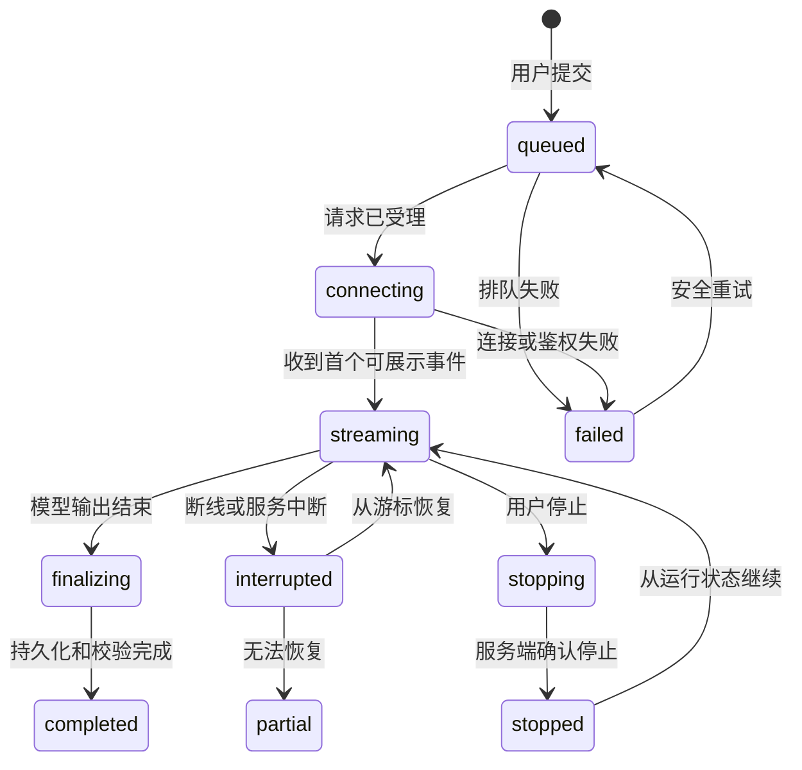

# AI 对话与流式响应：把不确定生成变成可控制的交互

AI 对话界面不是把请求发送给模型后逐字显示答案。它必须把用户意图、会话上下文、一次生成运行和已经提交的结果分开管理，使用户能够澄清、停止、重试、继续，并在断线后判断哪些内容已经完成。

本文聚焦 Chat 与 Streaming 的交互契约。工具授权见[工具调用与风险确认](03-tool-call-approval.md)，长任务的计划与接管见 [Agent 任务控制](04-agent-task-control.md)。

## 1. 四个不能混为一谈的对象

| 对象 | 定义 | 稳定标识 | 用户可执行的动作 |
| --- | --- | --- | --- |
| 对话 `conversation` | 多轮消息的持久容器 | `conversationId` | 新建、切换、删除 |
| 消息 `message` | 用户、助手或系统产生的一条内容记录 | `messageId` | 编辑副本、引用、反馈 |
| 运行 `run` | 针对某次输入执行的一次生成过程 | `runId` | 停止、查看状态、恢复 |
| 结果版本 `response` | 某次运行已经形成的输出快照 | `responseId` | 重试为新版本、继续 |

同一条用户消息可以产生多个回答版本；停止一个运行不等于删除对话；“继续”是从未完成运行的状态恢复还是发起新消息，也必须由系统契约决定。

最小数据结构可以是：

```json
{
  "conversationId": "conv-42",
  "messages": [
    {
      "messageId": "msg-user-7",
      "role": "user",
      "content": "比较两个发布方案",
      "createdAt": "2026-07-22T03:00:00Z"
    }
  ],
  "runs": [
    {
      "runId": "run-91",
      "inputMessageId": "msg-user-7",
      "status": "streaming",
      "responseId": "resp-91",
      "lastEventSequence": 18,
      "finishReason": null
    }
  ]
}
```

界面中的“正在回答”必须对应真实运行状态，不能靠光标动画推断。服务端已经失败而客户端仍播放动画，会让用户误以为系统还在工作。

## 2. 输入阶段：何时澄清，何时直接执行

澄清的目标是补齐会改变结果或风险的缺失约束，不是把每个请求都变成问卷。

### 2.1 判断顺序

1. 提取用户明确给出的目标、对象、范围、格式和截止条件。
2. 判断缺失信息是否会导致不可逆操作、显著成本或完全不同的结果。
3. 能使用安全默认值时，直接说明默认值并允许修改。
4. 必须澄清时，一次询问最少且可回答的问题。
5. 将用户回答写入当前任务状态，不要求用户重复整个请求。

| 缺失信息 | 处理方式 | 原因 |
| --- | --- | --- |
| 文案语气未指定 | 使用产品默认语气，可在结果后调整 | 可逆、低风险 |
| “删除旧数据”未说明范围 | 执行前要求选择明确范围 | 不可逆或恢复成本高 |
| 总结文件未指定输出长度 | 先给适中长度并提供“更详细” | 不改变事实处理 |
| 发送邮件未指定收件人 | 必须澄清 | 外部影响对象不明确 |
| 同名文件存在两个 | 展示路径与修改时间供选择 | 仅凭名称不能确定对象 |

澄清问题要展示为什么需要该信息，并提供已知选项。不要让用户猜系统内部参数名。

### 2.2 多轮上下文的可见边界

多轮并不意味着系统拥有无限、精确的全部历史。界面至少应区分：

- 当前输入：这一轮用户刚提交的内容。
- 对话历史：当前会话中可能被带入的消息。
- 附件与连接数据：具有独立权限、生命周期和更新状态。
- 长期记忆：可能跨会话生效的个性化信息。
- 运行临时状态：计划、工具结果和未完成输出。

当上下文会显著影响结果时，给出可检查入口，如“本次使用了 3 个文件、当前对话和 2 条偏好”。不要用“AI 已了解你”替代范围说明。

## 3. 流式响应的状态机

流式传输降低的是可见等待时间，不保证总耗时更短，也不表示先到达的文本已经通过完整校验。



### 3.1 状态的进入、退出与界面

| 状态 | 进入条件 | 主界面 | 可用动作 | 退出条件 |
| --- | --- | --- | --- | --- |
| `queued` | 服务端已创建运行 | “等待处理” | 取消 | 获得执行资源或失败 |
| `connecting` | 建立事件通道 | 非确定进度 | 停止 | 首事件或连接错误 |
| `streaming` | 持续收到内容/状态事件 | 增量文本、停止按钮 | 停止、滚动 | 输出结束、断线、停止 |
| `finalizing` | 文本结束但仍在保存或校验 | “正在完成” | 通常不可重试 | 保存完成或失败 |
| `completed` | 权威结果已保存 | 完成标记 | 重试、继续 | 用户发起新动作 |
| `stopping` | 停止请求已发出 | “正在停止” | 防重复点击 | 收到确认或超时 |
| `stopped` | 服务端确认不再执行 | 保留部分内容并标注 | 继续、重新开始 | 新运行开始 |
| `interrupted` | 事件通道断开，运行状态未知 | “连接中断，正在确认” | 重连 | 查询到权威状态 |
| `partial` | 已知无法恢复完整运行 | 部分结果与缺失边界 | 基于部分结果继续、重试 | 新运行开始 |
| `failed` | 权威失败 | 原因、保留输入 | 重试、修改输入 | 新运行开始 |

“首 Token”应作为性能观测点，而不是用户承诺。可记录：

```text
TTFT = first_visible_event_at - request_accepted_at
total_latency = completed_at - request_accepted_at
stream_gap_p95 = 第 95 百分位的相邻可见事件间隔
```

只有真正展示给用户的事件才计入 `first_visible_event_at`。连接心跳、内部推理事件或空增量不能算首个可见结果。

## 4. 事件协议：文本只是其中一种事件

稳定的流式界面应消费带序号和类型的事件，而不是拼接任意字符串。

```json
{
  "runId": "run-91",
  "sequence": 19,
  "eventId": "evt-91-19",
  "type": "response.text.delta",
  "responseId": "resp-91",
  "payload": { "delta": "第二种方案" },
  "createdAt": "2026-07-22T03:00:02.314Z"
}
```

常见事件至少包括：

| 事件 | 作用 | 渲染规则 |
| --- | --- | --- |
| `run.started` | 确认已开始 | 切换到运行状态 |
| `response.text.delta` | 增量文本 | 按序号去重后追加 |
| `response.annotation.added` | 引用或结构标注 | 绑定稳定文本范围 |
| `tool.pending` | 工具调用将发生 | 展示工具状态，不混入回答文本 |
| `tool.completed` | 工具有结构化结果 | 更新对应工具卡片 |
| `run.interrupted` | 等待批准或外部输入 | 展示阻塞原因和动作 |
| `run.completed` | 权威完成 | 结束忙碌状态并允许重试 |
| `run.failed` | 权威失败 | 展示错误类别和恢复入口 |

客户端必须按 `eventId` 或 `(runId, sequence)` 去重。重连后服务端重放事件时，盲目追加会出现重复段落。若收到序号 21 后直接收到 23，应先补取 22，不能假设网络只会按序到达。

## 5. 停止、重试与继续的语义

### 5.1 停止

停止包含两个阶段：客户端停止消费和服务端停止执行。只关闭浏览器读取流不一定终止服务端的模型请求、工具调用或计费。

停止按钮点击后：

1. 立即禁用重复点击并显示“正在停止”。
2. 发送带 `runId` 的取消请求。
3. 等待服务端返回终止状态或再次查询。
4. 保留已经确认接收的部分结果。
5. 标注“已停止”，不要把部分内容伪装成完整回答。
6. 若工具已经产生外部副作用，单独列出已完成动作。

### 5.2 重试

重试创建新运行和新回答版本，旧版本保持可访问。否则用户无法比较，也无法知道引用或反馈对应哪个版本。

重试选项可以分为：

- 相同输入重新生成：用于随机性或暂时故障。
- 修改输入后提交：创建新的用户消息或明确的修订版本。
- 从失败步骤重试：仅在幂等性和状态契约允许时使用。

对发送、支付、写数据库等副作用，不能把“再试一次”直接映射为重复执行。必须使用幂等键、查询原操作状态或进入人工确认。

### 5.3 继续

“继续”至少有三种不同含义：

| 含义 | 输入 | 结果 |
| --- | --- | --- |
| 恢复同一未完成运行 | 序列化运行状态/恢复令牌 | 延续原来的运行身份 |
| 让模型接着已完成回答写 | 新用户消息“继续”及已有内容 | 新运行、新回答 |
| 从部分结果开始新任务 | 明确引用部分输出作为输入 | 新运行并保留来源关系 |

按钮文案应具体，如“恢复生成”“继续展开”“基于当前内容重试”，避免一个“继续”承担三个契约。

## 6. 完整案例一：研究摘要的断线恢复

### 6.1 输入与约束

用户要求总结三个已上传文档。系统预计运行 40 秒，输出含引用，客户端可能切换网络。

### 6.2 处理过程

1. 创建 `run-201`，服务端返回事件流地址和 `resumeToken`。
2. 客户端先展示“已读取 3 个文件”，随后接收摘要文本。
3. 事件 1–37 已落到本地视图和服务端事件存储。
4. 网络断开；客户端进入 `interrupted`，冻结文本但不标记完成。
5. 客户端用 `runId` 查询权威状态，而不是立即创建新运行。
6. 服务端显示运行仍在执行，并允许从序号 37 恢复。
7. 客户端重连，收到重放的 35–37 和新的 38；去重后从 38 继续。
8. `run.completed` 到达，客户端再获取最终快照与引用映射。

### 6.3 输出与验证

- 页面只出现一份摘要，没有重复段落。
- `lastEventSequence` 连续到 74。
- 最终快照哈希与服务端 `responseId` 对应。
- 断线期间屏幕阅读器只播报一次“连接中断”，恢复后播报“已恢复”。
- TTFT、断线时间和恢复耗时分别记录。

### 6.4 失败分支

若事件存储已过期，服务端返回 `resume_not_available`。界面保留部分内容，明确标出截断位置，并提供“从头重试”与“基于当前部分继续”两个不同动作。不能悄悄重新生成后拼接，因为新结果可能与旧段落矛盾。

## 7. 完整案例二：客服答复中的澄清与停止

### 7.1 输入与约束

用户输入“替我回复客户，告诉他可以退款”，但当前页面关联两个订单，退款政策因支付渠道不同。

### 7.2 处理过程

1. 系统识别到外发对象和订单范围不唯一，不直接生成可发送结果。
2. 展示两个订单的编号、商品、支付渠道与可退款状态。
3. 用户选择订单 B，并选择“只生成草稿，不发送”。
4. 系统开始流式生成；界面将“草稿生成”和“发送”分为两个动作。
5. 用户发现语气不合适并停止。系统确认停止后保留部分草稿。
6. 用户修改约束为“简短、说明到账时间”，点击“重新生成完整草稿”。
7. 新回答成为版本 2，版本 1 仍可比较。

### 7.3 输出与验证

- 任何生成阶段都没有调用发送接口。
- 草稿明确绑定订单 B 和政策版本。
- 停止后没有后台继续生成的费用事件。
- 版本 2 包含退款范围和预计到账时间，且政策字段来自结构化数据。
- 用户必须再次点击独立的“审核并发送”才能产生外部副作用。

### 7.4 失败分支

若生成完成但保存草稿失败，页面进入 `finalizing_failed`，保留客户端文本并提供复制、下载和再次保存。不能显示“生成失败”后清空已经完成的内容，也不能显示“已保存”。

## 8. 自动滚动、键盘和屏幕阅读器

流式文本持续改变布局，容易夺走阅读位置。

- 用户仍位于底部附近时可以跟随输出。
- 用户向上滚动后停止自动跟随，显示“有新内容”按钮。
- 不在每个 Token 到达时把焦点移动到回答。
- 停止按钮在运行期间保持稳定位置和可访问名称。
- 使用 `aria-busy="true"` 标记正在更新的结果区域，并在完成后改为 `false`。
- 状态变化放入 `role="status"` 或 `aria-live="polite"` 区域；不要逐 Token 播报。
- 致命错误可用更高优先级通知，但仍应避免重复播报。
- “重新生成”必须说明它作用于哪条输入和哪个回答版本。

未知进度不要伪造百分比。若只有步骤信息，展示“正在解析文件 2/3”前必须确认分母稳定；若任务可能增加步骤，使用非确定进度和当前活动描述。

## 9. 方案取舍

| 方案 | 优点 | 成本与风险 | 适用条件 |
| --- | --- | --- | --- |
| 非流式整包响应 | 状态简单，完成后一次渲染 | 首次可见等待长，长请求易超时 | 短输出、需整体校验 |
| 只流式文本 | 实现成本较低 | 工具、引用和批准状态不可见 | 纯文本低风险生成 |
| 类型化事件流 | 能表达文本、工具、引用、状态 | 协议、重放和版本管理更复杂 | 生产级 AI 工作区 |
| 客户端断线即重跑 | 恢复逻辑简单 | 重复成本、结果冲突、副作用风险 | 仅限短且无副作用请求 |
| 服务端持久化可恢复运行 | 恢复准确、支持长任务 | 存储、过期与鉴权成本 | 长任务、移动网络、Agent |

## 10. 风险与失败注入

测试不能只覆盖正常生成。

| 注入条件 | 期望行为 | 禁止行为 |
| --- | --- | --- |
| 首事件延迟 20 秒 | 显示已受理与停止入口 | 假装输出进度 |
| 每 10 个事件断线 | 查询并从游标恢复 | 自动创建多个运行 |
| 重放重复事件 | 去重，内容不重复 | 直接字符串追加 |
| 完成事件早于最后文本到达 | 按协议缓冲或报错 | 静默丢段落 |
| 停止确认超时 | 标记“正在确认”，查询后台 | 宣称已停止 |
| 保存最终快照失败 | 保留文本，提供恢复 | 清空结果 |
| 上下文超限 | 明确缺失范围，允许删减 | 静默丢弃早期内容 |
| 用户快速双击重试 | 只创建一个新运行 | 并行产生重复结果 |

日志应至少关联 `conversationId`、`messageId`、`runId`、`responseId`、事件序号、客户端连接 ID、停止请求和最终状态。日志不得直接记录敏感提示词或完整附件，除非有明确权限、脱敏和保留策略。

## 11. 验收指标

- TTFT 与总耗时分别统计，不能用平均值掩盖长尾。
- 停止成功率以服务端确认终止为准。
- 恢复成功率要求恢复后最终结果连续且无重复。
- 重试率需要区分质量重试、技术故障重试和误触。
- 澄清率不能单独作为好坏指标，应结合任务完成和放弃率。
- 部分结果被误认为完成的比例应通过状态文案测试。
- 键盘用户能提交、停止、重试、切换版本和恢复阅读位置。
- 屏幕阅读器不会逐 Token 播报或因流式更新不断丢失焦点。

## 12. 综合练习：设计一个可恢复的 AI 分析面板

为“上传 CSV 后生成分析报告”设计中保真流程，并定义事件协议。

交付物：

1. 对话、消息、运行、回答版本的数据关系图。
2. 从排队到完成、停止、断线、恢复和失败的状态机。
3. 至少 8 种类型化事件及其去重规则。
4. 正常生成与断线恢复两个可点击流程。
5. 停止、相同输入重试、修改输入重试和继续展开的不同语义。
6. 空文件、超大文件、解析部分失败、上下文超限和最终保存失败状态。
7. 键盘顺序、焦点策略、自动滚动规则与状态播报文本。
8. TTFT、总耗时、停止成功率和恢复成功率的埋点定义。

验收标准：

- 重复事件不会造成重复内容。
- 断线不会自动创建新运行。
- 用户停止后能确认后台真实状态。
- 部分结果始终有明确标记和恢复入口。
- 高风险动作不因聊天生成而自动执行。
- 在 320px 宽度、键盘和屏幕阅读器下仍能操作核心控制。

## 来源

- [OpenAI Agents SDK：Streaming](https://openai.github.io/openai-agents-js/guides/streaming/)（访问日期：2026-07-22）
- [OpenAI Agents SDK：Sessions](https://openai.github.io/openai-agents-js/guides/sessions/)（访问日期：2026-07-22）
- [Microsoft HAX：Guidelines for Human-AI Interaction](https://www.microsoft.com/en-us/haxtoolkit/ai-guidelines/)（访问日期：2026-07-22）
- [W3C WAI：ARIA25 流程状态消息](https://www.w3.org/WAI/WCAG21/Techniques/aria/ARIA25)（访问日期：2026-07-22）
- [WAI-ARIA 1.2：Live Region 与状态语义](https://www.w3.org/TR/wai-aria/)（访问日期：2026-07-22）
