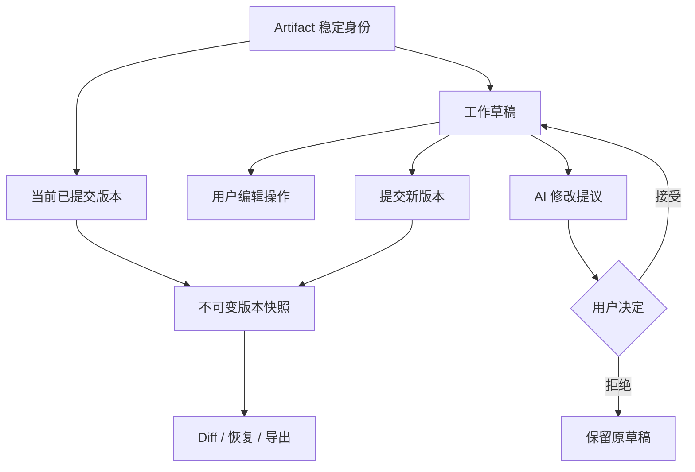
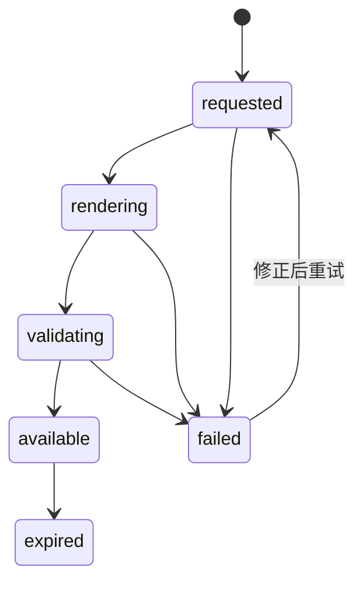

# AI Artifact 编辑与版本：让生成结果可局部修改、比较和恢复

Artifact 是在对话之外具有稳定身份、结构、版本和导出能力的工作成果，例如文章、代码文件、网页、图表或演示文稿。它与聊天回答的区别不在于是否显示在侧栏，而在于用户能否持续编辑同一个对象，并准确知道一次 AI 操作修改了什么。

本文讨论 Artifact 的创建、局部修改、版本、Diff、恢复、导出和修改来源。聊天运行的停止与恢复见 [AI 对话与流式响应](01-chat-streaming.md)。

## 1. Artifact 的能力边界

一个可持续编辑的 Artifact 至少有：

- 稳定对象 ID：标题和文件名变化后仍指向同一对象。
- 明确内容模型：纯文本、结构化文档、代码文件树或画布节点。
- 版本身份：每次已提交状态可定位、比较和恢复。
- 操作来源：用户直接编辑、AI 提议、AI 已应用、导入或系统迁移。
- 选择范围：局部修改必须绑定稳定范围，而不是模糊的“上面那段”。
- 导出契约：格式、资源、编码、权限和失败状态明确。

Artifact 不是：

- 一条无法再编辑的聊天消息。
- 只有当前文本、没有历史的临时编辑框。
- 每次要求 AI 修改都复制出一个不相关的新文件。
- 用彩色高亮声称“这是 AI 写的”，却没有事件记录支撑。

## 2. 内容、版本和操作记录分层



推荐的数据边界：

```json
{
  "artifact": {
    "id": "art-73",
    "type": "structured-document",
    "title": "发布方案",
    "headVersionId": "ver-19"
  },
  "draft": {
    "id": "draft-22",
    "baseVersionId": "ver-19",
    "revision": 8,
    "dirty": true
  },
  "proposal": {
    "id": "proposal-51",
    "runId": "run-300",
    "baseDraftRevision": 7,
    "selection": { "blockIds": ["block-14", "block-15"] },
    "status": "pending"
  }
}
```

`headVersionId` 是最近提交的权威版本；`draft.revision` 是草稿内部的并发检查值；`baseDraftRevision` 防止用户继续编辑后仍把过时 AI 提议应用到错误位置。

## 3. 创建：从空对象到可编辑对象

### 3.1 创建状态

| 状态 | 系统事实 | 界面 | 恢复动作 |
| --- | --- | --- | --- |
| `creating` | 正在分配对象与草稿 | 空骨架、取消入口 | 取消创建 |
| `generating-initial` | 对象存在，初始内容未完成 | 可见增量内容、停止 | 停止并保留部分草稿 |
| `editable` | 草稿可修改 | 编辑器与保存状态 | 正常编辑 |
| `saving` | 草稿修订正在持久化 | 明确保存中 | 等待或离线队列 |
| `save-failed` | 当前修订未保存 | 保留本地内容 | 重试、复制、下载 |
| `ready` | 已形成已提交版本 | 显示版本身份 | 修改或导出 |

先创建对象 ID 再流式生成，能让断线后的内容有恢复目标。若生成完成后才创建对象，关闭页面可能导致结果没有归属。

### 3.2 初始生成不应锁死编辑器

有三种方案：

| 方案 | 优点 | 风险 | 适用条件 |
| --- | --- | --- | --- |
| 生成结束前只读 | 不会产生并发编辑 | 用户等待长，停止后才可改 | 短内容、结构依赖整体结果 |
| 边生成边允许编辑 | 即时控制 | 光标跳动、AI 覆盖用户输入 | 仅在不同稳定块可隔离时 |
| 生成到候选分支，完成后合并 | 不干扰当前草稿 | 需要 Diff 与合并 UI | 长文、代码、多文件 |

不应在同一文本节点中同时让 AI 追加和用户输入。最安全的默认是将 AI 输出写入独立候选版本或独立块，完成后由用户接受。

## 4. 局部修改：选择范围必须稳定

用户说“把这段缩短”时，系统至少需要：

1. Artifact ID。
2. 作为修改基础的草稿修订。
3. 选区的稳定块 ID 或结构路径。
4. 选区当时的内容摘要或哈希。
5. 修改指令。
6. 允许修改的边界。

字符起止位置只在文本不变化时可靠。用户在选区前插入内容后，旧偏移会指向新位置。结构化文档宜使用块 ID 和块内锚点；代码宜使用文件路径、语法节点或带上下文的补丁。

```json
{
  "artifactId": "art-73",
  "baseDraftRevision": 8,
  "selection": {
    "start": { "blockId": "block-14", "offset": 0 },
    "end": { "blockId": "block-15", "offset": 42 },
    "contentHash": "sha256:93f..."
  },
  "instruction": "压缩到 120 字，保留两个数字与风险结论",
  "allowedOperations": ["replace-selection"]
}
```

### 4.1 提议、预览、应用

局部修改应先形成 Proposal：

- 原文保持不变。
- 提议显示删除、增加和结构变化。
- 用户可以接受全部、逐块接受或拒绝。
- 接受前再次核对 `baseDraftRevision` 和选区哈希。
- 应用后形成一条可撤销操作。

若基础内容已变化，提议进入 `stale`，系统重新计算 Diff 或要求用户选择新范围。不能把旧补丁强行套到相似文本。

## 5. Diff：回答“改变了什么”，不是制造彩色噪声

### 5.1 选择正确比较层级

| 内容类型 | 比较单元 | 需要额外表达的变化 |
| --- | --- | --- |
| 普通文本 | 段落、句子、词 | 移动、拆分、合并 |
| 中文长文 | 结构块、句子、字符 | 标点与格式变化 |
| 富文本 | 标题、段落、列表项、内联标记 | 链接、样式、节点类型 |
| 代码 | 文件、语法节点、行 | 重命名、移动、测试结果 |
| 表格 | 行列稳定 ID、单元格 | 排序、公式、类型变化 |
| 画布 | 节点 ID、属性、层级 | 位置、层级、连接关系 |

对移动的段落只显示“整段删除 + 整段新增”会夸大改动。可以标记“从第 2 节移动到第 4 节”，并允许展开底层差异。

### 5.2 Diff 的三个视图

- 摘要视图：改动文件数、块数、风险与验证结果。
- 聚焦视图：默认只展示发生变化的上下文。
- 完整视图：查看修改后的完整 Artifact，防止局部正确但整体冲突。

每处变更应回答：修改对象、原值、新值、发起者、发生时间、所属提议或操作、是否已接受。颜色不能作为唯一表达，删除和新增还要有文字、图标或语义标记。

## 6. 版本、撤销与恢复不是同一件事

| 能力 | 作用范围 | 是否创建新版本 | 典型用途 |
| --- | --- | --- | --- |
| 撤销 Undo | 当前编辑会话的最近操作 | 通常否 | 撤回刚接受的 AI 提议 |
| 重做 Redo | 恢复刚撤销的操作 | 通常否 | 修正误触撤销 |
| 保存草稿 | 持久化未提交工作 | 可只增加草稿修订 | 跨设备或断线恢复 |
| 提交版本 | 形成稳定快照 | 是 | 审阅、分享、导出基线 |
| 恢复历史版本 | 以旧内容创建新当前状态 | 应创建新版本或新草稿 | 回到已知良好状态 |
| 分支 | 从某版本并行发展 | 是 | 比较多个方案 |

“恢复 v12”不应删除 v13–v19。正确做法是以 v12 的内容创建一个新的草稿或 v20，并记录 `restoredFromVersionId: v12`。这样历史仍可审计，也能撤销恢复操作。

版本列表至少显示：

- 版本 ID 或可辨识序号。
- 创建时间与时区。
- 操作者身份类型：用户、AI 运行、导入或系统迁移。
- 变更摘要。
- 基础版本或父版本。
- 验证结果与导出状态（如果相关）。

## 7. 区分用户修改和 AI 修改

来源信息必须来自操作记录，不能根据文本风格猜测。

推荐记录：

```json
{
  "operationId": "op-801",
  "artifactId": "art-73",
  "baseVersionId": "ver-19",
  "actor": { "type": "ai-run", "id": "run-300" },
  "requestedBy": { "type": "user", "id": "user-18" },
  "operation": "replace-blocks",
  "targets": ["block-14", "block-15"],
  "status": "accepted",
  "acceptedBy": "user-18",
  "createdAt": "2026-07-22T03:20:00Z"
}
```

这里要区分：

- `actor`：实际产生修改内容的主体。
- `requestedBy`：发起 AI 运行的人。
- `acceptedBy`：决定把提议写入草稿的人。
- `operation`：发生的结构化动作。

用户接受 AI 提议后，内容仍可标为“AI 生成、用户接受”，不应改写为“用户原创”。用户随后手工编辑某句，只改变该操作影响的范围。对复杂富文本，可按块或操作保存溯源，不必给每个字符永久贴标签。

溯源记录说明内容历史，不证明内容真实、正确或安全。C2PA 一类 Content Credentials 也强调来源与编辑历史；验证凭证完整性不能代替事实验证。

## 8. 导出是一条独立生产链路

导出不等于把编辑器 DOM 下载下来。导出契约应说明：

- 导出哪个版本：当前草稿、最近提交版本或选定历史版本。
- 格式：Markdown、PDF、DOCX、HTML、ZIP 等。
- 资源：图片、字体、附件和链接如何处理。
- 编码、页面尺寸、时区与语言。
- 评论、修改痕迹、记忆或提示词是否包含。
- 权限水印、敏感信息和外链访问控制。
- 导出任务状态与过期时间。



导出前固定 `sourceVersionId`，避免渲染过程中继续编辑导致页间内容来自不同修订。若导出的是未提交草稿，也要冻结一个临时快照并显示其修订号。

## 9. 完整案例一：AI 长文的局部改写

### 9.1 输入与约束

一篇 4000 字发布说明已有 v7。用户选中“兼容性”两段，要求压缩到 180 字，必须保留浏览器版本、迁移日期和回滚步骤。

### 9.2 处理过程

1. 编辑器记录两个稳定块 ID、草稿修订 12 和内容哈希。
2. AI 在独立 Proposal 中生成替换内容，不直接覆盖草稿。
3. Diff 按句展示：删去重复背景，保留三个硬约束。
4. 用户在 AI 生成期间继续修改标题，草稿修订变为 13；选区块内容未变化。
5. 系统检查选区哈希仍相同，允许将提议重基到修订 13。
6. 用户逐块接受第一段、拒绝第二段，并手工补充回滚命令。
7. 操作记录分别标记 AI 生成并接受、AI 生成并拒绝、用户编辑。
8. 提交 v8，运行链接、验证结果和父版本 v7 一并保存。

### 9.3 输出与验证

- 最终字数在 180 字上下限内。
- 三个强制信息逐项存在。
- 标题修改没有被 AI 提议覆盖。
- 版本 Diff 能还原每个接受与拒绝动作。
- 撤销“接受第一段”只回退该操作，不删除后续用户编辑。

### 9.4 失败分支

若用户在 AI 生成期间改了选区内容，哈希不匹配。系统把提议标为“基于旧内容”，展示旧基础与当前草稿的差异，并提供“重新生成”或“复制提议”，不允许一键应用。

## 10. 完整案例二：多文件网页 Artifact

### 10.1 输入与约束

Artifact 包含 `index.html`、`styles.css`、`app.js` 和两张图片。用户要求 AI “增加暗色模式”，但不能破坏键盘操作，导出需为可离线打开的 ZIP。

### 10.2 处理过程

1. 从 v3 建立候选分支 `proposal-dark-mode`。
2. AI 修改 CSS 变量、增加切换按钮并更新 JS 持久化逻辑。
3. 摘要视图显示 3 个文件变化和 1 个新增测试。
4. 文件 Diff 标出按钮语义、焦点样式与 `prefers-color-scheme` 默认策略。
5. 沙箱预览运行 HTML 校验、键盘走查和控制台检查。
6. 测试发现本地存储不可用时脚本抛错；提议保持未接受。
7. AI 生成修复：捕获存储异常并保持系统主题默认值。
8. 用户接受修复后的提议，合并为 v4。
9. 导出任务冻结 v4，收集相对资源、生成 ZIP 并在隔离环境离线打开。

### 10.3 输出与验证

- 三个主题状态：系统默认、显式亮色、显式暗色。
- 按钮有可访问名称、键盘焦点和当前状态。
- 禁用存储后页面仍能打开和切换当前会话主题。
- ZIP 内不存在绝对本地路径，图片与脚本可加载。
- 导出清单记录 `sourceVersionId: v4` 和文件哈希。

### 10.4 失败分支

若 ZIP 渲染完成但资源校验发现图片缺失，导出状态为 `failed`，不能提供标记为成功的下载。界面列出缺失资源路径，允许返回 Artifact 修复或选择明确的“移除缺失图片后重新导出”。

## 11. 方案取舍与风险

| 决策 | 方案 A | 方案 B | 选择依据 |
| --- | --- | --- | --- |
| AI 修改落点 | 直接改草稿 | 候选提议 | 高价值内容默认提议；低风险可撤销格式化可直接改 |
| 版本存储 | 全量快照 | 增量操作日志 | 快照恢复简单；日志节省空间但重放与迁移复杂 |
| Diff 粒度 | 行/字符 | 结构节点 | 代码适合行与语法；富文本优先结构节点 |
| 来源标记 | 当前块标签 | 完整操作溯源 | 需要审计、协作或版权判断时保存操作溯源 |
| 导出 | 客户端生成 | 服务端任务 | 小文本可客户端；复杂格式、字体和审计宜服务端 |

主要风险：

- AI 提议基于过期草稿，覆盖用户的新修改。
- Diff 粒度错误，让结构变化看似大量删除新增。
- 恢复历史版本破坏后续历史。
- 来源标签因复制粘贴、合并或手工编辑失真。
- 导出包含隐藏评论、提示词、私有 URL 或访问令牌。
- 导出渲染和编辑使用不同版本。
- 自动保存失败后界面仍显示“已保存”。
- 多人同时接受不同提议造成并发冲突。

## 12. 失败注入与观测

| 注入 | 期望结果 |
| --- | --- |
| AI 生成时修改选区 | 提议过期，不直接应用 |
| 保存响应丢失但服务端已保存 | 用幂等操作 ID 查询，避免重复版本 |
| 两个浏览器同时接受提议 | 基于草稿修订冲突，进入合并流程 |
| Diff 服务超时 | 仍保留两个版本，允许稍后重算 |
| 恢复后立即撤销 | 能回到恢复前草稿，不删除历史 |
| 导出时继续编辑 | 导出固定版本，界面说明版本差异 |
| 图片资源 403 | 导出失败并列出资源，不产出残缺成功文件 |
| 离线自动保存 | 本地排队并明确“仅保存在此设备” |

观测事件至少包括提议创建、过期、接受、拒绝、局部接受、保存、版本提交、恢复、导出开始/成功/失败。质量指标要区分“用户拒绝 AI 提议”和“因提议过期无法应用”，二者不是同一种失败。

## 13. 无障碍与窄屏

- Diff 的删除与新增不能只靠红绿颜色，使用文字和语义。
- 每个变更块可用键盘进入，提供“接受此项”“拒绝此项”。
- 接受后把焦点移到稳定的下一处变更，而不是页面顶部。
- 版本列表以真实按钮和列表语义实现，当前版本有程序化状态。
- 长 Diff 提供文件/章节导航和跳过已处理项。
- 窄屏默认单列展示原文与新文，并保持版本标签，不强塞并排双列。
- 保存和导出状态使用状态消息，错误提供可聚焦的摘要与具体修复入口。
- AI 来源提示不能覆盖正文或依赖悬停才能查看。

## 14. 综合练习：设计一个可审阅的 AI 文档工作区

设计一个支持用户与 AI 共同编辑结构化文档的原型。

交付物：

1. Artifact、草稿、版本、提议和操作记录的数据模型。
2. 创建、生成、编辑、保存失败和恢复状态图。
3. 段落改写与跨章节重组两种 Proposal。
4. 摘要、聚焦、完整三种 Diff 视图。
5. 用户修改、AI 提议、用户接受和系统迁移的来源表达。
6. 撤销、版本恢复和分支的不同交互。
7. Markdown 与 PDF 两种导出流程及失败状态。
8. 过期提议、并发接受、离线保存和资源缺失的失败注入报告。

验收标准：

- AI 不能在未提示时覆盖用户的新修改。
- 任一已提交版本都可查看和比较。
- 恢复旧版本不会删除后来历史。
- 每个 AI 变更都能定位运行、范围和接受者。
- 导出文件能证明来自哪个冻结版本。
- 纯键盘用户能遍历、接受、拒绝和恢复变更。

## 来源

- [Git 官方文档：Recording changes to the repository](https://git-scm.com/book/en/v2/Git-Basics-Recording-Changes-to-the-Repository)（访问日期：2026-07-22）
- [GitHub Docs：Comparing commits](https://docs.github.com/en/pull-requests/committing-changes-to-your-project/viewing-and-comparing-commits/comparing-commits)（访问日期：2026-07-22）
- [C2PA 2.4：Content Credentials Explainer](https://spec.c2pa.org/specifications/specifications/2.4/explainer/Explainer.html)（访问日期：2026-07-22）
- [C2PA 2.4：Implementation Guidance](https://spec.c2pa.org/specifications/specifications/2.4/guidance/Guidance.html)（访问日期：2026-07-22）
- [Microsoft HAX：Support efficient correction](https://www.microsoft.com/en-us/haxtoolkit/guideline/support-efficient-correction/)（访问日期：2026-07-22）
