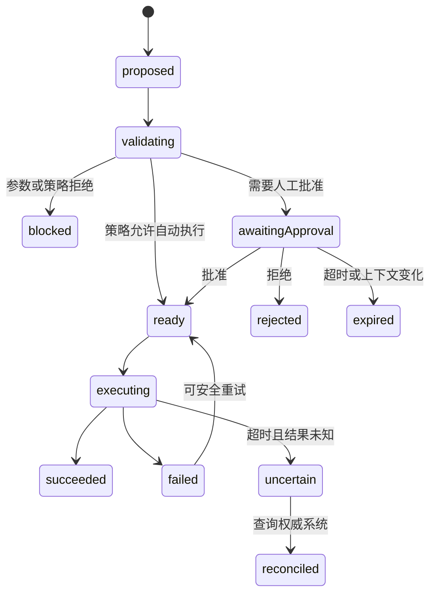

# AI 工具调用与风险确认：在执行前建立可理解的授权边界

工具调用让 AI 从“生成内容”进入“读取系统或改变外部状态”。交互设计的核心不是展示一行“正在调用工具”，而是把工具身份、真实参数、影响范围、风险、授权决定和执行结果建立为可审计的状态契约。

提示词不能承担授权。模型决定“应该调用”不代表调用者“被允许调用”，用户在聊天里说“都可以”也不能自动变成无限期、跨对象的权限授予。

## 1. Tool Call 的组成

一个工具调用至少包含：

| 字段 | 作用 | 设计要求 |
| --- | --- | --- |
| `toolCallId` | 标识这一次调用 | 重试也不能复用已完成副作用调用的身份 |
| `toolName` | 稳定工具标识 | 同时显示用户能理解的名称 |
| `arguments` | 结构化参数 | 按 schema 校验，不只展示自然语言摘要 |
| `initiatorRunId` | 关联提出调用的 AI 运行 | 可回到上下文 |
| `principal` | 实际授权主体 | 不能默认等于模型或工具服务 |
| `capability` | 允许的动作 | 与读取、写入、删除等权限对应 |
| `target` | 受影响对象与范围 | 使用稳定 ID，并显示名称/路径 |
| `riskClass` | 产品定义的风险等级 | 由策略系统计算，不由模型自评 |
| `approvalStatus` | 是否等待、批准或拒绝 | 决定能否进入执行 |
| `executionStatus` | 是否排队、执行、成功或失败 | 与批准状态分开 |

```json
{
  "toolCallId": "call-602",
  "toolName": "calendar.create_event",
  "arguments": {
    "calendarId": "cal-team",
    "title": "发布复盘",
    "start": "2026-07-24T10:00:00+08:00",
    "end": "2026-07-24T11:00:00+08:00",
    "attendeeIds": ["user-7", "user-9"]
  },
  "principal": { "type": "user", "id": "user-18" },
  "riskClass": "external-write",
  "approvalStatus": "required",
  "executionStatus": "not-started"
}
```

## 2. 从提出到完成的双状态机

批准和执行必须分开。批准成功后执行仍可能失败；拒绝则意味着工具从未执行。



### 2.1 状态表

| 状态 | 用户应知道 | 可用动作 |
| --- | --- | --- |
| `proposed` | AI 提议什么 | 等待校验，无批准按钮 |
| `validating` | 正在检查参数和权限 | 取消整个运行 |
| `blocked` | 哪条策略不允许 | 修改范围、申请权限 |
| `awaitingApproval` | 将执行的确切动作与影响 | 批准、拒绝、修改 |
| `ready` | 已具备执行条件 | 自动继续或取消 |
| `executing` | 工具已开始，是否可取消 | 查看当前步骤 |
| `succeeded` | 权威结果和可验证链接 | 查看、必要时补偿 |
| `failed` | 已确认未完成或部分完成 | 修正、受控重试 |
| `uncertain` | 请求结果未知 | 查询状态，禁止盲重试 |
| `expired` | 原批准已失效 | 检查新参数后重新批准 |

## 3. 风险分级决定确认强度

风险由动作可逆性、影响范围、数据敏感度、外部传播、财务/法律后果和自动恢复能力共同决定。

| 风险类别 | 示例 | 默认交互 |
| --- | --- | --- |
| 低风险只读 | 读取公开天气、搜索公开文档 | 可自动执行，保留调用记录 |
| 受限只读 | 读取私有文件、客户数据 | 首次或范围变化时授权，显示数据范围 |
| 可逆写入 | 创建未发布草稿、添加本地标签 | 可按会话授权，提供撤销 |
| 外部写入 | 发邮件、创建日程、发布评论 | 执行前逐次确认收件人/对象与内容 |
| 破坏性写入 | 删除记录、覆盖文件、撤销权限 | 强确认、范围复核、必要时二次身份验证 |
| 财务/法律/安全关键 | 付款、签署、生产权限、医疗动作 | 人工审查、职责分离和受控系统规则 |

风险分级是组织策略，不是自然定律。相同动作在不同上下文中风险不同：删除可恢复的个人草稿与永久删除共享生产数据不能共用一个“删除”级别。

## 4. Approval 卡片必须展示什么

确认界面要让用户在不阅读原始 JSON 的情况下作出知情决定，同时允许展开真实参数。

### 4.1 必要信息

1. 动作：创建、修改、发送、删除还是授权。
2. 工具：由哪个连接或服务执行。
3. 对象：稳定身份、名称、路径和所属空间。
4. 关键参数：收件人、金额、时间、字段变化、查询范围。
5. 影响：外部可见性、是否可撤销、预计数量和费用。
6. 权限：将使用哪个账户和权限范围。
7. 原因：它如何服务当前用户目标；这是解释，不是授权依据。
8. 决定：批准一次、拒绝、修改参数；长期授权必须单独说明范围与撤销入口。

### 4.2 确认文案

差的确认：

> AI 想要使用 Calendar，是否允许？

可决策的确认：

> 使用工作日历创建“发布复盘”，时间为 7 月 24 日 10:00–11:00（UTC+8），邀请王宁和李悦。创建后两位参与者会收到通知。是否创建？

第二种文案仍要提供“查看完整参数”，并确保展示值来自最终校验后的调用参数，而不是模型另写的一段摘要。

## 5. 参数校验必须发生在受控系统

批准前和执行前都要校验，因为等待期间对象、权限或策略可能变化。

```text
模型产生候选参数
  → Schema 校验与归一化
  → 身份与权限检查
  → 风险策略计算
  → 展示最终参数并等待批准
  → 重新校验权限、对象版本和参数
  → 执行工具
  → 查询/验证权威结果
```

需要在代码中强制的规则包括：

- 必填字段、类型、枚举、长度和格式。
- 金额、数量、时间和地域边界。
- 用户是否对目标对象拥有相应能力。
- 参数中的对象是否与确认界面一致。
- 批准是否仍在有效期和范围内。
- 幂等键与并发版本是否匹配。
- 数据最小化、敏感字段脱敏和日志策略。

模型可以建议风险等级或解释原因，但策略引擎必须根据真实工具、参数、主体和环境计算最终规则。

## 6. 批准的作用域与生命周期

“始终允许”容易把一次理解变成长期高权限。授权至少有这些维度：

| 维度 | 示例 |
| --- | --- |
| 工具 | 只允许 `calendar.read`，不包括 `calendar.create_event` |
| 动作 | 只读、创建草稿、发送、删除 |
| 对象 | 当前文件夹、当前仓库、指定日历 |
| 参数上限 | 金额不超过 100 元、收件人仅当前团队 |
| 时间 | 本次调用、本次运行、本次会话、到某日期 |
| 环境 | 测试环境，不包括生产环境 |
| 主体 | 当前用户，不可转授给其他 Agent |

适合的选项通常是：

- 允许这一次。
- 本次运行内允许相同工具的同等或更低风险调用。
- 拒绝并告诉 AI 原因。
- 修改参数后重新请求。

长期授权要放在连接/权限设置中，显示具体范围、最近使用和撤销入口，不应藏在高压确认弹窗里。

## 7. 批量调用与嵌套 Agent

### 7.1 不把一串动作压成含糊的一次确认

批量动作应按共同目标、相同风险和可理解数量分组。例如“为 6 个选中的 Issue 添加 `needs-review` 标签”可以一次确认；“修改 6 个 Issue，其中 2 个关闭、1 个删除”应按风险拆分。

确认卡片显示：

- 总对象数和可展开列表。
- 相同字段变化。
- 被跳过或无权限对象。
- 是否允许部分成功。
- 失败后的补偿或重试方式。

### 7.2 嵌套 Agent 不改变授权主体

顶层 Agent 委派给子 Agent，子 Agent 再调用工具时，批准请求仍要回到具有权限的人。不能因为顶层 Agent 被允许“做研究”，就推导出子 Agent 可发送邮件或写生产数据库。

界面可显示调用路径：

```text
发布助理 → 数据分析子任务 → analytics.export_report
```

用户批准的是最终工具动作及范围，不需要理解每个内部代理名称，但必须知道是谁发起、使用哪个账户以及影响什么。

## 8. 执行结果与不确定结果

成功不能以“工具接口返回 200”作为唯一证据。应读取业务结果：

- 创建资源返回稳定 ID 和可打开链接。
- 更新返回新版本号或字段快照。
- 发送返回消息 ID、收件人和时间。
- 删除返回删除状态、恢复截止时间或审计事件。
- 支付返回交易状态，而不是只返回请求受理。

超时最危险的状态是 `uncertain`：请求可能已经在远端成功，但客户端没有收到响应。此时重试可能重复发送或扣款。恢复顺序是：

1. 使用幂等键或外部请求 ID 查询权威状态。
2. 能确认成功则展示结果。
3. 能确认未执行才允许重试。
4. 无法确认时升级为人工核对，不自动重放。

## 9. 完整案例一：发送客户邮件

### 9.1 输入与约束

用户要求“把退款说明发给客户”。当前工单绑定一个客户、两个联系人，草稿由 AI 生成，发送属于外部写入。

### 9.2 处理过程

1. AI 调用只读工具读取工单和退款政策，记录使用范围。
2. AI 生成邮件草稿；此时没有调用发送工具。
3. 用户选择主联系人，修改到账时间描述。
4. 系统创建 `email.send` 候选调用并做 schema、权限、域名和附件扫描。
5. Approval 卡片展示发件账户、To/CC、主题、完整正文、附件、外部可见影响。
6. 用户批准一次；批准绑定正文哈希、收件人和 5 分钟有效期。
7. 执行前发现草稿被另一标签页修改，哈希变化，原批准过期。
8. 系统展示差异并要求重新确认最终正文。
9. 发送后返回消息 ID 和工单时间线链接。

### 9.3 输出与验证

- 收件人和正文与最终批准内容逐字对应。
- 发送记录绑定批准人、工具调用和消息 ID。
- 工单中能看到发送结果，不依赖 AI 自述。
- “再次生成草稿”不会自动再次发送。

### 9.4 失败分支

若发送接口超时，进入 `uncertain`。系统以幂等键查询发件服务；查到消息 ID 则显示已发送，查到未创建才允许重试。查询仍失败时提示人工检查发件箱，不显示通用“再试一次”。

## 10. 完整案例二：批量修改项目标签

### 10.1 输入与约束

用户要求为搜索结果中“所有过期但未关闭的任务”加 `overdue` 标签。搜索结果有 83 条，其中 7 条用户无编辑权限，结果还会随时间变化。

### 10.2 处理过程

1. 只读查询得到对象 ID 快照、查询时间和版本。
2. 策略将可编辑 76 条与无权限 7 条分开。
3. Approval 卡片显示“修改 76 条，跳过 7 条”，允许展开具体对象。
4. 用户选择不允许部分成功：任一写入失败则停止后续执行。
5. 批准绑定 76 个稳定 ID，不绑定动态搜索表达式。
6. 执行前重新检查版本；3 条已被关闭，因此从集合移除并使批准过期。
7. 用户审核新集合 73 条后批准。
8. 工具按幂等操作 ID 批量执行，返回每条结果。

### 10.3 输出与验证

- 成功 73、跳过 10 的原因可逐条查看。
- 搜索中新出现的任务不会被偷偷加入。
- 重试只针对权威确认失败且未成功的对象。
- 操作摘要可导出并关联审计日志。

### 10.4 失败分支

执行到第 40 条时网络中断。系统查询批次状态，确认 38 条成功、2 条业务失败、其余未执行；界面进入部分成功，允许对未执行集合重新确认，不对成功项重放。

## 11. 无障碍与反操纵设计

- 批准和拒绝使用同等可发现的按钮，不用视觉弱化迫使批准。
- 高风险确认默认焦点不放在“批准”按钮，避免回车误触。
- 按钮名称包含动作，如“发送给 2 位收件人”，不是“确定”。
- 风险、不可逆性和外部影响不只用颜色表达。
- 参数表可用键盘浏览，长 JSON 只是补充视图。
- 工具等待批准时使用状态消息，但不反复催促。
- 拒绝后允许给出原因并继续对话，不把拒绝视为系统错误。
- 倒计时过期要有文本和程序化状态，不能只用缩短的进度条。
- 移动端确认必须保留对象、影响和关键参数，不可只剩标题与按钮。

## 12. 方案取舍

| 方案 | 优点 | 风险 | 适用条件 |
| --- | --- | --- | --- |
| 所有工具逐次确认 | 控制强 | 确认疲劳，用户机械批准 | 原型期或工具均高风险 |
| 基于风险的确认 | 低风险流畅、高风险可控 | 需要可靠策略和持续审计 | 生产产品 |
| 会话级授权 | 减少重复确认 | 范围容易扩大 | 明确工具、对象和时间上限 |
| 直接执行后提供撤销 | 快速 | 不适合不可逆、外部或敏感动作 | 可逆本地写入 |
| 由模型决定是否确认 | 实现简单 | 可被提示注入绕过 | 不应作为授权机制 |

## 13. 安全、隐私和运维边界

- 工具返回内容可能含提示注入；它是外部数据，不是更高优先级指令。
- 前端隐藏按钮不等于权限控制；服务端每次执行都要授权。
- 日志记录参数时必须脱敏 Secret、个人数据和正文敏感内容。
- 第三方连接失效、权限缩减或账户切换后，旧批准必须失效。
- 生产与测试连接应有明显环境标识，并由系统隔离。
- 工具 schema 版本变化后，未执行的旧批准需要重新校验。
- 补偿操作不是普遍撤销；已发送邮件无法真正收回，删除恢复也可能有时限。
- 高风险域可要求第二审批人、强认证或职责分离，不能只增加更吓人的弹窗。

## 14. 失败注入与验收

| 注入条件 | 应观察到 |
| --- | --- |
| Approval 展示后参数被修改 | 批准失效并重新展示 |
| 用户权限在等待期间被撤销 | 执行前拒绝，不尝试工具 |
| 双击批准 | 只执行一个 `toolCallId` |
| 工具成功但响应丢失 | 查询权威结果，不盲重试 |
| 嵌套 Agent 请求高风险工具 | 批准回到原授权主体 |
| 批量对象集合变化 | 固定快照或使批准过期 |
| 拒绝调用 | 工具从未执行，Agent 获得明确拒绝结果 |
| 会话级允许后切换生产环境 | 旧授权不适用 |

验收指标：

- 未批准高风险调用执行数必须为零。
- 批准界面参数与执行参数哈希一致。
- 不确定结果的盲重试数为零。
- 可追踪每次调用的发起运行、授权主体、工具版本和权威结果。
- 确认疲劳通过拒绝率、阅读时间和误操作研究评估，不能只追求批准速度。

## 15. 综合练习：设计“AI 发布助理”的工具权限

工具包括读取文档、创建发布草稿、上传资源、修改 DNS 和正式发布。

交付物：

1. 五个工具的 schema、权限、风险级别和结果契约。
2. 提出、校验、批准、执行、部分成功和不确定结果状态机。
3. 低风险自动执行、会话内授权、逐次强确认的分级规则。
4. 创建草稿与正式发布两张不同确认卡片。
5. 参数变化、权限撤销、超时、双击和响应丢失的测试记录。
6. 批量上传中部分成功的恢复流程。
7. 审计日志字段、脱敏规则与保留策略。
8. 键盘、读屏和 320px 窄屏验收。

完成标准：发布工具只能在用户审核最终域名、版本、可见范围和回滚方式后执行；模型或子 Agent 无法自行扩大权限；每次结果都能由发布平台的稳定 ID 验证。

## 来源

- [OpenAI Agents SDK：Human-in-the-loop](https://openai.github.io/openai-agents-js/guides/human-in-the-loop/)（访问日期：2026-07-22）
- [OpenAI Agents SDK：Tools](https://openai.github.io/openai-agents-js/guides/tools/)（访问日期：2026-07-22）
- [NIST：AI Risk Management Framework 1.0](https://www.nist.gov/publications/artificial-intelligence-risk-management-framework-ai-rmf-10)（访问日期：2026-07-22）
- [NIST：Generative AI Profile](https://www.nist.gov/publications/artificial-intelligence-risk-management-framework-generative-artificial-intelligence)（访问日期：2026-07-22）
- [Microsoft HAX：Make clear why the system did what it did](https://www.microsoft.com/en-us/haxtoolkit/guideline/make-clear-why-the-system-did-what-it-did/)（访问日期：2026-07-22）
