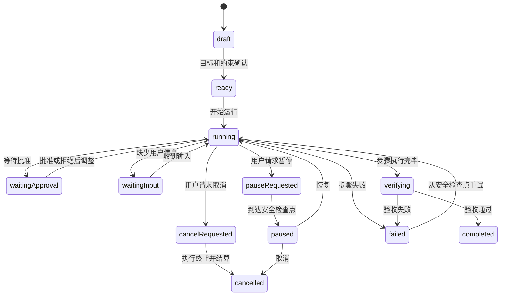

# Agent 任务与人工接管：设计可观测、可暂停和可恢复的长任务

Agent Task 是一个可能跨多个步骤、工具和等待点持续运行的任务。用户需要看到目标、已确认的计划、当前活动、真实结果和待处理问题，并能够暂停、取消、恢复或接管。

可观测不等于公开模型内部思维链。产品应展示可验证的计划、动作、输入输出、状态变化和简洁原因，不把隐藏推理文本当作进度，也不把动画当作执行证据。

## 1. 会话、任务、运行和步骤

| 对象 | 含义 | 生命周期 |
| --- | --- | --- |
| 会话 `session` | 用户与 Agent 的交互上下文 | 可包含多个任务 |
| 任务 `task` | 用户认可的目标与约束 | 从创建到完成/取消 |
| 运行 `run` | 一次实际执行尝试 | 可失败后产生下一次运行 |
| 步骤 `step` | 可观测的工作单元 | 排队、执行、阻塞、完成 |
| 工具调用 `toolCall` | 对受控工具的一次调用 | 独立批准与执行状态 |
| 产物 `artifact` | 任务产生的可审阅成果 | 可有独立版本历史 |

```json
{
  "taskId": "task-88",
  "goal": "把 Issue 314 修复为可审阅的 Pull Request",
  "constraints": ["不修改公共 API", "必须通过单元测试"],
  "status": "running",
  "currentRunId": "run-4",
  "planVersion": 3,
  "steps": [
    { "id": "step-1", "title": "复现失败", "status": "completed" },
    { "id": "step-2", "title": "修改解析逻辑", "status": "running" },
    { "id": "step-3", "title": "运行测试", "status": "pending" }
  ]
}
```

任务不能只存自然语言目标。约束、允许的环境、完成标准、预算、截止时间和授权边界都应成为结构化状态。

## 2. 任务状态机



### 2.1 状态语义

| 状态 | 进入条件 | 允许动作 | 退出证据 |
| --- | --- | --- | --- |
| `draft` | 目标仍在编辑 | 修改、删除 | 用户确认目标 |
| `ready` | 输入和授权足以开始 | 开始、修改 | 创建运行 |
| `running` | 至少一个步骤正在执行 | 请求暂停/取消、提供引导 | 步骤事件或阻塞 |
| `waitingApproval` | 高风险调用尚未授权 | 批准、拒绝、修改 | 决定写入运行状态 |
| `waitingInput` | 无安全默认值的关键输入缺失 | 回答、终止 | 输入校验通过 |
| `pauseRequested` | 已收到暂停请求 | 等待、升级取消 | 到达检查点 |
| `paused` | 执行状态已持久化且无后台继续 | 恢复、取消 | 新运行或恢复运行 |
| `cancelRequested` | 已收到取消请求 | 等待状态确认 | 子任务已终止/结算 |
| `cancelled` | 已确认不再继续 | 查看结果、复制新任务 | 终态 |
| `failed` | 步骤无法按契约继续 | 重试、改计划、接管 | 新运行或终止 |
| `verifying` | 执行结束，完成标准待验证 | 查看验证 | 验收通过/失败 |
| `completed` | 所有必须标准通过 | 查看、派生任务 | 终态 |

## 3. 目标与完成标准

好的目标必须可判定，而不是只描述活动。

“优化首页”无法直接完成；可以改为：

- 对象：首页当前主分支。
- 目标：将移动端核心内容的 LCP 降到 2.5 秒以内。
- 约束：不降低图片可读性，不更改分析 SDK。
- 验证：指定设备配置下运行 5 次，报告中位数与第 75 百分位。
- 产出：变更分支、测试结果和回滚说明。

Agent 可建议补充标准，但用户或业务规则决定目标。任务开始页应展示最终目标与关键约束；执行中修改目标要形成版本，并说明哪些已完成步骤需要重做。

## 4. 计划是可修订承诺，不是思维链

计划展示面向用户的工作单元：

- 步骤标题和预期产出。
- 依赖、可并行关系和当前状态。
- 需要的工具、数据或批准。
- 已知风险和验证方法。
- 计划版本与变化摘要。

计划不应展示：

- 模型逐 Token 的隐藏推理。
- 未验证的自我评价，如“我已经完全理解”。
- 为了显得忙碌而生成的细碎动作。
- 与用户决策无关的内部调度细节。

### 4.1 动态改计划

当工具结果推翻假设时，Agent 可以修订计划：

1. 保留旧计划版本。
2. 标出新增、删除、重新排序的步骤。
3. 说明触发变化的可验证事实。
4. 重新计算预算、时间和授权需求。
5. 若变化扩大目标或风险，等待用户确认。

例如“修复单个解析器”发现需要数据库迁移，已经超出原约束，不能仅把迁移悄悄加进步骤列表。

## 5. 步骤进度：只展示能证明的状态

| 进度类型 | 可以展示 | 不应展示 |
| --- | --- | --- |
| 确定进度 | 处理 37/100 个已知对象 | 对象集合仍增长时声称 37% |
| 阶段进度 | 下载→解析→验证→发布 | 未知耗时却给精确剩余时间 |
| 当前活动 | 正在运行测试套件 `api` | “正在努力思考” |
| 结果摘要 | 42 项通过、2 项失败 | 仅写“测试完成” |
| 等待状态 | 等待用户批准发送 2 封邮件 | 继续播放运行动画 |

步骤事件示例：

```json
{
  "taskId": "task-88",
  "runId": "run-4",
  "stepId": "step-3",
  "sequence": 61,
  "type": "step.validation.completed",
  "status": "failed",
  "summary": "单元测试 128 通过，2 失败",
  "evidence": [
    { "type": "test-report", "artifactId": "artifact-test-9" }
  ]
}
```

进度条只有在分母稳定且事件可靠时使用确定值。否则使用阶段列表和当前活动。

## 6. 暂停、取消和停止的差别

### 6.1 暂停

暂停意味着未来可以从持久化检查点继续。系统需要：

- 停止创建新步骤和新工具调用。
- 让不可中断的当前操作到达安全点。
- 持久化计划版本、步骤结果、批准决定和外部对象 ID。
- 标明仍在完成的收尾动作。
- 确认所有执行器不再继续后进入 `paused`。

不是所有工具都支持暂停。一次正在发生的文件上传可能只能完成或取消；已发出的邮件不能暂停。界面应在请求前说明最早暂停点。

### 6.2 取消

取消表示任务不再自动继续，但不等于回滚已经完成的副作用。

取消摘要应分为：

- 已完成且保留：已创建分支、已上传草稿。
- 已终止：尚未完成的模型运行、未开始的步骤。
- 无法撤销：已发送通知、外部系统已处理动作。
- 可补偿：可以删除草稿或关闭分支，但需要另一次授权。

### 6.3 浏览器关闭

关闭页面只是客户端离开。长任务默认继续还是暂停必须预先明确，并在重新打开时显示权威状态。不能把页面关闭当作可靠取消机制。

## 7. 恢复：从检查点继续而非猜测

检查点至少保存：

```json
{
  "checkpointId": "cp-11",
  "taskId": "task-88",
  "runId": "run-4",
  "planVersion": 3,
  "completedStepIds": ["step-1"],
  "currentStep": {
    "id": "step-2",
    "resumeToken": "opaque-token",
    "status": "paused"
  },
  "externalEffects": [
    { "toolCallId": "call-8", "resourceId": "branch-fix-314", "status": "created" }
  ],
  "authorizationSnapshot": "authz-203",
  "createdAt": "2026-07-22T04:00:00Z"
}
```

恢复前重新检查：

1. 用户身份与当前权限。
2. 外部资源是否仍存在、版本是否变化。
3. 未执行工具的批准是否过期。
4. 计划依赖和输入文件是否更新。
5. 预算、截止时间和环境是否仍适用。

已完成步骤若有可靠产物可复用；有副作用的步骤不能因本地状态丢失就重跑。

## 8. 失败步骤与重试

失败界面至少回答：

- 哪一步失败。
- 已确认完成了什么。
- 失败类别：输入、权限、网络、工具、验证、预算或内部错误。
- 当前外部状态是否已知。
- 重试会从哪里开始，会不会重复副作用。
- 用户能修改什么、提供什么或接管什么。

### 8.1 重试策略

| 失败 | 默认策略 |
| --- | --- |
| 短暂网络错误、无副作用 | 指数退避自动重试，有上限 |
| 限流 | 遵守服务端重试时间，展示等待 |
| 参数无效 | 不自动重试，修正参数 |
| 权限不足 | 申请或切换账户，不重复调用 |
| 写操作结果未知 | 先对账，再决定是否重试 |
| 验收失败 | 回到修改步骤，保留失败证据 |
| 预算耗尽 | 暂停并请求范围/预算决定 |

重试次数多不代表可靠。必须记录每次尝试与最终权威结果，防止失败循环消耗成本。

## 9. 人工接管

人工接管不是点击“停止 AI”后把一个空白页面交给用户。交接包应包含：

- 原目标、约束和完成标准。
- 当前计划版本与状态。
- 已完成步骤和可验证产物。
- 未完成、失败和等待批准的步骤。
- 已发生外部副作用和对象链接。
- 工作草稿、分支或锁的所有权。
- 建议的下一步，但明确它只是建议。

接管模式：

| 模式 | Agent 状态 | 用户能力 |
| --- | --- | --- |
| 观察 | 继续运行 | 查看证据，不修改 |
| 引导 | 继续运行 | 新增约束或调整后续计划 |
| 审批 | 在检查点等待 | 批准、拒绝或修改动作 |
| 协作 | 特定步骤暂停 | 用户编辑产物后交还 Agent |
| 完全接管 | Agent 停止自动执行 | 用户拥有编辑和执行控制 |

从用户交还给 Agent 时，要创建新检查点并重新核对用户手工修改，不能继续使用接管前的陈旧假设。

## 10. 完整案例一：Coding Agent 创建修复 PR

### 10.1 输入与约束

目标是修复解析器 Issue，不能更改公共 API，必须运行单测和静态检查，最终只创建草稿 PR，不自动合并。

### 10.2 处理过程

1. Agent 建立任务和 5 步计划：复现、定位、修改、测试、创建草稿 PR。
2. 复现步骤记录失败测试作为证据。
3. 修改步骤创建隔离分支，提交候选补丁。
4. 测试 128 项中 2 项失败，步骤进入 `failed`，不把任务标为完成。
5. 用户查看测试报告，选择“接管修改”。Agent 暂停并移交分支与失败位置。
6. 用户修复一处测试夹具并交还控制。
7. Agent 从新提交建立检查点，重新运行完整测试，而不是只跑之前失败的两项。
8. 所有验证通过后，调用创建草稿 PR 的可逆写工具。
9. 任务进入 `verifying`，确认 PR 链接、目标分支、测试状态和未修改公共 API。

### 10.3 输出与验证

- 时间线显示 Agent 和用户各自修改的提交。
- 失败测试没有被隐藏或删除。
- PR 为草稿，未触发自动合并。
- 完成摘要链接到测试报告和具体 Diff。
- 关闭页面后重新进入仍能看到权威运行状态。

### 10.4 失败分支

若创建 PR 请求超时，任务进入不确定结果。系统用分支名和幂等键查询是否已有 PR；找到则绑定，确认没有才重试，避免创建重复 PR。

## 11. 完整案例二：市场素材批量生成与发布

### 11.1 输入与约束

为 12 个渠道生成适配素材，设计师必须审阅，任何内容不得自动公开发布。任务可运行数小时。

### 11.2 处理过程

1. 计划按“收集规格、生成候选、自动校验、人工审阅、导出”分阶段。
2. 12 个生成步骤并行，但总并发和成本有上限。
3. 每个渠道显示已生成候选数与尺寸校验结果，不显示虚假整体百分比。
4. 第 4 个渠道触发品牌词校验失败，单步失败，其余可继续。
5. 用户请求暂停；系统停止调度新生成，让 2 个正在上传的文件到达安全点后持久化。
6. 次日恢复时，渠道规格有 1 项变化；系统使对应候选过期并修订计划。
7. 设计师逐项接管审阅，接受 10 个、退回 2 个。
8. Agent 只重新生成退回项。最终导出包固定通过审阅的版本。

### 11.3 输出与验证

- 暂停期间没有新增模型和上传成本。
- 恢复没有重复生成已通过且规格未变的素材。
- 每个导出文件对应审批人和候选版本。
- “发布”不在任务允许工具列表中，Agent 无法越权公开内容。

### 11.4 失败分支

若暂停请求后外部渲染服务无法取消，状态显示“暂停请求已收到，仍有 1 个渲染作业收尾”。只有远端作业完成或确认终止后才进入 `paused`。

## 12. 并行步骤和依赖

并行能缩短耗时，也增加预算竞争、结果合并和取消难度。

- 明确依赖图，不能只按列表顺序推断。
- 同一对象上的写步骤串行或使用版本控制。
- 共享预算由调度器强制，不由 Agent 自觉停止。
- 一个分支失败时定义其他分支继续、暂停还是取消。
- 聚合步骤只消费已验证产物。
- 取消父任务要向子运行传播，并汇总无法取消的外部工作。

当 5 个并行步骤中 4 个完成、1 个失败时，任务是“部分完成”还是“失败”由完成标准决定，不能根据多数投票。

## 13. 无障碍和信息密度

- 任务状态、步骤状态和工具状态使用文字及程序化语义，不只靠颜色。
- 当前运行步骤可定位，但状态更新不自动抢焦点。
- 频繁日志默认折叠；重要阻塞通过 `role="status"` 温和播报。
- 失败摘要提供到失败步骤的键盘链接。
- 暂停、取消、接管的按钮名称明确影响范围。
- 窄屏先显示目标、当前状态和阻塞动作，详细日志在次级层。
- 进度更新节流，避免屏幕阅读器连续播报。
- 时间显示绝对时间与相对时间的可切换信息，跨时区任务注明时区。

## 14. 方案取舍

| 设计决策 | 方案 | 优点 | 代价 |
| --- | --- | --- | --- |
| 计划展示 | 固定步骤 | 稳定、易理解 | 无法表达发现后的调整 |
| 计划展示 | 版本化动态计划 | 适应真实任务 | 需要变化说明和重新授权 |
| 日志 | 原始事件全量展示 | 审计完整 | 信息过载、可能含敏感数据 |
| 日志 | 用户级时间线 + 可展开证据 | 清晰 | 需要事件归纳层 |
| 暂停 | 立即杀死进程 | 响应快 | 可能损坏状态或留下未知副作用 |
| 暂停 | 安全检查点 | 可恢复 | 暂停不是瞬时完成 |
| 接管 | 只停止 Agent | 简单 | 用户缺少上下文 |
| 接管 | 结构化交接包 | 可继续工作 | 要维护稳定产物与状态 |

## 15. 失败注入与观测

| 注入条件 | 期望行为 |
| --- | --- |
| 步骤日志中断但执行仍继续 | 显示连接问题并查询任务状态 |
| 暂停时工具不可中断 | 明确收尾步骤，最终确认暂停 |
| 关闭页面 | 遵循既定后台策略，重开可恢复 |
| 计划修订扩大到生产写入 | 阻塞并请求新授权 |
| 接管时外部资源被他人修改 | 显示并发冲突，不覆盖 |
| 恢复时权限过期 | 保持暂停，重新授权 |
| 完成摘要生成失败 | 任务结果仍可从结构化证据重建 |
| 父任务取消 | 子任务收到取消并逐项汇报最终状态 |

观测指标：

- 各状态停留时间与阻塞原因。
- 首个可验证进展时间，而不是首个日志字符时间。
- 暂停请求到真实暂停的时延。
- 恢复成功率与重复副作用数。
- 人工接管后任务完成率和上下文补充次数。
- 计划变更次数及其触发证据。
- 完成后验收失败率。
- 每任务工具成本、模型成本和失败重试成本。

## 16. 综合练习：设计一个跨小时的数据迁移 Agent

任务需要分析旧数据、生成映射、在测试环境迁移、校验、等待批准，再执行生产迁移。

交付物：

1. 任务、运行、步骤、检查点和产物模型。
2. 版本化计划与依赖图。
3. 目标、约束、预算、环境和完成标准界面。
4. 暂停、取消、恢复、步骤失败和人工接管流程。
5. 测试与生产环境的授权边界。
6. 1 万条记录的确定进度与错误样本展示。
7. 权限过期、进程崩溃、部分写入、结果未知和并发修改测试。
8. 完成后的对账报告与回滚决策入口。

验收标准：

- 任务不会因生成了一段总结就被标为完成。
- 每个完成步骤都有产物或权威结果。
- 暂停后无新步骤启动，恢复不重复已完成写入。
- 生产迁移必须在最终对象、数量、映射和回滚方式确认后执行。
- 人工接管可以从交接包继续，不需要重读全部原始日志。
- 失败后能区分未执行、已成功、已失败和结果未知记录。

## 来源

- [GitHub Docs：About agent management](https://docs.github.com/en/copilot/concepts/agents/cloud-agent/agent-management)（访问日期：2026-07-22）
- [GitHub Docs：Get started with Copilot agents on GitHub](https://docs.github.com/en/copilot/how-tos/copilot-on-github/use-copilot-agents/overview)（访问日期：2026-07-22）
- [OpenAI Agents SDK：Human-in-the-loop](https://openai.github.io/openai-agents-js/guides/human-in-the-loop/)（访问日期：2026-07-22）
- [OpenAI Agents SDK：Streaming](https://openai.github.io/openai-agents-js/guides/streaming/)（访问日期：2026-07-22）
- [NIST：AI Risk Management Framework 1.0](https://www.nist.gov/publications/artificial-intelligence-risk-management-framework-ai-rmf-10)（访问日期：2026-07-22）
