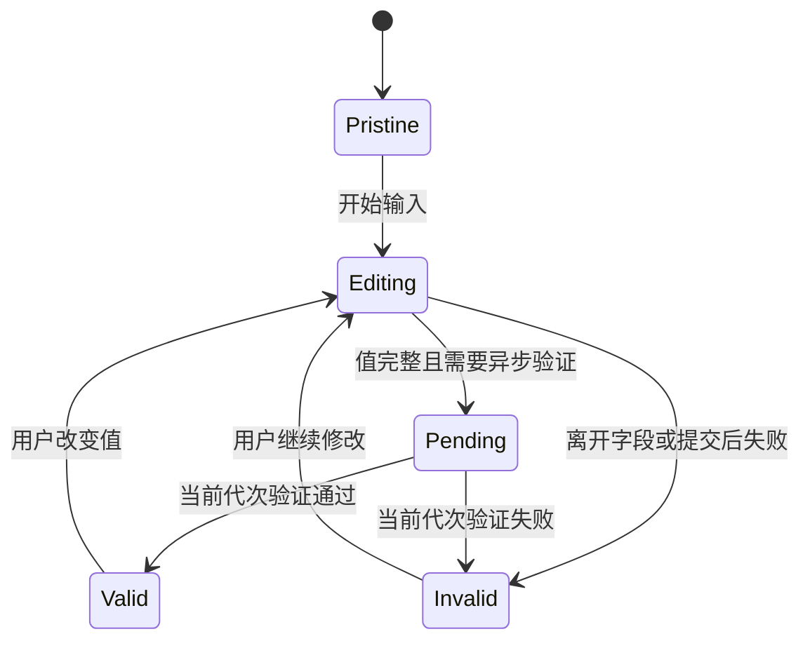

# Inline Error 行内错误

行内错误是在发生问题的字段、对象或局部区域附近显示的错误信息。

它把“哪里错了”“为什么错”“怎样修正”放在同一个操作上下文中，减少用户在页面摘要、表单和说明之间来回查找。

行内错误不是红色边框。

边框只能辅助定位；错误仍需使用文本说明，并与发生错误的控件建立程序化关联。

## 错误的基本结构

有效的字段错误包含：

1. 字段或对象身份。
2. 当前值违反的规则。
3. 已知时给出修正建议。
4. 修正后如何重新验证。

推荐：

- “开始日期不能早于今天。”
- “文件大于 20 MB。请选择更小的文件。”
- “该名称已被当前工作区使用。请更换名称。”

避免：

- “无效”
- “错误”
- “输入有误”
- “Error 1003”

技术错误编号可以补充诊断，但不能替代用户能执行的说明。

## 错误、提示和约束

| 信息 | 出现时机 | 示例 |
| --- | --- | --- |
| 标签 | 始终 | 邮箱地址 |
| 说明 | 输入前或持续 | 用于接收账单，不会公开 |
| 格式提示 | 输入前 | 格式：name@example.com |
| 错误 | 规则被验证为不满足后 | 邮箱地址缺少域名 |
| 成功反馈 | 仅在确有价值时 | 用户名可用 |

不能把用户必须知道的格式只写在错误消息里。

如果格式是完成输入的前提，应在输入前提供说明。

错误负责描述实际发生的问题，不负责第一次披露隐藏规则。

## 错误类型

### 必填缺失

字段在提交或合理的离开时机仍为空。

错误要说明字段要求，不能只显示星号。

### 格式错误

值不符合可解析格式。

例如日期、邮箱、URL 或标识符。

格式规则应尽量宽容，先规范化再验证。

### 范围错误

数值或日期超出允许范围。

需要说明边界及单位：

“重试次数必须是 1 到 5 的整数。”

### 业务规则错误

格式正确，但违反当前业务不变量。

例如：

- 结束时间早于开始时间。
- 优惠额度超过账户剩余额度。
- 用户名已经占用。

### 权限错误

当前主体不能设置该值或执行该动作。

权限错误通常不应伪装成格式错误。

需要说明可合法执行的替代路径，例如申请权限或联系所有者。

### 冲突错误

用户输入建立在过期对象版本上。

冲突涉及多个值或版本时，单个字段旁的错误可能不足，需要持久冲突面板。

### 服务错误

验证服务不可用、超时或返回未知结果。

不能把“无法验证”写成“值无效”。

## 验证时机


每个时机承担不同责任。

### 输入前

显示标签、必填状态、格式和限制。

目标是预防错误。

### 输入中

适合反馈能逐步满足的规则：

- 密码要求。
- 字符数。
- 可用性查询。
- 组合条件。

不要在用户只输入第一个字符时立即显示“内容无效”。

### 离开字段

适合验证已完成输入：

- 必填。
- 完整日期。
- 邮箱格式。

如果用户返回修改，错误应在条件解除时及时消失。

### 提交

执行全表单验证，显示错误摘要并定位第一个错误。

提交验证仍然必要，因为用户可能没有逐个触发 blur。

### 服务端

所有安全和业务规则必须由服务端重新验证。

客户端验证只改善反馈速度，不能作为授权或数据完整性边界。

## 不要过早报错

错误必须基于足够信息。

用户输入 `2` 时，日期字段可能最终是 `2026-07-18`。

在输入尚未完成时立即报错，会造成：

- 屏幕阅读器频繁播报。
- 视觉状态持续闪烁。
- 用户无法判断何时真正有效。
- 输入法组合过程被错误识别。

可以使用三态：

- `pristine`：尚未尝试验证。
- `pending`：信息不足或异步验证中。
- `invalid` / `valid`：已有结果。



## HTML 原生约束验证

HTML 提供：

- `required`
- `type`
- `min`
- `max`
- `minlength`
- `maxlength`
- `pattern`
- `step`

浏览器会计算 `validity` 状态，并可阻止无效表单提交。

```html
<label for="team-size">团队人数</label>
<input
  id="team-size"
  name="teamSize"
  type="number"
  min="1"
  max="500"
  step="1"
  required
>
```

原生约束能提供基础语义和键盘输入优化。

但浏览器默认错误气泡存在限制：

- 文案由浏览器和语言环境决定。
- 可能只暴露第一个错误。
- 持续时间和缩放行为受用户代理控制。
- 很难表达跨字段业务规则。
- 很难同时给出全表单错误摘要。

复杂产品可以保留原生约束语义，同时实现持久、可关联的自定义错误显示。

## Constraint Validation API

常用成员：

- `input.validity`
- `input.validationMessage`
- `input.checkValidity()`
- `input.reportValidity()`
- `input.setCustomValidity(message)`
- `form.checkValidity()`
- `form.reportValidity()`

`setCustomValidity()` 设置非空文本后，控件保持无效，直到再次传入空字符串。

```js
const start = document.querySelector("#start-date");
const end = document.querySelector("#end-date");

function validateDateRange() {
  end.setCustomValidity("");

  if (start.value && end.value && end.value < start.value) {
    end.setCustomValidity("结束日期不能早于开始日期");
  }
}

start.addEventListener("change", validateDateRange);
end.addEventListener("change", validateDateRange);
```

即使使用自定义消息，仍需在页面中显示持久文本并建立关联。

## `aria-invalid`

`aria-invalid="true"` 表示当前值不符合应用期望格式或规则。

使用条件：

- 已经实际执行验证。
- 当前字段确实无效。
- 错误解除后改回 `false` 或移除属性。

不要在用户尚未尝试填写必填字段时，把所有空字段预先标为无效。

```html
<label for="project-key">项目 Key</label>
<input
  id="project-key"
  name="projectKey"
  aria-invalid="true"
  aria-describedby="project-key-hint project-key-error"
>
<p id="project-key-hint">使用 2–10 个大写字母。</p>
<p id="project-key-error">Key 包含小写字母，请改为大写。</p>
```

`aria-invalid` 不能取代可见错误文本。

## `aria-describedby` 与 `aria-errormessage`

`aria-describedby` 可以把说明和错误加入控件的无障碍描述。

一个字段可以引用多个 ID。

`aria-errormessage` 专门引用错误消息，并应与 `aria-invalid="true"` 配合。

实际项目需要测试目标浏览器和辅助技术组合。

`aria-describedby` 兼容范围通常更成熟，也能同时关联提示与错误。

无论使用哪个属性：

- 引用目标必须存在。
- ID 必须唯一。
- 隐藏错误不应继续被错误关联。
- 消息文本应与视觉文本一致。

## 错误摘要

长表单或多个错误需要顶部摘要。

摘要不是行内错误的替代，而是导航入口。

```html
<section id="error-summary" aria-labelledby="error-title" tabindex="-1">
  <h2 id="error-title">请修正 3 个问题</h2>
  <ul>
    <li><a href="#company-name">公司名称不能为空</a></li>
    <li><a href="#email">邮箱地址缺少域名</a></li>
    <li><a href="#end-date">结束日期不能早于开始日期</a></li>
  </ul>
</section>
```

提交失败后可以把焦点移动到摘要。

前提是：

- 摘要是本次提交直接产生的新上下文。
- 每条链接准确跳到字段。
- 字段旁仍有完整错误。
- 焦点移动不会丢失用户输入。

短表单只有一个明显错误时，可以直接聚焦第一个无效字段。

## 焦点策略

### 首次提交失败

推荐顺序：

1. 阻止无效提交。
2. 显示所有已知错误。
3. 更新错误计数。
4. 焦点移到错误摘要或第一个错误字段。
5. 允许用户按页面顺序修正。

### 修正字段

不要在每次输入后自动跳到下一个字段。

用户应控制焦点。

### 错误消失

错误文本移除不能移除正在获得焦点的输入。

页面布局应避免因错误高度变化造成主操作大幅跳动。

可以为常见错误区域预留最小空间，但不能制造大量空白。

## 异步验证

用户名、优惠码和远程资源等需要服务端验证。

异步流程必须处理：

- 输入防抖。
- 请求取消。
- 响应乱序。
- 结果缓存。
- 速率限制。
- 服务不可用。
- 隐私泄露。

```js
let validationGeneration = 0;
let activeController;

async function validateSlug(slug) {
  const generation = ++validationGeneration;
  activeController?.abort();
  activeController = new AbortController();

  showPending("正在检查地址是否可用");

  try {
    const response = await fetch(
      `/api/slugs/${encodeURIComponent(slug)}/availability`,
      { signal: activeController.signal }
    );

    const result = await response.json();

    if (generation !== validationGeneration) return;

    if (result.available) {
      clearError();
    } else {
      showError("该地址已被使用，请更换地址");
    }
  } catch (error) {
    if (error.name === "AbortError") return;
    if (generation !== validationGeneration) return;
    showUnknown("暂时无法检查地址；提交时会再次验证");
  }
}
```

“无法检查”不是“地址不可用”。

未知状态需要单独表达。

## 输入法组合

中文、日文和韩文输入法可能在 `compositionstart` 到 `compositionend` 之间产生中间值。

不要把中间值当成最终输入反复验证。

```js
let composing = false;

input.addEventListener("compositionstart", () => {
  composing = true;
});

input.addEventListener("compositionend", () => {
  composing = false;
  validateCurrentValue();
});

input.addEventListener("input", () => {
  if (!composing) validateCurrentValue();
});
```

服务端提交时仍需执行最终验证。

## 跨字段错误

某些错误由多个字段共同决定：

- 开始日期与结束日期。
- 国家、地区与邮政编码。
- 预算上限与各项分配总和。
- 旧密码与新密码。

处理原则：

- 在最能承担修正动作的位置显示错误。
- 相关字段共享说明。
- 不能只把错误挂到最后一个字段。
- 修正任意相关值后重新计算。
- 错误摘要指向用户最先需要处理的字段或字段组。

```html
<fieldset aria-describedby="budget-error">
  <legend>预算分配</legend>
  <!-- allocation inputs -->
</fieldset>
<p id="budget-error">
  已分配 110%，请减少至少 10 个百分点。
</p>
```

## 服务端返回格式

字段错误响应需要稳定字段标识，而不是直接返回中文标签作为键。

```json
{
  "code": "validation_failed",
  "errors": [
    {
      "path": ["billing", "postalCode"],
      "rule": "postal_code_region_mismatch",
      "messageKey": "billing.postal_code_region_mismatch",
      "params": {
        "region": "CN"
      }
    }
  ]
}
```

客户端负责本地化展示。

服务端负责权威规则和机器可处理的错误类别。

不要把服务端返回的任意 HTML 注入错误容器。

## 动态列表中的错误身份

可添加、删除、排序的表单项不能只用数组下标标识错误。

例如删除第 2 行后，原第 3 行变为第 2 行，按下标保存的错误可能关联到错误对象。

每一行需要稳定 ID：

```ts
type LineItemError = {
  itemId: string;
  field: "quantity" | "unitPrice" | "sku";
  code: string;
};
```

重新排序时错误跟随 `itemId`，而不是跟随视觉位置。

## 案例一：创建 API 凭据

### 字段

- 名称
- 到期日期
- 权限范围
- IP allowlist

### 规则

- 名称在当前项目内唯一。
- 到期日期不能超过组织策略。
- 至少选择一个 scope。
- CIDR 必须可解析且不能包含被禁止网段。

### 设计

名称唯一性在离开字段后异步验证。

到期日期使用客户端快速范围检查，提交时由服务端按组织策略重新验证。

CIDR 错误明确说明第几项、错误位置和允许格式。

权限范围错误放在 checkbox group 下，而不是附到第一个 checkbox。

### 服务端冲突

提交前另一名管理员创建同名凭据。

即使客户端曾显示“名称可用”，服务端仍返回唯一约束冲突。

页面保留其他合法输入，仅把名称标为无效。

### 验收

- 空表单初始不显示四个错误。
- 首次提交显示完整摘要。
- 摘要链接进入正确字段或字段组。
- 唯一性迟到响应不覆盖新名称的结果。
- 错误文案不泄露其他项目的凭据名称。
- 修正名称后其他选择不丢失。

## 案例二：国际收货地址

### 约束

字段随国家或地区变化。

邮政编码规则、行政区字段和地址行格式不同。

### 设计

选择国家后：

1. 加载对应地址 schema。
2. 保留仍合法的用户输入。
3. 更新标签与说明。
4. 只在重新验证后更新错误。
5. 不要求重复输入已经提供且仍有效的信息。

### 风险

- 切换国家导致隐藏字段仍携带旧错误。
- 浏览器自动填充发生在验证之后。
- 服务端规范化地址后值发生变化。
- 某些地区没有邮政编码。
- 姓名和地址字符不应被错误限制为 ASCII。

### 验收

- 无邮编地区不会显示必填错误。
- 自动填充后触发正确验证。
- 规范化改值时明确告知用户。
- 国家切换后错误摘要不指向隐藏字段。
- 不以英文地址格式作为全球默认真理。

## 案例三：批量编辑成员角色

### 场景

管理员为 80 名成员修改角色。

其中：

- 3 人是唯一所有者，不能降级。
- 5 人已被另一个管理员修改。
- 2 人权限已撤销。

这不是单一字段错误。

### 设计

- 表格每行显示对象级错误。
- 页面顶部显示结果摘要。
- 成功行保持成功状态。
- 冲突行显示当前角色与请求角色。
- 权限错误提供合法的申请路径。
- 重新提交只包含修正后的失败行。

不能把所有失败都挂在“保存”按钮旁。

### 验收

- 屏幕阅读器可以从行标题定位错误。
- 虚拟滚动不会卸载唯一错误信息。
- 过滤“仅失败项”后对象身份保持稳定。
- 重试不会重复修改成功项。
- 部分成功结果可在刷新后恢复。

## 文案规则

### 描述问题

使用用户理解的概念：

- “结束日期不能早于开始日期”

不要暴露实现术语：

- “end_at violates CHECK constraint”

### 提供建议

建议必须真实可行。

如果系统不知道怎样修正，不应伪造：

- 可说：“该文件无法解析，请导出为 UTF-8 CSV 后重试。”
- 不应说：“请检查文件”，却不说明检查什么。

### 不责备用户

描述值与规则，不评价操作者。

- 推荐：“验证码已过期，请获取新的验证码。”
- 避免：“你输入得太慢。”

### 安全例外

修正建议不能破坏安全目的。

登录失败时通常不说明“邮箱存在但密码错误”，避免账户枚举。

## 错误清除规则

错误应在其事实不再成立时清除。

不同来源的错误不能互相误删。

例如：

- 客户端格式错误。
- 服务端唯一性错误。
- 权限错误。
- 异步验证未知。

可以按来源和字段保存：

```ts
type FieldIssue = {
  source: "client" | "server" | "async";
  code: string;
  valueRevision: number;
  message: string;
};
```

用户修改值后，可以清除与旧 `valueRevision` 关联的值错误。

权限错误可能与值无关，不能因为输入一个字符就自动消失。

## 观测

可记录：

- 各规则触发率。
- 首次错误到修正成功的时间。
- 相同字段反复失败次数。
- 提交失败后的放弃率。
- 客户端与服务端规则不一致率。
- 异步验证超时率。
- 错误摘要链接使用率。
- 屏幕阅读器测试缺陷。

不要记录敏感字段的原始值。

密码、令牌、证件、健康信息和支付信息应只记录错误类别。

高错误率可能表示：

- 标签不清楚。
- 默认值错误。
- 输入格式过于严格。
- 服务端规则没有提前说明。
- 业务模型本身不合理。

## 测试清单

### 初始状态

- 必填字段未触发时不预先报错。
- 标签、格式和限制在输入前可见。
- 自动填充值能被识别。

### 输入

- 输入法组合期间不反复报错。
- 粘贴、语音输入和自动填充都触发验证。
- 宽容解析不会拒绝可安全规范化的值。
- 字符数按实际产品规则计算。

### 提交

- 所有错误一次显示。
- 摘要数量正确。
- 摘要链接到具体字段或字段组。
- 用户输入保留。
- 服务端重新验证。

### 异步

- 请求乱序不会覆盖新值。
- 取消请求不显示失败。
- 超时显示未知而非无效。
- 速率限制包含可重试条件。

### 无障碍

- 错误使用文本说明。
- `aria-invalid` 只标记已验证的无效字段。
- 描述关系引用有效 ID。
- 颜色不是唯一线索。
- 焦点顺序合理。
- 200% 缩放下错误不会覆盖字段。

### 动态表单

- 删除与排序后错误仍属于正确对象。
- 隐藏字段不会留在错误摘要。
- 字段重新出现时按当前值重新验证。
- 多步骤返回时错误与值一致。

## 综合练习

设计“创建自动化规则”表单的错误系统。

字段包括：

- 规则名称
- 触发条件
- 条件表达式
- 执行动作
- 密钥引用
- 重试策略

要求：

1. 区分输入前说明、客户端错误和服务端错误。
2. 设计跨字段规则。
3. 处理表达式异步编译的乱序响应。
4. 处理密钥无权访问但不能泄露密钥是否存在。
5. 为多动作列表建立稳定对象 ID。
6. 设计提交错误摘要。
7. 保留合法输入并重试失败部分。
8. 给出键盘和屏幕阅读器验收步骤。

验收结果不能只看红框数量。

应验证用户能否确定问题、到达问题、修正问题，并确认权威提交成功。

## 来源

- [W3C：WCAG 2.2，Error Identification](https://www.w3.org/TR/WCAG22/#error-identification)（访问日期：2026-07-18）
- [W3C：WCAG 2.2，Error Suggestion](https://www.w3.org/TR/WCAG22/#error-suggestion)（访问日期：2026-07-18）
- [W3C WAI：Forms Tutorial — Validating Input](https://www.w3.org/WAI/tutorials/forms/validation/)（访问日期：2026-07-18）
- [W3C WAI：Forms Tutorial — User Notification](https://www.w3.org/WAI/tutorials/forms/notifications/)（访问日期：2026-07-18）
- [WHATWG：HTML Living Standard — Constraint validation](https://html.spec.whatwg.org/multipage/form-control-infrastructure.html#constraint-validation)（访问日期：2026-07-18）
